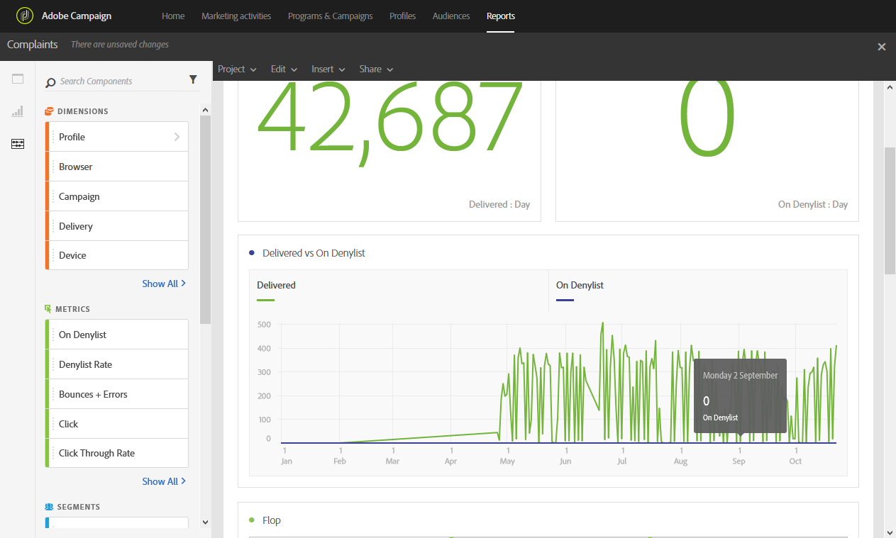

# Complaints

Complaints

The **Complaints** report identifies the deliveries that have received the most declarations as spam.

The **Flop** table, sorted by recipient domain, displays the number of recipients that have declared an email or junk. The table's results are also available in a chart and summary numbers.

The **Delivered vs Blacklisted rate** table lists the number of recipients that have declared an email as spam or junk. The table is sorted by delivery.
