# Creating a custom profile dimension{#creating-a-custom-profile-dimension}

Creating a custom profile dimension

Reports can also be created and managed based on custom profile data created during the profile custom resource extension.

In this example, we want to create the custom profile field **Loyalty programs** which will be divided into three levels: gold, silver and bronze. This custom profile will then be extended to be able to use it as a custom profile dimension in dynamic reports.

* [Step 1: Create a new profile field](../../reporting/using/creating-a-custom-profile-dimension.md#step-1--create-a-new-profile-field)
* [Step 2: Extend the sending logs with the profile field](../../reporting/using/creating-a-custom-profile-dimension.md#step-2--extend-the-sending-logs-with-the-profile-field)
* [Step 3: Create a delivery targeting recipients enrolled in the loyalty program](../../reporting/using/creating-a-custom-profile-dimension.md#step-3--create-a-delivery-targeting-recipients-enrolled-in-the-loyalty-program)
* [Step 4: Create a dynamic report to filter recipients with the custom profile dimension](../../reporting/using/creating-a-custom-profile-dimension.md#step-4--create-a-dynamic-report-to-filter-recipients-with-the-custom-profile-dimension)

## Step 1: Create a new profile field {#step-create-a-new-profile-field}

We first need to create the new profile field **Loyalty program** that will assign loyalty level to our recipients: gold, silver or bronze.

>[!NOTE]
>
>Custom resources can only be managed by an administrator.

To do so:

1. From the advanced menu, select **Administration** > **Development** > **Custom resources** then the **Profile (profile)** custom resource.

   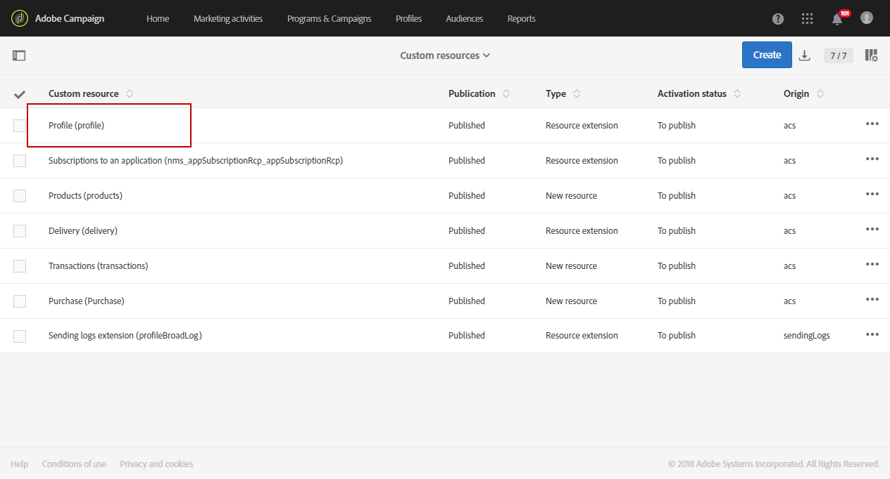

1. From the **Data structure** tab, in the **Fields** category, click the **Add field** button.

   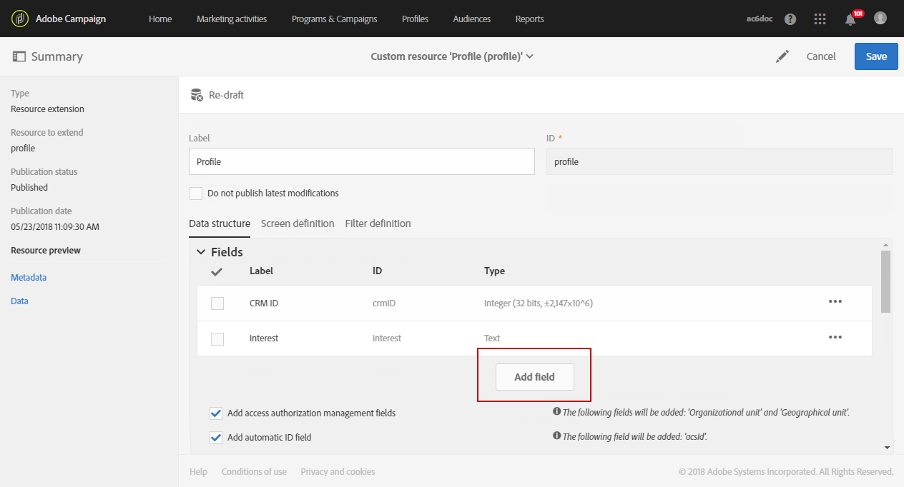

1. Enter the **Label**, **ID** and select the custom resource **Type**. Here, we selected **Text** since recipients will have the choice between gold, silver and bronze.

   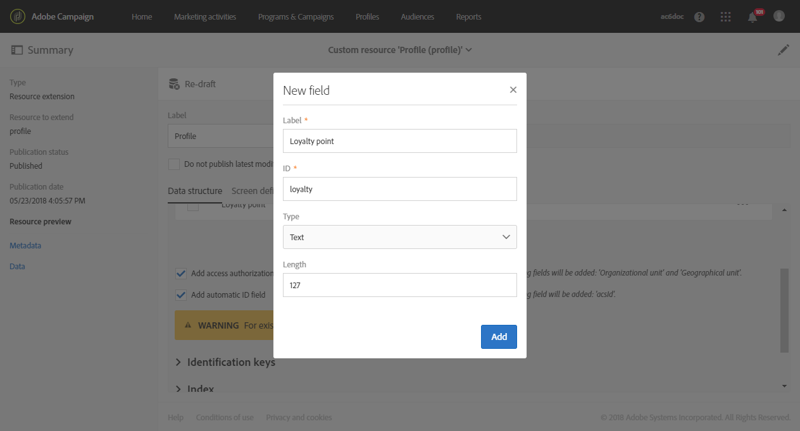

1. Click the  

   icon to define your field. 

   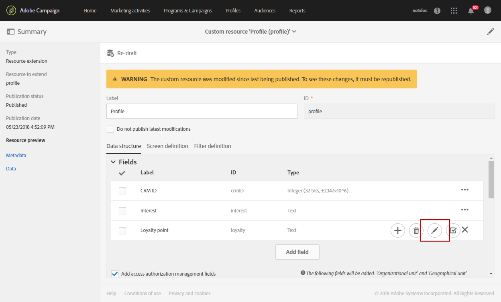

1. Here, we need to specify the authorized values by checking **Specify a list of authorized valued** and create each value by clicking **Create element**.

   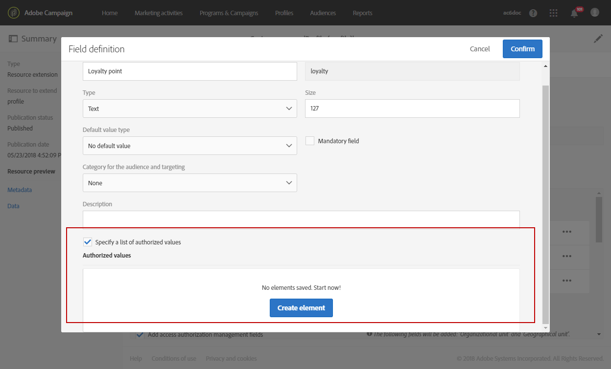

1. Enter the **Label** and **Value** then click **Add**. For this example, we need to create the value gold, silver and bronze. Click **Confirm** when done.

   

1. Select the **Screen definition** tab. In the **Detail screen configuration** drop-down, check **Add personalized fields** section to create a new section in our profile.

   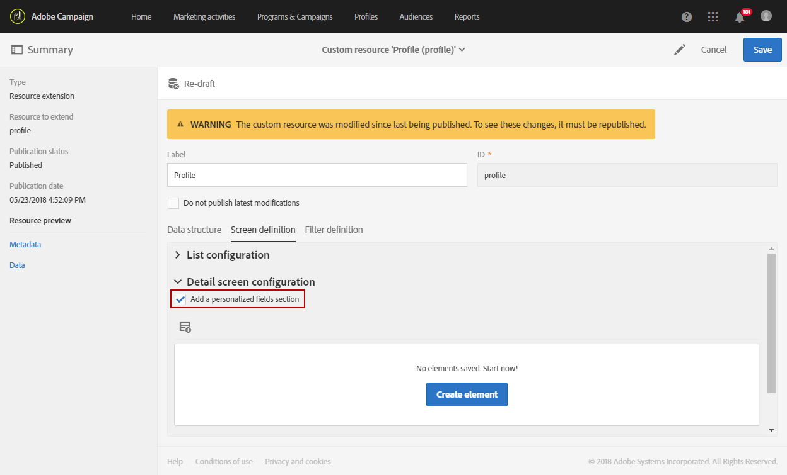

1. Click the** Add an element** button to create your new section. Select the **Type**: **Input field**, **Value** or **List**, then the field to add in this new section.

   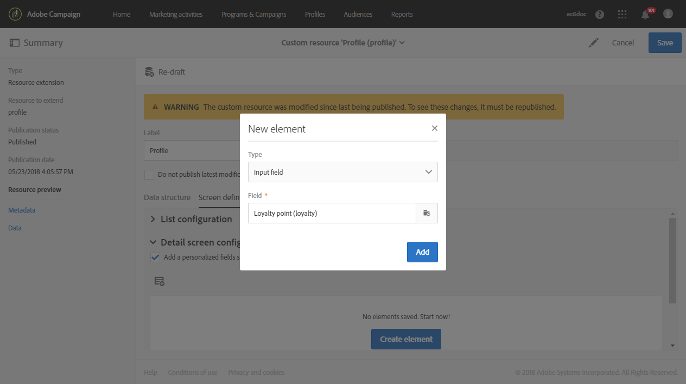

1. You can also add a title to your section in the field **Customize the title of the section where the fields will be displayed**.

   Click **Save** when the configuration is done.

   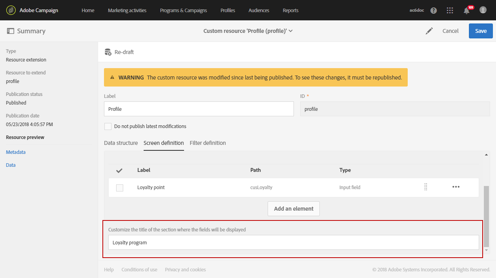

1. From the advanced menu, select **Administration** > **Development** > **Publication** to start publishing your custom resource.
1. Click **Prepare publication** then when the preparation is done, click the **Publish** button.

   

Your new profile field is now ready to be used and selected by your recipients.

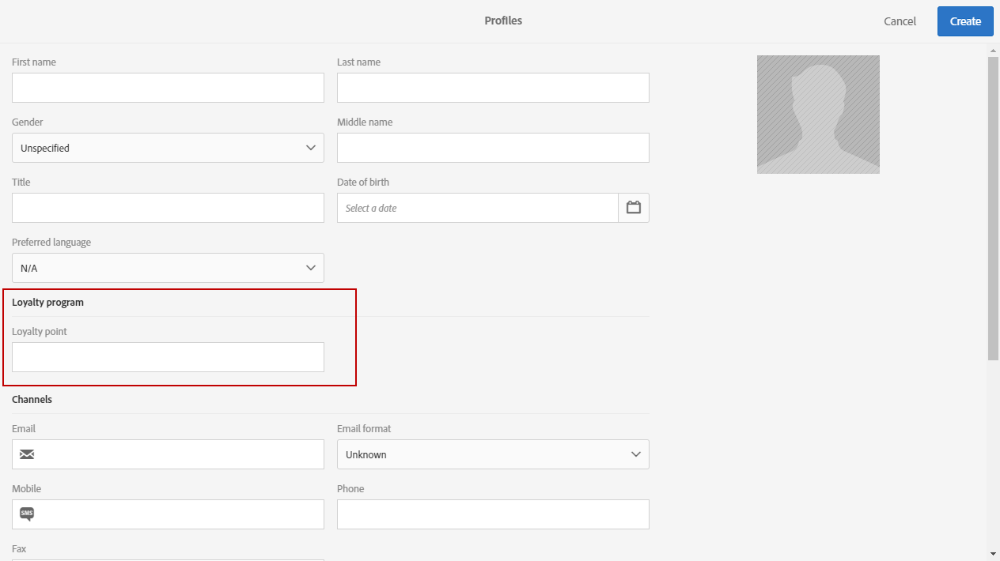

## Step 2: Extend the sending logs with the profile field {#step-extend-the-sending-logs-with-the-profile-field}

Now that your profile field is created, we need to extend the sending logs with our profile field to create the associated custom profile dimension in dynamic reports.

Before extending the log with our profile field, make sure that the PII window was accepted to have access to the **Sending logs extension** tab. For more on this, refer to this [page](../../reporting/using/about-dynamic-reports.md#dynamic-reporting-usage-agreement).

>[!NOTE]
>
>Logs can only be extended with profile fields by administrator.

1. From the advanced menu, select **Administration** > **Development** > **Custom resources** then the **Profile (profile)** custom resource.
1. Open the** Sending logs extension** drop-down.

   Check **Add segment code** to store the segment code from the targeting workflow. Please note that segments can not be used in Dynamic reports. For more information on segmentation, refer to this [page](../../automating/using/segmentation.md).

1. Click the **Create element** button.

   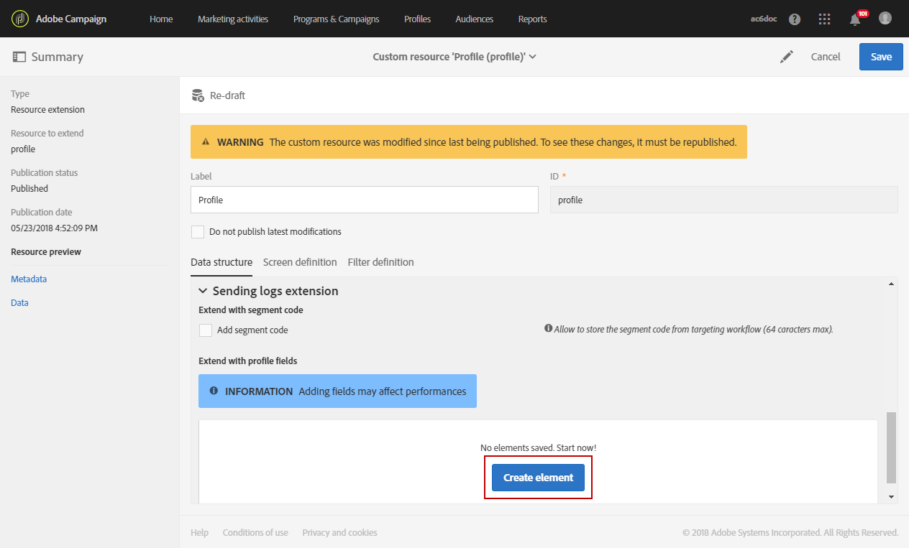

1. Select your previously created field and click **Confirm**.
1. Check **Add this field in Dynamic reporting as a new dimension** to create your custom profile dimension.

   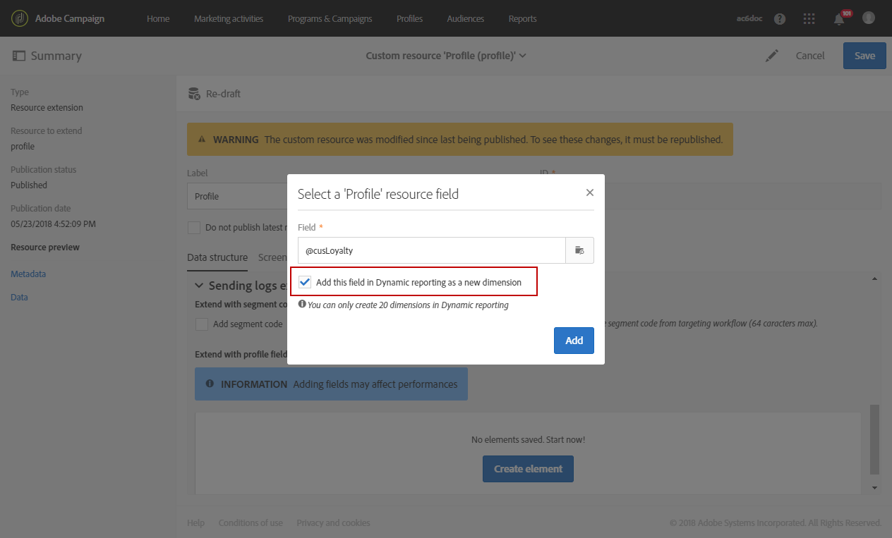

   This option is only available if the PII window was accepted. For more on this, refer to this [page](../../reporting/using/about-dynamic-reports.md#dynamic-reporting-usage-agreement).

1. Click **Add** then save your custom resource.
1. Since the custom resource was modified, we need to publish it to implement the new changes.

   From the advanced menu, select **Administration **> **Development** > **Publication** to start publishing your custom resource.

1. Click **Prepare publication** then when the preparation is done, click the **Publish** button.

   

Your custom profile is now available as a custom profile dimension in your reports.

Now that your field has been created and that sending logs have been extended with this profile field, you can start targeting recipients in deliveries.

## Step 3: Create a delivery targeting recipients enrolled in the loyalty program {#step-create-a-delivery-targeting-recipients-enrolled-in-the-loyalty-program}

Once your profile field is published, you can start your delivery. In this example, we want to target every recipient enrolled in the loyalty program.

1. From the **Marketing activities** tab, click **Create** then select **Email**.
1. Choose an **Email type** then enter your email's properties.
1. To target recipient enrolled in the loyalty program, drag and drop the **Delivery logs** activity.

   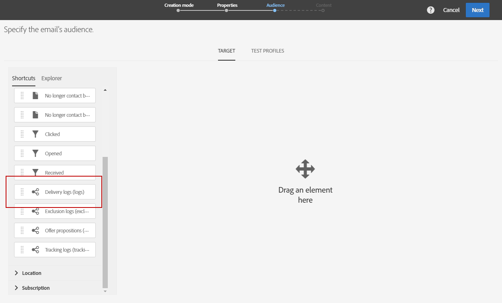

1. Drag and drop the **Profile** activity and select your previously created field from the **Field** drop-down.

   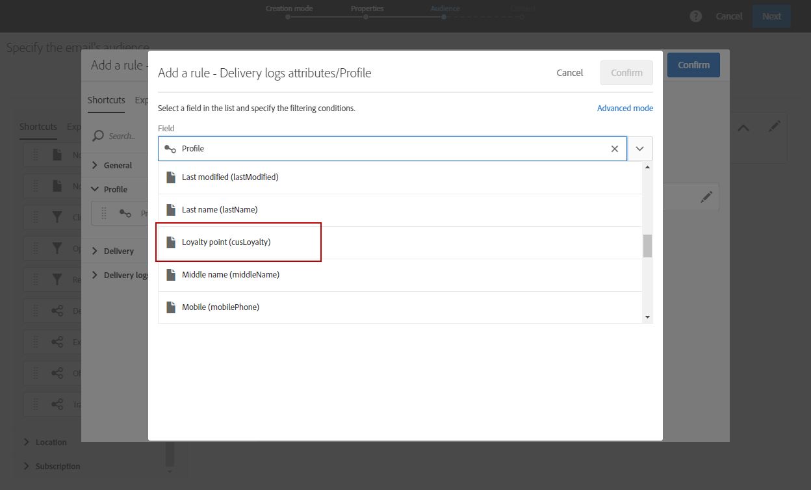

1. Select your **Filter conditions**. Here, we want to target recipients who are part of one of the three loyalty program's levels.

   

1. Click **Confirm** then when done filtering, click **Next**.
1. Define and personalize the message content, sender name and subject. For more information on email creation refer to this [page](../../designing/using/about-email-content-design.md#using-the-creative-designer).

   Then, click **Create**.

1. When ready, you can preview and send your message. For more information on how to prepare and send your message, refer to this [page](../../sending/using/preparing-the-send.md).

Once your email is correctly sent to your selected recipients, you can start filtering your data and track the success of your delivery with reports.

## Step 4: Create a dynamic report to filter recipients with the custom profile dimension {#step-create-a-dynamic-report-to-filter-recipients-with-the-custom-profile-dimension}

After sending your delivery, you can breakdown reports using your custom profile dimension from the **Profile** table.

1. From the **Reports** tab, select an out-of-the-box report or click the **Create** button to start one from scratch.

   

1. In the **Dimensions** category, click **Profile** then drag and drop your custom **Loyalty program** profile dimension to your freeform table.

   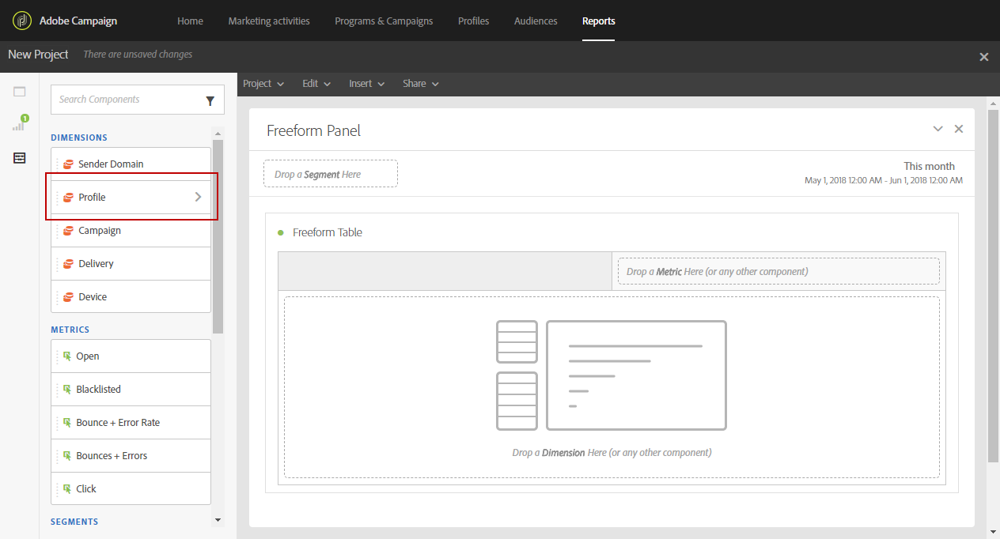

1. Drag and drop the **Processed/Sent** and **Open** metrics to start filtering your data.

   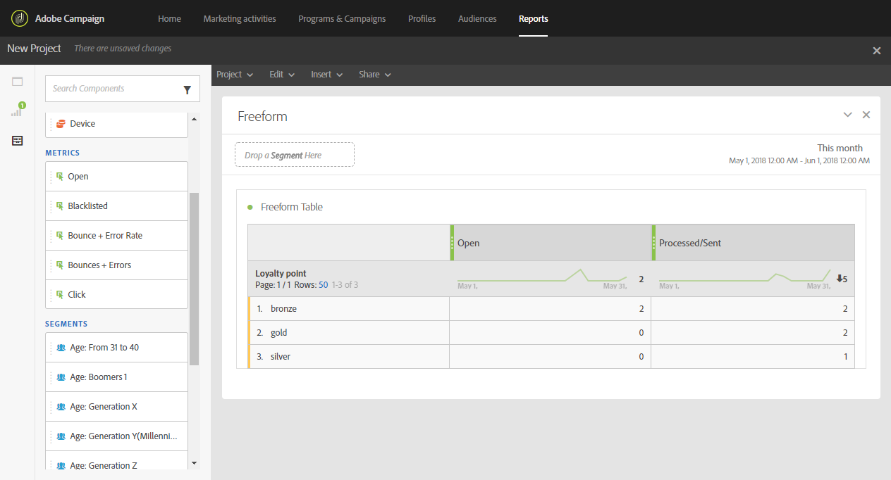

1. Drag and drop a visualization in your workspace if needed.

   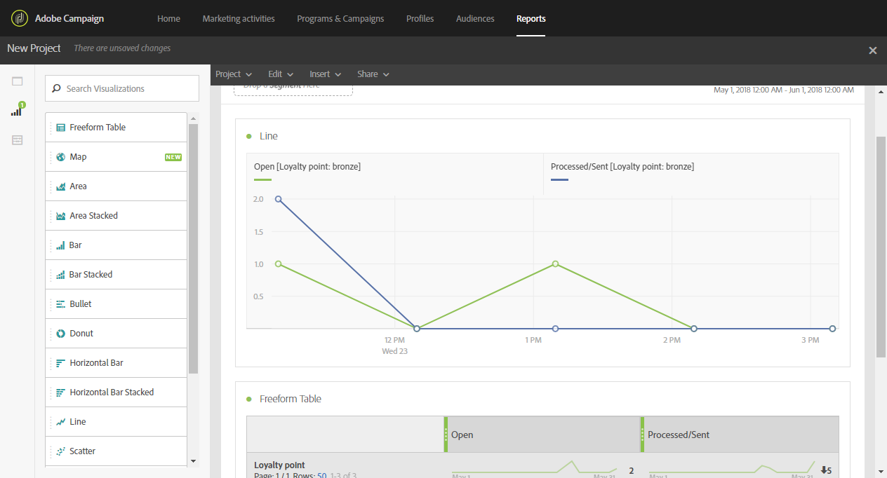

