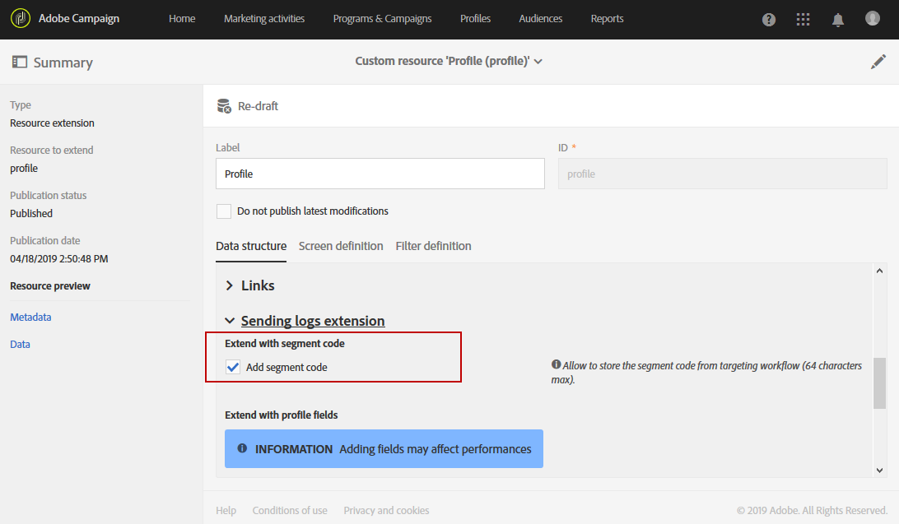
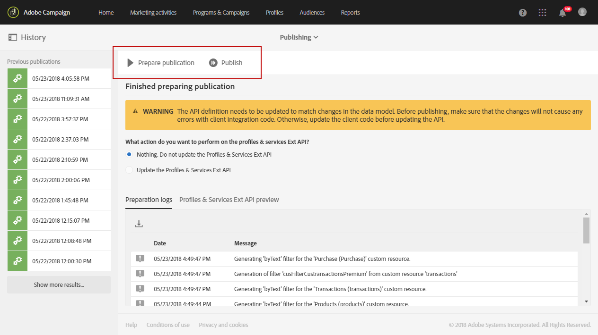
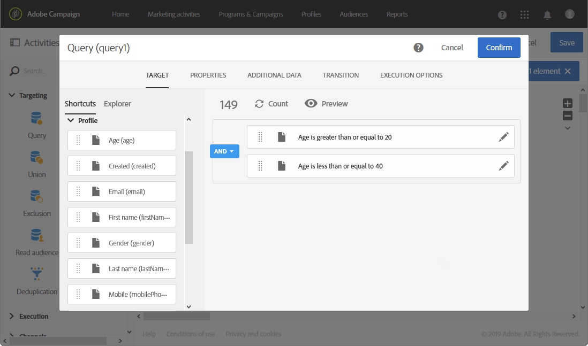
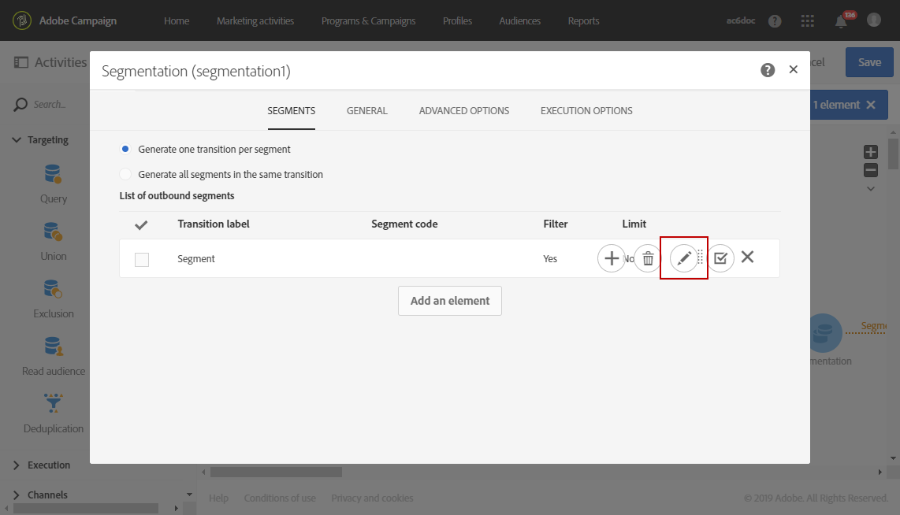
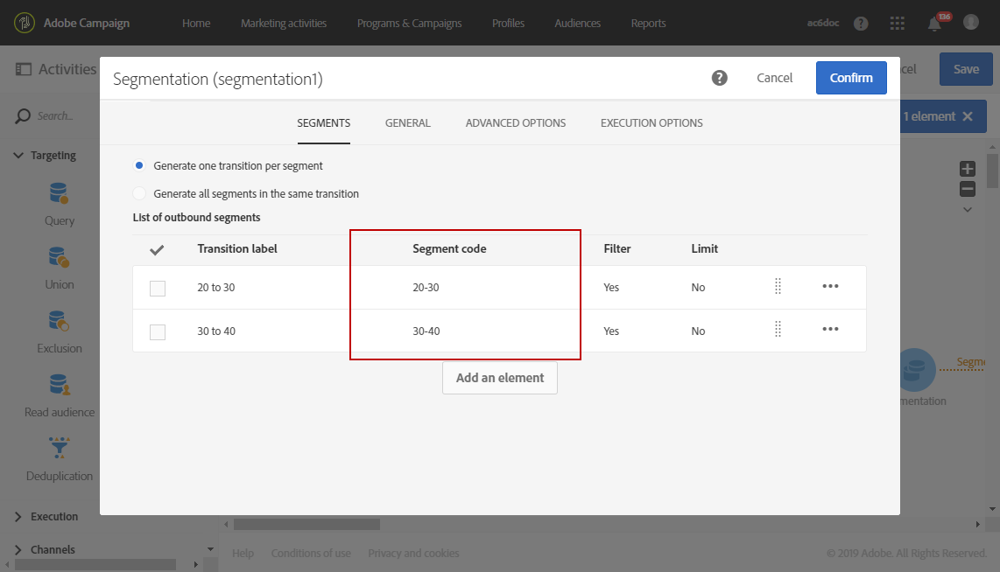
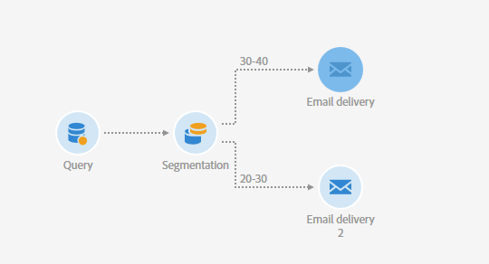
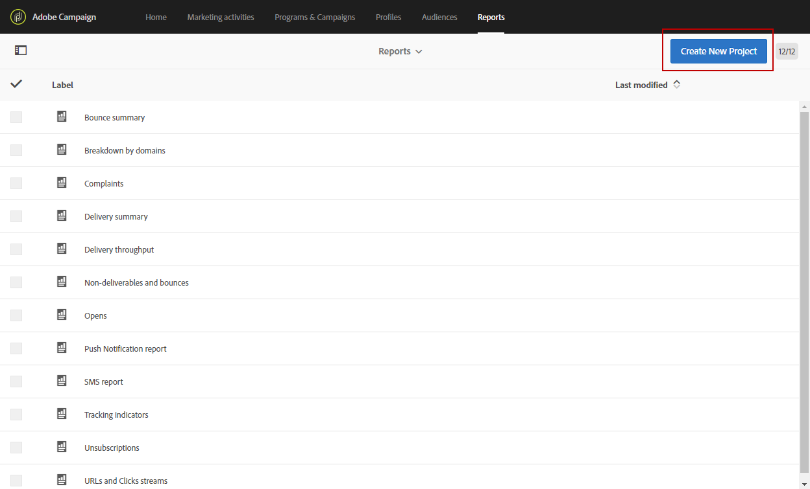
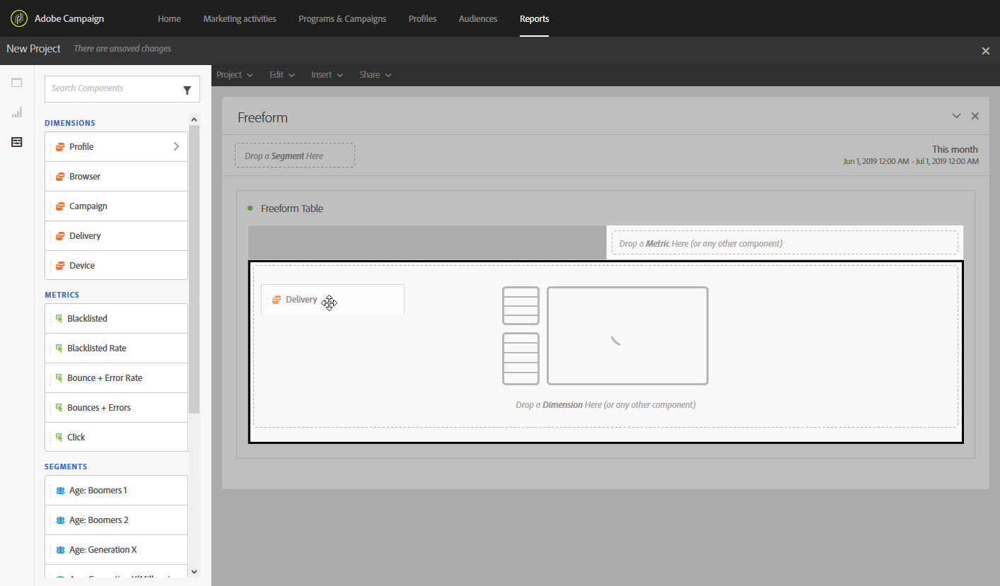
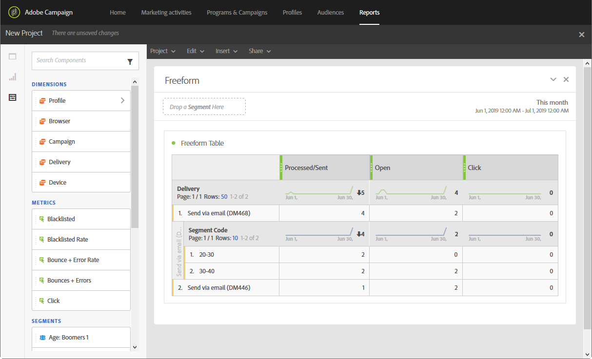
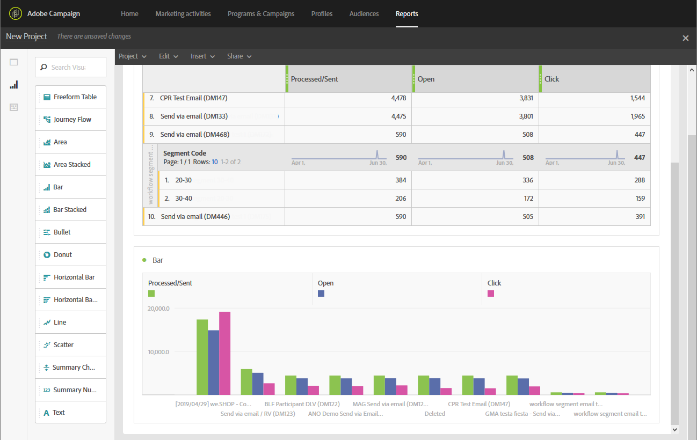

# Creating a report based on workflow segments{#creating-a-report-workflow-segment}

>[!CAUTION]
> **[!UICONTROL Segment code]** can only target email and SMS deliveries.

After creating a workflow and filtering your population into different targeted audience, you can measure the efficiency of your marketing campaigns based on segments defined in this targeting workflow.
To target these segments in your reports:

* [Step 1: Update Profiles custom resource with segments](#step-1--update-profiles-custom-resource-segments)
* [Step 2: Create a workflow with segments](#step-2--create-a-workflow-segments)
* [Step 3: Create a dynamic report to filter segments](#step-3--create-a-dynamic-report-filter-segments)

>[!CAUTION]
>The Dynamic reporting usage agreement must be accepted to start collecting these data.
>
>For more on this agreement, refer to this [page](../../reporting/using/about-dynamic-reports.md#dynamic-reporting-usage-agreement).

## Step 1: Update Profiles custom resource with segments{#step-1--update-profiles-custom-resource-segments}

Before reporting on your segment code, you need to update your **[!UICONTROL Profiles]** custom resource for your segment codes to be stored.

1. From the advanced menu, via the Adobe Campaign logo, select **[!UICONTROL Administration]** > **[!UICONTROL Development]** > **[!UICONTROL Custom resources]**, then select the **[!UICONTROL Profile (profile)]** resource.
1. In the **[!UICONTROL Sending logs extension]** menu from the **[!UICONTROL Data structure]** tab, check **[!UICONTROL Add segment code]** to allow storage of your segment codes from targeting workflows and to send it to dynamic reporting.

    The **[!UICONTROL Segment code]** will then be available in the **[!UICONTROL Profile]** dimension section of your report.

   

1. Save your custom resource.

1. You now need to publish your custom resource.
From the advanced menu, select **[!UICONTROL Administration]** > **[!UICONTROL Development]** > **[!UICONTROL Publishing]**.

   

1. Click **[!UICONTROL Prepare publication]** then when the preparation is done, click the **[!UICONTROL Publish]** button. For more information on custom resource, refer to this [page](../../developing/using/updating-the-database-structure.md).

You can now start creating your workflow with segment codes.

Note that segment codes will be collected as soon as you enable the segment code in the **[!UICONTROL Sending logs extension]**.

## Step 2: Create a workflow with segments {#step-2--create-a-workflow-segments}

>[!NOTE]
>If the input transition of the email delivery is empty, the Segment code from the previous transition will added by default.

You first need to create a workflow with different targeted population. Here, we want to send an email that will be personalized depending on the age of our audience: one delivery for 20 to 30 years old profiles and another for profiles between 30 to 40 years old.

1. Create your workflow. For more details on how to create your workflow, refer to this [page](../../automating/using/building-a-workflow.md).

1. Add a **[!UICONTROL Query]** activity by dragging it from the palette and dropping it in the workspace.

1. Target profiles from 20 to 40 years old to later segment them into more targeted populations.

   

1. Add a **[!UICONTROL Segmentation]** activity to split your query results into two targeted populations. For more on segmentation, refer to this [page](../../automating/using/segmentation.md).

1. Double click the **[!UICONTROL Segmentation]** activity to configure it. Edit the first segment by clicking **[!UICONTROL Edit properties]**.

    

1. Query profiles between the age of 20 to 30 and click **[!UICONTROL Confirm]** when done.

    

1. Click **[!UICONTROL Add an element]** to create your second segment and configure it as described in the steps above to target profiles between the age of 30 to 40.

1. Edit the **[!UICONTROL Segment code]** for each population to be passed on through dynamic reporting.

   >[!NOTE]
   >This step is mandatory or else you will not be able to understand which segments to report on.

   

1. Drag and drop an **[!UICONTROL Email delivery]** activity after your segments.

   

1. Personalize your deliveries depending on the different targeted populations. For more on email creation, refer to this [page](../../designing/using/designing-content-in-adobe-campaign.md).

1. Save the workflow.

1. Click **[!UICONTROL Start]** when your workflow is ready.

You can now access your reports to track your segment codes.

## Step 3: Create a dynamic report to filter segments {#step-3--create-a-dynamic-report-filter-segments}

After sending deliveries with your workflow, you can breakdown reports using your segment codes from your workflow.

1. From the **[!UICONTROL Reports]** tab, select an out-of-the-box report or click the **[!UICONTROL Create new project]** button to start one from scratch.

   
1. Drag and drop the **[!UICONTROL Delivery]** dimension to your freeform table.

   

1. Drag and drop different metrics to your table such as the **[!UICONTROL Open]** and **[!UICONTROL Click]** metrics to start filtering your data.
1. In the **[!UICONTROL Dimensions]** category, click the **[!UICONTROL Profile]** dimension then drag and drop the **[!UICONTROL Segment code]** dimension on your workflow's delivery to measure the success of your email delivery depending on the targeted populations.

   

1. Drag and drop a visualization in your workspace if needed.

   
