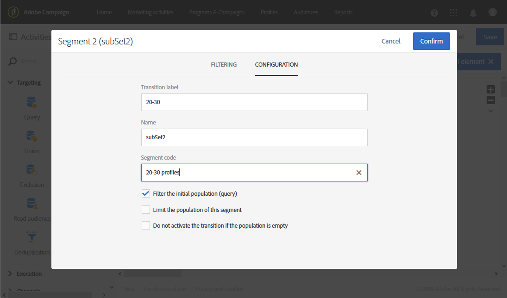

# Creating a report based on workflow segments{#creating-a-report-workflow-segment}

After creating a workflow and filtering your population into different targeted audience, you can check the success of your delivery depending on your segments in your reports.
To start reports on your workflow segments, you need to:

* [Step 1: Create a workflow with segments](../../reporting/using/creating-a-custom-profile-dimension.md#step-1--create-a-workflow-segments)
* [Step 2: Update Profiles custom resource with segments](../../reporting/using/creating-a-custom-profile-dimension.md##step-2--update-profiles-custom-resource-segments)
* [Step 3: Create a dynamic report to filter segments](../../reporting/using/creating-a-custom-profile-dimension.md#step-3--create-a-dynamic-report-filter-segments)

## Step 1: Create a workflow with segments {#step-1--create-a-workflow-segments}

You first need to create a workflow with different targeted population. Here, we want to send different deliveries depending on the age of our audience: one delivery for 20 to 30 years old profiles and another for profiles between 30 to 40 years old.

1. Create your workflow. For more details on how to create your workflow, refer to this page.

1. Add a **[!UICONTROL Query]** activity by dragging it from the palette and dropping it in the workspace.

1. Target profiles from 20 to 40 years old to later segment them into more targeted population.

   

1. Add a **[!UICONTROL Segmentation]** activity to split your query results into two targeted populations. For more on segmentation, refer to this page.

1. Add a **[!UICONTROL Segment code]** for each population to be passed on through dynamic reporting.

   

1. Drag and drop an **[!UICONTROL Email delivery]** activity after each of your segments.

   

1. Personalize your deliveries depending on the targeted population. For more on email creation, refer to this page.

1. Save the workflow.

1. Click **[!UICONTROL Start]** when your workflow is ready.

## Step 2: Update Profiles custom resource with segments{#step-2--update-profiles-custom-resource-segments}

Before reporting on your segment code, you need to update your Profiles custom resource for your segment codes to be stored.

1. From the advanced menu, via the Adobe Campaign logo, select **[!UICONTROL Administration]** > **[!UICONTROL Development]** > **[!UICONTROL Custom resources]**, then select the **[!UICONTROL Profile (profile)]** resource.
1. In the **[!UICONTROL Sending logs extension]**S menu, click **[!UICONTROL Add segment box]** to allow storage of your segment codes from targeting workflow.

   

1. Save your custom resource.

1. You now need to publish your custom resource.
From the advanced menu, select **[!UICONTROL Administration]** > **[!UICONTROL Development]** > **[!UICONTROL Publishing]**.

   

1. Click **[!UICONTROL Prepare publication]** then when the preparation is done, click the **[!UICONTROL Publish]** button.

You can now access your reports to track your segment codes.

## Step 3: Create a dynamic report to filter segments{#step-3--create-a-dynamic-report-filter-segments}

After sending deliveries with your workflow, you can breakdown reports using your segment codes from your workflow.

1. From the **[!UICONTROL Reports]** tab, select an out-of-the-box report or click the **[!UICONTROL Create new project]** button to start one from scratch.

   

1. In the **[!UICONTROL Dimensions]** category, drag and drop your **[!UICONTROL Segment code]** dimension to your freeform table.
1. Drag and drop the **[!UICONTROL Processed/Sent]** and **[!UICONTROL Open]** metrics to start filtering your data.
1. Drag and drop a visualization in your workspace if needed.