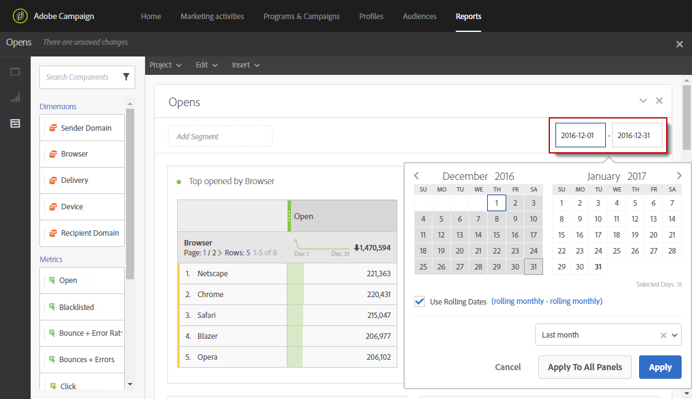

# Defining the report period{#defining-the-report-period}

Before starting or accessing a report, you must apply a time period. The given period can be accessed on the top right of the report.

By default, for a campaign or program, the filter period is set to the start and end date of the program or campaign. For a delivery, the start date corresponds to the sent date and the end date to the sent date plus 7 days.

To modify the filter, select a start date and a period or use the pre-set time period such as last week, two months ago, etc.

The report is automatically updated when a filter is applied or modified. The report period selected will govern the events that happened in the period, not the whole set of data of your deliveries that were created in the interval e.g. if a delivery ran from 1st til 5th January and the report period is 1st til 2nd January, you may see partial data. This can affect the open/click counts since open or click may happen even one month after the delivery was sent. 

