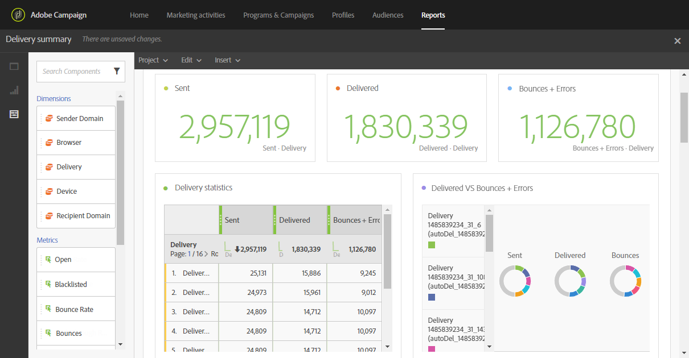

# Delivery summary{#delivery-summary}

The **[!UICONTROL Delivery summary]** report details the main information relative to an email, or several emails.

Each table is represented by summary numbers and charts. You can change how the details are shown in their respective visualization settings.

The **Delivery statistics** table contains the data available for sent emails, such as:

* **[!UICONTROL Processed/sent]**: The total number of sends for the delivery.
* **[!UICONTROL Delivered]**: The number of messages successfully sent, in relation to the total number of sent messages. Errors raised (bounces) are taken into account. However, complaints (spam declarations) and away messages such as "out of office" are not taken into account.
* **[!UICONTROL Bounces + Errors]**: The number of total errors cumulated during delivery and automatic return processing in relation to the total number of sent messages.

The **Open and clicks** table, contains the available data for recipient activity for each delivery, such as:

* **Click**: The number of times a content was clicked in a delivery.
* **Open**: The number of times a message was opened in a delivery.
* **Unique opens**: The number of recipients who opened the delivery.
* **Unique clicks**: The number of recipients who clicked on a content in a delivery.

The **Domain repartition** table displays the status of deliveries according to the recipient's domain.
