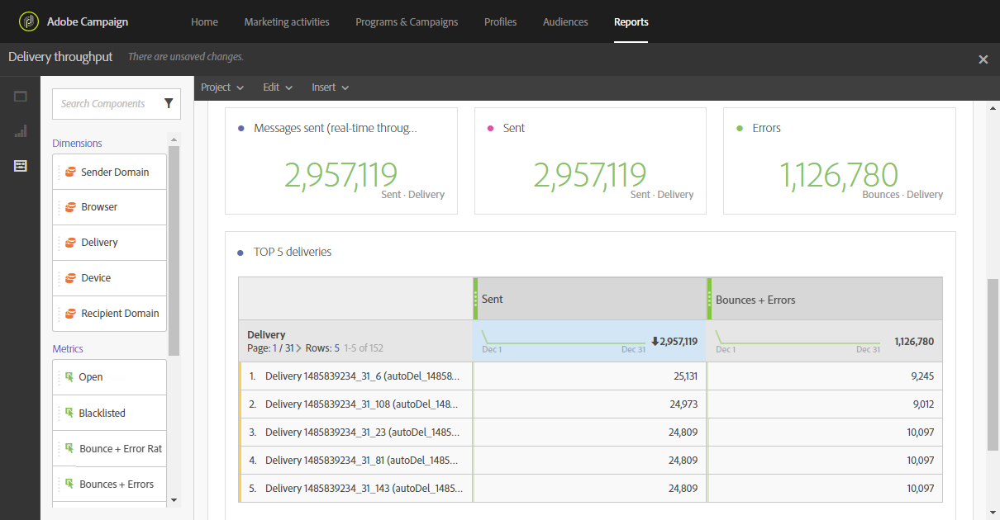

# Delivery throughput{#delivery-throughput}

This report contains data relating to the delivery throughput of a send, or several sends. It provides:

* The number of messages processed per hour
* The **[!UICONTROL Top 5 deliveries]** table and complementary summary numbers that show the five deliveries with the best gain in retries.

>[!NOTE]
>
>The **[!UICONTROL Delivery throughput]** page displays the throughput speed for the relay of your messages from Campaign over to the Adobe Campaign Enhanced MTA.
