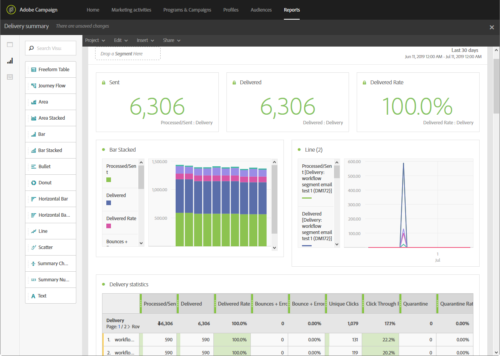

# Get started with dynamic reporting {#get-started-reporting}

Dynamic Reporting provides fully customizable and real-time reports to measure the impact of your marketing activitied. It adds access to profile data, enabling demographic analysis by profile dimensions such as gender, city and age in addition to functional email campaign data like opens and clicks.

<table>
<tr><td><a href="#manage-share-reports"> Manage and share dynamic reports</a></td><td><a href="#build-reports"> Build your reports</a></td><td><a href="#customize-reports"> Customize your reports</a></td></tr>
</table>

## Manage and share reports {#manage-share-reports}

With Dynamic reporting drag-and-drop interface, you can explore data, determine how your email campaigns performed against your most important customer segments and measure their impact on recipients from one single place.

Manage your dynamic reports thanks to various functionalities: refresh the data in real-time, print your reports, or export them as CSV files. You can also share your reports with Campaign Standard users through one-shot or recurring emails.

Read more:

* [About dynamic reports](../../reporting/using/about-dynamic-reports.md)
* [Reporting interface](../../reporting/using/reporting-interface.md)

## Build your reports {#build-reports}

Campaign Standard comes with a set of ready-to-use dynamc reports allowing you to measure multiple aspects of your markting campaigns: bounces, deliveries that have been declared the most as spam or junk, most viewed deliveries by recipients, channels-related reports, delivery throughput  and tracking reports...

Combine different components (dimensions, metrics and segments, time periods) to build your own reports or personalize out-of-the-box reports.

Read more:

* [List of components](../../reporting/using/list-of-components-.md)
* [Indicator calculation](../../reporting/using/indicator-calculation.md)
* [List of reports](../../reporting/using/defining-the-report-period.md)

## Customize your reports {#customize-reports}

Customize your reports by leverage dynamic reporting designing capabilities: add as many components as you need (panels and freeform tables) to analyse your data using the available metric and dimensions.

Drag and drop visualization items to add graphical representations of your data into your reports and configure them according to your needs.

Create reports based on custom profile data created during the Profile resouce extension, and reports based on segments defined in targeting workflows.

Read more:

* [Adding panels](../../reporting/using/adding-panels.md)
* [Adding visualizations](../../reporting/using/adding-visualizations.md)
* [Adding components](../../reporting/using/adding-components.md)
* [Creating a custom profile dimension](../../reporting/using/creating-a-custom-profile-dimension.md)
* [Creating a report based on workflow segments](../../reporting/using/creating-a-report-workflow-segment.md)

## Additional resources

* xxx
* xxx
