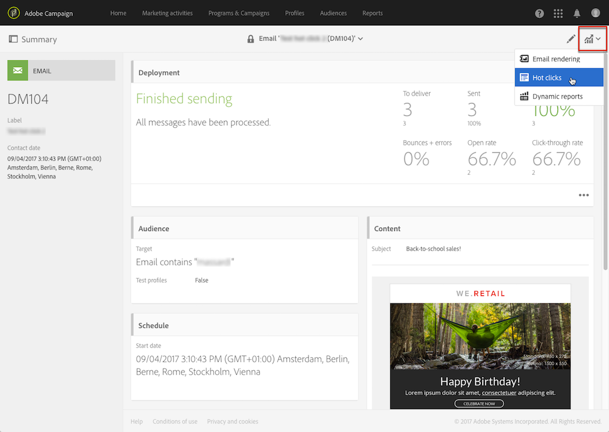
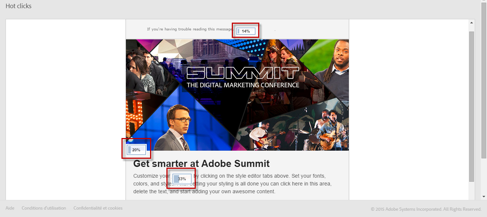
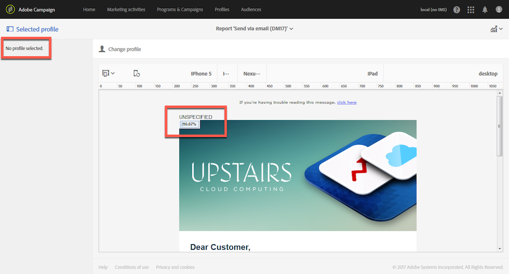
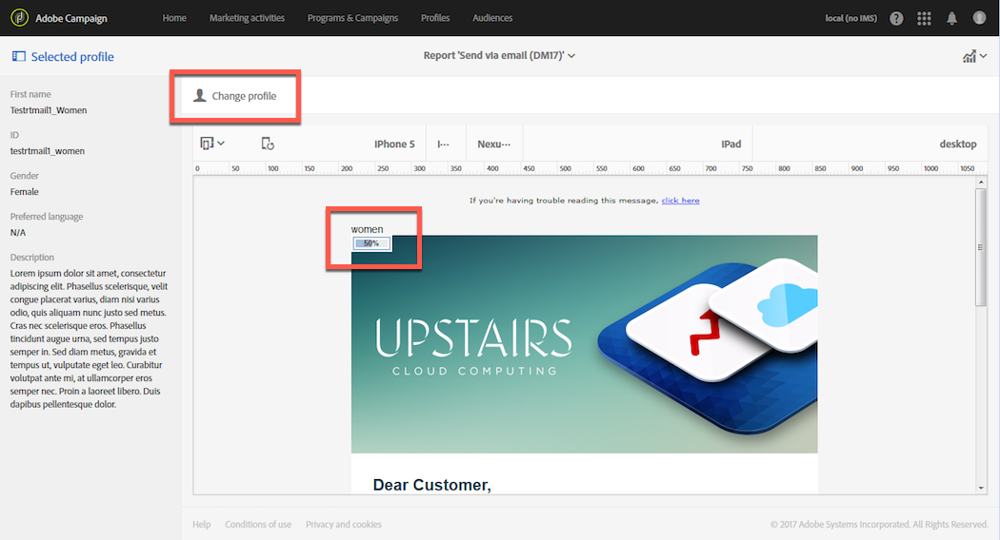
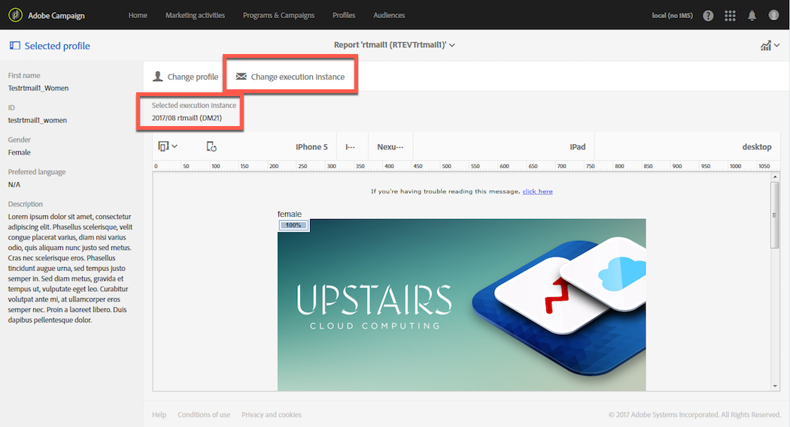

# Hot clicks{#hot-clicks}

>[!IMPORTANT]
>
>The Hot Clicks report exclusively showcases the HTML version of the email and does not support the Text version.

This report can be accessed from the **[!UICONTROL Reports]** button in each delivery or transactional message.

It presents the message content with the percentage of clicks on each link.

If you created dynamic content for your delivery, you can view the percentages for each condition that you defined. For more on inserting conditional content in a delivery, see [Defining dynamic content](../../designing/using/personalization.md#defining-dynamic-content-in-an-email).

For example, imagine you created a delivery with the following conditions:

* The link on the main image is different if the recipient is a man or a woman.
* You also added a link to a special offer that is only visible to recipients over 25.

Once your message is sent, select **[!UICONTROL Reports]** > **[!UICONTROL Hot clicks]** from the delivery dashboard.

By default, no profile is selected. Only clicks for recipients whose gender is unknown and for recipients who are under 25 or whose age is unknown are displayed.

To display clicks for women, click the **[!UICONTROL Change profile]** button and select a female test profile. To display clicks for men, proceed similarly and select a male test profile.

To display clicks for recipients over 25, click the **[!UICONTROL Change profile]** button and select a test profile whose birth date is matching this condition.

For more on test profiles, see [About test profiles](../../audiences/using/managing-test-profiles.md).

>[!NOTE]
>
>The number of clicks on a specific link is a percentage of the total clicks for all conditional contents in a delivery. Therefore, if you defined dynamic content, the total of the percentages displayed for a specific test profile might not equal 100.

Similarly, for recurring deliveries and transactional messages, you can select the test profile corresponding to the dynamic content that you want to display, but you can also view the click percentages according to the selected execution delivery.

An execution delivery is a non-actionable and non-functional technical message that is created in the following cases:

* Each time a recurring delivery is executed or updated.

  For example, if the workflow managing this delivery is executed once a month, there will be one execution delivery per month. In addition to this, each time the content of the delivery is updated, an additional execution delivery is created.

  For more on recurring email deliveries, see [Email delivery](../../automating/using/email-delivery.md).

* By default once a month for transactional messages, and each time a transactional message is edited and published again.

  For more on transactional messages, see [Getting started with transactional messaging](../../channels/using/getting-started-with-transactional-msg.md).

>[!NOTE]
>
>Because the tracked URLs' IDs are different for each execution, the hot clicks data cannot be aggregated for all the execution deliveries of a given message. It can only be displayed for one execution delivery at a time.

Once your message is sent, select **[!UICONTROL Reports]** > **[!UICONTROL Hot clicks]** from the delivery dashboard.

By default, the last execution delivery is selected. Click the **[!UICONTROL Change execution delivery]** button to select another one.

Only the click percentages for the selected delivery execution are displayed.
