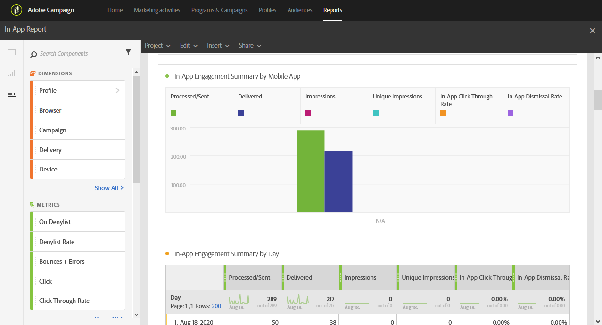

# In-App report{#in-app-report}

>[!CAUTION]
>
>Please note that you have to drag and drop the **[!UICONTROL Message type]** metrics to your tables to split your data depending on your delivery types, in this case In-App deliveries.

The **In-App** report provides details related to In-App deliveries.

Each table is represented by summary numbers and charts. You can change how the details are shown in their respective visualization settings.

The first table **In-App Engagement Summary** is split into three categories: by day, by mobile app and by delivery. It contains the available data for recipient reactivity to the delivery:

* **[!UICONTROL Processed/sent]** : Total number of sends for the In-App delivery.
* **[!UICONTROL Delivered]** : Number of In-App messages successfully sent, in relation to the total number of sent messages.
* **[!UICONTROL Impressions]** : Total of In-App messages seen by recipients depending on whether trigger criterion was met. 
* **[!UICONTROL Unique impressions]** : Number of impressions by recipient.
* **[!UICONTROL In-App click through rate]** : Percentage of users who clicked on Button 1 or Button 2 compared to users who saw the message.
* **[!UICONTROL In-App dismissal rate]** : Percentage of In-App messages that recipients dismissed.

The second table **In-App Clicks & Dismissals** is split into three categories: by day, by mobile app and by delivery. It contains the available data for recipient behavior per delivery:

* **[!UICONTROL In-App clicks]** : Total number of recipients who clicked on Button 1 or Button 2.
* **[!UICONTROL Unique In-App clicks]** : Number of times recipients clicked on Button 1 or Button 2.
* **[!UICONTROL In-App dismissal]** : Total number of messages that recipients dismissed either by clicking the close button or auto-dismiss.
* **[!UICONTROL Unique In-App dismissal]** : Number of time recipients dismissed an In-App message.

