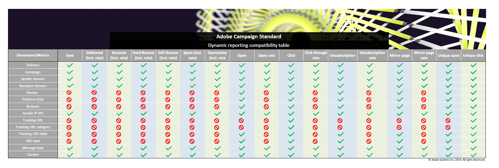

# List of components {#list-of-components}

To learn more on compatibility between dimensions and metrics, refer to this [table](https://docs.campaign.adobe.com/doc/standard/en/Technotes/dynamic_report_compatibility.pdf). If two components are not compatible, the cell will display the value **None**.

## Dimensions {#dimensions}

The table below gives you the list of dimensions used in reports and their definitions.

<table> 
 <thead> 
  <tr> 
   <th> Dimension  </th> 
   <th> Definition  </th> 
  </tr> 
 </thead> 
 <tbody> 
  <tr> 
   <td> Browser  </td> 
   <td> Browser from which the message was opened or clicked on.  </td> 
  </tr> 
  <tr> 
   <td> Campaign  </td> 
   <td> Label and ID of your campaign.  </td> 
  </tr> 
  <tr> 
   <td> City  </td> 
   <td> City registered in the recipient's profile.  </td> 
  </tr> 
  <tr> 
   <td> Country  </td> 
   <td> Country registered in the recipient's profile.  </td> 
  </tr> 
  <tr> 
   <td> Delivery  </td> 
   <td> Label and ID of the delivery.  </td> 
  </tr> 
  <tr> 
   <td> Device  </td> 
   <td> Device from which the email/SMS/push notification was opened/viewed/clicked on.  </td> 
  </tr> 
  <tr> 
   <td> Failure reason  </td> 
   <td> Types of errors that caused bounces for each delivery e.g. user unknown, invalid domain or mailbox full.  </td> 
  </tr> 
  <tr> 
   <td> Gender  </td> 
   <td> Recipient's gender such as male or female. If the gender field is empty in the recipient's profile, the value will be none.  </td> 
  </tr> 
  <tr> 
   <td> In-App message actions  </td> 
   <td> Actions on the In-App message delivered, e.g. actions on button 1 or 2 or dismissals.  </td> 
  </tr> 
  <tr> 
   <td> Message type  </td> 
   <td> Channel used for the delivery, such as email, SMS, push notification or In-App.  </td> 
  </tr> 
  <tr> 
   <td> Mobile App name  </td> 
   <td> Name of the mobile application  </td> 
  </tr> 
  <tr> 
   <td> Platform  </td> 
   <td> Platform of the device from which the message was opened/viewed/clicked on.  </td> 
  </tr> 
  <tr> 
   <td> Profiles  </td> 
   <td> Regroups out-of-the-box and custom profile fields created during the profile resource extension, for more on this refer to this <a href="../../developing/using/key-steps-to-add-a-resource.md">page</a> or this <a href="../../reporting/using/creating-a-custom-profile-dimension.md">example</a>.  Note that data for this dimension is retrieved as soon as the custom resource linked to the profile field is published.  </td> 
  </tr> 
  <tr> 
   <td> Push platform  </td> 
   <td> Platform of the device from which the push notification was opened, such as iOS or Android.  </td> 
  </tr> 
  <tr> 
   <td> Recipient domain  </td> 
   <td> Domain used to open the email.  </td> 
  </tr> 
  <tr> 
   <td> Recurring delivery  </td> 
   <td> Label and ID of the recurring delivery.  </td> 
  </tr> 
  <tr> 
   <td> Sender domain  </td> 
   <td> Domain used to send the email.  </td> 
  </tr> 
  <tr> 
   <td> Sender IP  </td> 
   <td> IP used to send the email.  </td> 
  </tr> 
  <tr> 
   <td> State  </td> 
   <td> State registered in the recipient's profile.  </td> 
  </tr> 
  <tr> 
   <td> Tracking URL  </td> 
   <td> URL that was clicked on by the user from the message.  </td> 
  </tr> 
  <tr> 
   <td> Tracking URL category  </td> 
   <td> Category assigned to the tracking URL.  </td> 
  </tr> 
  <tr> 
   <td> Tracking URL label  </td> 
   <td> Label given to the URL, such as mirror page, contact us or open.  </td> 
  </tr> 
  <tr> 
   <td> Transactional delivery  </td> 
   <td> Label and ID of the transactional delivery.  </td> 
  </tr> 
  <tr> 
   <td> Variant  </td> 
   <td> Variant of the email in case of A/B testing.  </td> 
  </tr> 
 </tbody> 
</table>

## Metrics {#metrics}

The tables below give you the list of metrics used in reports and their definitions depending on the delivery type.

### Email and SMS metrics {#email-and-sms-metrics}

<table> 
 <thead> 
  <tr> 
   <th> Metric  </th> 
   <th> Definition  </th> 
  </tr> 
 </thead> 
 <tbody> 
  <tr> 
   <td> Blacklisted  </td> 
   <td> Number of recipients who have declared an email as spam or junk.  </td> 
  </tr> 
  <tr> 
   <td> Blacklisted rate  </td> 
   <td> Percentage of deliveries marked as blacklisted.  </td> 
  </tr> 
  <tr> 
   <td> Bounces + Errors  </td> 
   <td> Total of errors cumulated during delivery and automatic return processing in relation to the total number of sent messages.  </td> 
  </tr> 
  <tr> 
   <td> Bounce + Error rate  </td> 
   <td> Percentage of emails that bounced compared to email sent.  </td> 
  </tr> 
  <tr> 
   <td> Click  </td> 
   <td> Number of times a content was clicked in a delivery.  </td> 
  </tr> 
  <tr> 
   <td> Click through rate  </td> 
   <td> Percentage of clicks in a delivery.  </td> 
  </tr> 
  <tr> 
   <td> Delivered  </td> 
   <td> Number of messages successfully sent, in relation to the total number of sent messages.  </td> 
  </tr> 
  <tr> 
   <td> Delivered rate  </td> 
   <td> Percentage of messages successfully sent.  </td> 
  </tr> 
  <tr> 
   <td> Hard bounce  </td> 
   <td> Total number of permanent errors, such as a wrong email address.  </td> 
  </tr> 
  <tr> 
   <td> Hard bounce rate  </td> 
   <td> Percentage of deliveries that failed due to permanent errors.  </td> 
  </tr> 
  <tr> 
   <td> Mirror page  </td> 
   <td> Number of recipients who clicked on the mirror page link.  </td> 
  </tr> 
  <tr> 
   <td> Mirror page rate  </td> 
   <td> Percentage of clicks on the mirror page link compared to the total delivery messages.  </td> 
  </tr> 
  <tr> 
   <td> Offer clicks  </td> 
   <td> Number of time an offer was clicked on in a delivery.  </td> 
  </tr> 
  <tr> 
   <td> Offer click rate  </td> 
   <td> Percentage of clicks on an offer.  </td> 
  </tr> 
  <tr> 
   <td> Open  </td> 
   <td> Number of times a message was opened in a delivery.  </td> 
  </tr> 
  <tr> 
   <td> Open rate  </td> 
   <td> Percentage of opened messages.  </td> 
  </tr> 
  <tr> 
   <td> Processed/sent  </td> 
   <td> Total number of sends for the delivery.  </td> 
  </tr> 
  <tr> 
   <td> Quarantine  </td> 
   <td> Number of messages that bounced and resulted in the quarantine of the address.  </td> 
  </tr> 
  <tr> 
   <td> Quarantine rate  </td> 
   <td> Percentage of quarantines compared to sent messages.  </td> 
  </tr> 
  <tr> 
   <td> Rejected  </td> 
   <td> Number of messages classified as spam by the SMTP servers.  </td> 
  </tr> 
  <tr> 
   <td> Rejected rate  </td> 
   <td> Percentage of messages marked as rejected.  </td> 
  </tr> 
  <tr> 
   <td> Soft bounce  </td> 
   <td> Total number of temporary errors, such as a full inbox.  </td> 
  </tr> 
  <tr> 
   <td> Soft bounce rate  </td> 
   <td> Percentage of deliveries that failed due to temporary reason.  </td> 
  </tr> 
  <tr> 
   <td> Unique clicks  </td> 
   <td> Number of recipients who clicked on a content in a delivery.  </td> 
  </tr> 
  <tr> 
   <td> Unique opens  </td> 
   <td> Number of recipients who opened the delivery.  </td> 
  </tr> 
  <tr> 
   <td> Unsubscribe rate  </td> 
   <td> Percentage of unsubscriptions by recipient compared to the delivered messages.  </td> 
  </tr> 
  <tr> 
   <td> Unsubscribed  </td> 
   <td> Number of clicks on the unsubscription link.  </td> 
  </tr> 
 </tbody> 
</table>

### Push notification metrics {#push-notification-metrics}

<table> 
 <thead> 
  <tr> 
   <th> Metric  </th> 
   <th> Definition  </th> 
  </tr> 
 </thead> 
 <tbody> 
  <tr> 
   <td> Bounces + Errors  </td> 
   <td> Total of errors cumulated during delivery in relation to the total number of sent messages, e.g. errors from MCPNS or provider.  </td> 
  </tr> 
  <tr> 
   <td> Bounce + Error rate  </td> 
   <td> Percentage of push notifications that bounced compared to push notifications sent.  </td> 
  </tr> 
  <tr> 
   <td> Click  </td> 
   <td> Number of times a push notification has been delivered to the device and clicked on by the user. The user either wanted to view the notification, which will then be moved to Push Open tracking, or dismiss it.  </td> 
  </tr> 
  <tr> 
   <td> Click through rate  </td> 
   <td> Percentage of users who interacted with the push notification.  </td> 
  </tr> 
  <tr> 
   <td> Delivered  </td> 
   <td> Number of push notifications successfully sent, in relation to the total number of sent push notifications.  </td> 
  </tr> 
  <tr> 
   <td> Delivered rate  </td> 
   <td> Percentage of push notifications successfully sent.  </td> 
  </tr> 
  <tr> 
   <td> Impressions  </td> 
   <td> Number of times a push notification has been delivered to the device and left untouched in the notification center. In most cases, impressions number should be similar to the delivered number. This ensures that the device got the message and relayed that information back to the server.  </td> 
  </tr> 
  <tr> 
   <td> Processed/sent  </td> 
   <td> Total number of push notifications sent.  </td> 
  </tr> 
  <tr> 
   <td> Open  </td> 
   <td> Total number of push notifications delivered to the device and clicked on by users thus opening the app. This is similar to the Push Click except a Push Open will not be triggered if the notification was dismissed.  </td> 
  </tr> 
  <tr> 
   <td> Open rate  </td> 
   <td> Percentage of opened push notifications.  </td> 
  </tr> 
  <tr> 
   <td> Unique click  </td> 
   <td> Number of times a unique user interacts with the push notification, e.g. clicks on the notification or button.  </td> 
  </tr> 
  <tr> 
   <td> Unique impressions  </td> 
   <td> Number of impressions by recipient.  </td> 
  </tr> 
  <tr> 
   <td> Unique Opens  </td> 
   <td> Number of recipients who opened the delivery.  </td> 
  </tr> 
 </tbody> 
</table>

### In-App metrics {#in-app-metrics}

<table> 
 <thead> 
  <tr> 
   <th> Metric  </th> 
   <th> Definition  </th> 
  </tr> 
 </thead> 
 <tbody> 
  <tr> 
   <td> Delivered  </td> 
   <td> Total number of In-App messages delivered to the device by the service provider.  </td> 
  </tr> 
  <tr> 
   <td> Impressions  </td> 
   <td> Total of In-App messages seen by recipients depending on whether trigger criterion was met.  </td> 
  </tr> 
  <tr> 
   <td> In-App clicks   </td> 
   <td> Total number of recipients who clicked on Button 1 or Button 2.  </td> 
  </tr> 
  <tr> 
   <td> In-App click through rate  </td> 
   <td> Percentage of users who clicked on Button 1 or Button 2 compared to users who saw the message.  </td> 
  </tr> 
  <tr> 
   <td> In-App dismissal  </td> 
   <td> Total number of messages that recipients dismissed either by clicking the close button or auto-dismiss.  </td> 
  </tr> 
  <tr> 
   <td> In-App dismissal rate  </td> 
   <td> Percentage of In-App messages that recipients dismissed.  </td> 
  </tr> 
  <tr> 
   <td> Processed/sent  </td> 
   <td> Total number of In-App messages sent from Adobe Campaign as part of the delivery sent process.  </td> 
  </tr> 
  <tr> 
   <td> Unique impressions  </td> 
   <td> Number of impressions by a unique recipient.  </td> 
  </tr> 
  <tr> 
   <td> Unique In-App clicks  </td> 
   <td> Number of times recipients clicked on Button 1 or Button 2.  </td> 
  </tr> 
  <tr> 
   <td> Unique In-App dismissals  </td> 
   <td> Number of time recipients dismissed an In-App message.  </td> 
  </tr> 
 </tbody> 
</table>

## Segments {#segments}

>[!NOTE]
>
>By default, the **[!UICONTROL Exclude proof]** segment is alredy selected to filter your reports but can be changed if needed.

The table below gives you the list of segments used in reports and their definitions.

<table> 
 <thead> 
  <tr> 
   <th> Segment  </th> 
   <th> Definition  </th> 
  </tr> 
 </thead> 
 <tbody> 
  <tr> 
   <td> Age: Boomers 1  </td> 
   <td> Recipients born from 1946 to 1954.  </td> 
  </tr> 
  <tr> 
   <td> Age: Boomers 2  </td> 
   <td> Recipients born from 1955 to 1965.  </td> 
  </tr> 
  <tr> 
   <td> Age: From 18 to 25  </td> 
   <td> Recipients from 18 to 25 years old.  </td> 
  </tr> 
  <tr> 
   <td> Age: From 26 to 30  </td> 
   <td> Recipients from 26 to 30 years old.  </td> 
  </tr> 
  <tr> 
   <td> Age: From 31 to 40  </td> 
   <td> Recipients from 31 to 40 years old.  </td> 
  </tr> 
  <tr> 
   <td> Age: From 41 to 50  </td> 
   <td> Recipients from 41 to 50 years old.  </td> 
  </tr> 
  <tr> 
   <td> Age: Generation X  </td> 
   <td> Recipients born from 1966 to 1976.  </td> 
  </tr> 
  <tr> 
   <td> Age: Generation Y (Millennials)  </td> 
   <td> Recipients born from 1977 to 1994.  </td> 
  </tr> 
  <tr> 
   <td> Age: Generation Z  </td> 
   <td> Recipients born from 1995 to today.  </td> 
  </tr> 
  <tr> 
   <td> Age: Greater than 50  </td> 
   <td> Recipients whose age is greater than 50.  </td> 
  </tr> 
  <tr> 
   <td> Age: Less than 25  </td> 
   <td> Recipients whose age is less than 25.  </td> 
  </tr> 
  <tr> 
   <td> Age: Less than 30  </td> 
   <td> Recipients whose age is less than 30.  </td> 
  </tr> 
  <tr> 
   <td> Age: Less than 40  </td> 
   <td> Recipients whose age is less than 40.  </td> 
  </tr> 
  <tr> 
   <td> Age: Less than 50  </td> 
   <td> Recipients whose age is less than 50.  </td> 
  </tr> 
  <tr> 
   <td> Age: Silent Generation  </td> 
   <td> Recipients born in 1945 or before.  </td> 
  </tr> 
  <tr> 
   <td> All visits  </td> 
   <td> Every recipient  </td> 
  </tr> 
    <tr> 
   <td> Exclude proof  </td> 
   <td> Exclude proofs from your reports (starting Campaign 19.4 release only)  </td> 
  </tr> 
 </tbody> 
</table>

