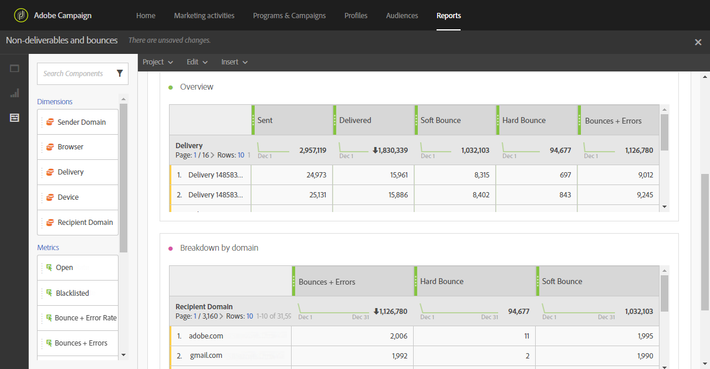

# Non-deliverables and bounces{#non-deliverables-and-bounces}

The **[!UICONTROL Non-deliverables and bounces]** report provides details on all the errors encountered during a delivery.

The **[!UICONTROL Overview]** table contains the data available regarding the possible errors that may be encountered for each delivery, such as:

* **Processed/sent**: The number of emails sent.
* **Delivered**: The number of emails delivered.
* **Soft bounce**: The total number of temporary errors, such as a a full inbox.
* **Hard bounce**: The total number of permanent errors, such as a wrong email address.
* **Bounces + Errors**: The number of messages that could not be delivered.

The **Breakdown by domain** table lists the bounces per recipients' domains.
