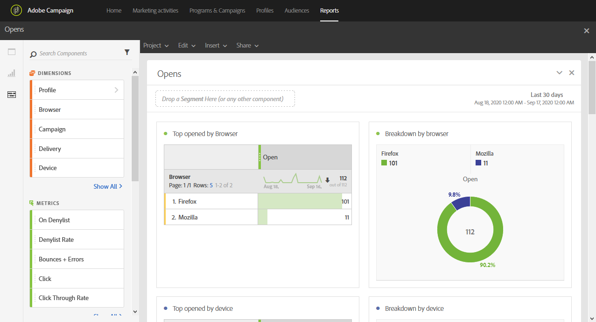

# Opens{#opens}

Opens

The **[!UICONTROL Opens]** report identifies the deliveries that have been most viewed by recipients.

Four tables and charts break down the total number of recipients who opened an email based upon:

* Browser
* Device
* Platform
* Domain

The **[!UICONTROL TOP 5]** table and graph display the deliveries with the highest number of delivered messages.
