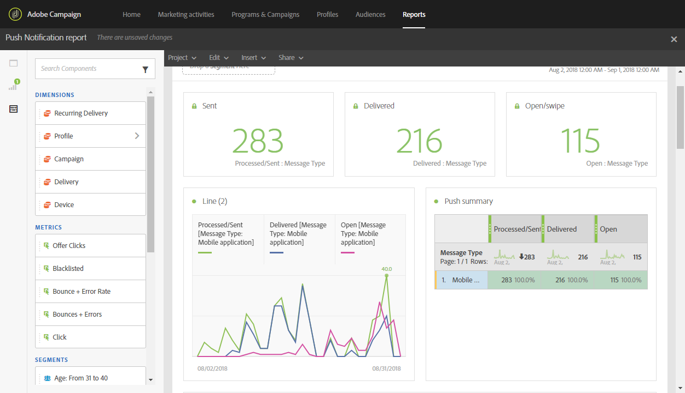
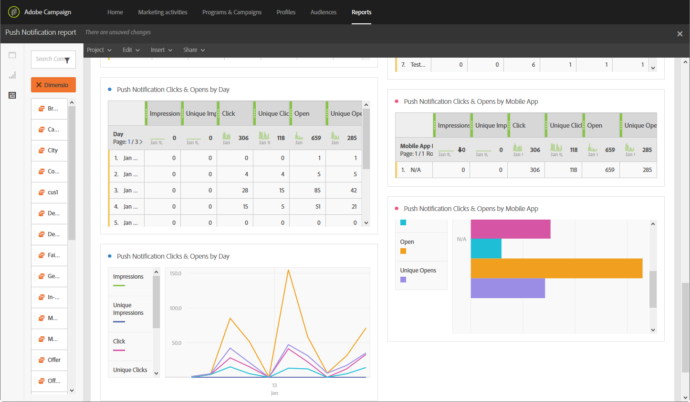

# Push notification report{#push-notification-report}

>[!CAUTION]
>
>Please note that you have to drag and drop the **[!UICONTROL Message type]** metrics to your tables to split your data depending on your delivery types, in this case push notification deliveries.

The **Push notification** report provides details of marketing performance of push notifications in Adobe Campaign. This out-of-the-box report will help you understand how users interact with push notifications, mobile applications and deliveries.

Some configuration is required in the mobile application to implement push tracking, refer to this [page](../../administration/using/push-tracking.md) for the detailed steps.

Each table is represented by summary numbers and charts. You can change how the details are shown in their respective visualization settings.

The first table **Push notification Engagement Summary** is split into three categories: by day, by mobile app and by delivery. It contains the available data for recipient reactivity to the delivery:

* **[!UICONTROL Processed/sent]**: Total number of push notifications sent.
* **[!UICONTROL Delivered]**: Number of push notifications successfully sent, in relation to the total number of sent push notifications.
* **[!UICONTROL Impressions]**: Number of times a push notification has been delivered to the device and left untouched in the notification center. In most cases, impressions number should be similar to the delivered number. This ensures that the device got the message and relayed that information back to the server.
* **[!UICONTROL Unique impressions]**: Number of impressions by recipient.
* **[!UICONTROL Click through rate]**: Percentage of users who interacted with the push notification.
* **[!UICONTROL Open rate]**: Percentage of opened push notifications.

The second table **Push notification Clicks & opens** is split into three categories: by day, by mobile app and by delivery. It contains the available data for recipient behavior per delivery:

* **[!UICONTROL Impressions]**: Total of push notifications seen by recipients. 
* **[!UICONTROL Unique impressions]**: Number of impressions by recipient.
* **[!UICONTROL Click]**: Number of times a push notification has been delivered to the device and clicked by the user. The user either wanted to view the notification, which will then be moved to Push Open tracking, or dismiss it.
* **[!UICONTROL Unique clicks]**: Number of times a unique user interacts with the push notification, e.g. clicks on the notification or button.
* **[!UICONTROL Open]**: Total number of push notifications delivered to the device and clicked on by users thus opening the app. This is similar to the Push Click except a Push Open will not be triggered if the notification was dismissed.
* **[!UICONTROL Unique Opens]**: Number of recipients who opened the delivery.

