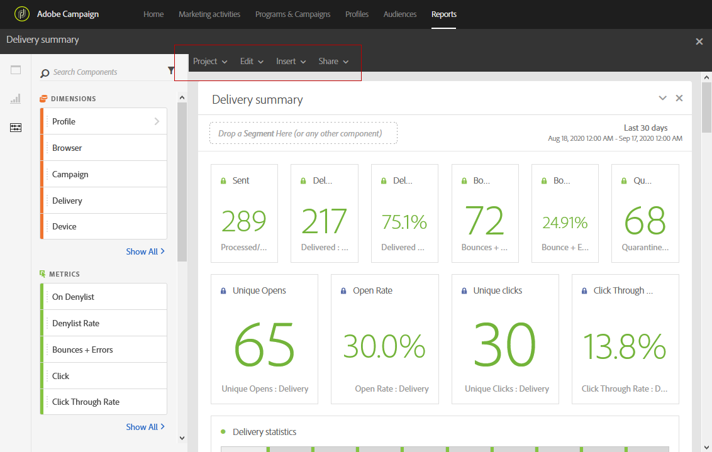
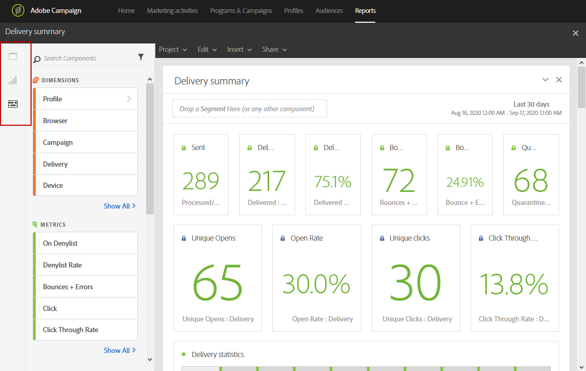
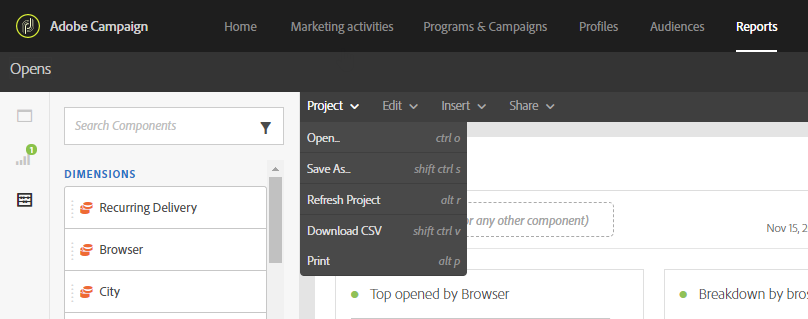
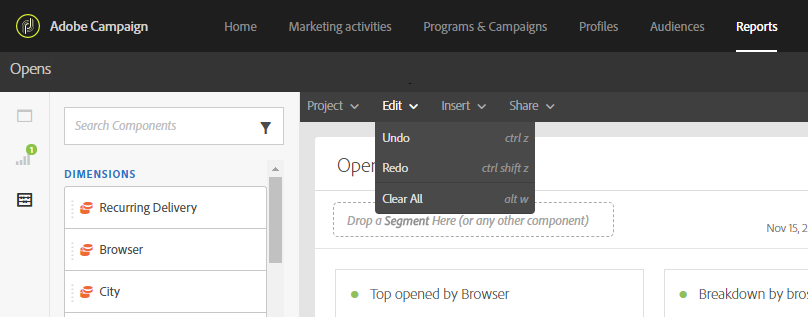
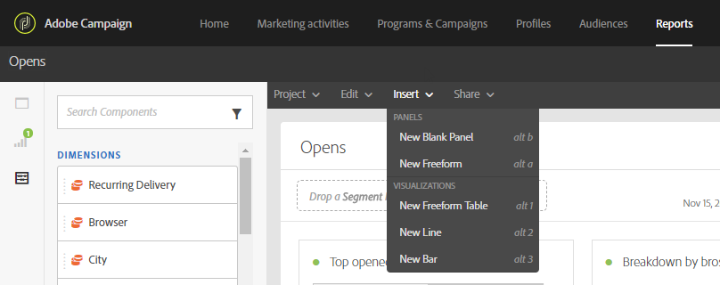
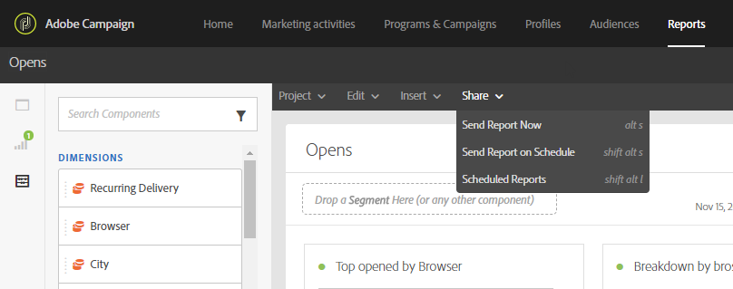
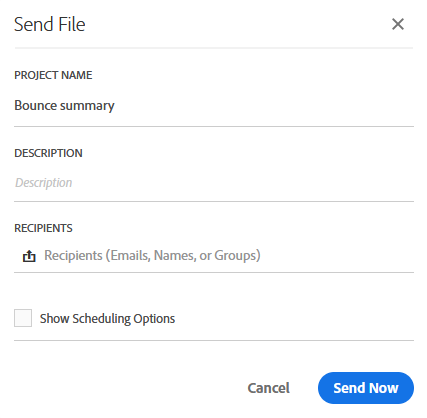
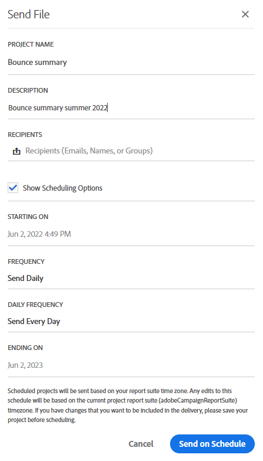
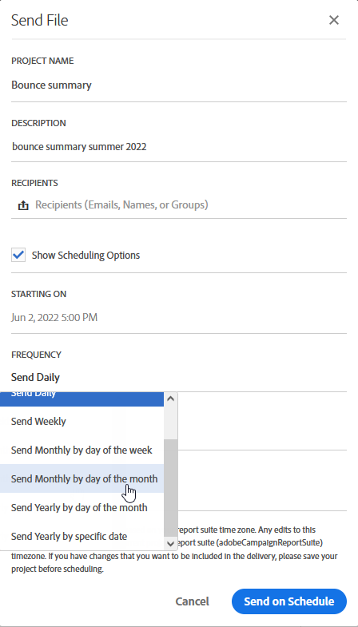

# Reporting interface{#reporting-interface}

The top toolbar allows you, for example, to modify, save or print your report.

Use the **Project** tab to:

* **Open...**: Opens a previously created report or a template.
* **Save As...**: Duplicates templates to be able to modify them.
* **Refresh project**: Updates your report based upon new data and changes to filters.
* **Download CSV**: Exports your reports to a CSV file.

The **Edit** tab allows you to:

* **Undo**: Cancels your last action on your dashboard.
* **Clear all**: Deletes every panel on your dashboard.

The **Insert** table lets you customize your reports by adding graphs and tables to your dashboard:

* **New Blank Panel**: Adds a new blank panel to your dashboard.
* **New Freeform**: Adds a new freeform table to your dashboard.
* **New Line**: Adds a new line graph to your dashboard.
* **New Bar**: Adds a new bar graph to your dashboard.

**Related topics:**

* [Adding panels](../../reporting/using/adding-panels.md)
* [Adding visualizations](../../reporting/using/adding-visualizations.md)
* [Adding components](../../reporting/using/adding-components.md)
* [Sharing reports automatically with stakeholders through email](https://helpx.adobe.com/campaign/kb/simplify-campaign-management.html#Reportandshareinsightswithallstakeholders)

## Tabs {#tabs}

The left tabs let you build your report and filter your data as needed.

These tabs give you access to the following items:

* **[!UICONTROL Panels]**: add a blank panel or freeform to your report to start filtering your data. For more on this, refer to the Adding panels section
* **[!UICONTROL Visualizations]**: drag and drop a selection of visualization items to give your report a graphical dimension. For more on this, refer to the Adding visualizations section.
* **[!UICONTROL Components]**: customize your reports with different dimensions, metrics, segments and time periods.

## Toolbar {#toolbar}

The toolbar can be found above your workspace. Composed of different tabs, it allows you, for example, to modify, save, share or print your report.

**Related topics:**

* [Adding panels](../../reporting/using/adding-panels.md)
* [Adding visualizations](../../reporting/using/adding-visualizations.md)
* [Adding components](../../reporting/using/adding-components.md)

### Project tab {#project-tab}

Use the **Project** tab to:

* **Open...**: Opens a previously created report or a template.
* **Save As...**: Duplicates templates to be able to modify them.
* **Refresh project**: Updates your report based upon new data and changes to filters.
* **Download CSV**: Exports your reports to a CSV file.
* **[!UICONTROL Print]**: Print your report.

### Edit tab {#edit-tab}

The **Edit** tab allows you to:

* **Undo**: Cancels your last action on your dashboard.
* **Clear all**: Deletes every panel on your dashboard.

### Insert tab {#insert-tab}

The **Insert** tab lets you customize your reports by adding graphs and tables to your dashboard:

* **New Blank Panel**: Adds a new blank panel to your dashboard.
* **New Freeform**: Adds a new freeform table to your dashboard.
* **New Line**: Adds a new line graph to your dashboard.
* **New Bar**: Adds a new bar graph to your dashboard.

### Share tab {#share-tab}

The **[!UICONTROL Share]** tab allows you to send your reports with Adobe Campaign users through one-shot or recurrent emails. The targeted users will then receive an email with your report attached.

* **[!UICONTROL Send report now]**: Send your report to a list of chosen recipients through a one-shot email.

    1. In the **[!UICONTROL Send report]** window, add a description if needed.
    
       

    1. Select the recipients from the drop-down. Note that you cannot select users outside your organization.
    1. Check **[!UICONTROL Show scheduling options]** if you want to send recurring emails. This can also be done by selecting **[!UICONTROL Send Report on schedule]** in the **[!UICONTROL Share]** tab.
    1. Click **[!UICONTROL Send now]**. Your recipients will then receive an email with your report attached.

* **[!UICONTROL Send report on schedule]**: Schedule your report and send recurring emails to your recipients.

    1. In the **[!UICONTROL Send report]** window, add a description if needed.
    1. Select the recipients from the drop-down. Note that you cannot select users outside your organization.
    
       

    1. Select your starting and ending date to configure your email validity in the **[!UICONTROL Starting on]** and **[!UICONTROL Ending on]** fields.
    1. Choose at which frequency your email will be sent.
    
       

    1. Click **[!UICONTROL Send on schedule]**, your recipients will receive your recurring email depending on the chosen frequency.

* **[!UICONTROL Scheduled reports]**: Find and configure all your scheduled report.

    1. In the **[!UICONTROL Scheduled reports]** window, find all your recurring sent reports. 
    
       

    1. If you need to delete one of your scheduled report, select the scheduled report you want to delete then click **[!UICONTROL Delete the section]**. 
    1. To configure or check your scheduled reports, click directly on the report you need to change.
    1. The **[!UICONTROL Edit scheduled report]** window appears, you can now change the recipients or frequency of your email if needed.

The targeted users will then receive an email with your report attached directly in their inboxes. Users can always decide to stop receiving recurring emails using an unsubscription link available in each recurring email.

**Related topic:**

* [Sharing reports automatically with stakeholders through email](https://helpx.adobe.com/campaign/kb/simplify-campaign-management.html#Reportandshareinsightswithallstakeholders)
