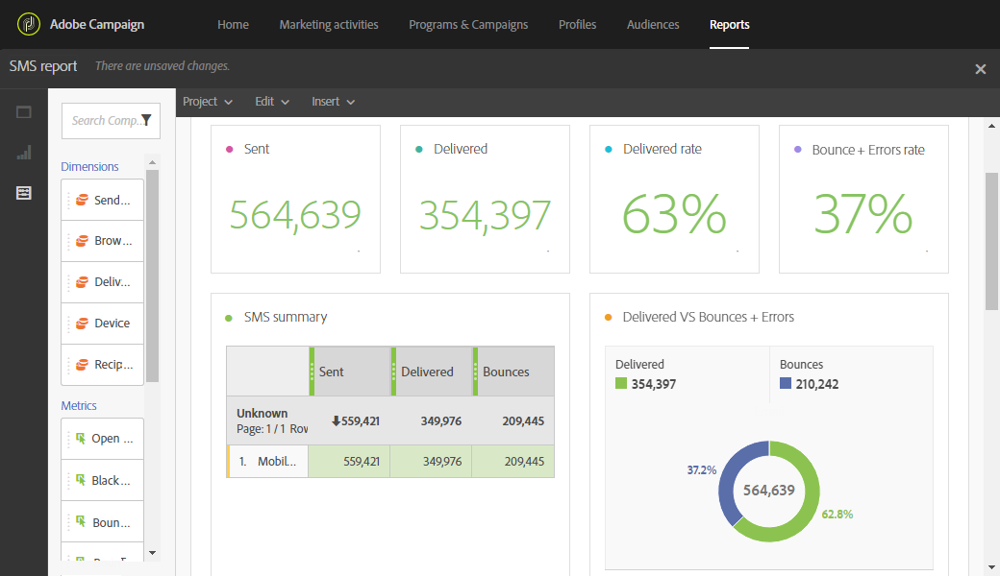

# SMS report{#sms-report}

SMS report

The **SMS **report provides details about SMS deliveries, such as delivered and bounce rates.

The **SMS summary** table, graphs and summary numbers contain available data for SMS deliveries that have been sent.

* **Sent**: The number of SMS sent.
* **Delivered**: The number of SMS delivered.
* **Bounces + Errors**: The number of messages that could not be delivered.

