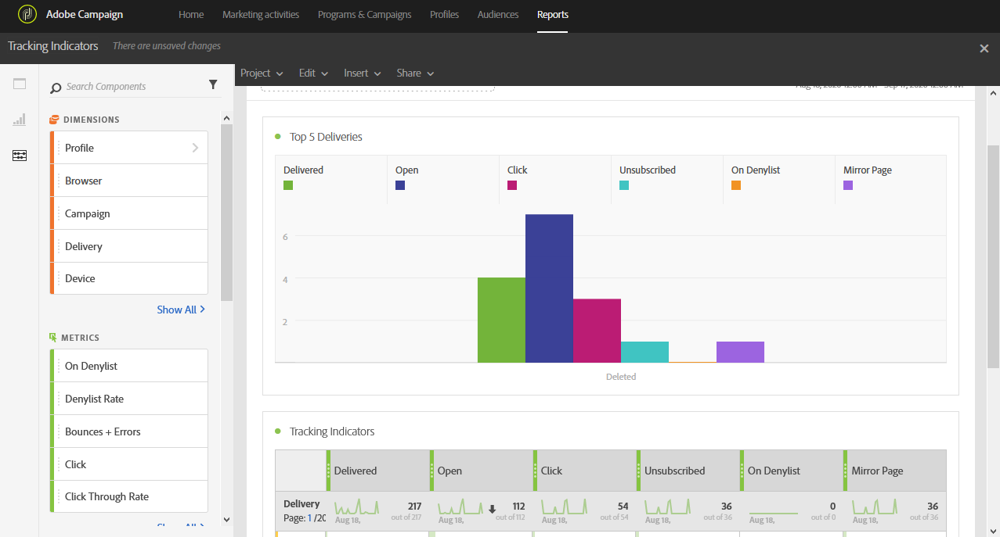

# Tracking indicators{#tracking-indicators}

The **[!UICONTROL Tracking indicators]** report contains the key indicators for tracking behavior after email messages are received.

>[!NOTE]
>
>To access this data, tracking has to be enabled when preparing a delivery.

The **[!UICONTROL Tracking indicators]** table and **Top 5 deliveries** graph contain the available data for email tracking, such as:

* **[!UICONTROL Delivered]**: The number of messages successfully sent. Errors raised (bounces) are taken into account. however, complaints (spam declarations) and away messages such as "out of office" are not taken into account.
* **Open**: The number of times a message was opened in a delivery.
* **Click**: The number of times content was clicked in a delivery.
* **Unsubscribed**: The number of clicks on the subscription link.
* **Spam:** The number of recipients who have declared an email as spam.
* **Mirror Page**: The number of clicks on the mirror page link.
