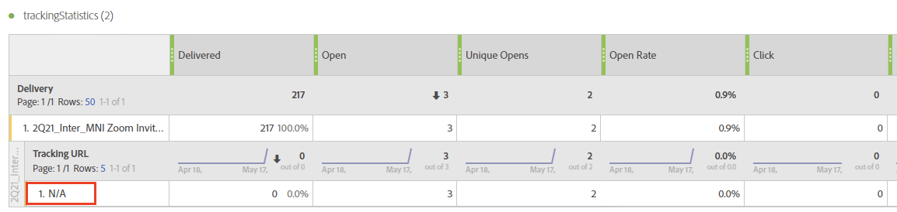

# Troubleshooting{#troubleshooting}

You can find in this section common questions related to Dynamic reporting.

## For Unique opens and Unique clicks, the count in the aggregate row is not matching the ones in individual rows {#unique-open-clicks-no-match}

This is an expected behavior.
We can take the following example to explain this behavior.

An email is sent to profiles P1 and P2.

P1 opens the email twice on the first day and then tree times on the second day. 

Whereas, P2 opens the email once on the first day and doesn't reopen it in the following days.
Here is a visual representation of the profiles' interaction with the sent email:

<table> 
 <thead> 
  <tr> 
   <th align="center"> <strong>Day</strong>   </th> 
   <th align="center"> <strong>Opens</strong>   </th> 
   <th align="center"> <strong>Unique opens</strong>   </th> 
  </tr> 
 </thead> 
 <tbody> 
  <tr> 
   <td align="center"> Day 1  </td> 
   <td align="center"> 2 + 1 = 3  </td> 
   <td align="center"> 1 + 1 = 2  </td> 
  </tr> 
  <tr> 
   <td align="center"> Day 2  </td> 
   <td align="center"> 3 + 0 = 3  </td> 
   <td align="center"> 1 + 0 = 1  </td> 
  </tr>
 </tbody> 
</table>

To understand the overall number of unique opens, we need to sum up the row counts of **[!UICONTROL Unique Opens]** which gives us the value 3. But since the email was targeted to only 2 profiles, the Open rate should show 150%.

To not obtain percentage higher than 100, the definition of **[!UICONTROL Unique Opens]** is maintained to be the number of unique broadlogs that were opened. In this case even if P1 opened the email on Day 1 and Day 2, their unique opens will still be 1.

This will result in the following table:

<table> 
 <thead> 
  <tr> 
   <th align="center"> <strong></strong>   </th> 
   <th align="center"> <strong>Opens</strong>   </th> 
   <th align="center"> <strong>Unique opens</strong>   </th> 
  </tr> 
 </thead> 
 <tbody> 
  <tr> 
   <td align="center"> <strong> Day </strong>  </td> 
   <td align="center"> <strong> 6 </strong>  </td> 
   <td align="center"> <strong> 2</strong>  </td>
  </tr> 
  <tr> 
   <td align="center"> Day 1  </td> 
   <td align="center"> 3  </td> 
   <td align="center"> 2  </td>
  </tr> 
  <tr> 
   <td align="center"> Day 2  </td> 
   <td align="center"> 3  </td> 
   <td align="center"> 1  </td> 
  </tr> 
 </tbody> 
</table>

>[!NOTE]
>
>Unique counts are based on an HLL-based sketch, this may cause slight inaccuracies at large counts.

## Open counts do not match the Database count {#open-counts-no-match-database}

This may be due to the fact that, heuristics are used in Dynamic reporting to track opens even when we can't track the **[!UICONTROL Open]** action.

For example, if a user has disabled images on their client and click on a link in the email, the **[!UICONTROL Open]** may not be tracked by the database but the **[!UICONTROL Click]** will.

Therefore, the **[!UICONTROL Open]** tracking logs counts may not have the same count in the database.

Such occurrences are added as **"an email click implies an email open"**.

>[!NOTE]
>
>Since unique counts are based on an HLL-based sketch, minor inconsistencies between the counts can be experienced.

## How are counts for recurring/transactional deliveries calculated? {#counts-recurring-deliveries}

When working with recurring and transactional deliveries, the counts will be attributed to both the parent and child deliveries.
We can take the example of a recurring delivery named **R1** set to run every day on day 1 (RC1), day 2 (RC2) and day 3 (RC3).
Let's assume that only a single person opened all the child deliveries multiple times. In this case, the individual recurring child deliveries will show the **[!UICONTROL Open]** count as 1 for each.
However, since the same person clicked on all the deliveries, the parent recurring delivery will also have **[!UICONTROL Unique open]** as 1.

Reports should look like the following:

<table> 
 <thead> 
  <tr> 
   <th align="center"> <strong>Delivery</strong>   </th> 
   <th align="center"> <strong>Sent</strong>   </th> 
   <th align="center"> <strong>Delivered</strong>   </th>
   <th align="center"> <strong>Opens</strong>   </th> 
   <th align="center"> <strong>Unique opens</strong>   </th>
  </tr> 
 </thead> 
 <tbody> 
  <tr> 
   <td align="center"> <strong>R1</strong>  </td> 
   <td align="center"> <strong>100</strong>  </td> 
   <td align="center"> <strong>90</strong>  </td> 
   <td align="center"> <strong>10</strong>  </td> 
   <td align="center"> <strong>3</strong>  </td> 
  </tr> 
  <tr> 
   <td align="center"> RC1  </td> 
   <td align="center"> 20  </td> 
   <td align="center"> 20  </td> 
   <td align="center"> 6  </td> 
   <td align="center"> 1  </td> 
  </tr>
    <tr> 
   <td align="center"> RC2  </td> 
   <td align="center"> 40  </td> 
   <td align="center"> 30  </td> 
   <td align="center"> 2  </td> 
   <td align="center"> 1  </td> 
  </tr> 
    <tr> 
   <td align="center"> RC3  </td> 
   <td align="center"> 40  </td> 
   <td align="center"> 40  </td> 
   <td align="center"> 2  </td> 
   <td align="center"> 1  </td> 
  </tr> 
 </tbody> 
</table>

## What is the colors' signification in my reports' table? {#reports-color-signification}

Colors displayed on your reports are randomized and cannot be personalized. They represent a progress bar and are displayed to help you better highlight the maximal value reached in your reports.

In the example below, the cell is of the same color since its value is 100%.

If you change the **[!UICONTROL Conditional formatting]** to custom, when the value reaches the upper limit the cell will get greener. Whereas, if it reaches the lower limit, it will get redder.

For example, here, we set the **[!UICONTROL Upper limit]** to 500 and **[!UICONTROL Lower limit]** to 0.

## Why does the value N/A appear in my reports?

The value **N/A** can sometimes appear in your dynamic reports. This can be displayed for three reasons:

* The delivery has been deleted and is shown here as **N/A** to not cause discrepancy in the results.
* When drag and dropping the **[!UICONTROL Transactional Delivery]** dimension to your reports, the value **N/A** might appear as a result. This happens because Dynamic report fetches every delivery even if they are not transactional. This can also happen when drag and dropping the **[!UICONTROL Delivery]** dimension to your report but in this case, the **N/A** value will represent transactional deliveries.
* When a dimension is used with a metric that is not related to the dimension. In the example below, a breakdown is added with the **[!UICONTROL Tracking URL]** dimension even though the **[!UICONTROL Click]** count is set to 0 in this delivery. 

  

## Deliveries' reports show incomplete data when using custom Target mapping

If you are using imported custom Target mappings in deliveries and no data is displayed in the different reports, this could mean that the Reporting enrichments were not created for those Target mappings.

To resolve this:

* After importing your Target mapping from an XML, you will also need to import the Reporting enrichment.

* Instead of importing your Target mapping, you can create it directly in Adobe Campaign Standard which will automatically create the Reporting enrichment. 

## Discrepancy between the column header number and sum of rows 

Discrepancy between the column header number and the sum of all rows is expected for the following cases:

* **Unique Metrics**: Using unique metrics can alter the total count displayed in the header, as it is based on recipient IDs instead of a simple sum of row counts. Consequently, a single profile might trigger numerous events across various dimensions, leading to multiple rows in the dataset. However, in the header, each profile is counted only once.

  For example:

  * If a profile A opens an email on three different days, the breakdown by day will show A in three rows, but in the header, A will count as 1.

  * If profile A clicks on three different links in an email on the same day, the breakdown by tracking URL will show A in three rows, but in the header, A will count as 1. The same applies to breakdowns by device and browser.

* **Open Metrics**: The count of Opens is determined by aggregating the total of both actual Open events and Unique click events (per recipient ID), excluding cases where an open event has not occurred since an email link cannot be clicked without an open event.

  For example:

  * When profile A opens a tracked email (with URL U1), it registers as an open event with the URL noted as null. Clicking on U1 later generates a click event. Although A's click on U1 is counted as an open event too, there is no specific open event for U1. Hence, A is only counted once in the unique open count.

  * A profile R opens an email on day 1, registering an open event, and clicks a link. Over the next two days, R reopens the email and clicks the link again, generating a click event each day. While R's engagement is tracked daily in the Open number, R is only counted once in the column header, focusing on unique engagements.

* **Negated event**: In Reports, negated event means delivery attempts that were initially marked successful but ultimately failed after retries. These are indicated by a count of -1. To avoid confusion, these negative counts are excluded from the displayed Delivery metric numbers. As a result, the total of all rows for the delivery metric may not match the column header number.
