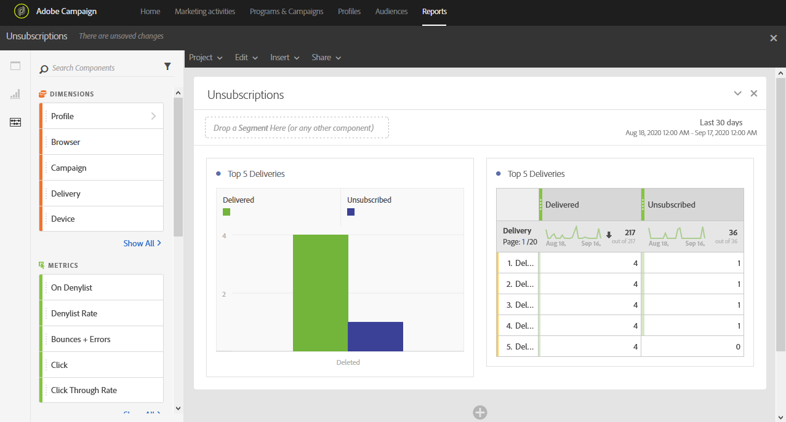

# Unsubscriptions{#unsubscriptions}

Unsubscriptions

The **Unsubscriptions** report identifies the deliveries with the most unsubscriptions.

The **TOP 5 deliveries **table and graph displays the top five deliveries with the highest number of delivered messages and the number of recipients that have unsubscribed. Data listed here is based upon the number of clicks on the message's unsubscription link.
