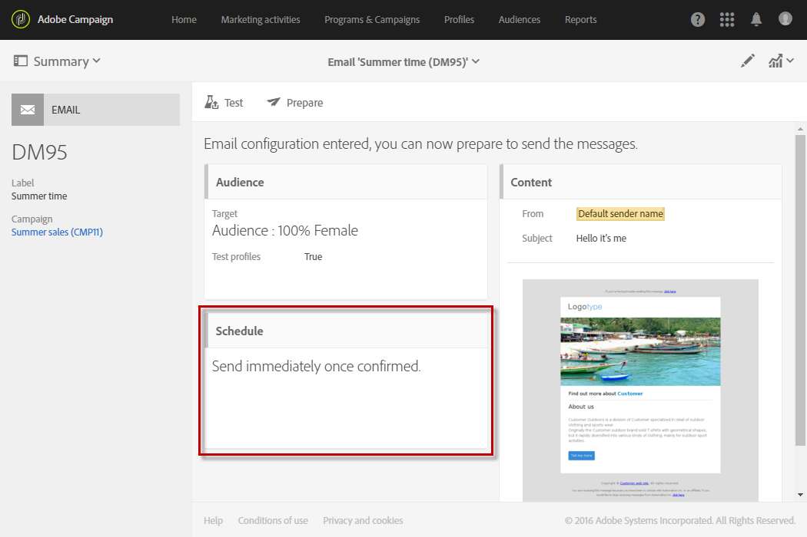
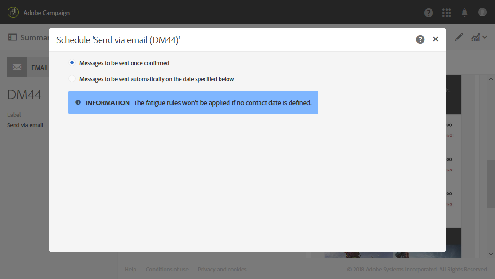
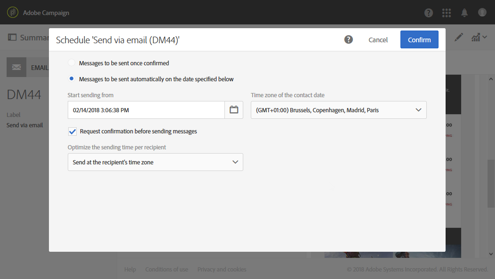

# About scheduling messages{#about-scheduling-messages}

About scheduling messages

>[!CAUTION]
>
>Whenever making changes to a delivery’s schedule, you must re-prepare the delivery by clicking on the **Prepare** button before clicking **Confirm**.

In the message dashboard, the **Schedule** block allows you to define when messages will be sent.

The **Schedule** properties let you set sending options:

* **Messages to be sent once confirmed**: messages are sent as soon as the send is confirmed. See [Confirming the send](../../sending/using/confirming-the-send.md).

  

* **Messages to be sent automatically on the date specified below**: messages will be sent at a later date and time. Specify the **contact date** in the **Start sending from** field.

  You can prepare and confirm the send, but messages will only be sent starting the selected date and time. Preparing and confirming the send are presented in the [Preparing the send](../../sending/using/preparing-the-send.md) and [Confirming the send](../../sending/using/confirming-the-send.md) sections.

  The **Time zone of the contact date** drop-down list allows you to modify the time zone that will be taken into account for the sending time. For example, if you enter 9:00 AM in the **Start sending from** field and if you select Brussels, Copenhagen, Madrid, Paris (GMT+1) in the **Time zone of the contact date** drop-down list, all recipients will receive the message at 9:00 AM Paris time. Therefore, a recipient located in Moscow (GMT+3) will receive the message at 11:00 AM Moscow time.

  If you would like to manually confirm the send, check the **Request confirmation before sending messages** option. This option is enabled by default.

  

>[!CAUTION]
>
>When duplicating a delivery, all scheduling settings are deleted. Unless you schedule a new contact date, the duplicated delivery will be sent as soon as the send is confirmed.

**Related topics**:

* [Optimizing the sending time](../../sending/using/optimizing-the-sending-time.md)
* [Sending messages at the recipient's time zone](../../sending/using/sending-messages-at-the-recipient-s-time-zone.md)
* [Computing the sending date](../../sending/using/computing-the-sending-date.md)

