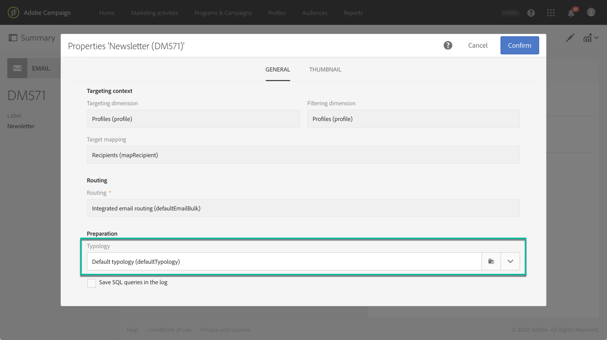

# About typologies and typology rules{#about-typology-rules}

Campaign Standard allows you to link a message to a **typology**, in order to check wether the message is valid and meets your quality criteria.

Typologies are sets of **typology rules**, that are executed during the message analysis phase. They allow you to make sure your emails always contain certain elements (such as an unsubscription link or a subject line) or filtering rules to exclude groups from your intended target (like unsubscribers, competitors, or non-loyalty customers).

Ready-to-use typologies and typology rules are available in Campaign Standard. Depending on your needs, you can also create new rules, and add them to existing or new typologies to link to your messages.

The steps to create and apply a typology to messages are:

1. Create typology rules.
1. Create a typology and reference the rules you created into it.
1. Configure your delivery to use the typology you created.
1. During the message preparation, profiles are excluded when criterion is met. You can check logs to monitor exclusions.

**Related topics:**

* [Managing typologies](../../sending/using/managing-typologies.md)
* [Managing typology rules](../../sending/using/managing-typology-rules.md)
