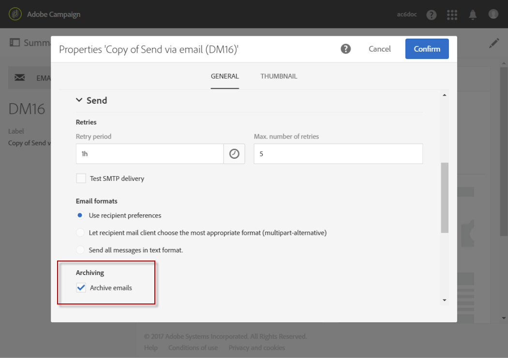

# Archiving with Email BCC{#archiving-emails}

You can configure Adobe Campaign to keep a copy of emails sent from your platform through Email BCC.

In particular, if your organization needs to archive all outbound email messages for compliance, you can enable this capability. It allows you to send an exact hidden copy of the corresponding sent messages to a BCC email address (invisible to the delivery recipients) that you must specify.

Once enabled, you need to activate Email BCC from the **[!UICONTROL Archive emails]** option in the email delivery template.

>[!NOTE]
>
>Adobe Campaign itself does not manage archived files. It does enable you to send the messages of your choice to a dedicated address, from where they can be processed and archived using an external system.

## Recommendations and limitations {#recommendations-and-limitations}

* This feature is optional. Please check your license agreement and contact your account executive to activate it.
* The BCC address of your choice must be provided to the Adobe team who will configure it for you.
* You can only use one BCC email address.
* Only successfully sent emails are taken in account. Bounces are not.
* For privacy reasons, BCC emails must be processed by an archiving system capable of storing securely personally identifiable information (PII).
* When creating a new delivery template, Email BCC is not enabled by default, even if the option has been purchased. You must enable it manually in each delivery template where you want to use it.

>[!NOTE]
>
>Currently the archived emails cannot be sent with the Adobe Campaign Enhanced MTA, even if you are already upgraded to the Enhanced MTA.

## Activating email archiving {#activating-email-archiving}

Once enabled, Email BCC is activated in the [email template](../../start/using/marketing-activity-templates.md), through a dedicated option:

1. Go to **Resources** > **Templates** > **Delivery templates**.
1. Duplicate the out-of-the-box **[!UICONTROL Send via email]** template.
1. Select the duplicated template.
1. Click the **[!UICONTROL Edit properties]** button to edit the template's properties.
1. Expand the **[!UICONTROL Send]** section.
1. Check the **[!UICONTROL Archive emails]** box to keep a copy of all sent messages for each delivery based on this template.

   

>[!NOTE]
>
>If the emails sent to the BCC address are opened and clicked through, this will be taken into account in the **[!UICONTROL Total opens]** and **[!UICONTROL Clicks]** from the send analysis, which could cause some miscalculations.