# Computing the sending date{#computing-the-sending-date}

Computing the sending date

You can define a formula to send the message to each recipient at a specific date and time.

## Customizing date formula {#customizing-date-formula}

For example, you may use send time optimization during the ramp-up process.

When emails are sent using a new platform, Internet service providers (ISPs) are suspicious of IP addresses that are not recognized. If large volumes of emails are suddenly sent, the ISPs often mark them as spam.

To avoid being marked as spam, you can progressively increase the volume sent by distributing large volumes of emails over different times. This should ensure smooth development of the start-up phase and enable you to reduce the overall rate of invalid addresses.

For example, you can segment your target audience randomly to send your delivery in five batches. You will send a first batch representing 10% of your target audience on June 1st at 10:00 AM, a second batch 24 hours later with 15% of the audience, and so on.

You can schedule this using a workflow.

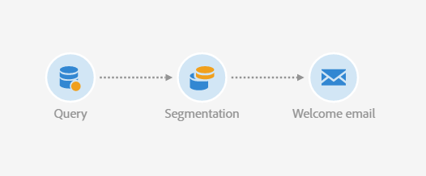

1. Access the marketing activity list and create a new workflow. See [Creating a workflow](../../automating/using/building-a-workflow.md#creating-a-workflow).
1. Drag and drop a **Query** activity into your workflow and open it. See the [Query](../../automating/using/query.md) section.
1. Select an audience, for example all your Gold customers and click **[!UICONTROL Confirm]** to save the query.
1. Drag and drop a **Segmentation** activity into your workflow and open it. See the [Segmentation](../../automating/using/segmentation.md) section.
1. Define five segments. For each segment:

    * Fill in the **[!UICONTROL Segment code]** field: manually enter the desired date and time for sending the message.

      For example, you want to send the first batch on June 1st at 10:00 AM GMT+1. Use the following format: **YYYY-MM-DD hh:mm:ss+tz**.
    
      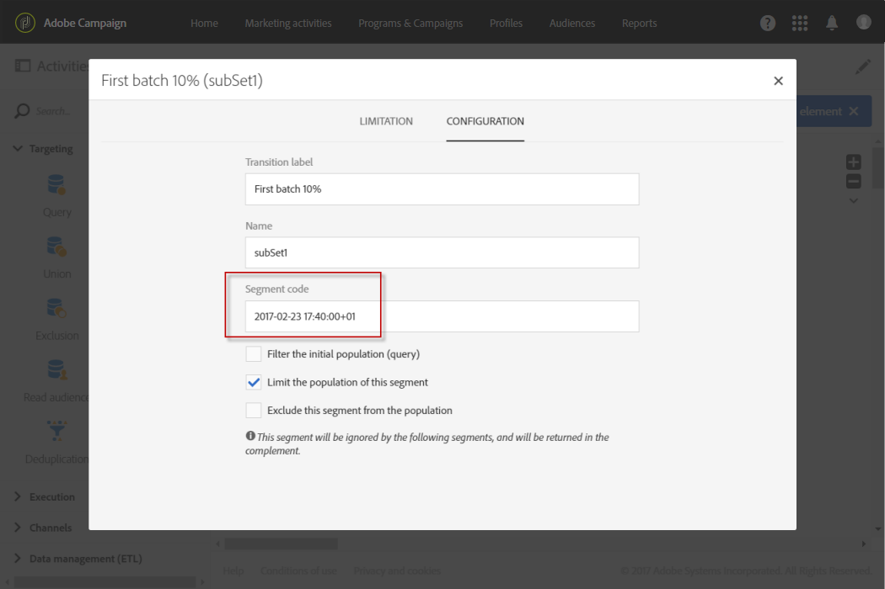

      To send the next batch the day after, enter **2017-06-02 10:00:00+01** for the second segment.

      For the remaining segments, define the next batches as follows:

        * 
        * 
        *

    * Make sure you select the **[!UICONTROL Limit the population of this segment]** option.

      In the **[!UICONTROL Limitation]** tab, select **[!UICONTROL Random sampling]** and enter the desired percentage for each segment: 10 for the first batch, 15 for the second, and so on.
    
      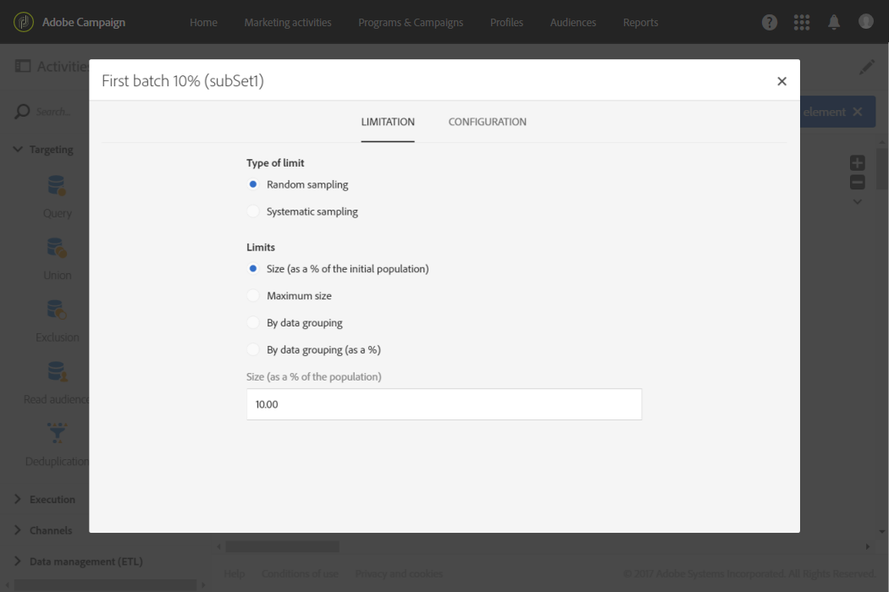

1. Once all segments are defined, select **[!UICONTROL Generate all segments in the same transition]** and click **[!UICONTROL Confirm]** .

   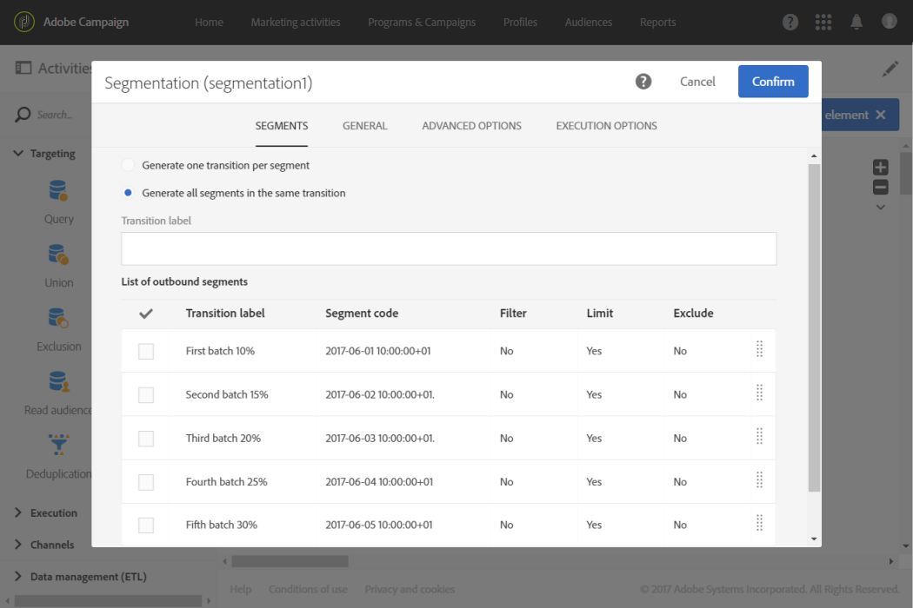

1. Drag and drop an **Email delivery** activity into your workflow and open it. See the [Email delivery](../../automating/using/email-delivery.md) section.
1. Click the **[!UICONTROL Schedule]** section in the email dashboard and select **[!UICONTROL Messages to be sent automatically on the date specified below]** .
1. In the **[!UICONTROL Start sending from]** field, define a contact date.
1. From the send time optimization drop-down menu, choose **[!UICONTROL Send at a custom date defined by a formula]** .
1. Click the **[!UICONTROL Edit an expression]** button of the **[!UICONTROL Custom date formula]** field.

   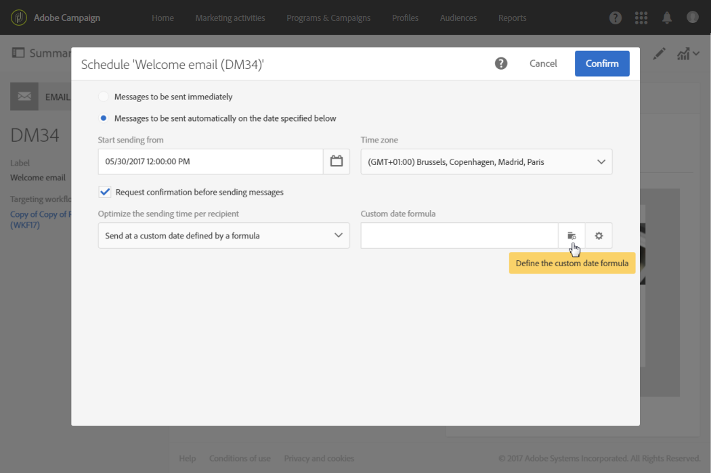

1. Create the following expression using the **[!UICONTROL ToDateTime]** function and the **[!UICONTROL Segment code]** field. You can also direclty type in the expression but make sure to use correct syntax and spelling.

   ```
   ToDateTime([targetData/@segmentCode])
   ```

   The **[!UICONTROL ToDateTime]** function transforms the segment code from a text string to a date and time value.

   Confirm the expression to return to the previous screen.

   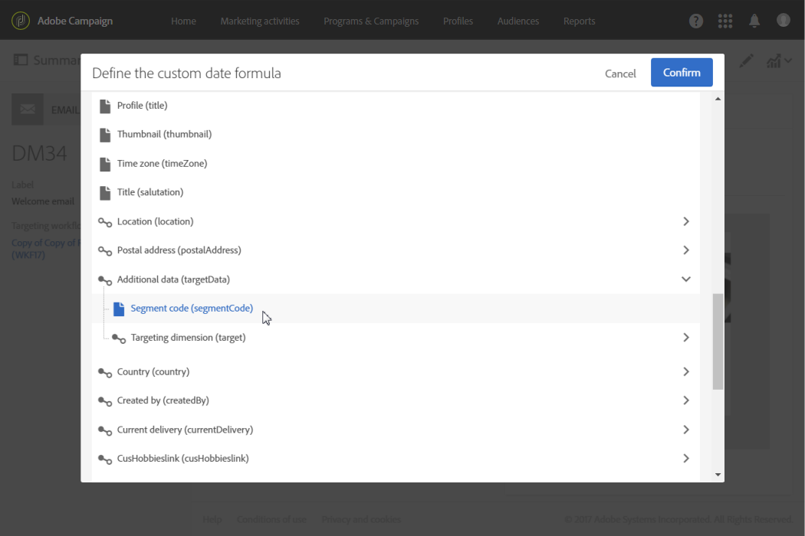

   In the **[!UICONTROL Schedule]** window, the custom date formula is displayed as follows:

   ```
   ToDateTime([targetData/@segmentCode])
   ```

   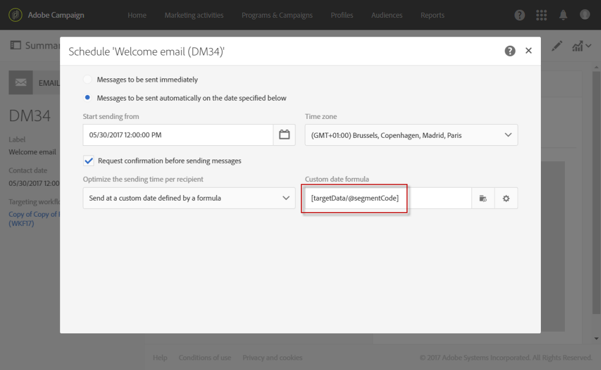

1. Confirm the schedule, save your delivery and execute the workflow.

The delivery will be progressively sent to all targeted recipients over five days.

>[!NOTE]
>
>Make sure that all dates are in the future when confirming the send. Otherwise the message will be sent as soon as the send is confirmed.

## Using an expression {#using-an-expression}

Send time optimization is also useful for campaigns involving a call center. You can ensure that all messages are not received at the same time. This enables your organization to process the number of calls according to its capacity.

For example, you want to send an email inviting your customers to contact a call center in order to get a promotional offer. To avoid overwhelming the call center, you decide to segment your target audience randomly to send your email in four batches.

You can schedule this using a workflow.

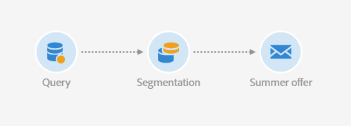

1. Access the marketing activity list and create a new workflow. See [Creating a workflow](../../automating/using/building-a-workflow.md#creating-a-workflow).
1. Drag and drop a **Query** activity into your workflow and open it. See the [Query](../../automating/using/query.md) section.
1. Select an audience, for example over 35 profiles and click **[!UICONTROL Confirm]** to save the query.
1. Drag and drop a **Segmentation** activity into your workflow and open it. See the [Segmentation](../../automating/using/segmentation.md) section.
1. Define four segments. For each segment:

    * Define the segment codes as follows:

        * 8:00 AM - 10:00 AM: **0**. The message will be sent to the first quarter of the target population at 8:00 AM (contact date).
        * 10:00 AM - 12:00 PM: **2**. The message will be sent to the second quarter of the target population at 10:00 AM (contact date + 2 hours).
        * 2:00 PM - 4:00 PM: **6**. The call center being closed between 12:00 PM and 2:00 PM, the message will be sent to the third quarter of the target population at 2:00 PM (contact date + 6 hours).
        * 4:00 PM - 6:00 PM: **8**. The message will be sent to the last quarter of the target population at 4:00 PM (contact date + 8 hours).

      >[!NOTE]
      >
      >The contact date will be defined in the Email delivery activity later in the workflow.

    * Make sure you select the **[!UICONTROL Limit the population of this segment]** option.
    * In the **[!UICONTROL Limitation]** tab, select **[!UICONTROL Random sampling]** and enter the desired percentage for each segment: **25**.

1. Once all segments are defined, select **[!UICONTROL Generate all segments in the same transition]** and click **[!UICONTROL Confirm]** .

   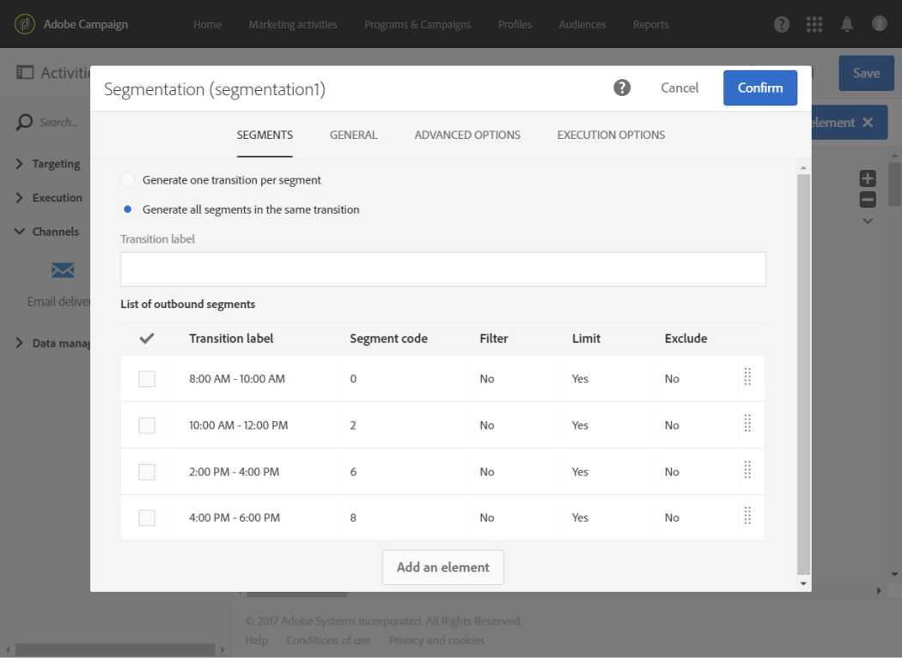

1. Drag and drop an **Email delivery** activity into your workflow and open it. See the [Email delivery](../../automating/using/email-delivery.md) section.
1. Click the **[!UICONTROL Schedule]** section in the email dashboard.
1. Select **[!UICONTROL Messages to be sent automatically on the date specified below]** .
1. In the **[!UICONTROL Start sending from]** field, define a contact date.

   In this example, select May 25th at 8:00 AM.

1. From the send time optimization drop-down menu, choose **[!UICONTROL Send at a custom date defined by a formula]** and click the **[!UICONTROL Edit an expression]** button.

   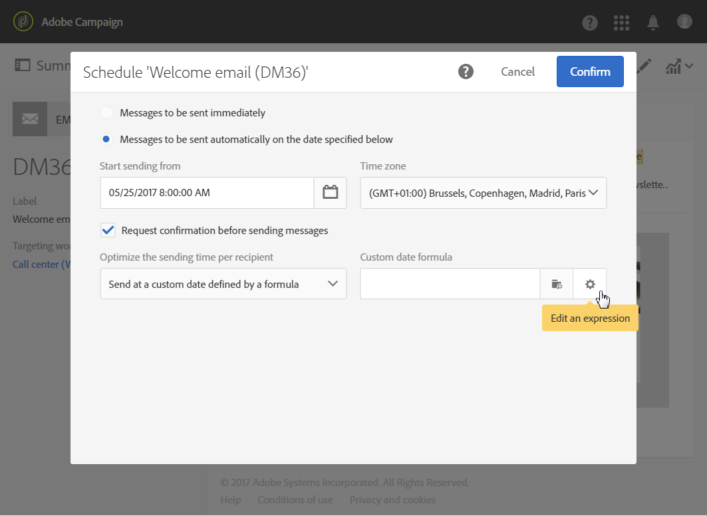

1. In the **[!UICONTROL Expression editor]** , set the date and the segment codes to compute the data for each customer.

   In the list of functions, select **[!UICONTROL AddHours]** .

   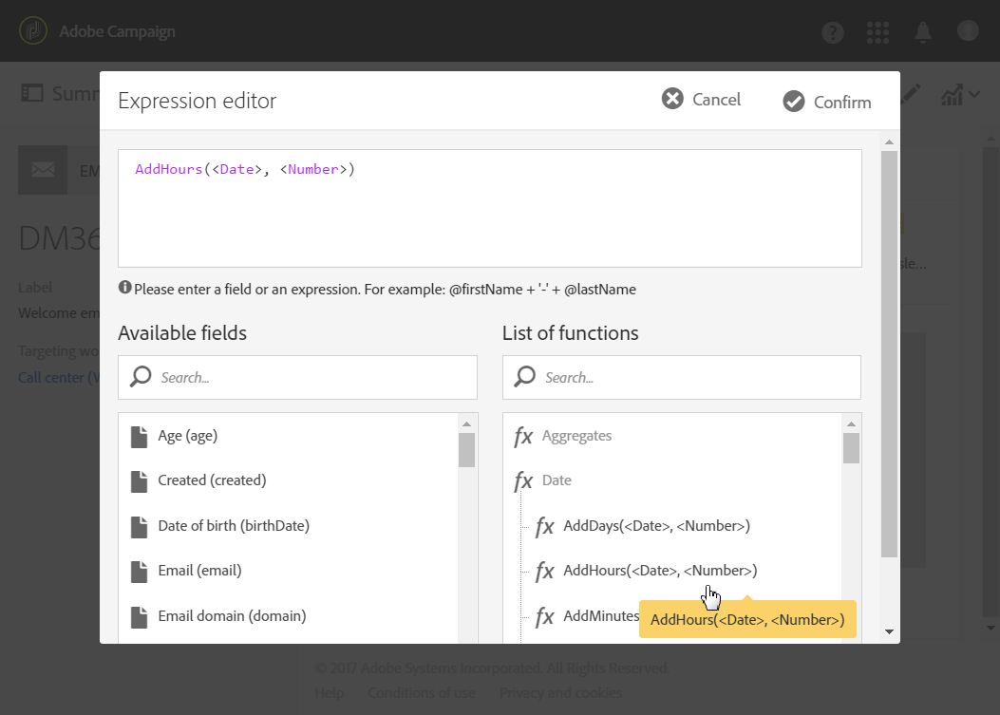

   In the available fields, select **[!UICONTROL Current delivery]** > **[!UICONTROL Delivery scheduling]** > **[!UICONTROL Contact date]** .

   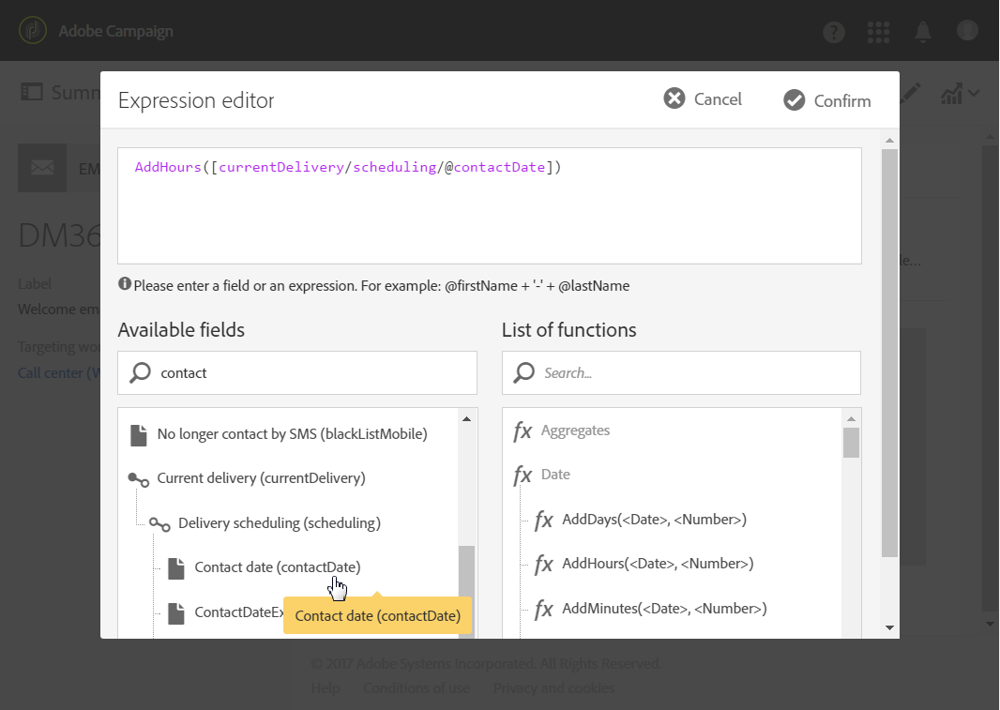

   This enables you to retrieve the date and time specified in the **[!UICONTROL Start sending from]** field.

   In the list of functions, select **[!UICONTROL ToInteger]** . In the available fields, select **[!UICONTROL Additional data]** > **[!UICONTROL Segment code]** .

   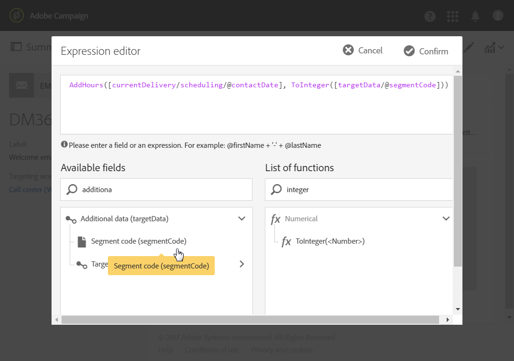

   This enables you to retrieve the numbers that you specified in the segment codes.

   You should get the following formula:

   ```
   AddHours([currentDelivery/scheduling/@contactDate], ToInteger([targetData/@segmentCode]))
   ```

1. Confirm to save your expression. Confirm the schedule, save your delivery and execute the workflow.

* The first segment will receive the message on the contact date (May 25th at 8:00 AM).
* The second segment will receive the message two hours later (May 25th at 10:00 AM).
* The third segment will receive the message six hours later (May 25th at 2:00 PM).
* The fourth segment will receive the message eight hours later (May 25th at 4:00 PM).

