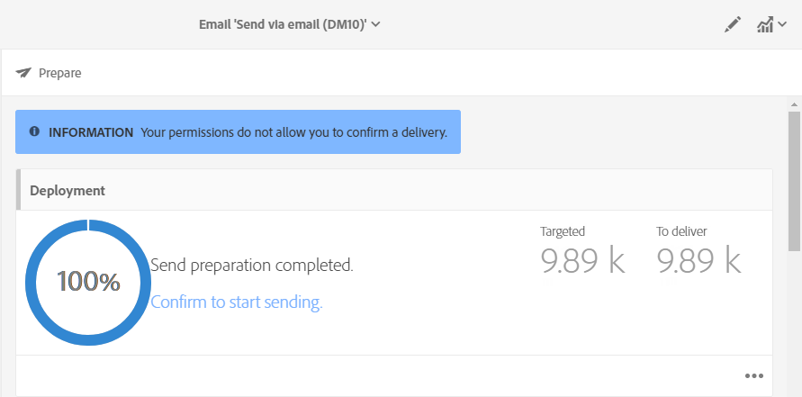
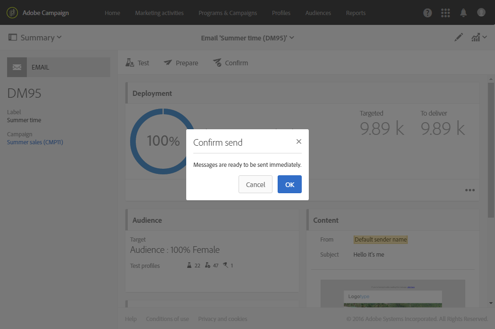
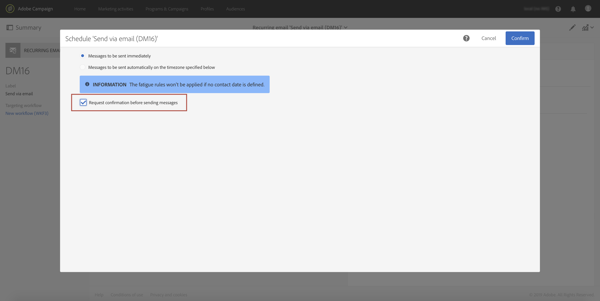
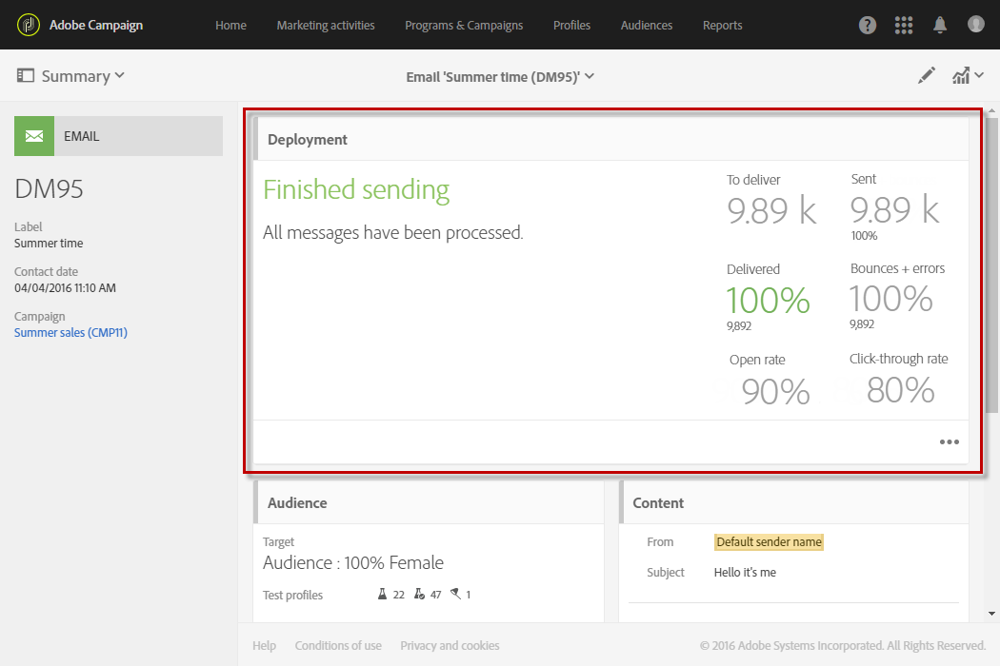
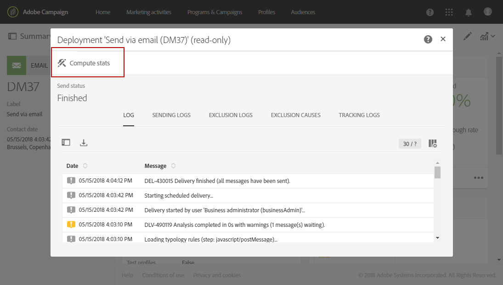
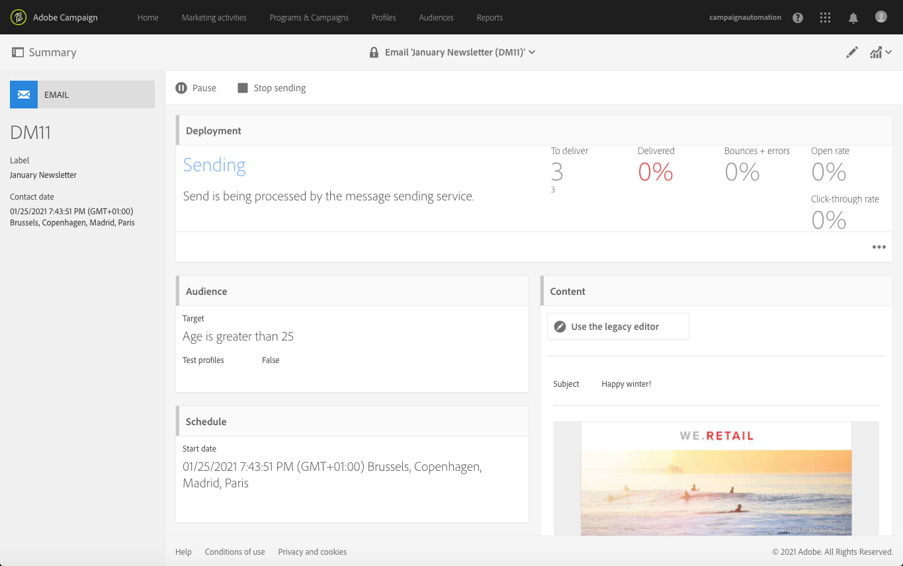
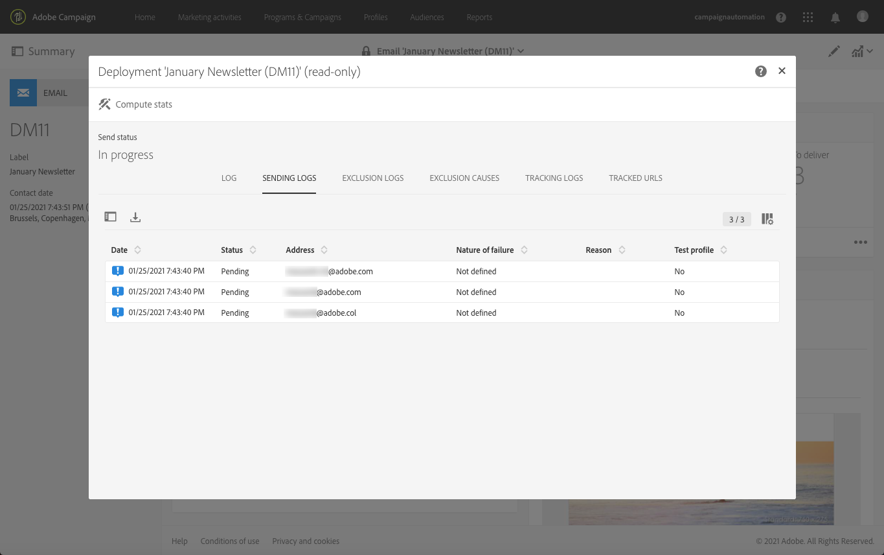

# Confirming the send{#confirming-the-send}

Once you have finished preparing your messages and the approval steps have been carried out, you can send them. For more on messages preparation, refer to [Preparing the send](../../sending/using/preparing-the-send.md).

Only users with the **[!UICONTROL Start deliveries]** role can confirm send. For more on this, refer to the [List of roles](../../administration/using/list-of-roles.md) section.

<!--Users without this role will see the following message: 

-->

## Sending the message {#sending-message}

Once ready, follow the steps below to send your message.

1. Click the **[!UICONTROL Confirm send]** button found in the message's action bar.

    

1. Finalize the send by clicking the **[!UICONTROL OK]** button.

    

The message is being sent. The **[!UICONTROL Deployment]** block shows the progress of the send.

>[!NOTE]
>
>If the message is scheduled, it will be sent when sending time is reached. For more on scheduling messages, refer to [this section](../../sending/using/about-scheduling-messages.md).

If you are using a recurring delivery with no aggregation period, you can request confirmation before the delivery is sent. To do this, when configuring your message, open the **[!UICONTROL Schedule]** block of the delivery dashboard and activate the dedicated option.

## Understanding message indicators {#message-indicators}

Once the message is sent to the contacts, the **[!UICONTROL Deployment]** zone shows your KPIs (Key Performance Indicator) data , including:

* The number of messages to deliver
* The number of messages sent
* The percentage of messages delivered
* The percentage of bounces and errors
* The percentage of open messages
* The percentage of clicks in the messages (for emails)

  >[!NOTE]
  >
  >The **[!UICONTROL Open rate]** and **[!UICONTROL Click-through rate]** are updated every hour.

If the KPIs take too long to update or do not take into account the results from the sending logs, click the **[!UICONTROL Compute stats]** button in the **[!UICONTROL Deployment]** window.

The message can be viewed in the history of one of the targeted profiles. See [Integrated customer profile](../../audiences/using/integrated-customer-profile.md).

Once a message is sent, you can track the behavior of its recipients, and monitor it to measure its impact. For more on this, refer to these sections:

* [Tracking messages](../../sending/using/tracking-messages.md)
* [Monitoring a delivery](../../sending/using/monitoring-a-delivery.md)

### Delivered status report {#delivered-status-report}

<!--All messages will show as Sent as soon as they are successfully relayed from Campaign to the Enhanced MTA. They will stay in that state unless or until a bounce for that message is communicated back from the Enhanced MTA to Campaign.-->

For the email channel, in the **[!UICONTROL Summary]** view of each message, the **[!UICONTROL Delivered]** percentage starts out at 100% and then progressively goes down throughout the validity period of the delivery, as the soft and hard bounces get reported back<!--from the Enhanced MTA to Campaign-->.

Indeed, all messages show as **[!UICONTROL Sent]** as soon as they are successfully relayed from Campaign to the Enhanced MTA (Message Transfer Agent). They stay in that state unless or until a bounce for that message is communicated back from the Enhanced MTA to Campaign.

Soft-bouncing messages do not show as **[!UICONTROL Failed]** after day one of the delivery. They are retried and stay in the retry queue until the end of the delivery [validity period](../../administration/using/configuring-email-channel.md#validity-period-parameters). For more on retries after a delivery temporary failure, see [this section](../../sending/using/understanding-delivery-failures.md#retries-after-a-delivery-temporary-failure).

>[!NOTE]
>
>You should wait until the end of the validity period to see the final **[!UICONTROL Delivered]** percentage, and the final number of actually **[!UICONTROL Sent]** and **[!UICONTROL Failed]** messages in the [sending logs](../../sending/using/monitoring-a-delivery.md#sending-logs).

### Email Feedback Service (beta) {#email-feedback-service}

With the Email Feedback Service (EFS) capability, the status of each email is accurately reported, because feedback is captured directly from the Enhanced MTA (Message Transfer Agent).

>[!IMPORTANT]
>
>The Email Feedback Service is currently available as a beta capability.

Once the delivery has started, there is no change in the **[!UICONTROL Delivered]** percentage when the message is successfully relayed from Campaign to the Enhanced MTA.

The delivery logs show the **[!UICONTROL Pending]** status for the targeted addresses.

When the message is actually delivered to the targeted profiles, the delivery logs show the **[!UICONTROL Sent]** status for each address that successfully received the message. The **[!UICONTROL Delivered]** percentage is updated accordingly with each successful delivery.

Soft-bouncing messages show as **[!UICONTROL Failed]** as soon as EFS retrieves their status. They do not increment an error counter and they are not added to the quarantined address list.

They are retried and stay in the retry queue throughout the delivery [validity period](../../administration/using/configuring-email-channel.md#validity-period-parameters). If a retry is successful before the end of the validity period, the message status changes to **[!UICONTROL Sent]**. Otherwise, the status remains as **[!UICONTROL Failed]**.

For more on retries after a delivery temporary failure, see [this section](../../sending/using/understanding-delivery-failures.md#retries-after-a-delivery-temporary-failure).
