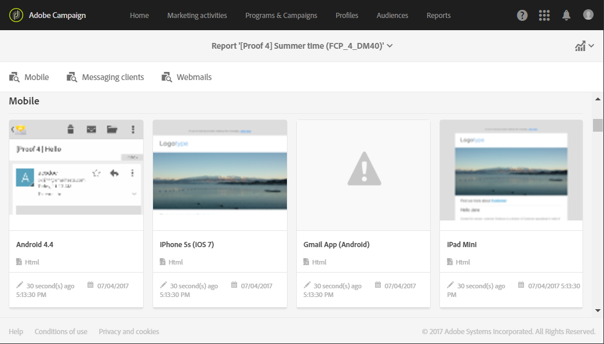

# Controlling email content{#control-email-content}

<!--TO KEEP because specific to Campaign-->

To make sure that your emails reach your recipients and improve your email deliverability rate, they must respect a number of rules. Otherwise, the content of certain messages may be detected as spam. Adobe Campaign provides you with several tools to make your content comply with these rules.

Follow the principles listed below when designing your message content:

* [Sender name and address](#sender-name): the address has to explicitly identify the sender. The domain has to be owned by and registered to the sender. The domain registry must not be privatized.
    <!--**Subject**: Avoid excessive capitalization and punctuation, and words that are frequently used by spammers ("Win", "Free", etc.).-->
* [Personalization and send time optimization](#perso-send-time-optimization): personalizing content and defining a sending time per recipient increase the chances of your message being opened.
* Images and text: respect a decent text/image ratio (for example 60% text and 40% images).
* [Unsubscription link](#opt-out) and landing page: the unsubscription link is essential. It must be visible and valid, and the form must be functional.
* Preview: use the tools offered by Adobe Campaign to check and optimize the content of your email ([Anti-spam analysis](#anti-spam-analysis), [Email rendering](#message-responsiveness)).

For additional tips to optimize deliverability when designing content, see the [Adobe Deliverability Best Practice Guide](https://experienceleague.adobe.com/docs/deliverability-learn/deliverability-best-practice-guide/content-best-practices-for-optimal-delivery.html).

>[!NOTE]
>
>For more information on editing email content, consult the [Email Designer overview](../../designing/using/designing-content-in-adobe-campaign.md) and the [Message design best practices](../../designing/using/designing-content-in-adobe-campaign.md#content-design-best-practices).

## Sender name and address {#sender-name}

Certain ISPs check the validity of the sender address (**[!UICONTROL From]**) before accepting messages. A badly formed address may result in it being rejected by the receiving server.

You must make sure a correct address is given at the instance level or in the most frequently-used scenarios. To do this, contact your administrator.

For more on this, see [Defining the email sender of an email](../../designing/using/subject-line.md#email-sender).
  
## Personalization and send time optimization {#perso-send-time-optimization}

To improve your recipients’ experience and make them open your email, Adobe Campaign enables you to personalize your messages. For more on this, see [this section](designing/using/personalization.md).

To increase the opening rate of your messages, you can also manually define a sending time per recipient. Each profile will receive the message at the specified date and time, whenever possible. For more on this, see [Optimizing the sending time](../../sending/using/optimizing-the-sending-time.md).

## Opt-out link and form {#opt-out}

By default, when the message is analyzed, a typology rule checks whether an opt-out link has been included and generates a warning if it is missing. For more on managing links, see [this section](../../designing/using/links.md).

You must check that the opt-out link works correctly before each time you send. For example, when [sending the proof](../../sending/using/sending-proofs.md), make sure the link is valid, that the form is on-line and that validating this checks the **[!UICONTROL No longer contact]** boxes. You should make this check systematically because human error is always possible when entering the link or when changing the form. For more on managing opt-in and opt-out, see [this section](../../audiences/using/managing-opt-in-and-opt-out-in-campaign.md).

If a problem is detected concerning unsubscription after the delivery is started, it is still possible to perform an unsubscription manually (using the mass-update function, for example) for those recipients who click the opt-out link even if they were not able to confirm their choice.

As a general rule, you should not try to get in the way of recipients who want to opt-out by requiring them to fill out fields such as their email address or name, for example. The unsubscription landing page should have one validation button only.

Requesting additional confirmation is not reliable: a user may have two email addresses redirected to the same box (for example: firstname.lastname@club.com and firstname.lastname@internet-club.com). If the profile is able to remember the first address only and wishes to unsubscribe via a message sent to the other one, the form will refuse this because the encrypted identifier and the email address entered will not match.

## Anti-spam analysis {#anti-spam-analysis}

Adobe Campaign's message editor integrates an **Anti-spam analysis** which allows you to score emails to determine whether a message runs the risk of being considered as spam by the anti-spam tools used upon receipt. For more on this, see [Previewing messages](../../sending/using/previewing-messages.md).

In the message content editor, click **[!UICONTROL Preview]**. A message warns you if the anti-spam checking has detected a high risk for this message. Click **[!UICONTROL Anti-spam analysis]** to view details.

  
## Email rendering {#message-responsiveness}

Before sending your message, you can test your message responsiveness by checking what your message is going to look like on different devices. This is to make sure that it will be displayed in an optimal way on a variety of web clients, web mails and devices.

To allow this, Adobe Campaign captures the rendering and makes it available in a dedicated report. This enables you to preview the sent message in the different contexts in which it may be received.

For more on this, see [Email rendering](../../sending/using/email-rendering.md).