# Adding a control group {#defining-control-group}

To measure the impact of a delivery, you may want to withdraw some profiles from your target so that they will not receive a given message.

<table>
<tr>
<td></td>
<td>
To do this in Adobe Campaign, you can create a <b>control group</b> when defining the target of your delivery.
</td>
</tr>
</table>

This will enable you to make a comparison with the behavior of the target population which did receive the message. You can also use the sending logs in other campaigns.

<!--The control group is built when the delivery is prepared.-->

## Overview {#overview}

The control group can be extracted from the main target and/or come from a specific population based on a query. Consequently, there are two ways you can define a control group:
* Extract a percentage or a number of profiles from the main target, randomly or based on a sorting.
* Exclude some profiles based on criteria that you define in a query.

You can use both methods when defining a control group.

All profiles being part of the control group at the delivery preparation stage will be removed from the main target. They will not receive the message once it will be sent.

<!--There are four options to define a control group:
* Select a percentage of the population, randomly or based on a sorting.
* Select a fixed number of profiles to exclude, randomly or based on a sorting.
* Select a pre-defined audience.
* Select profiles based on a query.-->

## Extracting from the target population {#extraction-target-population}

To define a control group, you can choose to extract a percentage or a fixed number of profiles from the target population, randomly or based on a sorting.

### Target extraction {#target-extraction}

First, define the way the profiles will be extracted from the target: randomly or based on a sorting.

Under the **[!UICONTROL Target extraction]** section, select one of the following:
    
* **[!UICONTROL Random sampling]**. When preparing the delivery, Adobe Campaign will randomly extract a number of profiles corresponding to the percentage or to the maximum number that you will set.

    For example, if you then set the threshold to 10 in the **[!UICONTROL Limits]** section (see [Size limit](#size-limit)), the control group will be made up of 10% from the targeted population, selected randomly.<!--Change screenshot to match example)-->

    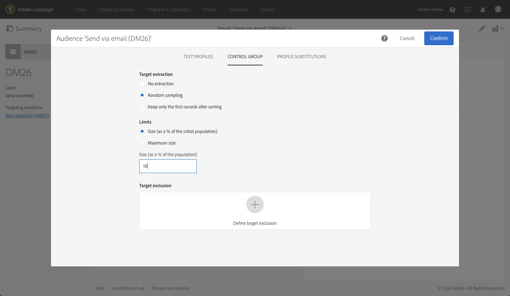

* **[!UICONTROL Keep only the first records after sorting]** and define an expression. This option enables you to define a limitation based on one or more sorting orders.

    For example, if you select the **[!UICONTROL Age]** field as a sorting criterion and then define 100 as the threshold in the **[!UICONTROL Limits]** section (see [Size limit](#size-limit)), leaving the **[!UICONTROL Descending sort]** option checked, the control group will be made up of the 100 oldest recipients.<!--Change screenshot to match example)-->

    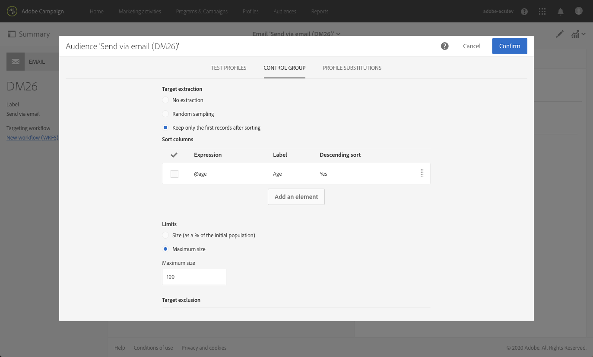
    
    It can be interesting to define a control group that includes profiles who make few purchases, or profiles who make frequent purchases, and to compare their behavior with that of the contacted recipients.

>[!NOTE]
>
>Select **[!UICONTROL No extraction]** if you do not want to use the **[!UICONTROL Target extraction]** option.

<!--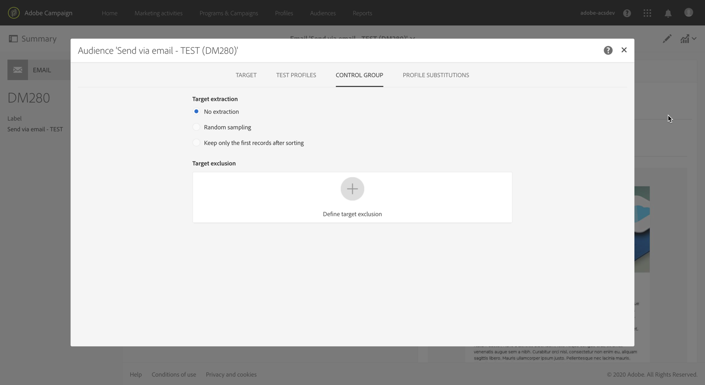-->

### Size limit {#size-limit}
    
Whether you selected **[!UICONTROL Random sampling]** or **[!UICONTROL Keep only the first records after sorting]**, you must set how you are going to limit the number of profiles that you extract from the main target. Do either one of the following:
    
* Select **[!UICONTROL Size (as a % of the initial population)]** and fill in the **[!UICONTROL Size (as a % of the population)]** frame.

    For example, if you set 10, depending on the option you selected above, Adobe Campaign will either:
    * Randomly extract 10% of the target population.
    * If you selected the **[!UICONTROL Age]** field as a sorting criterion, extract the 10% oldest profiles from the target population.

* Select **[!UICONTROL Maximum size]** and fill in the corresponding frame.

    For example, if you set 100, Adobe Campaign will either:
    * Randomly extract 100 profiles from the target population.
    * If you selected the **[!UICONTROL Age]** field as a sorting criterion, extract the 100 oldest profiles from the target population.

    >[!NOTE]
    >
    >If you uncheck the **[!UICONTROL Descending sort]** option, the 50 youngest profiles will be extracted.

## Excluding a specific population {#excluding-specific-population}

Another way to define a control group is to exclude a specific population from the target using a query.

To do this:

1. From the **[!UICONTROL Target exclusion]** section, click **[!UICONTROL Define target exclusion]**.

    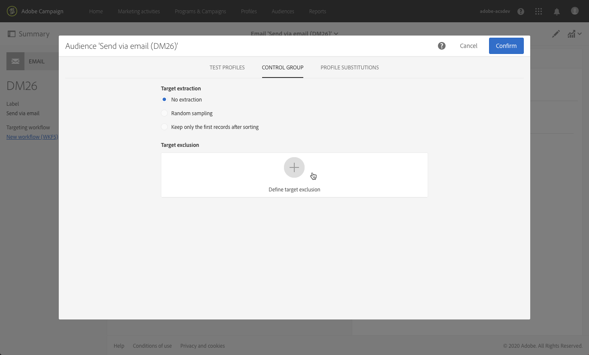

1. Define the exclusion criteria using the [query editor](../../automating/using/editing-queries.md). You can also select an [audience](../../audiences/using/about-audiences.md) that was previously created.

    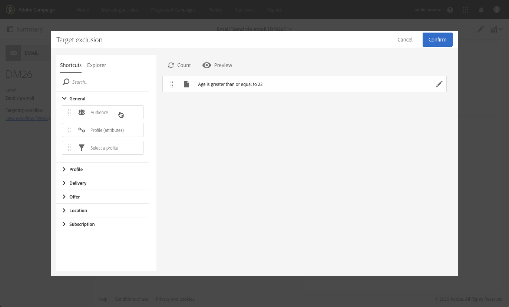

1. Click **[!UICONTROL Confirm]**.

The profiles matching the result of the query will be excluded from the target.

<!--For more on using the query editor, see the [Editing queries](../../automating/using/editing-queries.md) section.-->

## Example {#control-group-example}

1. Create a workflow. The detailed steps to create a workflow are presented in the [Building a workflow](../../automating/using/building-a-workflow.md) section.
1. In **[!UICONTROL Activities]** > **[!UICONTROL Targeting]**, drag and drop a [Query](../../automating/using/query.md) activity.
1. Double-click the activity to define your target. <!--For example, in **[!UICONTROL Shortcuts]**, drag and drop **[!UICONTROL Profile]**, select **[!UICONTROL Age]** with the operator **[!UICONTROL Greater than]** and type 25 in the **[!UICONTROL Value]** field.-->

1. In **[!UICONTROL Activities]** > **[!UICONTROL Channels]**, drag and drop an [Email delivery](../../automating/using/email-delivery.md) activity after the main target segment and edit it.
1. Double-click the **[!UICONTROL Email delivery]** activity and click the **[!UICONTROL Audience]** block from the delivery dashboard.

1. Select the **[!UICONTROL Control group]** tab.

    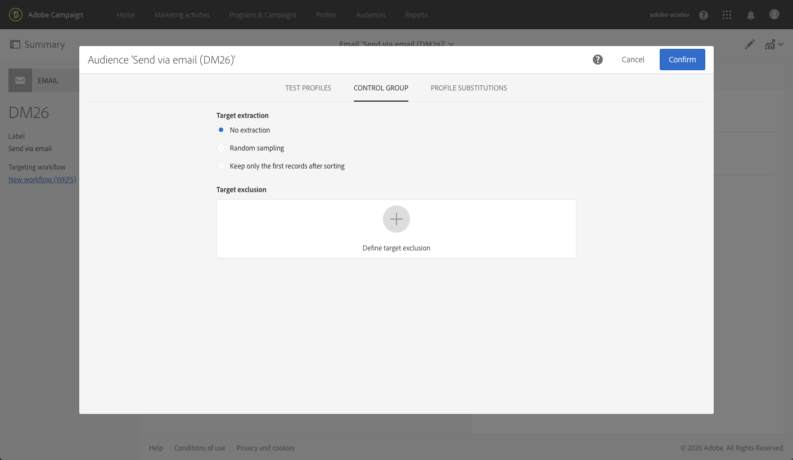

1. From the **[!UICONTROL Target extraction]** section, select **[!UICONTROL Keep only the first records after sorting]**.
1. Sort on the age and leave the **[!UICONTROL Descending]** sort option checked.

    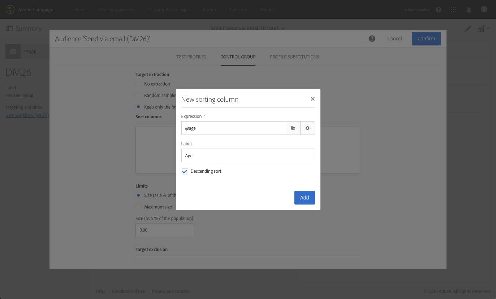

1. Set 100 as the maximum size. The 100 oldest profiles from your target will be extracted.

1. From the **[!UICONTROL Target exclusion]** section, define the profiles that will be excluded from your target, based on the criteria of your choice using the [query editor](../../automating/using/editing-queries.md). For example, "Age is less than 20". The profiles whose age is under 20 will also be excluded.

    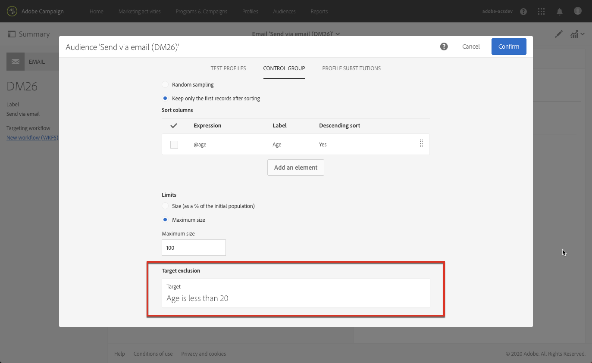

1. Launch the delivery preparation. See [Preparing the send](../../sending/using/preparing-the-send.md).
1. Confirm sending. See [Confirming the send](../../sending/using/confirming-the-send.md).

The profiles that were extracted from the target (the 100 oldest profiles) and the ones that were defined based on the query (profiles under 20) will be excluded from the delivery.

## Using the logs {#using-logs}

Check the **[!UICONTROL Sending logs]**. For more on the delivery logs and how to access them, see [this section](../../sending/using/monitoring-a-delivery.md#delivery-logs).

You can see the extracted and excluded profiles with the **[!UICONTROL Ignored]** status and **[!UICONTROL Control group]** as the reason of failure.

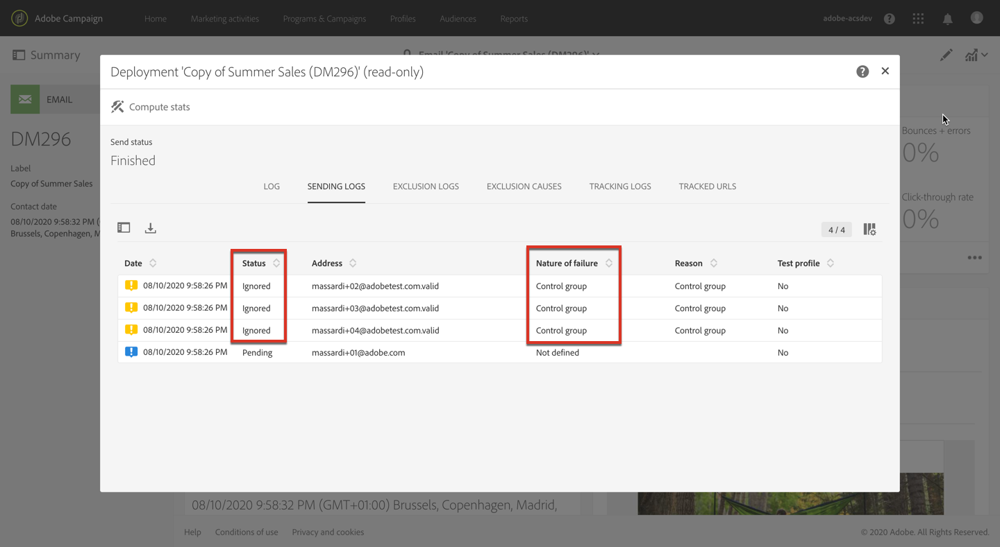

You can also check the **[!UICONTROL Exclusion causes]** tab to see the number of profiles excluded from the delivery.

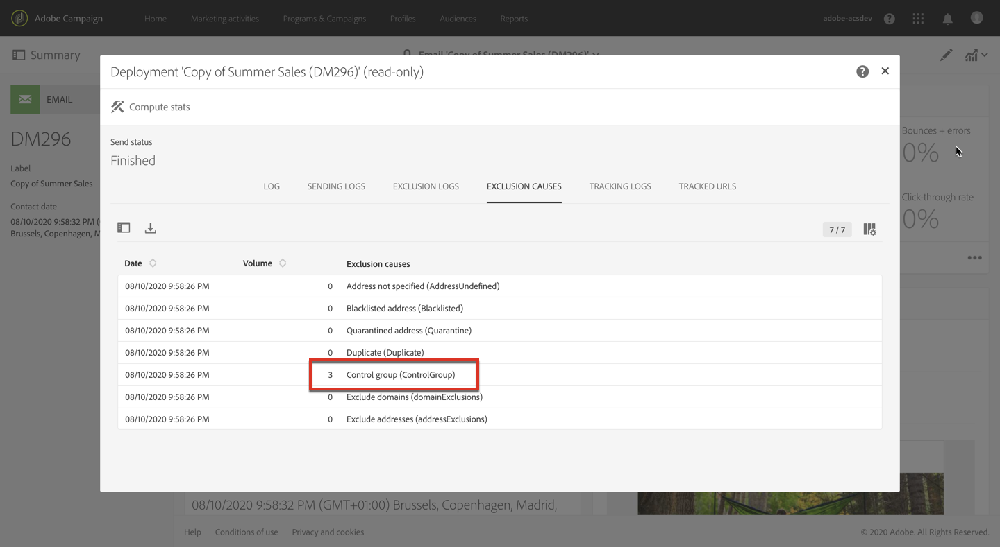

Now that you sent your delivery, what can you do with the control group?

<table>
<tr>
<td></td>
<td>
You can extract the <b>sending logs</b> to compare how the control group that did not receive the communication reacted compared to the effective target.
</td>
</tr>
</table>

You can also use the sending logs to do another targeting. To do this:

1. Create a workflow. The detailed steps to create a workflow are presented in the [Building a workflow](../../automating/using/building-a-workflow.md) section.
1. In **[!UICONTROL Activities]** > **[!UICONTROL Targeting]**, drag and drop a [Query](../../automating/using/query.md) activity.
1. In the **[!UICONTROL Properties]** tab, set **[!UICONTROL Delivery logs]** as the **[!UICONTROL Resource]** and **[!UICONTROL Profile]** as the **[!UICONTROL Targeting dimension]**.

    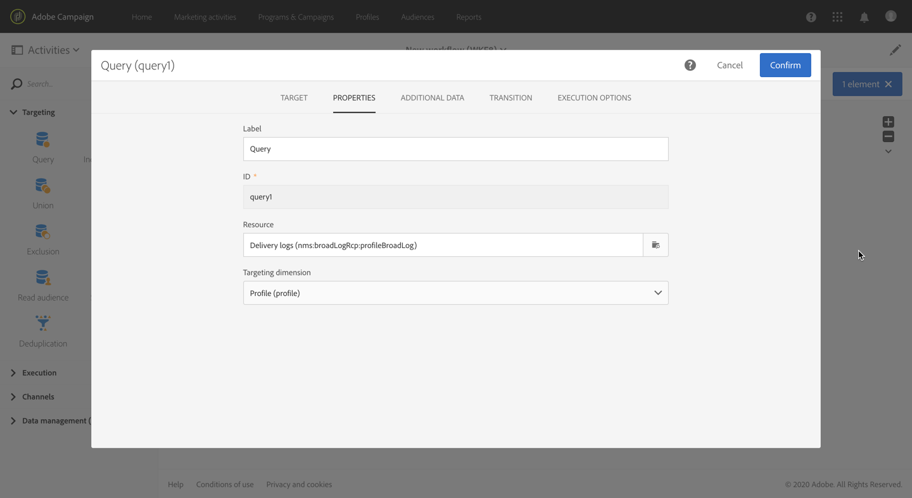

1. In the **[!UICONTROL Target]** tab, click **[!UICONTROL Delivery logs]**.
1. Drag and drop **[!UICONTROL Status]** and select **[!UICONTROL Ignored]**. Click **[!UICONTROL Confirm]**.

    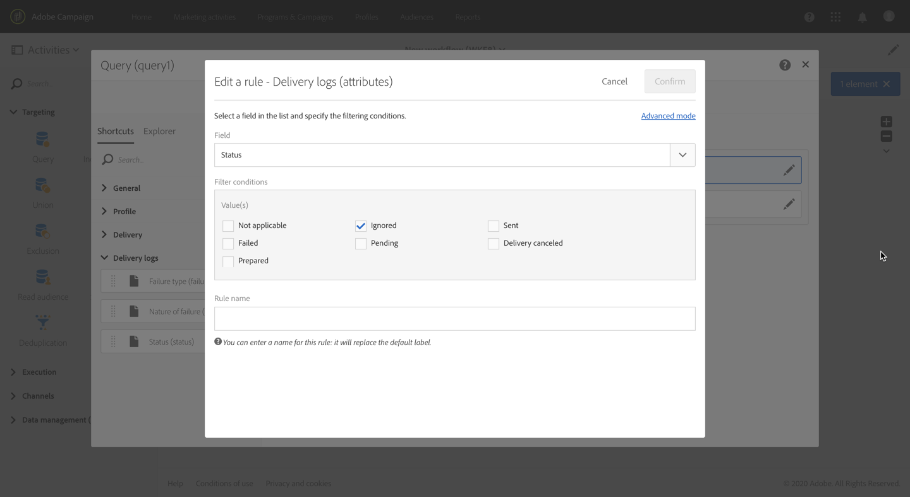

1. Drag and drop **[!UICONTROL Nature of failure]** and select **[!UICONTROL Control group]**. 1. Click **[!UICONTROL Confirm]**.

    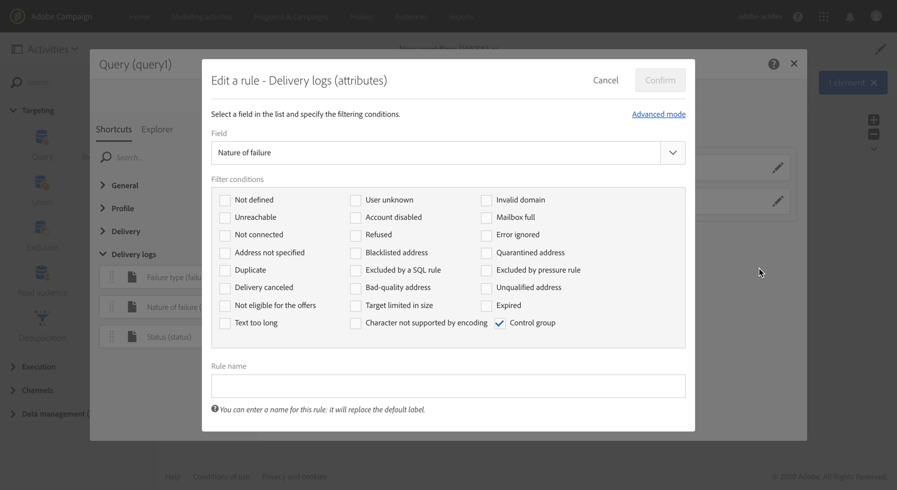

You can now target the profiles that did not receive the message using the sending logs of your delivery.

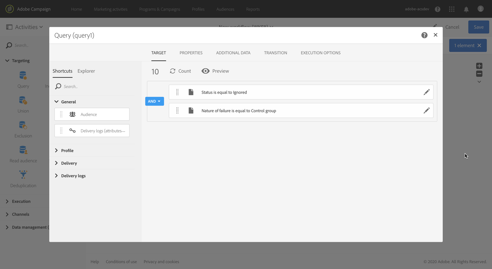
