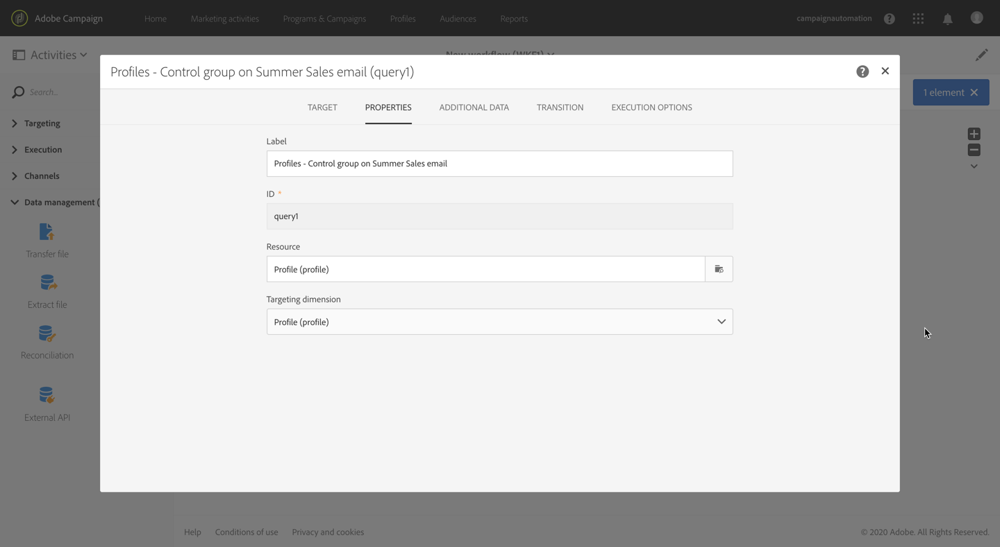
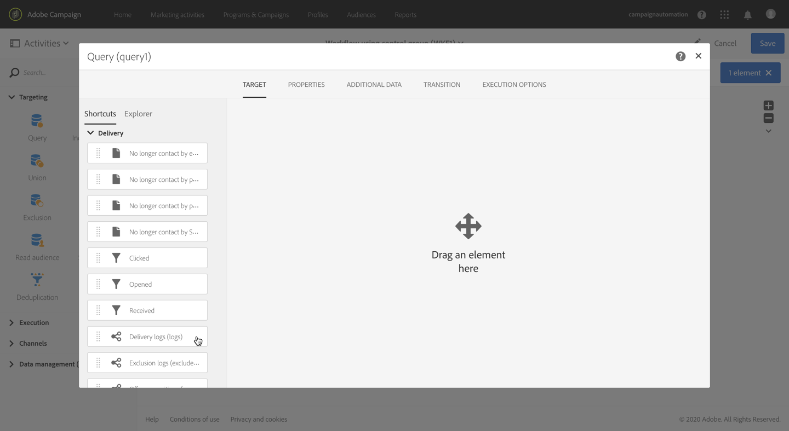
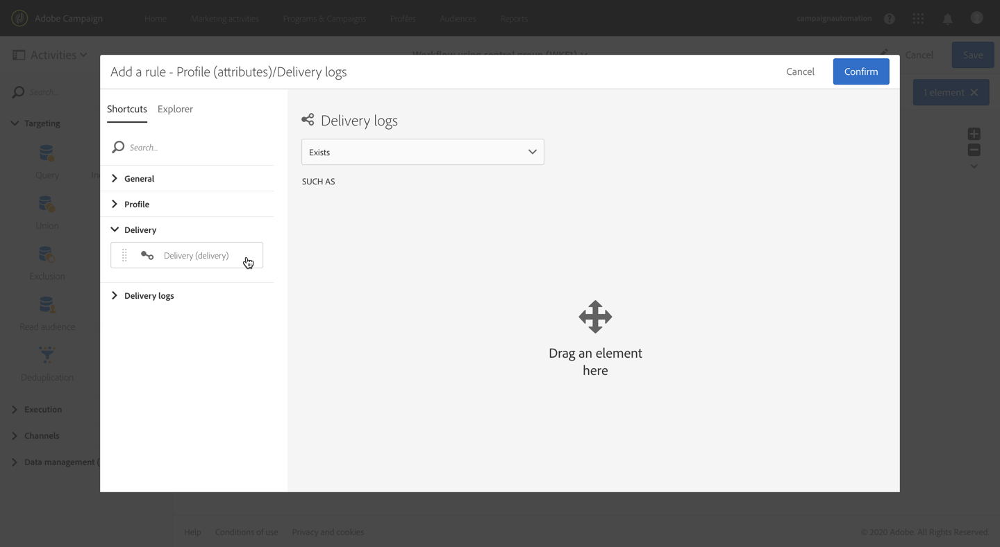
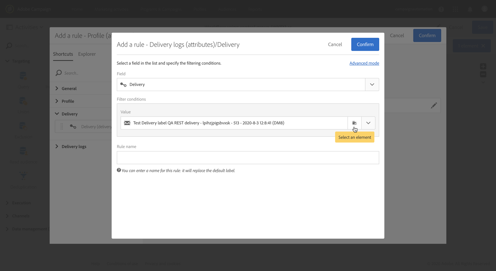
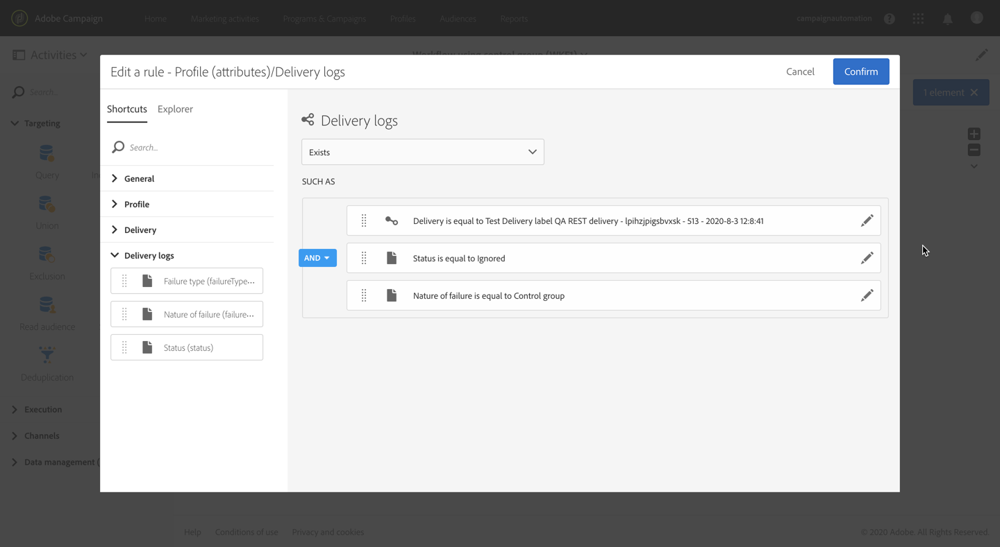
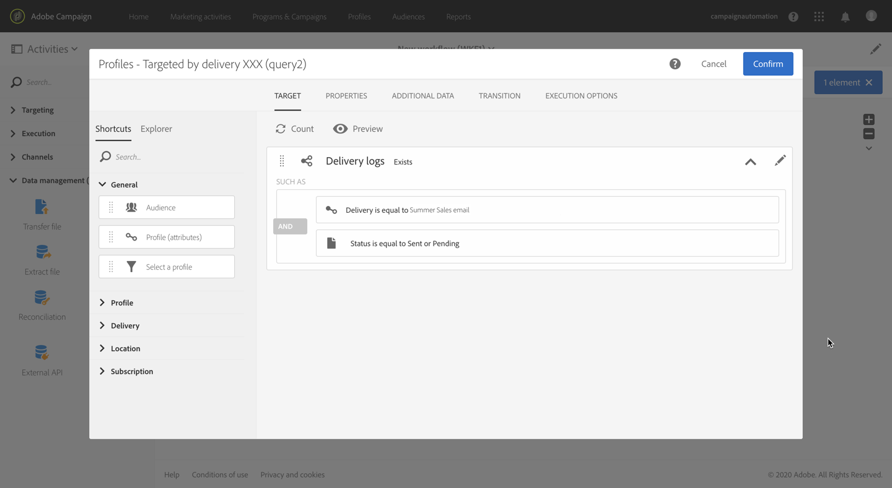

# Adding a control group {#adding-control-group}

You can use control groups to avoid sending messages to a portion of your audience in order to measure the impact of your campaigns.

To do this in Adobe Campaign, create a <b>control group</b> when defining the target of your delivery. Profiles are added to the control group randomly, filtered or not, or based on criteria.

 You will then be able to compare the behavior of the target population which did receive the message with the behavior of contacts which were not targeted. Based on the sending logs, you can also target a control group in future campaigns.

<!--The control group is built when the delivery is prepared.-->

## Overview {#overview}

The control group can be extracted randomly from the main target and/or selected from a specific population. Consequently, there are two main ways you can define a control group:
* **Extract** a number of profiles from the main target.
* **Exclude** some profiles based on criteria defined in a query.

You can use both methods when defining a control group.

All profiles being part of the control group at the delivery preparation step will be removed from the main target. They will not receive the message once it is sent.

## Extracting from the target population {#extraction-target-population}

To define a control group, you can choose to extract, randomly or based on a sorting, a percentage or a fixed number of profiles from the target population.

### Target extraction {#target-extraction}

First, define the way the profiles will be extracted from the target: **randomly** or based on a **sorting**.

Under the **[!UICONTROL Target extraction]** section, select one of the following:
    
* **[!UICONTROL Random sampling]**: when preparing the delivery, Adobe Campaign will randomly extract a number of profiles corresponding to the percentage or to the maximum number that you will set as the [size limit](#size-limit).

    For example, if you then set the threshold to 10 in the **[!UICONTROL Limits]** section, the control group will be made up of 10% selected randomly from the targeted population.<!--Change screenshot to match example)-->

    

* **[!UICONTROL Keep only the first records after sorting]**: this option enables you to define a limitation based on one or more sorting orders.

    For example:

    * Select the **[!UICONTROL Age]** field as a sorting criterion.
    * Define 100 as the threshold in the **[!UICONTROL Limits]** section (see [Size limit](#size-limit)).
    * Leave the **[!UICONTROL Descending sort]** option checked.
    
    As a result, the control group will be made up of the 100 oldest recipients.<!--Change screenshot to match example)-->

    
    
    It can be interesting to define a control group that includes profiles who make few or frequent purchases, and to compare their behavior with that of the contacted recipients.

>[!NOTE]
>
>Select **[!UICONTROL No extraction]** if you do not want to use the **[!UICONTROL Target extraction]** option.

<!---->

### Size limit {#size-limit}
    
Whether you selected **[!UICONTROL Random sampling]** or **[!UICONTROL Keep only the first records after sorting]**, you must set how you are going to limit the number of profiles that you extract from the main target. Do one of the following:
    
* Select **[!UICONTROL Size (as a % of the initial population)]** and fill in the corresponding frame.

    For example, if you set 10, depending on the option you selected above, Adobe Campaign will either:
    * Randomly extract 10% of the target population.
    * If you selected the **[!UICONTROL Age]** field as a sorting criterion, extract the 10% oldest profiles from the target population.

    >[!NOTE]
    >
    >If you uncheck the **[!UICONTROL Descending sort]** option, the 10% youngest profiles will be extracted.

* Select **[!UICONTROL Maximum size]** and fill in the corresponding frame.

    For example, if you set 100, Adobe Campaign will either:
    * Randomly extract 100 profiles from the target population.
    * If you selected the **[!UICONTROL Age]** field as a sorting criterion, extract the 100 oldest profiles from the target population.

    >[!NOTE]
    >
    >If you uncheck the **[!UICONTROL Descending sort]** option, the 100 youngest profiles will be extracted.

## Excluding a specific population {#excluding-specific-population}

Another way to define a control group is to exclude a specific population from the target using a query.

To do this:

1. From the **[!UICONTROL Target exclusion]** section, click **[!UICONTROL Define target exclusion]**.

    

1. Define the exclusion criteria using the [query editor](../../automating/using/editing-queries.md). You can also select an [audience](../../audiences/using/about-audiences.md) that was previously created.

    

1. Click **[!UICONTROL Confirm]**.

The profiles matching the result of the query will be excluded from the target.

<!--For more on using the query editor, see the [Editing queries](../../automating/using/editing-queries.md) section.-->

## Use case: set up a control group {#control-group-example}

Below is an example showing how to define a control group using both methods: extracting profiles from the main target and using a query to exclude a specific population.

1. Create a workflow. The detailed steps to create a workflow are presented in the [Building a workflow](../../automating/using/building-a-workflow.md) section.
1. In **[!UICONTROL Activities]** > **[!UICONTROL Targeting]**, drag and drop a [Query](../../automating/using/query.md) activity. Double-click the activity and define your target. <!--For example, in **[!UICONTROL Shortcuts]**, drag and drop **[!UICONTROL Profile]**, select **[!UICONTROL Age]** with the operator **[!UICONTROL Greater than]** and type 25 in the **[!UICONTROL Value]** field.-->

1. In **[!UICONTROL Activities]** > **[!UICONTROL Channels]**, drag and drop an [Email delivery](../../automating/using/email-delivery.md) activity after the main target segment and edit it.
1. Click the **[!UICONTROL Audience]** block from the delivery dashboard.

1. Select the **[!UICONTROL Control group]** tab.

    

1. From the **[!UICONTROL Target extraction]** section, select **[!UICONTROL Keep only the first records after sorting]**.
1. Sort on the age and leave the **[!UICONTROL Descending]** sort option checked.

    

1. Set 100 as the maximum size. The 100 oldest profiles from your target will be extracted.

1. From the **[!UICONTROL Target exclusion]** section, define the profiles that will be excluded from your target, based on the criteria of your choice using the [query editor](../../automating/using/editing-queries.md). For example, "Age is less than 20".

    

    The profiles whose age is under 20 will be excluded.

1. Launch the [delivery preparation](../../sending/using/preparing-the-send.md) and [confirm the send](../../sending/using/confirming-the-send.md).

The profiles that were extracted (the 100 oldest profiles) and the ones that were defined based on the query (profiles under 20) will be withdrawn from the main target. They will not receive the message.

## Comparing the results {#delivery-logs}

Now that you sent your delivery, what can you do with the control group?

You can extract the **sending logs** to compare how the control group that did not receive the communication acted compared to the effective target. You can also use the delivery logs to **build another targeting**.

>[!CAUTION]
>
>You need to have an [Administrator role](../../administration/using/users-management.md#functional-administrators) and belong to *le to connect to Adobe Campaign. If you would like to restrict access for a particular user or group of users, do not link it to **[!UICONTROL All]** [units](../../administration/using/organizational-units.md) to be able to access delivery logs.

### Checking the delivery logs {#checking-logs}

To see which profiles were removed from the target after the message was sent, check the **[!UICONTROL Delivery logs]**. For more on the delivery logs and how to access them, see [this section](../../sending/using/monitoring-a-delivery.md#delivery-logs).

* In the **[!UICONTROL Sending logs]** tab, you can see the extracted and excluded profiles. They have the **[!UICONTROL Ignored]** status and **[!UICONTROL Control group]** as the reason of failure.

    

* You can also check the **[!UICONTROL Exclusion causes]** tab to see the number of profiles that were not included in the delivery.

    

### Using the control group logs {#using-logs}

Once the delivery was sent, you can use the delivery logs to filter on the profiles that did not receive the message. Follow the steps below:

1. Create a workflow. The detailed steps to create a workflow are presented in the [Building a workflow](../../automating/using/building-a-workflow.md) section.
1. In **[!UICONTROL Activities]** > **[!UICONTROL Targeting]**, drag and drop a [Query](../../automating/using/query.md) activity.
1. In the **[!UICONTROL Properties]** tab, set **[!UICONTROL Delivery logs]** as the **[!UICONTROL Resource]** and **[!UICONTROL Profile]** as the **[!UICONTROL Targeting dimension]**.

    

1. In the **[!UICONTROL Target]** tab, click **[!UICONTROL Delivery logs]**.
1. Drag and drop **[!UICONTROL Status]** and select **[!UICONTROL Ignored]** as the filter condition.

    

1. Click **[!UICONTROL Confirm]**.

1. Still in the **[!UICONTROL Target]** tab, drag and drop **[!UICONTROL Nature of failure]** and select **[!UICONTROL Control group]** as the filter condition.

    

1. Click **[!UICONTROL Confirm]**.

    

You can then export the log data using an **Extract file** activity followed by a **Transfer file** activity for example. This will allow you to analyze in your own reporting tool the results of your campaign on the effective target compared to the control group. For more on exporting logs, see [this section](../../automating/using/exporting-logs.md).

### Targeting the control group {#targeting-control-group}

To do a targeting based on the profiles that did not receive the message, you can also use the delivery logs. Follow the steps below:

1. Create a workflow. The detailed steps to create a workflow are presented in the [Building a workflow](../../automating/using/building-a-workflow.md) section.
1. In **[!UICONTROL Activities]** > **[!UICONTROL Targeting]**, drag and drop a first [Query](../../automating/using/query.md) activity.
1. In the **[!UICONTROL Properties]** tab, make sure the **[!UICONTROL Profile]** resource is selected as the **[!UICONTROL Resource]** and **[!UICONTROL Targeting dimension]**.

    

1. In the **[!UICONTROL Target]** tab, expand **[!UICONTROL Delivery]** and drag and drop **[!UICONTROL Delivery logs]**.

    

1. In the **[!UICONTROL Add a rule]** window, drag and drop **[!UICONTROL Delivery]**.

    

1. Select the email you sent as the filter condition. Click **[!UICONTROL Confirm]**.

    

1. Back in the **[!UICONTROL Add a rule]** window, drag and drop **[!UICONTROL Status]** and select **[!UICONTROL Ignored]** as the filter condition. Click **[!UICONTROL Confirm]**.

    

1. Drag and drop **[!UICONTROL Nature of failure]** and select **[!UICONTROL Control group]** as the filter condition. Click **[!UICONTROL Confirm]**.

    

1. Make sure the conditions are all aligned with the **AND** boolean operator.

    

1. Click **[!UICONTROL Confirm]**.

You can now target the profiles that did not receive your first message because they were part of the control group and send them another email.

In the same workflow, you can also create another query to target the profiles that did receive the email and send them a different message.

