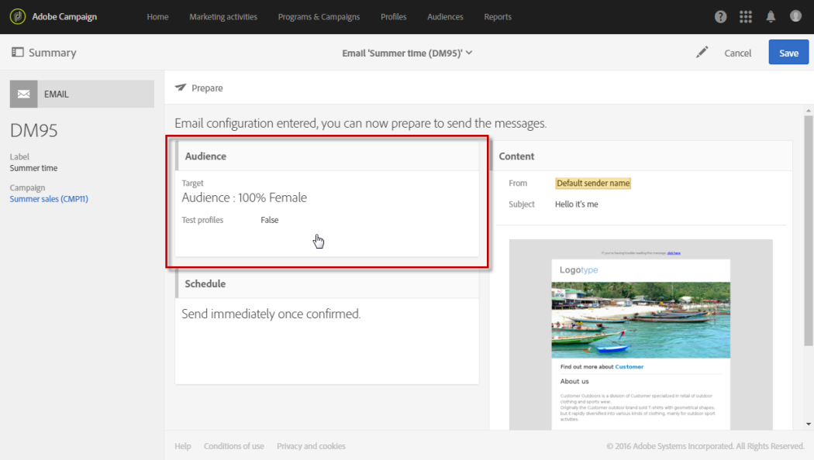
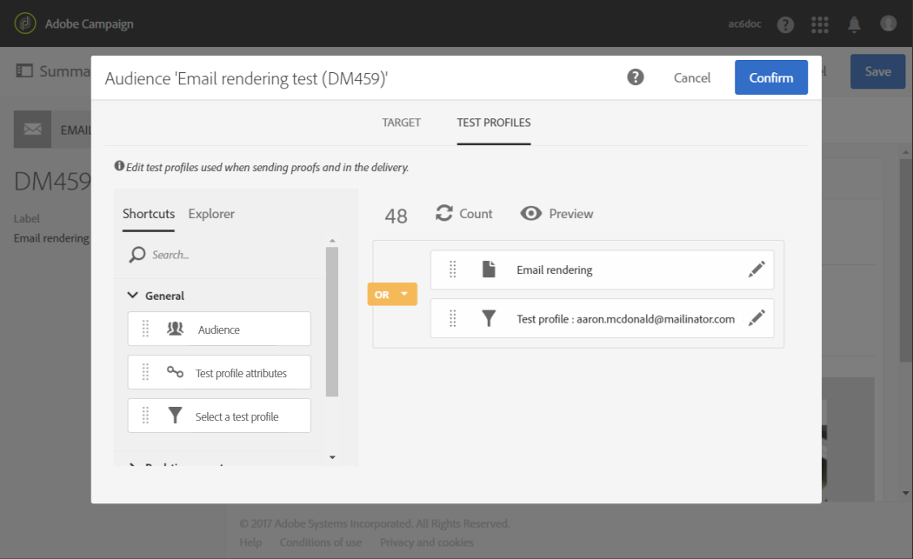
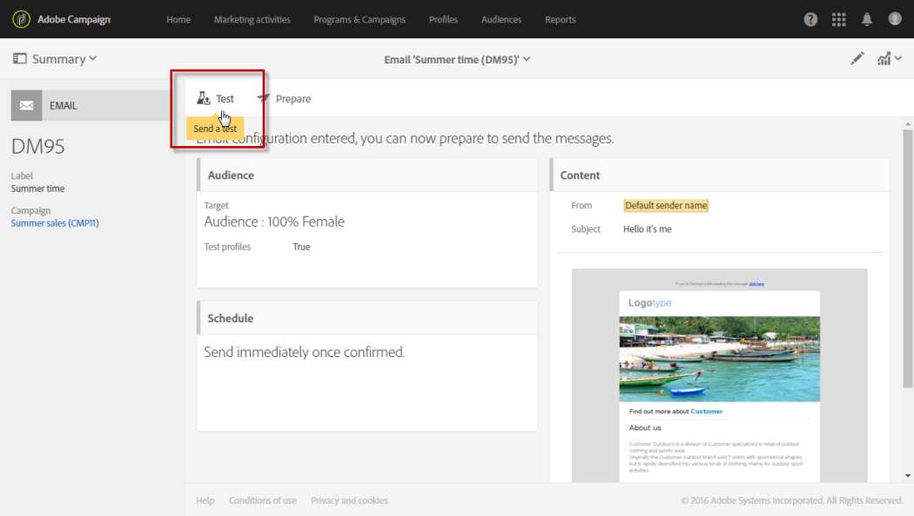
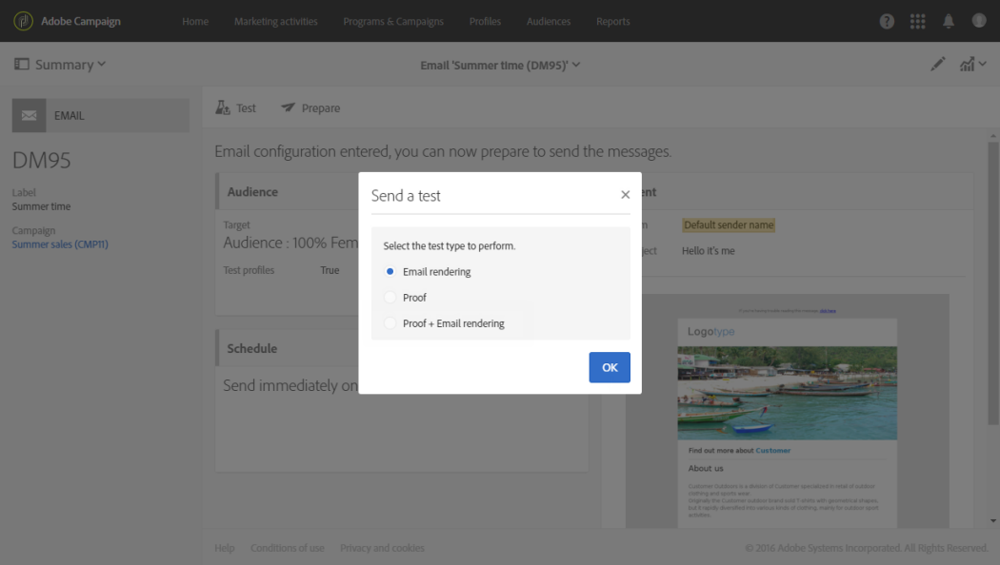
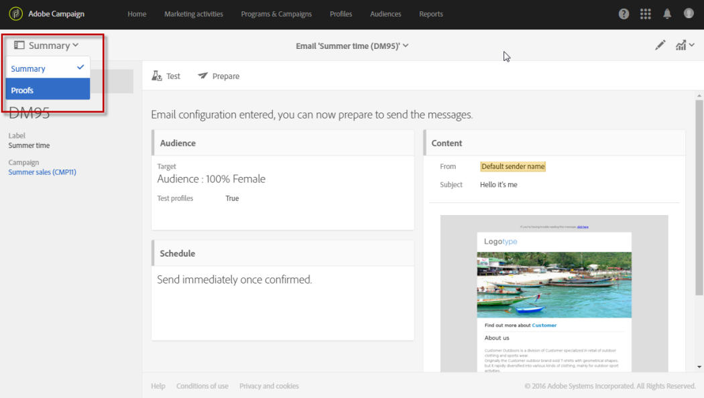
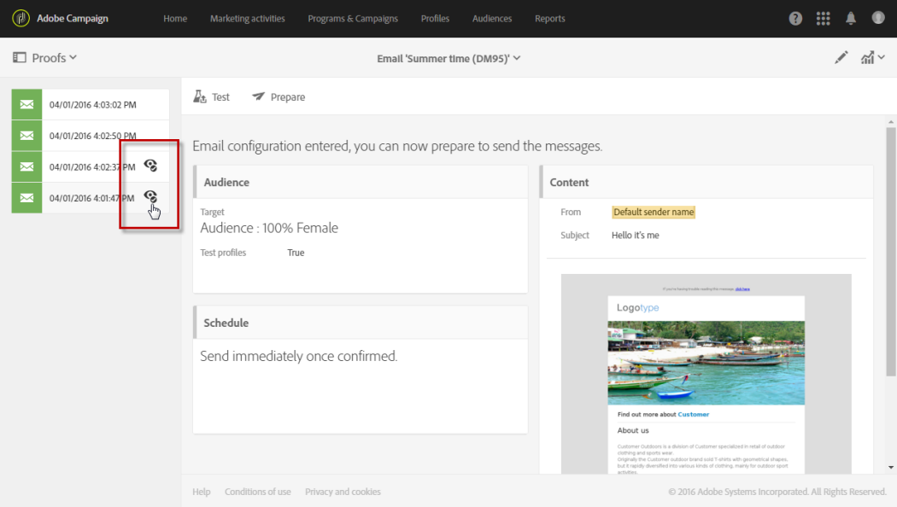
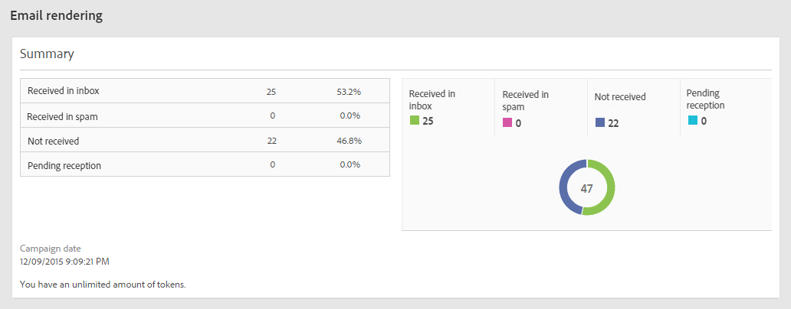
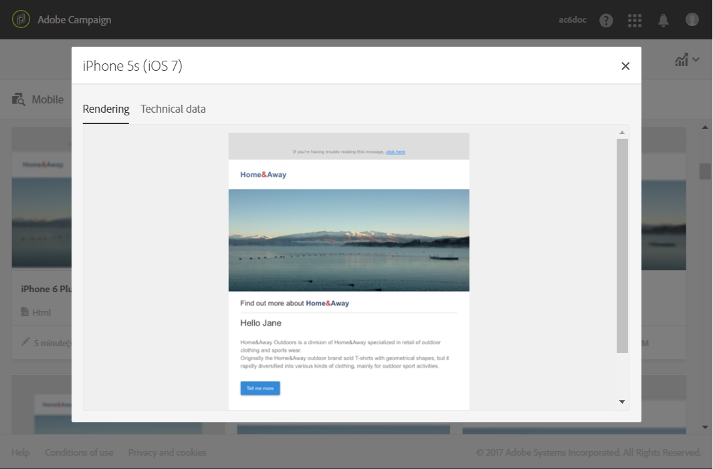

# Email rendering

Email rendering

Before hitting the **Send** button, make sure that your message will be displayed in an optimal way on a variety of web clients, web mails and devices.

To allow this, Adobe Campaign captures the rendering and makes it available in a dedicated report. This enables you to preview the sent message in the different contexts in which it may be received.

The mobile, messaging and webmail clients available for **Email rendering** in Adobe Campaign are listed on the Litmus [website](https://litmus.com/email-testing) (click **View all email clients**).

## Checking the Email rendering report

Once you have created your email delivery and defined its content as well as the targeted population, follow the steps below.

1. Click **Audience** to access the **Test profiles** tab.

   

1. Use the query editor to define the test profiles that you want to use, including the test profiles that are for **Email rendering** use. See [About test profiles](../../sending/using/managing-test-profiles-and-sending-proofs.md#about-test-profiles).

   

1. Check and confirm your query, then save your changes.
1. Click the **Test** button in the action bar.

   

1. Select the **Email rendering** option then click **OK**.

   

   >[!NOTE]
   >
   >The **Proof + Email rendering** option enables you to send a proof and use the email rendering feature simultaneously. You can have your message approved by the proof recipients and at the same time you can test the way your message will be received depending on the inboxes targeted. In this case, you also need to select Proof test profiles. See [About test profiles](../../sending/using/managing-test-profiles-and-sending-proofs.md#about-test-profiles).

   The test delivery is sent.

1. The rendering thumbnails are available a few minutes after sending the messages. To access them, select **Proofs** in the **Summary** drop-down list.

   

1. From the **Proofs** list, click the **Access email rendering** icon.

   

The dedicated email rendering report is displayed. See [Email rendering report description](../../sending/using/email-rendering.md#email-rendering-report-description).

**Related topics**:

* [Creating an email](../../channels/using/creating-an-email.md)
* [Managing test profiles and sending proofs](../../sending/using/managing-test-profiles-and-sending-proofs.md)
* [Query editor](../../automating/using/editing-queries.md#about-query-editor)

## Email rendering report description

This report presents the email renderings as they appear to the recipient. Email renderings can differ based upon how the recipient opens the email delivery: in a browser, on a mobile device, or via an email application.

>[!NOTE]
>
>The number of available renderings is listed in your license agreement. Each delivery with **Email rendering** enabled decreases your available renderings (known as tokens) by one. If you are a Litmus client, you can use your own Litmus account to provision and use Email rendering in Adobe Campaign. For more on this, contact your Adobe account executive.

The report summary presents the number of messages received, unwanted (spam), not received, or pending reception.

The report is divided into three parts: **Mobile**, **Messaging clients**, and **Webmails**. Scroll down the report to display all the renderings grouped into these three categories.

To get the details for each report, click the corresponding card. The rendering is displayed for the reception method selected.

The **Technical data** tab allows you to get more information, such as the receiving and capture dates, and the complete headers of emails.
