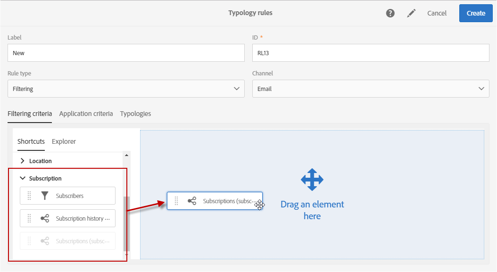
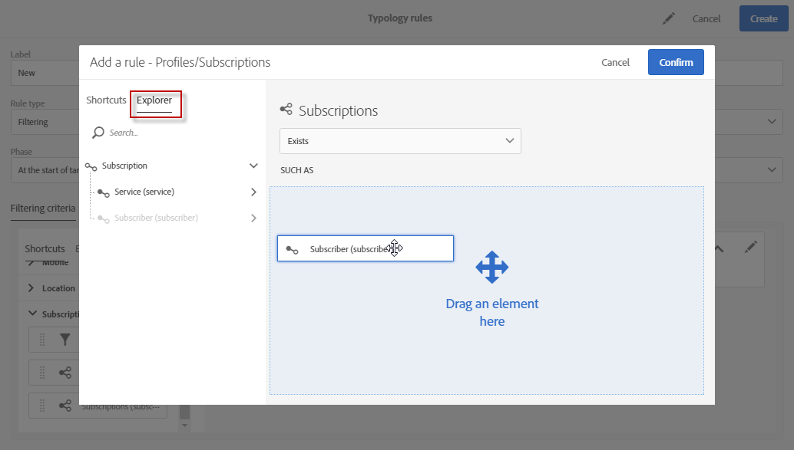
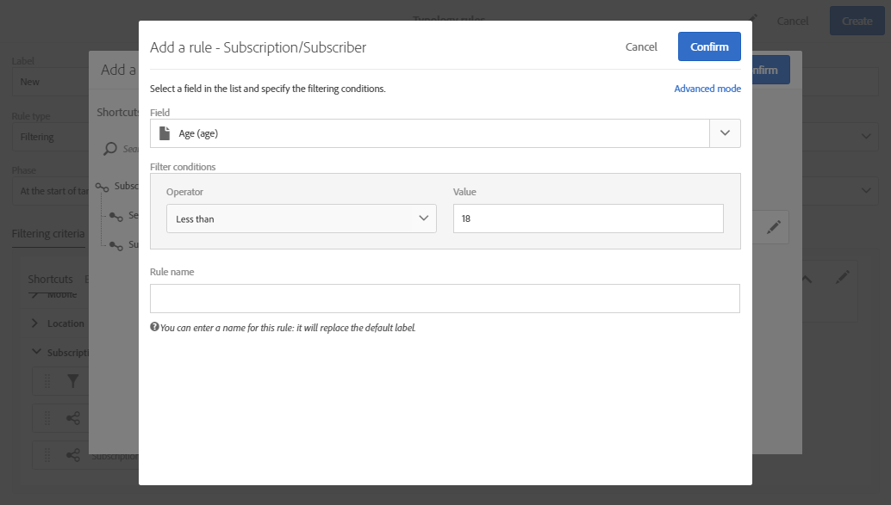
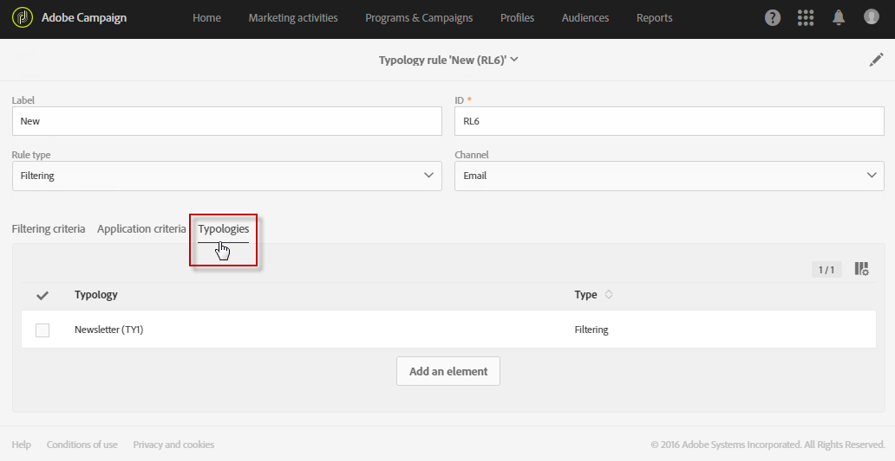
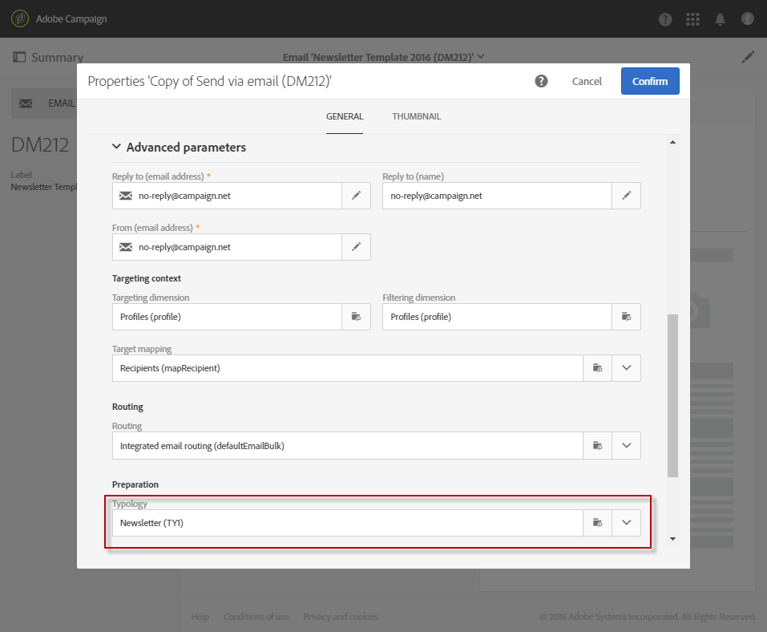
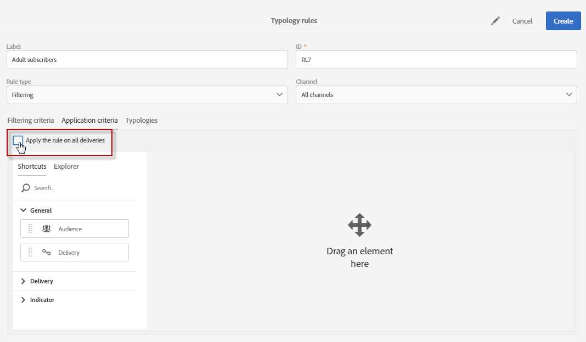

# Filtering rules {#filtering-rules}

Filtering rules allow you to exclude one part of the message target according to criteria defined in a query, such as quarantined profiles or profiles that have already been sent a certain number of emails.

## Default filtering typology rules {#default-filtering-typology-rules}

The table below provides information about out-of-the-box filtering rules, as well as their related channels.

Label | Channel | Description
---------|----------|---------|---------
 **[!UICONTROL Address not specified]** | All | Excludes the target population with no specified address (email, postal address, etc. according to the selected channel).
 **[!UICONTROL Blacklisted address]** | All | Excludes blacklisted addresses.
 **[!UICONTROL Duplicate]** | All | Excludes duplicates based on the target population **[!UICONTROL Address]** field.
 **[!UICONTROL Exclude mobile applications]** | Mobile application | Excludes app subscriptions that do not match the mobile application defined in the message.
 **[!UICONTROL Exclude mobile applications for In-App]** | In-App | Excludes app subscriptions that do not match the mobile application defined in the message (In-App template).
 **[!UICONTROL Exclude mobile applications for In-App broadcast]**| In-App | Excludes app subscriptions that do not match the mobile application defined in the message (In-App broadcast template)
 **[!UICONTROL Exclude mobile applications for Push]** | Mobile application | Excludes app subscriptions that do not match the mobile application defined in the message (for Push)
 **[!UICONTROL Quarantined address]** | All | Excludes quarantined addresses.
 **[!UICONTROL Target limited in size]** | All | Checks if the maximum delivery size was reached for the target. Applies to direct mail deliveries with the "delivery limit" option activated.

Additionally to these default filtering rules, two exclusion rules are available:

* **[!UICONTROL Exclusion of addresses]** ( **[!UICONTROL addressExclusions]** )
* **[!UICONTROL Exclusion of domains]** ( **[!UICONTROL domainExclusions]** ).

During the email analysis, these rules compare the recipient email addresses with the forbidden addresses or domain names contained in an encrypted global suppression list managed in the deliverability instance. If there is a match, the message is not sent to that recipient.

This is to avoid being blacklisted due to malicious activity, especially the use of a Spamtrap. For example, if a Spamtrap is used to subscribe via one of your web forms, a confirmation email is automatically sent to that Spamtrap, and this results in your address being automatically blacklisted.

>[!NOTE]
>
>The addresses and domain names contained in the global suppression list are hidden. Only the number of excluded recipients is indicated in the delivery analysis logs.

## Creating a filtering rule {#creating-a-filtering-rule}

You can create your own filtering rules according to your needs. For example, you can filter newsletters' target population so that the subscribers that are younger than 18 years old never receive communications.

To create a filtering typology rule, follow these steps:

1. Create a new typology rule. The main steps to create typology rules are detailed in [this section](../../sending/using/managing-typology-rules.md).

1. Select the **[!UICONTROL Filtering]** rule type, then specify the desired channel.

1. In the **[!UICONTROsL Filtering criteria]** tab, select the subscriptions in the **[!UICONTROL Subscription]** category.

   

1. In the **[!UICONTROL Explorer]** tab of the query editor, drag and drop the **[!UICONTROL Subscriber]** node into the main part of the screen.

   

1. Select the **[!UICONTROL Age]** field and define the filtering conditions so that the age of the subscribers is 18 or above.

   

1. In the **[!UICONTROL Typologies]** tab, link this rule to a typology.

   

1. Make sure that the typology is selected in the delivery or delivery template that you want to use. For more on this, refer to [this section](../../sending/using/managing-typologies.md#applying-typologies-to-messages).

   

Whenever this rule is used in a message, the subscribers who are considered minors will be automatically excluded.

## Configuring filtering rules' targeting context {#configuring-filtering-rules-targeting-context}

Campaign Standard allows you to configure the  **Targeting** and **Filtering** dimensions to use depending on the data that you want to target.

To do this, open the typology rule's properties, then access the **[!UICONTROL Advanced information]** section.

By default, filtering is carried out on the **[!UICONTROL Profiles]**. For example, if the rule is aimed at a mobile application, the **[!UICONTROL Filtering dimension]** can be changed to **[!UICONTROL Subscriptions to an application]**.

## Restricting the applicability of a filtering rule {#restricting-the-applicability-of-a-filtering-rule}

You can restrict the applicability of a filtering rule according to the message to send.

1. In the typology rule's **[!UICONTROL Application criteria]** tab, uncheck the **[!UICONTROL Apply the rule on all deliveries]** option, which is enabled by default.

   

1. Use the query editor to define a filter. For example, you can apply the rule only on messages whose label starts with a given word or whose ID contains certain letters.

   

In this case, the rule is only applied to the messages that correspond to the defined criteria.
