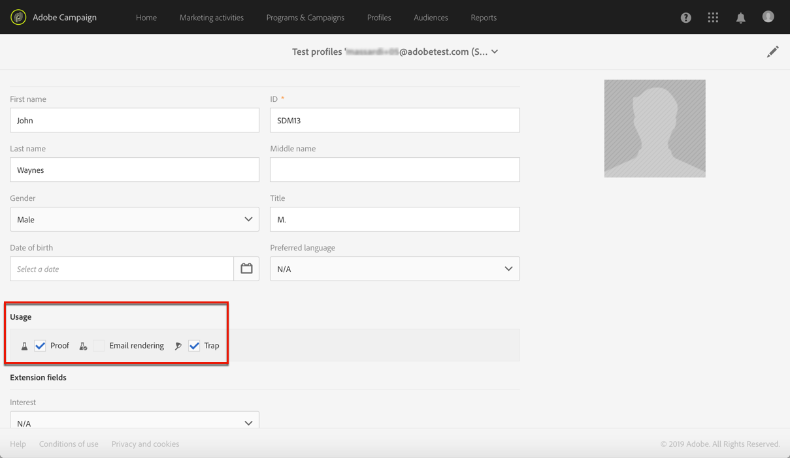
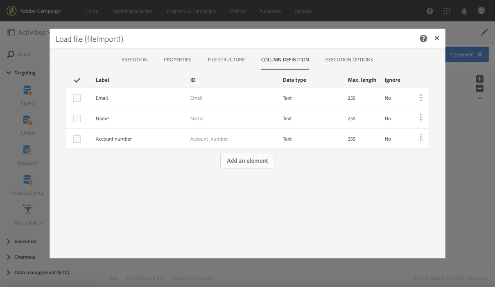
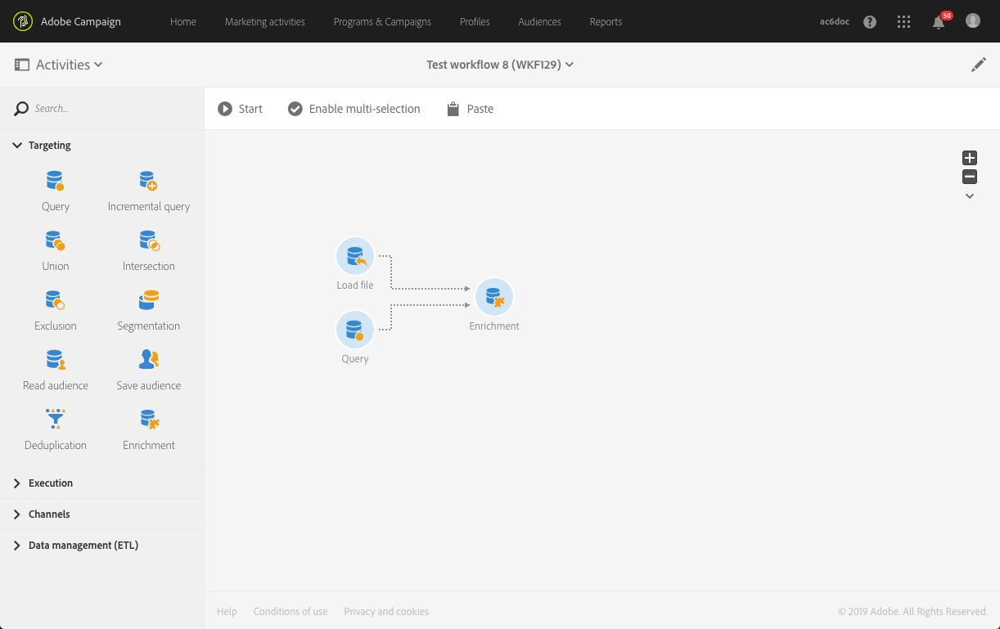
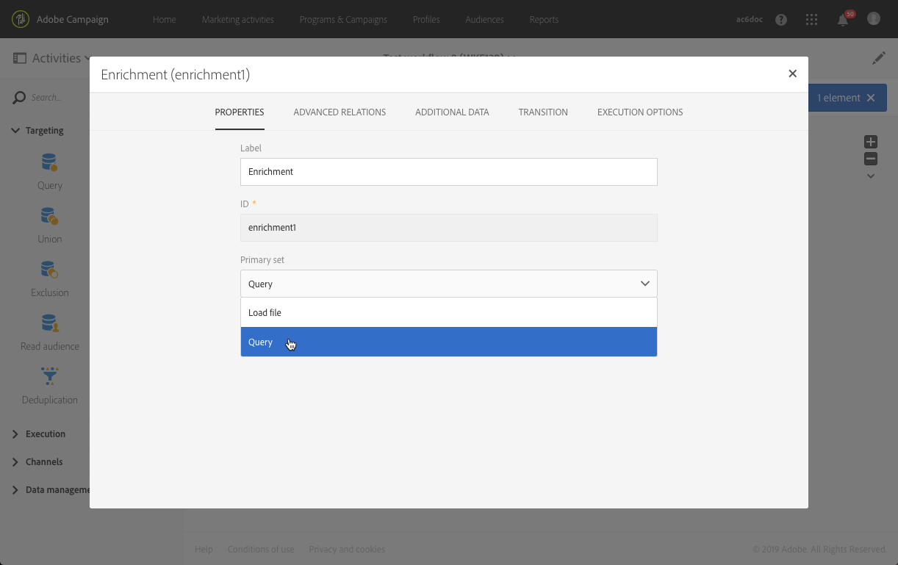
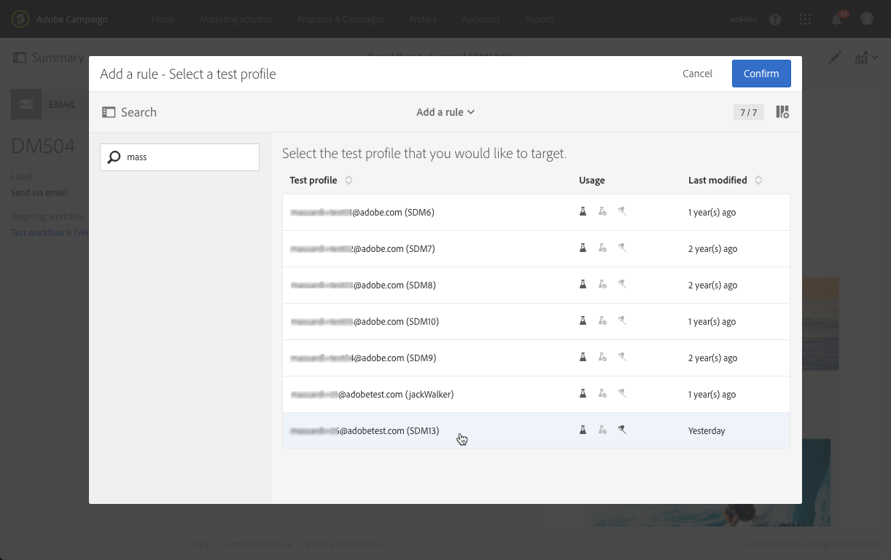
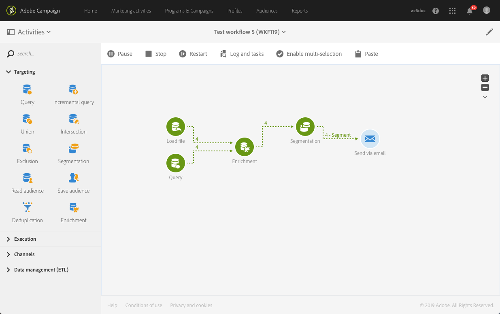
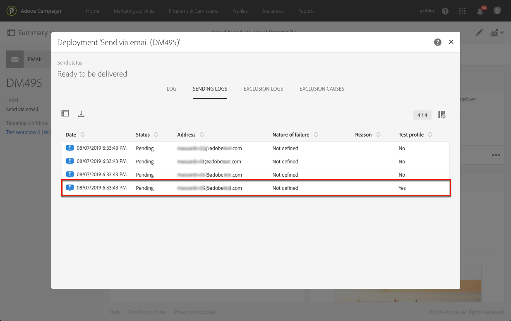
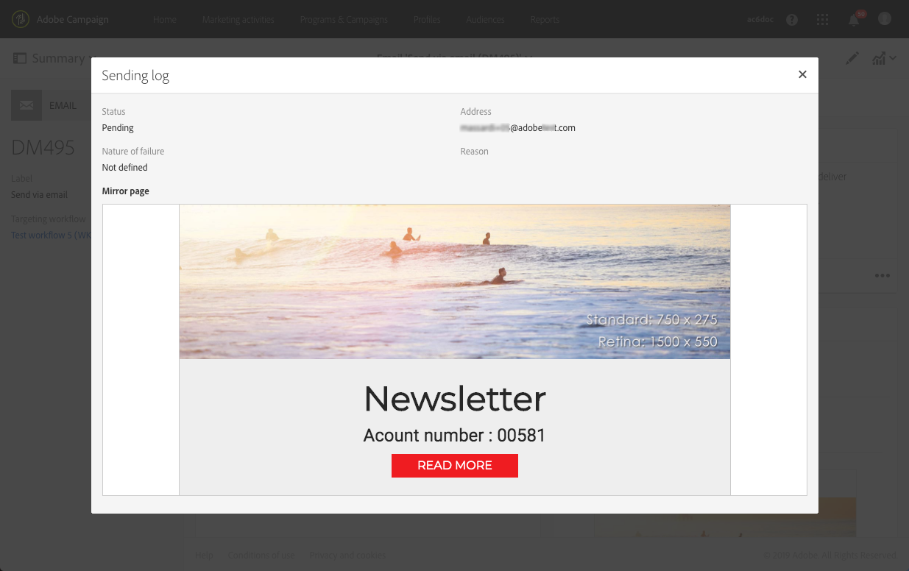

# Managing test profiles and sending proofs{#managing-test-profiles-and-sending-proofs}

## About test profiles {#about-test-profiles}

The test profiles allow you to target additional recipients who do not match the defined targeting criteria. They are added to a message's audience to detect any fraudulent use of your recipient database or to ensure the emails arrive in the inboxes.

You can manage your test profiles from the advanced menu **[!UICONTROL Profiles & audiences > Test profiles]**.

A test profile contains fictitious contact information, or contact information controlled by the sender, that can then be used in a message in the following contexts:

* For sending **Proofs**: the Proof is a specific message used to check the message before sending the finalized delivery to recipients. A Proof test profile is in charge of checking the delivery, with regard to its content and format. See [Sending proofs](../../sending/using/managing-test-profiles-and-sending-proofs.md#sending-proofs).
* For **Email rendering**: the Email rendering test profile is used to check the way in which a message is displayed according to the message inbox that receives it. For example, webmail, message service, mobile, etc. See [Email rendering](../../sending/using/email-rendering.md).

  The **Email rendering** use is read-only. Test profiles with this use are only available out-of-the-box in Adobe Campaign.

* As a **Trap**: the message is sent to the test profile just as it is sent to the main target, as a means to identify whether your client file is being used fraudulently.
* To **Preview** messages: a test profile can be selected when previewing a message to test the personalization elements. See [Previewing messages](/help/sending/using/previewing-messages.md).

## Managing test profiles {#managing-test-profiles}

### Creating test profiles {#creating-test-profiles}

1. From the advanced menu, via the Adobe Campaign logo, select **Profiles & audiences > Test profiles** to access the list of test profiles. 

   

1. From the **[!UICONTROL Test profiles]** dashboard, click **Create**.

   

1. Enter the data for this profile.

   

1. Select the use you intend for your test profile.

   

1. Enter the contact channels **[!UICONTROL Email, Telephone, Mobile, Mobile app]**, as well as the test profile address if necessary.

   >[!NOTE]
   >
   >You can define a preferred email format: **[!UICONTROL Text]** or **[!UICONTROL HTML]**.

1. Specify an event type and the data for this event if you want to use this test profile for testing the personalization of a transactional message.
1. Click **[!UICONTROL Create]** to save the test profile.

The test profile will then be added to the list of profiles.

**Related topic:**

[Creating a test profile](https://helpx.adobe.com/campaign/kt/acs/using/acs-test-profiles-feature-video-use.html) video

### Editing test profiles {#editing-test-profiles}

To edit a test profile and consult the data that is linked to it, or to modify it:

1. Select the test profile you would like to edit by clicking on its image.
1. Consult or modify the fields.

   

1. Click **[!UICONTROL Save]** if you have entered your changes, or select the name of the test profile then **[!UICONTROL Test profiles]** in the section at the top of the screen to go back to the test profiles dashboard.

## Sending proofs {#sending-proofs}

A proof is a specific message that allows you to test a message before sending it to the main target.

Recipients of the proof are in charge of approving the message (its content and form). They are defined in the **Test profiles**. For more on this, see [Managing test profiles](../../sending/using/managing-test-profiles-and-sending-proofs.md#managing-test-profiles).

In order to send a proof, the test profiles must be included in your message's audience.

In a message:

1. Click the **[!UICONTROL Send a test]** button.

   

1. Select the type of proof you would like to use:

    * **[!UICONTROL Email rendering]**: select this option to test the way your message is received according to the inboxes targeted. For more information, refer to [Email rendering](../../sending/using/email-rendering.md).
    * **[!UICONTROL Proof]**: select this option to test the message before sending it to the main target. The proof recipients are in charge of approving the delivery, by checking both its content and its format.
    * **[!UICONTROL Proof + Email rendering]**: this option combines the two previous options.

   

1. Confirm your choice.

   The proofs are sent to the test profiles.

   

1. You can view your proofs using the **[!UICONTROL Proofs]** drop-down list.

   

1. Select a proof to access its summary. For an email, if you have selected the **Email rendering** option as the proof type, the **[!UICONTROL Access email rendering]** icon is displayed on the right of the proof label. See [Email rendering](../../sending/using/email-rendering.md).

   

Depending on the comments from the people who receive the proof, you may be asked to modify the delivery's content. Once the modifications have been carried out, you have to restart email preparation then re-send a proof. Each new proof can be accessed using the **[!UICONTROL Show proofs]** button.

You have to send as many proofs as necessary until you have finalized the content of your delivery. Once this is done, you can send the delivery to the main target and close the approval cycle.

**Related topic:**

[Sending a test, preparing and sending an email](https://helpx.adobe.com/campaign/kt/acs/using/acs-sending-test-preparing-sending-email-feature-video-use.html) video

## About trap test profiles

Traps are historically used for direct mail. Mail is sent to a provider for sending, so including a trap tes profile address in the audience enables to detect if the client file was sent to another provider.
For the other channels, you can add trap test profiles to your maing target in order to check that your message was successfully sent, to get an exact copy of your email and to know when it was sent and received.
For more on this, see [Root link](.../.../channels/using/defining-the-direct-mail-audience.md).

## Using traps to test sending additional data {#sending-proofs-using-additional-data}

This section describes how to use a trap test profile to test sending real customer data accessible via a workflow, as opposed to using fake test profile data. This allows you to check that the variables used in a complex workflow are accurate and to get a view of the message that your recipients will receive.

>[!CAUTION]
   >
   >Following this process implies to run the workflow and confirm sending. The email is sent for real to the targeted audience including the trap test profile.
   >Adobe recommends creating a first test workflow that will be sent to a selected target including the trap test profile, then creating a real workflow targeting the desired audience.

For example, you want to check that additional data retrieved from a Load file activity are correctly used in the email you intend to send.

First, you need to define a test profile will be part of the targeted audience.

1. Create a test profile. For more on this, see [Managing test profiles](../../sending/using/managing-test-profiles-and-sending-proofs.md#managing-test-profiles).

1. Enable **[!UICONTROL Proof]** and **[!UICONTROL Trap]** as the intended usage.

   

   >[!NOTE]
   >
   >When using a test profile as a trap, for any enriched fields in a message, the corresponding additional data is randomly picked from a real targeted profile and assigned to the trap test profile.

Then, you need to create a workflow using additional data.

1. Access the marketing activity list and create a test workflow.

   See [Creating a workflow](../../automating/using/building-a-workflow.md#creating-a-workflow).

1. Drag and drop a **[!UICONTROL Query]** activity into your workflow and open it to define the main target.

   The Query activity is presented in the [Query](../../automating/using/query.md) section.

1. Drag and drop a Load file activity to assign some data to a profile. In this example, load a file containing account numbers corresponding to some profiles of the database.

   

   The Load file activity is presented in the [Load file](../../automating/using/load-file.md) section.

1. Drag and drop an **[!UICONTROL Enrichment]** activity into your workflow and link the Load file and Query activities to it.

   

1. Open the Enrichment activity and make sure **[!UICONTROL Query]** is selected as the **[!UICONTROL Primary set]**.

   

1. In the **[!UICONTROL Advanced relations]** tab of the Enrichment activity, select the **[!UICONTROL 0 or 1 cardinality simple link]** and define the fields to be used for reconciliation.

   

1. In the **[!UICONTROL Additional data]** tab, select the elements that you want to use in your email. Here select Account number (column from the file that you retrieved through the Load file activity).

   

   

   The Enrichment activity is presented in the [Enrichment](../../automating/using/enrichment.md) section.

1. Drag and drop a **[!UICONTROL Segmentation]** activity into your workflow and open it to refine the main target if needed.

   

   The Segmentation activity is presented in the [Segmentation](../../automating/using/segmentation.md) section.

Now you need to create an email targeting the trap test profile that you want to test additional data with.

1. Drag and drop an **Email delivery** activity into your workflow and open it.

   The Email delivery activity is presented in the [Email delivery](../../automating/using/email-delivery.md) section.

1. From the email message dashboard, select the test profile with trap usage that you created.

   

1. Add to your email content personalization fields using the additional data that you defined in the Query activity.

   

1. Save the email and start the workflow.

   During message preparation, the target count includes the test profile that you selected.

   

1. In the Sending logs of the Email delivery activity, you can see the test profile.

   

   Click the test profile row. You can see on the mirror page that an account number is displayed.

   

1. Click the **[!UICONTROL Confirm]** button.

   In the message sent to the trap test profile, you can also check that additional data is replaced by data from a 'real' profile.

>[!NOTE]
   >
   >Only additional data are replaced. No real profile data such as first name or last name will be used for the test profile.

Now you can duplicate the test workflow, define your real audience and run the new workflow to send an email to your 'real' intended target.

<!--## Test additional data (targetdata) using traps {#test-additional-data-using-traps}

This section describes how to use a trap test profile to test a delivery using  additional data (also called targetdata) available in a workflow. Additional data will come from real profile as opposed to using fake test profile data. This allows you to check that the variables used in a complex workflow are accurate and to get a view of the message that your recipients will receive.

>[!CAUTION]
   >
   >Following this process implies to run the workflow and confirm sending. The email is sent for real to the targeted audience including the trap test profile.
   >Adobe recommends creating a first test workflow that will be sent to a selected target including the trap test profile, then creating a real workflow targeting the desired audience.

For example, you want to check that additional data retrieved from a Load file activity are correctly used in the email you intend to send.

First, you need to define a test profile will be part of the targeted audience.

1. Create a test profile. For more on this, see [Managing test profiles](../../sending/using/managing-test-profiles-and-sending-proofs.md#managing-test-profiles).

1. Enable **[!UICONTROL Proof]** and **[!UICONTROL Trap]** as the intended usage.

   

   >[!NOTE]
   >
   >When using a test profile as a trap, for any enriched fields in a message, the corresponding additional data is randomly picked from a real targeted profile and assigned to the trap test profile.

Then, you need to create a workflow using additional data.

1. Access the marketing activity list and create a test workflow.

   See [Creating a workflow](../../automating/using/building-a-workflow.md#creating-a-workflow).

1. Drag and drop a **[!UICONTROL Query]** activity into your workflow and open it to define the main target.

   The Query activity is presented in the [Query](../../automating/using/query.md) section.

1. Drag and drop a Load file activity to assign some data to a profile. In this example, load a file containing account numbers corresponding to some profiles of the database.

   

   The Load file activity is presented in the [Load file](../../automating/using/load-file.md) section.

1. Drag and drop an **[!UICONTROL Enrichment]** activity into your workflow and link the Load file and Query activities to it.

   

1. Open the Enrichment activity and make sure **[!UICONTROL Query]** is selected as the **[!UICONTROL Primary set]**.

   

1. In the **[!UICONTROL Advanced relations]** tab of the Enrichment activity, select the **[!UICONTROL 0 or 1 cardinality simple link]** and define the fields to be used for reconciliation.

   

1. In the **[!UICONTROL Additional data]** tab, select the elements that you want to use in your email. Here select Account number (column from the file that you retrieved through the Load file activity).

   

   

   The Enrichment activity is presented in the [Enrichment](../../automating/using/enrichment.md) section.

1. Drag and drop a **[!UICONTROL Segmentation]** activity into your workflow and open it to refine the main target if needed.

   

   The Segmentation activity is presented in the [Segmentation](../../automating/using/segmentation.md) section.

Now you need to create an email targeting the trap test profile that you want to test additional data with.

1. Drag and drop an **Email delivery** activity into your workflow and open it.

   The Email delivery activity is presented in the [Email delivery](../../automating/using/email-delivery.md) section.

1. From the email message dashboard, select the test profile with trap usage that you created.

   

1. Add to your email content personalization fields using the additional data that you defined in the Query activity.

   

1. Save the email and start the workflow.

   During message preparation, the target count includes the test profile that you selected.

   

1. In the Sending logs of the Email delivery activity, you can see the test profile.

   

   Click the test profile row. You can see on the mirror page that an account number is displayed.

   

1. Click the **[!UICONTROL Confirm]** button.

   In the message sent to the trap test profile, you can also check that additional data is replaced by data from a 'real' profile.

>[!NOTE]
   >
   >Only additional data are replaced. No real profile data such as first name or last name will be used for the test profile.

Now you can duplicate the test workflow, define your real audience and run the new workflow to send an email to your 'real' intended target.-->