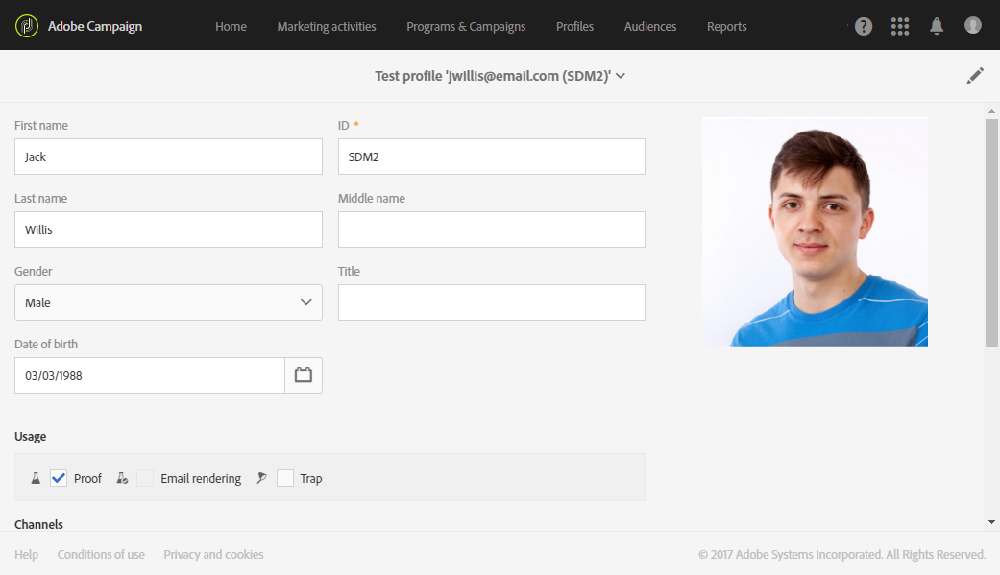
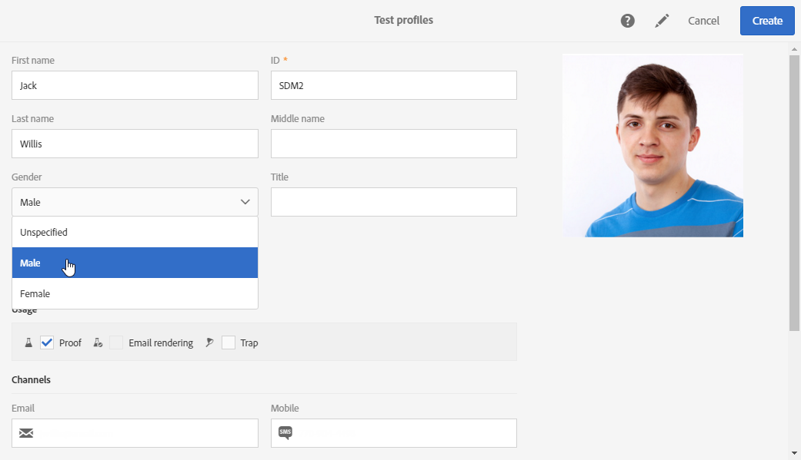
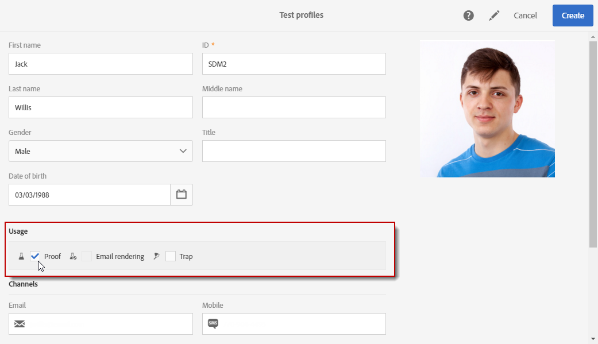
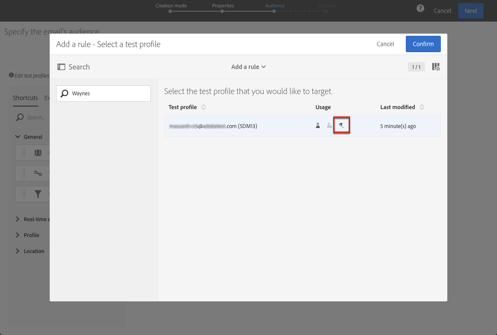
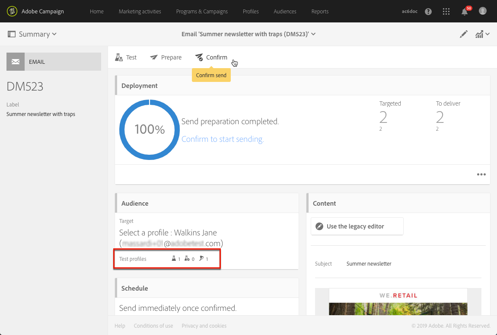

# Managing test profiles {#managing-test-profiles}

## About test profiles {#about-test-profiles}

The test profiles allow you to target additional recipients who do not match the defined targeting criteria. They are added to a message's audience to detect any fraudulent use of your recipient database or to ensure the emails arrive in the inboxes.

You can manage your test profiles from the advanced menu **[!UICONTROL Profiles & audiences > Test profiles]**.

A test profile contains fictitious contact information, or contact information controlled by the sender, that can then be used in a message in the following contexts:

* For sending **Proofs**: the Proof is a specific message used to check the message before sending the finalized delivery to recipients. A Proof test profile is in charge of checking the delivery, with regard to its content and format. See [Sending proofs](#sending-proofs).
* For **Email rendering**: the Email rendering test profile is used to check the way in which a message is displayed according to the message inbox that receives it. For example, webmail, message service, mobile, etc. See [Email rendering](../../sending/using/email-rendering.md).

  The **Email rendering** use is read-only. Test profiles with this use are only available out-of-the-box in Adobe Campaign.

* As a **Trap**: the message is sent to the test profile just as it is sent to the main target. See [Using traps](#using-traps).
* To **Preview** messages: a test profile can be selected when previewing a message to test the personalization elements. See [Previewing messages](/help/sending/using/previewing-messages.md).

## Creating test profiles {#creating-test-profiles}

1. From the advanced menu, via the Adobe Campaign logo, select **Profiles & audiences > Test profiles** to access the list of test profiles. 

   

1. From the **[!UICONTROL Test profiles]** dashboard, click **Create**.

   

1. Enter the data for this profile.

   

1. Select the use you intend for your test profile.

   

1. Enter the contact channels **[!UICONTROL Email, Telephone, Mobile, Mobile app]**, as well as the test profile address if necessary.

   >[!NOTE]
   >
   >You can define a preferred email format: **[!UICONTROL Text]** or **[!UICONTROL HTML]**.

1. Specify an event type and the data for this event if you want to use this test profile for testing the personalization of a transactional message.
1. Click **[!UICONTROL Create]** to save the test profile.

The test profile will then be added to the list of profiles.

**Related topic:**

[Creating a test profile](https://docs.adobe.com/content/help/en/campaign-learn/campaign-standard-tutorials/profiles-and-audiences/test-profiles.html) video

## Editing test profiles {#editing-test-profiles}

To edit a test profile and consult the data that is linked to it, or to modify it:

1. Select the test profile you would like to edit by clicking on its image.
1. Consult or modify the fields.

   

1. Click **[!UICONTROL Save]** if you have entered your changes, or select the name of the test profile then **[!UICONTROL Test profiles]** in the section at the top of the screen to go back to the test profiles dashboard.

## Using traps {#using-traps}

When using traps, the message is sent to the test profile just as it is sent to the main target, as a means to identify whether your client file is being used fraudulently.

Traps were originally designed for direct mail deliveries. They allow you to:
* Verify that your direct mail provider is really sending the communication.
* Receive the mail at the same time and in the same conditions as your customers.
* Keep an exact copy of the mail that was sent.
* Check that your client list is not misused by your direct mail provider. Indeed, if any other communication is sent to your test profile's address, your client file may have been used without your knowing. This is why the test profile's address should only be used to this purpose.

 For more on adding traps to a direct mail's audience, see [Adding test and trap profiles](../../channels/using/defining-the-direct-mail-audience.md#adding-test-and-trap-profiles).

For the other communication channels, you can add trap test profiles to your main target in order to:
* Check that your message was successfully sent.
* Get and keep an exact copy of your message.
* Track when it was sent and received.

To use a test profile as a trap, it must be included in your message's audience.

>[!NOTE]
>
>As opposed to test profiles used for [proofs](#sending-proofs) or [email rendering](../../sending/using/email-rendering.md), the message is sent at the same time to the main target and to the test profiles used as traps.

When defining a message's audience:

1. From the **[!UICONTROL Test profiles]** tab, select a test profile. Make sure that it has **[!UICONTROL Trap]** as the intended use.

   

1. Once your message content is ready, click the **[!UICONTROL Prepare]** button. See [Preparing the send](../../sending/using/preparing-the-send.md).
   >[!NOTE]
   >
   >Make sure you selected a main target. Otherwise, your message cannot be sent.

1. Click the **[!UICONTROL Confirm]** button. See [Confirming the send](../../sending/using/confirming-the-send.md).

   

The message is sent to the main target and to the test profile.

>[!NOTE]
>
>When using a test profile as a trap, for any enriched fields in a message, the corresponding additional data is randomly picked from a real targeted profile and assigned to the trap test profile. For more on enrichment, see [this example](../../automating/using/enrichment.md#example--enriching-profile-data-with-data-contained-in-a-file).
