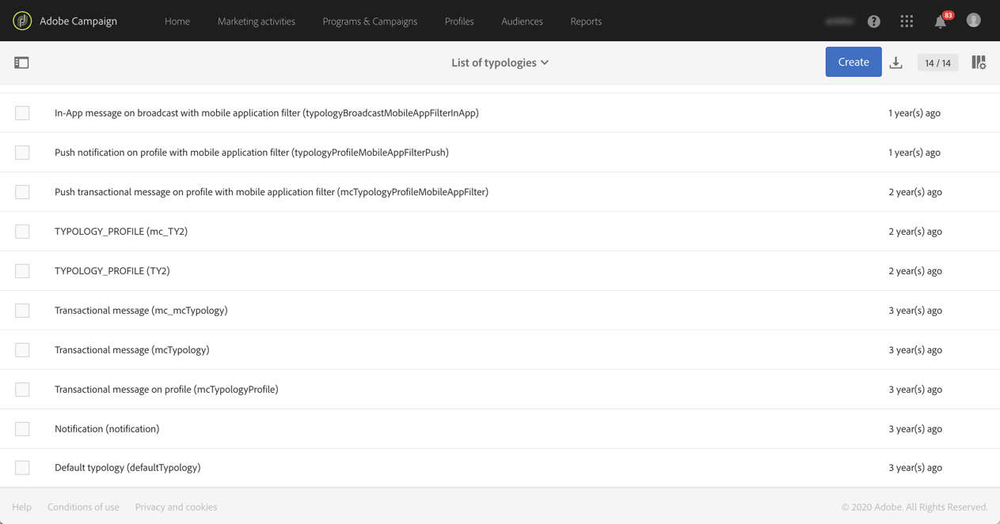
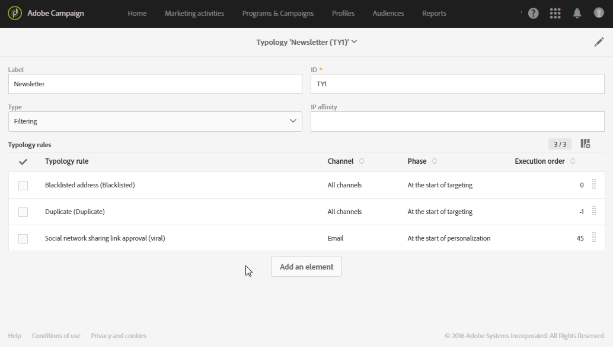
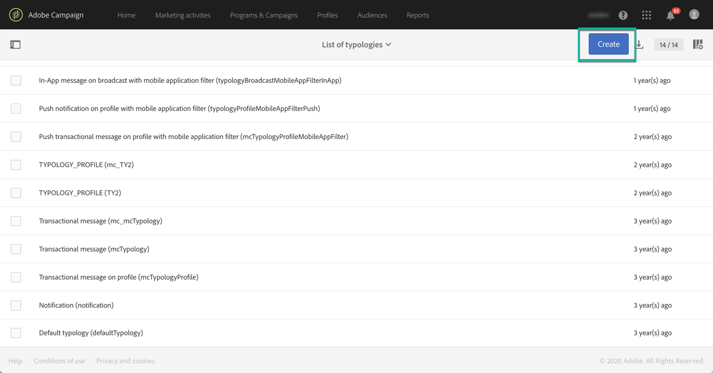
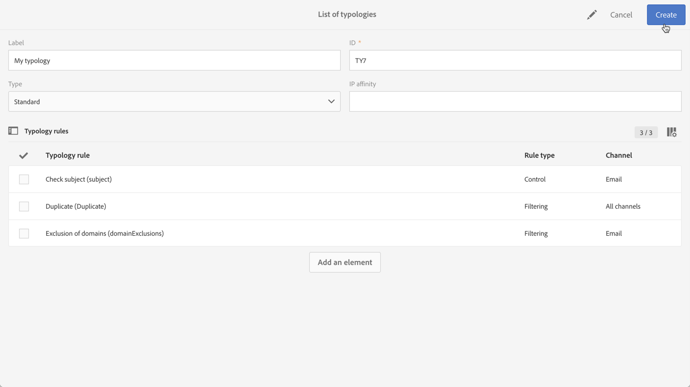
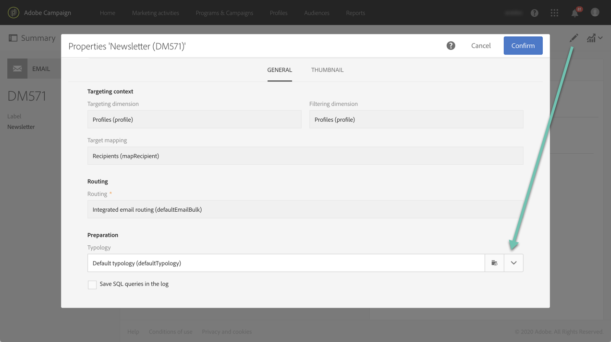

# Managing typologies {#managing-typologies}

## About typologies {#about-typologies}

Typologies are sets of rules that allow you to check the validity of your message before sending it. For example: The message content is not empty, an unsubscription is present, exclusion of duplicates, etc.

Typologies are accessible via the **[!UICONTROL Administration]** > **[!UICONTROL Channels]** > **[!UICONTROL Typologies]** menu. By default, a default typology is available in the application. Based on your needs, you can create your own typologies or modify existing ones.

For each typology, the **[!UICONTROL Typology rules]** section lists the set of rules that are executed when using the typology with a message.

   >[!NOTE]
   >
   >To get more details on one of the typology rules, double-click it. The rule will display in read-only mode.

## Creating a typology {#creating-a-typology}

To create a new typology, follow these steps:

1. Access the **[!UICONTROL Administration]** > **[!UICONTROL Channels]** > **[!UICONTROL Typologies]** menu.

1. The list of typologies displays. Click the **[!UICONTROL Create]** button.

   

1. Define the typology **[!UICONTROL Label]**, then click the **[!UICONTROL Add an element]** button to select the typology rules that you want to include in it. For more on typology rules, refer to [this section](../../sending/using/managing-typology-rules.md).

   

   >[!NOTE]
   >
   >The **[!UICONTROL IP affinity]** field allows you to manage the affinities according to your configuration. They are defined in the instance's configuration file. If you want to use the affinities contact your administrator.

1. Click **[!UICONTROL Create]** to confirm your selection. Your typology is now ready to be used in messages.

## Applying typologies to messages {#applying-typologies-to-messages}

When associating a typology with a message or message template, the typology rules included in the typology will be executed to check the message validity.

>[!NOTE]
>
>Each message or message template can only be assigned a single typology.

To link a typology to a message, follow these steps:

1. Access the message properties. Note that message templates are accessible from the **[!UICONTROL Resources]** > **[!UICONTROL Templates]** navigation menu.

1. In the **[!UICONTROL Advanced parameters]** > **[!UICONTROL Preparation]** section, select the typology to link to the message.

   

1. Click **[!UICONTROL Confirm]**.

   The selected typology is now linked to the message. All its associated typology rules will be executed to check the message validity.
