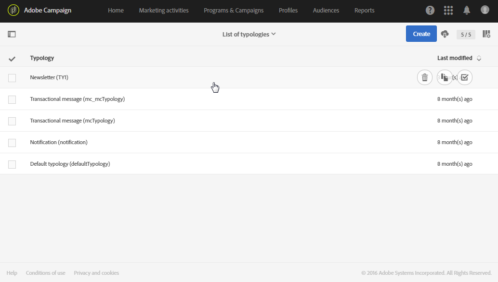

# Managing typologies {#managing-typologies}

## About typologies {#about-typologies}

Typologies are sets of rules that allow you to check the validity of your message before sending it. For example:the message content is not empty, an ubsubscription is present, exclusion of duplicates, etc.).

Based on your needs, you can create your own typologies or modify existing ones.

Typologies are accesible via he **[!UICONTROL Administration]** > **[!UICONTROL Channels]** > **[!UICONTROL Typologies]** menu. Several typologies are present by default in the application.

For each typology, the **[!UICONTROL Typology rules]** section lists the set of rules that are executed when using the typology with a message.

   >[!NOTE]
   >
   >To get more details on one of the typology rules, double-click it. The rule will display in read-only mode.

## Creating a typology {#creating-a-typology}

To create a new typology, follow these steps:

1. Access the **[!UICONTROL Administration]** > **[!UICONTROL Channels]** > **[!UICONTROL Typologies]** menu.

1. The list of typologies displays. Click the **[!UICONTROL Create]** button.

   

   >[!NOTE]
   >
   >You can also double-click an existing typology to modify its content and properties.

1. Define the type of the typology. Typologies can be either **[!UICONTROL Standard]** or **[!UICONTROL Filtering]** typologies.

   >[!NOTE]
   >
   >The **[!UICONTROL IP affinity]** field allows you to manage the affinities according to your configuration. These are defined in the instance's configuration file. If you want to use the affinities, contact your administrator.

1. Select the typology rules that you want to include into the typology.

   

   You can modify the order in which the rules are applied for a given typology. To do this, move the elements to modify the order in which they appear on the screen. The numbers corresponding to the execution order are then automatically recalculated. The rule application mode is presented in the [Typology rules execution order](#typology-rules-execution-order) section.

Your typology is ready to be used. You can select it in message properties or in message template properties.

## Applying typology to messages {#applying-typologies-to-messages}

When associating a typology with a message, the typology rules included in the typology will be executed to check the message validity.

>[!NOTE]
>
>Each message can only be assigned a single typology.

1. To link a typology to a message, access the message properties, then select the **[!UICONTROL Advanced parameters]** section.

   

1. By default, the out-of-the-box typology is linked to messages. Select the typology of your choice from the list, then confirm.

The selected typology is now linked to the message. All its associated typology rules will be executed to check the message validity.
