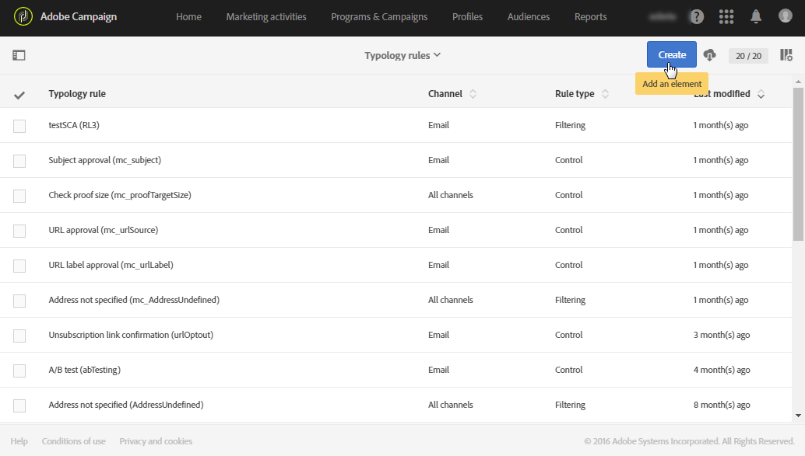
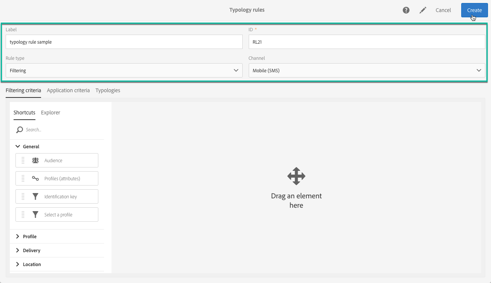
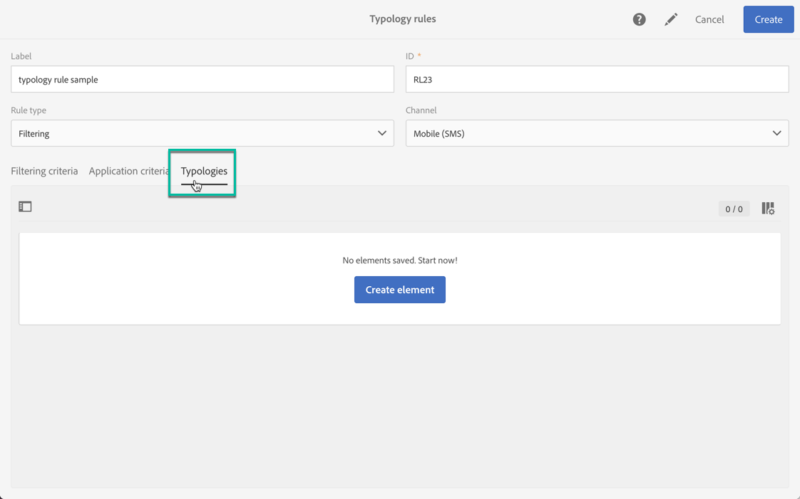
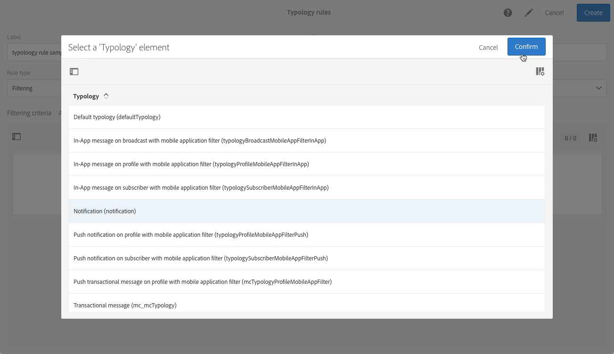
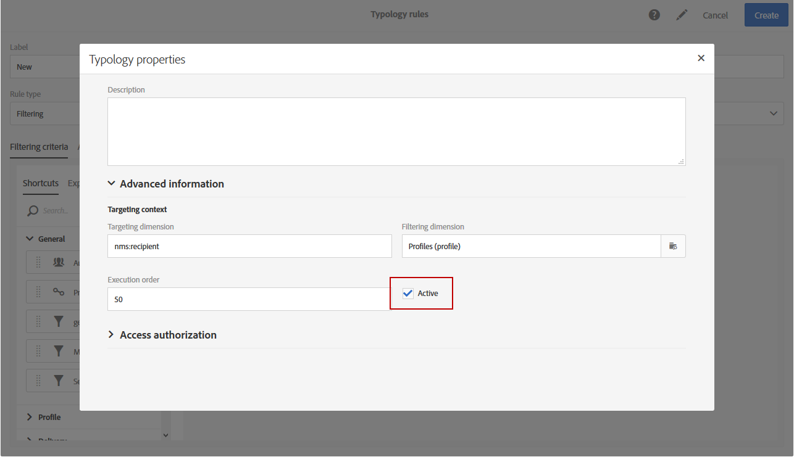

# Managing typology rules {#managing-typology-rules}

## About typology rules {#about-typology-rules}

Typology rules are business rules that allow you to perform checks and filtering on your message before sending it. Available types of typology rules are:

* **Filtering** rules: This type of rule allows you to exclude one part of the message target according to criteria defined in a query, such as quarantined profiles or profiles that have already been sent a certain number of emails. For more on this, refer to [this section](../../sending/using/filtering-rules.md).

* **Fatigue** rules: This type of rules allows you to define a maximum number of messages per profile to avoid over-soliciting them. For more on this, refer to [this section](../../sending/using/fatigue-rules.md).

* **Control** rules: This type of rules allows the user to check the validity and quality of the messages before they are sent, such as character display, SMS message size, address format, etc. For more on this, refer to [this section](../../sending/using/control-rules.md).

Typology rules are available under the **[!UICONTROL Administration]** > **[!UICONTROL Channels]** > **[!UICONTROL Typologies]** > **[!UICONTROL Typology rules]** menu.

By default, several out-of-the-box **filtering** and **control** typology rules are available. They are detailed in the [Filtering rules](../../sending/using/fatigue-rules.md) and [Control rules](../../sending/using/control-rules.md) sections.

According to your needs, you can modify existing typology rules or create new ones, excepted for **[!UICONTROL Control]** rules, which are read-only and cannot be modified.

## Creating a typology rule {#creating-a-typology-rule}

The main steps to create a typology rule are as follows:

1. Access the **[!UICONTROL Administration]** / **[!UICONTROL Channels]** / **[!UICONTROL Typologies]** / **[!UICONTROL Typology rules]** menu, then click **[!UICONTROL Create]**.

	

1. Enter the typology **[!UICONTROL Label]**, then specify the **[!UICONTROL Channel]** to which the rule should apply.

	

1. Specify the typology rule **[!UICONTROL Type]**, then configure it according to your needs.

	Typology rules configuration vary depending on their type. For more information, refer to the **[Filtering rules](../../sending/using/filtering-rules.md)** and **[Fatigue rules](../../sending/using/fatigue-rules.md)** sections.

1. Select the typologies in which you want to include the new rule. To do this, select the **[!UICONTROL Typologies]** tab, then click **[!UICONTROL Create element]** button.

	

1. Select the desired typology, then click **[!UICONTROL Confirm]**.

	

1. Once all the typologies are selected, click **[!UICONTROL Create]** to confirm the typology rule creation.

## Typology rules execution order {#typology-rules-execution-order}

Typology rules are executed in an order specified during the targeting, analysis, and message personalization phases.

In standard operation mode, the rules are applied in the following sequence:

1. Control rules, if they are applied at the start of targeting.
1. Filtering rules:

    * Native application rules for address qualification: defined address / non-verified address / blacklisted address / quarantined address / address quality.
    * Filtering rules defined by the user.

1. Control rules, if they are applied at the end of targeting.
1. Control rules, if they are applied at the start of personalization.
1. Control rules, if they are applied at the end of personalization.

However, you can adapt the execution order of the same type of rules in each typology. Indeed, when multiple rules are executed during the same message processing phase, you can choose the order in which they are applied.

For example, a filtering rule whose execution order is positioned at number 20 will be executed before a filtering rule whose execution order is positioned at number 30.

In the **[!UICONTROL Properties]** of a typology rule, you can set its execution order. When several rules have to be applied, the execution order of each rule determines the ones to process first. For more on this, refer to the [Typology rules execution order](#typology-rules-execution-order) section.

A typology rule can be deactivated through its **[!UICONTROL Properties]** if you do not want the rule to be applied at the moment that the messages concerned by the rule are analyzed.

