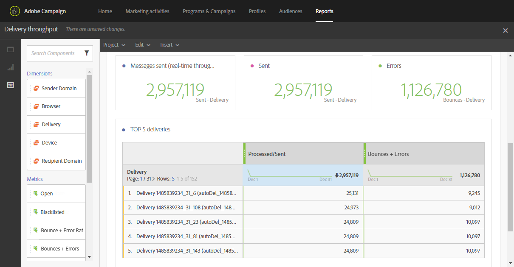
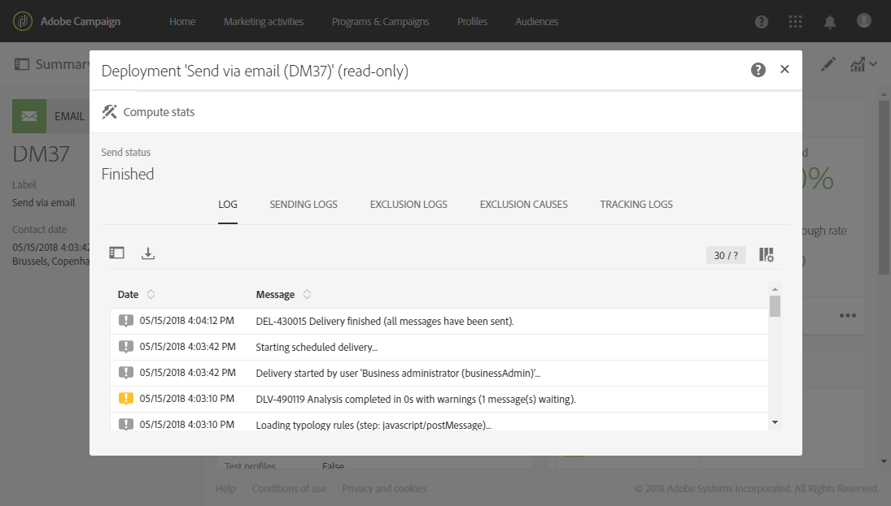

# Monitoring deliverability{#monitor-deliverability}

Below you will find details on the **[!UICONTROL Delivery throughput]** report as well as the different monitoring tools offered by Adobe Campaign. Here are some additional guidelines on deliverability monitoring:
* Regularly check the delivery throughput for the whole platform to verify whether it is consistent with the original set-up.
* Check that retries are set up correctly (30 minutes for retry period and more than 20 retries) in delivery templates.
* Regularly verify that the bounce mailbox is accessible and that the account is not about to expire.
* Check each delivery throughput to make sure that it is consistent with the delivery content's validity (e.g. 'flash sales' should be delivered in minutes, not days).
* Check that the number of errors and new quarantines are consistent with other deliveries.
* Carefully consult the delivery logs in detail to check the kind of errors that are highlighted (denylists, DNS issues, anti-spam rules, etc…).

## Delivery throughput {#delivery-throughput}

This report contains information on the delivery throughput of the entire platform for a given period to measure the speed at which the messages are delivered.

For more on this, see [Delivery throughput](../../reporting/using/delivery-throughput.md).

You can configure the values displayed by changing the timescale.

Other reports are available, such as **[!UICONTROL Delivery summary]** or **[!UICONTROL Non-deliverables and bounces]**. For more on this, see [Dynamic reports](../../reporting/using/about-dynamic-reports.md).

## Monitoring deliveries {#monitoring-deliveries}

The message dashboard gives you access to the delivery logs: **[!UICONTROL Sending logs]**, **[!UICONTROL Exclusion logs]**, **[!UICONTROL Exclusion causes]**, **[!UICONTROL Tracking logs]** and **[!UICONTROL Tracked URLs]**. They show the detail of the sending, which target has been excluded and why, as well as the tracking information such as opens and clicks.

For more on this, see [Monitoring a delivery](../../sending/using/monitoring-a-delivery.md).

## Receiving alerts {#receiving-alerts}

The **[!UICONTROL Delivery alerting]** feature is an alert management system that enables a group of users to automatically receive notifications containing information on the execution of their deliveries.

For more on this, see [Receiving alerts when failures happen](../../sending/using/receiving-alerts-when-failures-happen.md).

<!--## External tools (#external-tools)

### Signal Spam {#signal-spam}

Signal Spam is a French service which offers anonymized feedback loop reporting for French ISPs (Orange, SFR).

This service allows you to follow the reputation of the French ISPs and track customers' activity evolution.

Signal Spam also provides direct complaints that end users log through a dedicated interface. Those complaints are then quarantined from the email address database.

### 250ok {#solution-250ok}

250ok is a monitoring solution which provides IP and domain denylists, as well as reputation indicators.

The information provided is real-time, which allows for a pro-active assistance. 250ok a complementary solution to the Adobe deliverability internal tools.-->
