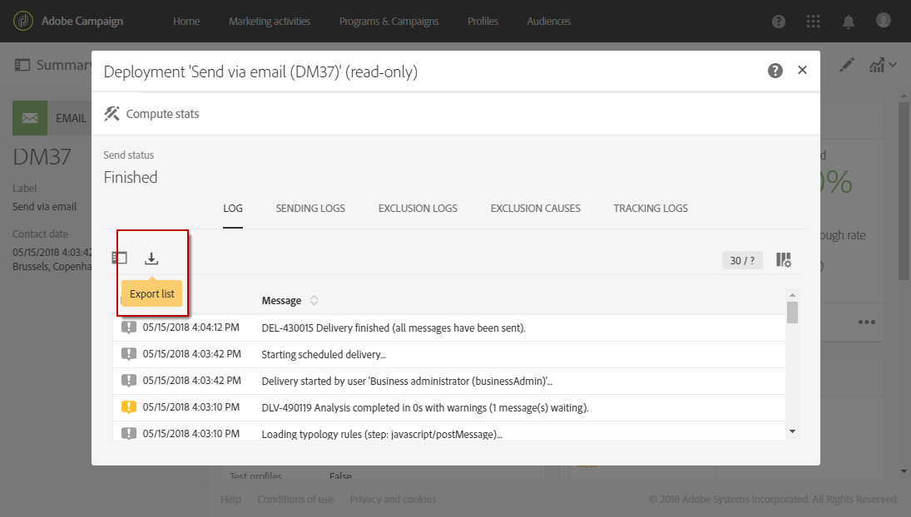
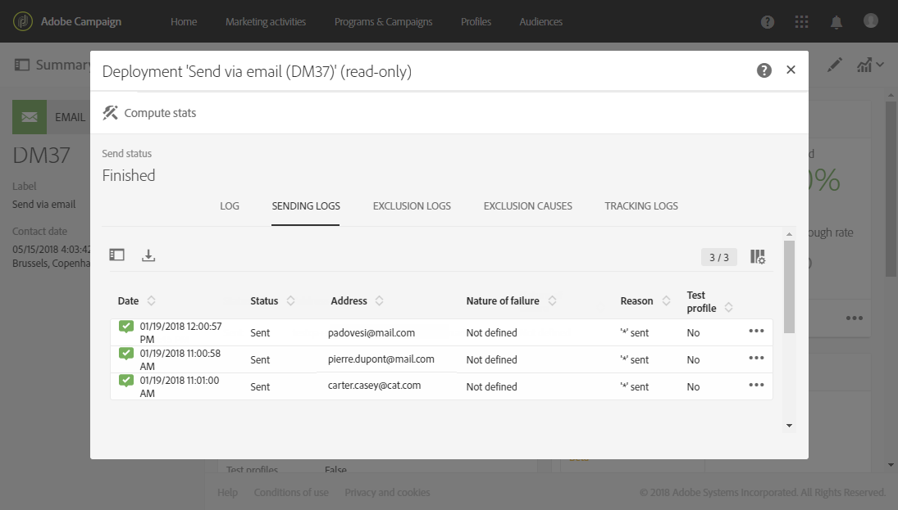
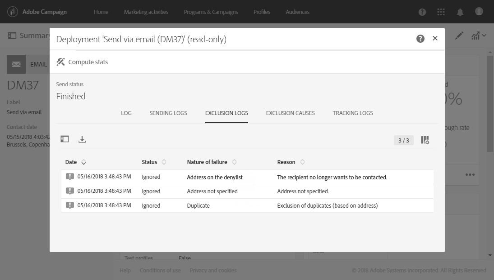
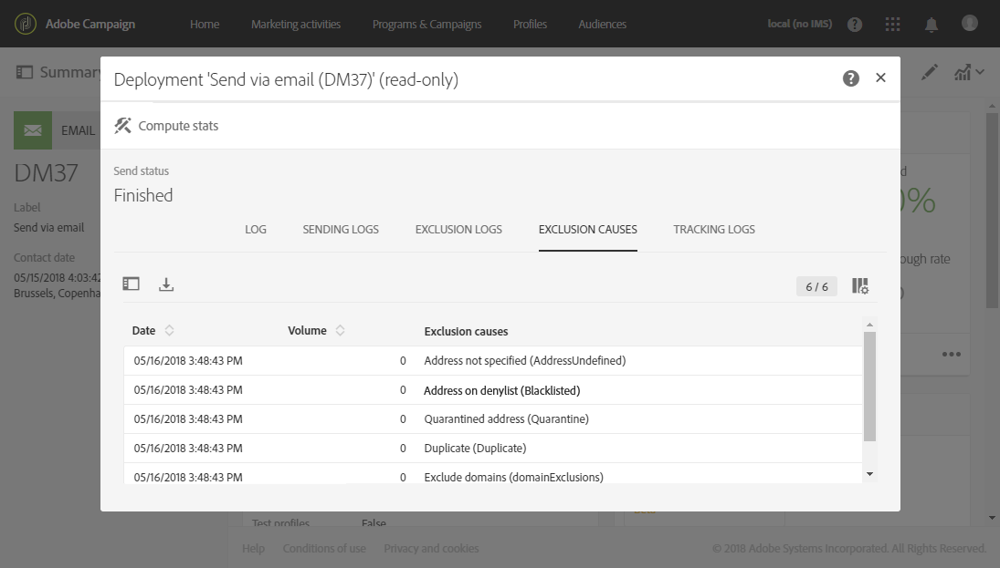

# Monitoring a delivery{#monitoring-a-delivery}

Monitoring a delivery

There are several ways to monitor a delivery and to measure its impact:

* **Message logs**: These logs can be accessed directly from the message dashboard. They show the detail of the sending, which target has been excluded and why, as well as the tracking information such as opens and clicks.

  To view the message logs, click the icon at the bottom right of the **Deployment** block.

  Several tabs contain information (if it exists) regarding the **Sending logs**, **Exclusion logs**, **Exclusion causes**, **Tracking logs** and **Tracked URLs**. See [Delivery logs](../../sending/using/monitoring-a-delivery.md#delivery-logs).

  

  The log contains all messages relating to the delivery and the proofs. Specific icons allow you to identify errors or warnings. For more on this, see [Approving messages](../../sending/using/previewing-messages.md).

  You can export the log by clicking the **Export list** button.

  

* **Delivery alerts**: To keep track of delivery successes or failures, Adobe Campaign provides an email alerting system that sends notifications to inform users of important system activities.
* **Reports**: From the message dashboard, you can access several reports for this specific message. You also have a **Reports** menu that allows you to access a complete list of built-in or custom reports that you can use to outline specific metrics related to your message or campaign.
* An administrator can also export logs in a separate file that can be processed in your own reporting or BI tools. For more on this, see [Exporting logs](../../automating/using/exporting-logs.md).

**Related topics:**

* [Receiving alerts when failures happen](../../sending/using/receiving-alerts-when-failures-happen.md)
* [Reports](../../reporting/using/about-dynamic-reports.md)

## Delivery logs {#delivery-logs}

### Sending logs {#sending-logs}

The **Sending logs** tab offers a history of every occurrence of this delivery. The list of sent messages and their statuses is stored here. It allows you to view the delivery status for each recipient.

For each profile with a **Sent** status, the **Date** column shows when the message was sent.

### Exclusion logs {#exclusion-logs}

The **Exclusion logs** tab lists all the messages that have been excluded from the target sent and specifies the reason for the send failure.

### Exclusion causes {#exclusion-causes}

The **Exclusion causes** tab displays the volume (in number of messages) of messages that were excluded from the target send.

