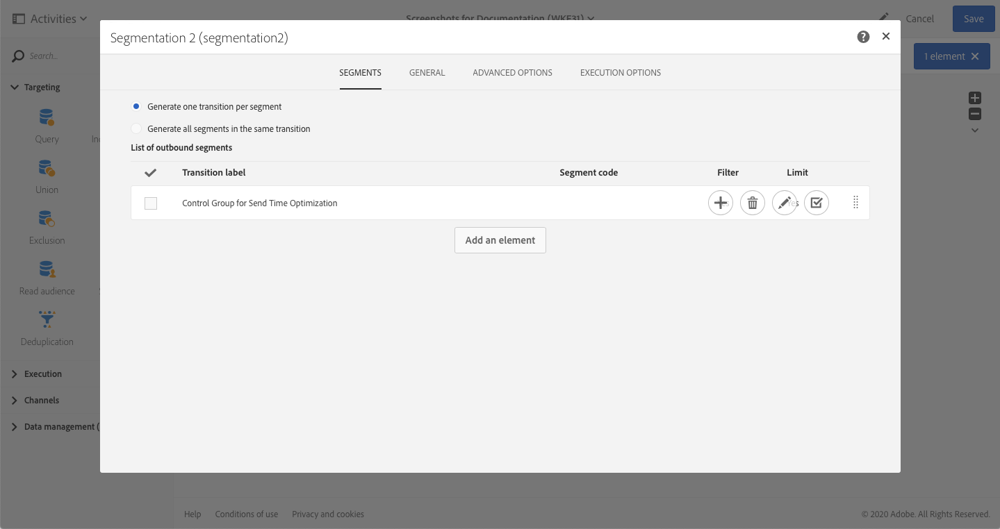

# Optimizing design and delivery with AI-powered emails{#journey-ai}

## Get started with AI-powered emails{#journey-ai-ovv}

Using Campaign, you can optimize the design and delivery of customer journeys with advanced ML capabilities to predict each individual's engagement preference. Powered by Adobe Sensei, Adobe Campaign can analyze and predict open rates, optimal send times, and probable churn based on historical engagement metrics.

**Machine learning models**

In addition to [send time optimization capabilities](../../sending/using/computing-the-sending-date.md), you can now leverage Machine Learning into Campaign. Adobe Campaign Standard offers two new Machine Learning models - Predictive Send Time Optimizations and Predictive Engagement Scoring. These two models are together referred to Journey AI which is a class of machine learning models that are specific to designing and delivering better customer journeys.

* **Predictive send time optimization**: Predictive send time optimization predicts which is the best send time for each recipient profile for email opens and clicks. For each recipient profile, the scores indicate the best send time for each weekday and which weekday is the best to send for best results. 

* **Predictive engagement scoring**: Predictive engagement scoring predicts the probability of a recipient engaging with a message as well as the probability of opting out (unsubscribing) within the next 7 days after the next email send. The probabilities are further divided into buckets according to the specific risk of disengagement, medium, or low. Along these the model also provides the risk percentile rank for the customers to understand where the rank of a certain customer in relation to others. 

>[!NOTE]
> **Prerequisites**
>
>This capability is not available out of the box as part of the product. The implementation requires Adobe Consulting to be engaged. Please reach out to your Adobe representative to find out more.
>
>Separately, the feature required the usage of an Azure storage that must be provided by the customer.

## Predictive send time optimization{#predictive-send-time}

### Optimize clicks and opens{#about-predictive-send-time}

Predictive send time optimization predicts which is the best send time for each recipient profile for email opens and clicks. For each recipient profile, the scores indicate the best send time for each weekday and which weekday is the best to send for best results. 

Within the Predictive Send Time Optimization model, there are two sub-models:
* Predictive send time for open is the best time a communication must be sent to the customer to maximize opens
* Predictive send time for click is the best time a communication must be sent to the customer to maximize clicks

**Model input**: Delivery logs, tracking logs and profile attributes (non-PII)

**Model output**: Best time to send a message (for opens and clicks)


Output details

* Compute the best time of day to send an email for the next 7 days with 1 hour intervals (e.g.: 9:00 am, 10:00 am, 11:00 am)
* The model will indicate the best time within the next 7 days to send the email
* Each optimal time is computed twice: once to maximize open rate and once to maximize click rate

*  e.g.: 16 fields are given:
    * best time to send an email to optimize clicks for Monday - values between 0 and 23
    * best time to send an email to optimize opens for Monday - values between 0 and 23
    * best time to send an email to optimize clicks for Tuesday - values between 0 and 23
    * ...
    * best time to send an email to optimize clicks for Sunday - values between 0 and 23
    * best time to send an email to optimize opens for Sunday - values between 0 and 23
    * ...
    * best day to send an email to optimize opens for the whole week - Monday to Sunday
    * best time to send an email to optimize opens for the whole week - values between 0 and 23

>[!NOTE]
>
>These predictive capabilities only apply to email deliveries.
>
>The model needs at least one month of data to produce significant results.


### Access profile scores{#access-predictive-send-time-scores}

Once implemented into Campaign, Machine Learning capabilities enrich profiles data with new tabs with their best open/click scores. Those metrics are computed by dedicated technical workflows.

To access those metrics, you need to:  

1. Open a profile and click the Edit button.

1. Click the **Send Time Score By Click** or **Send Time Score By Open** tab.

1. Click the profile identifier >> TO CONFIRM

By default, the profile scores will give the best time of the day for each day of the week and the best overall time in the week.

  

### Send messages at the best moment{#use-predictive-send-time}

In order for the emails to go out at the optimal time per profile, the delivery must be scheduled using the option **[!UICONTROL Send at a custom date defined by a formula]**. 
Learn how to compute the sending date [in this section](../../sending/using/computing-the-sending-date.md).

The formula needs to be populated with the specific best time of the particular day when the delivery will go out.

  

Formula example:  

```
AddHours([currentDelivery/scheduling/@contactDate], 
[cusSendTimeScoreByClickprofile_link/@EMAIL_BEST_TIME_TO_CLICK_WEDNESDAY])
```

  

>[!NOTE]
>
>The data model might be different depengin on your implementation.

### Use Case{#use-predictive-uc}

 You can add a control group to check the impact of your settings. In the example below, where we are keeping 10% of the audience for a non-optimized delivery.

 1. Create a new workflow 

 1. Add the following activities: 

 1. In the Segmentation activity, add a new output transition for the control group segment, as follows:

   

 1. 


 