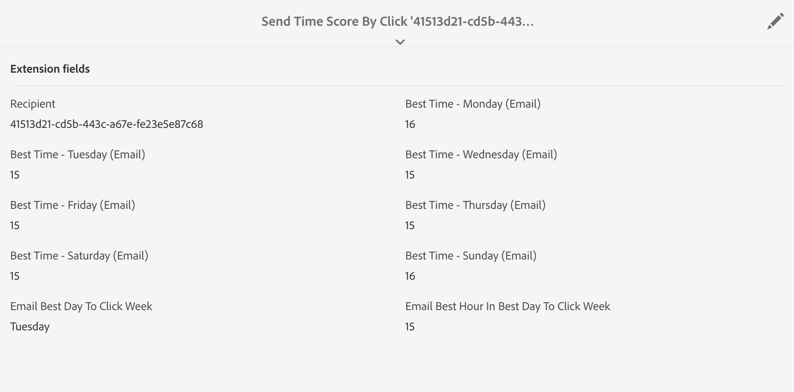
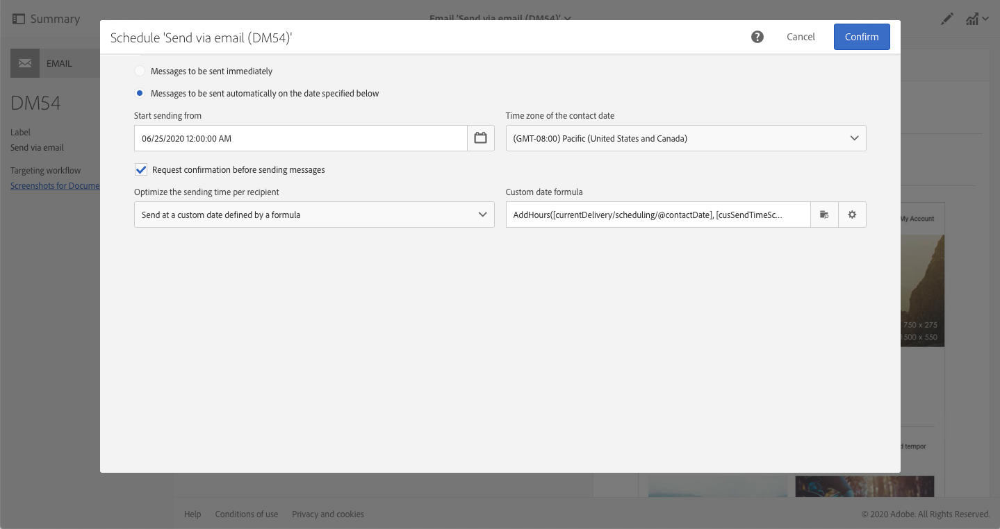
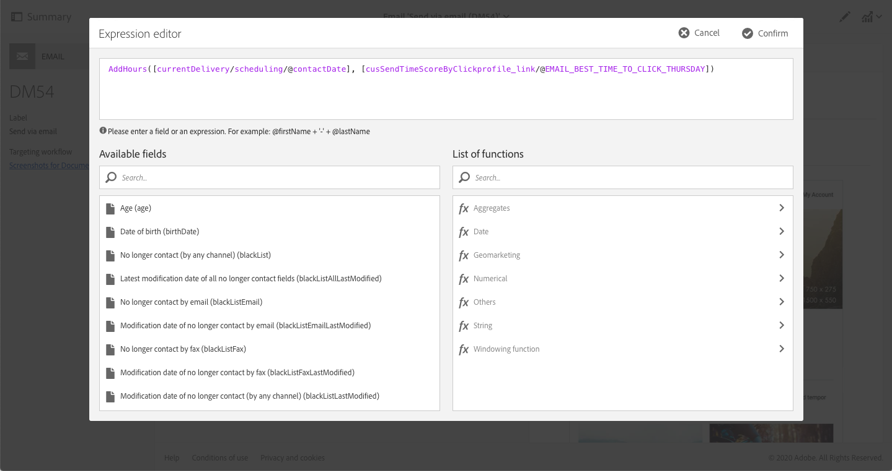
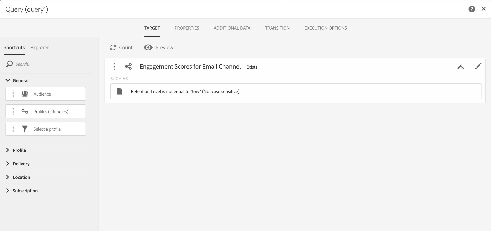

# Optimizing design and delivery with AI-powered emails{#journey-ai}

## Get started with AI-powered emails{#journey-ai-ovv}

Using Campaign, you can optimize the design and delivery of customer journeys to predict each individual's engagement preference. Powered by Journey AI, Adobe Campaign can analyze and predict open rates, optimal send times, and probable churn based on historical engagement metrics.

**Machine learning models**

Adobe Campaign Standard offers two new Machine Learning models: **Predictive Send Time Optimizations** and **Predictive Engagement Scoring**. These two models are together referred to Journey AI which is a class of machine learning models that are specific to designing and delivering better customer journeys.

* **Predictive send time optimization**: Predictive send time optimization predicts which is the best send time for each recipient profile for email opens or clicks. For each recipient profile, the scores indicate the best send time for each weekday and which weekday is the best to send for best results. 

* **Predictive engagement scoring**: Predictive engagement scoring predicts the probability of a recipient engaging with a message as well as the probability of opting out (unsubscribing) within the next 7 days after the next email send. The probabilities are further divided into buckets according to the specific risk of disengagement, medium, or low. Along these the model also provides the risk percentile rank for the customers to understand where the rank of a certain customer in relation to others. 

>[!CAUTION]
>This capability is not available out of the box as part of the product. The implementation requires Adobe Consulting to be engaged. Please reach out to your Adobe representative to find out more.
>
>Separately, the feature required the usage of an Azure storage that must be provided by the customer.

## Predictive send time optimization{#predictive-send-time}

### Optimize clicks and opens{#about-predictive-send-time}

Predictive send time optimization predicts which is the best send time for each recipient profile for email opens and clicks. For each recipient profile, the scores indicate the best send time for each weekday and which weekday is the best to send for best results. 

Within the Predictive Send Time Optimization model, there are two sub-models:
* Predictive send time for open is the best time a communication must be sent to the customer to maximize opens
* Predictive send time for click is the best time a communication must be sent to the customer to maximize clicks

**Model input**: Delivery logs, tracking logs and profile attributes (non-PII)

**Model output**: Best time to send a message (for opens and clicks)


Output details

* Compute the best time of day to send an email for the next 7 days with 1 hour intervals (e.g.: 9:00 am, 10:00 am, 11:00 am)
* The model will indicate the best time within the next 7 days to send the email
* Each optimal time is computed twice: once to maximize open rate and once to maximize click rate
* 16 fields are given (14 for days of the week and 2 for the whole week):
    * best time to send an email to optimize clicks for Monday - values between 0 and 23
    * best time to send an email to optimize opens for Monday - values between 0 and 23
    * best time to send an email to optimize clicks for Tuesday - values between 0 and 23
    * ...
    * best time to send an email to optimize clicks for Sunday - values between 0 and 23
    * best time to send an email to optimize opens for Sunday - values between 0 and 23
    * ...
    * best day to send an email to optimize opens for the whole week - Monday to Sunday
    * best time to send an email to optimize opens for the whole week - values between 0 and 23

>[!NOTE]
>
>These predictive capabilities only apply to email deliveries.
>
>The model needs at least one month of data to produce significant results.


### Access profile scores{#access-predictive-send-time-scores}

Once implemented into Campaign, Machine Learning capabilities enrich profiles data with new tabs with their best open/click scores. The metrics are computed by Journey AI and they are brought into Campaign using technical workflows.

To access those metrics, you need to:  

1. Open a profile and click the Edit button.

1. Click the **Send Time Score By Click** or **Send Time Score By Open** tab.

By default, the profile scores will give the best time of the day for each day of the week and the best overall time in the week.

  

### Send messages at the best moment{#use-predictive-send-time}

In order for the emails to go out at the optimal time per profile, the delivery must be scheduled using the option **[!UICONTROL Send at a custom date defined by a formula]**. 
Learn how to compute the sending date [in this section](../../sending/using/computing-the-sending-date.md).

The formula needs to be populated with the specific best time of the particular day when the delivery will go out.

  

Formula example:  

```
AddHours([currentDelivery/scheduling/@contactDate], 
[cusSendTimeScoreByClickprofile_link/@EMAIL_BEST_TIME_TO_CLICK_WEDNESDAY])
```

  

>[!NOTE]
>
>The data model might be different depending on your implementation.
> 


## Predictive engagement scoring {#predictive-scoring}

The predictive engagement scoring lets you:

* **Select an audience**: by using the query activity, you can select the audience to engage with a specific message
* **Exclude an audience**: by using the query activity, you can remove the audience to unsubscribe
* **Personalize**: personalize message based on level of engagement (highly engaged users will get a different message than un-engaged ones)

This model uses multiple scores to indicate:

* **Open Engagement Score / Click Engagement Score**: this value matches the probability that a subscriber will engage with a specific message (open or click). Values range from 0.0 to 1.0.
* **Unsubscription probability**: this value matches the probability for recipient to unsubscribe from email channel given one email opened. Values range from 0.0 to 1.0.
* **Retention level**:  this value ranks users into three levels: low, medium and high. High being most likely to stay with the brand and low value likely to unsubscribe.
* **Percentile rank of retention**: profile rank in terms of unsubscription probability. Values range from 0.0 to 1.0. For example, if the retention percent rank is 0.953, this recipient is more likely to stay with brand and less likely to unsubscribe than 95.3% of all recipients.

>[!NOTE]
>
>These predictive capabilities only apply to email deliveries.
>
>The model needs at least one month of data to produce significant results.


**Model Input**: Delivery logs, tracking logs and specific profile attributes

**Model Output**: A profile attribute that describes the profile’s score and category


### Using the engagement score for the email channel

To access those metrics, you need to:  

1. Open a profile and click the Edit button.

1. Click the **Engagement Scores for Email Channel** tab.

By using a query activity in a workflow, you can use the score to optimize your audience.

For example, with the **Retention level** criteria:




 