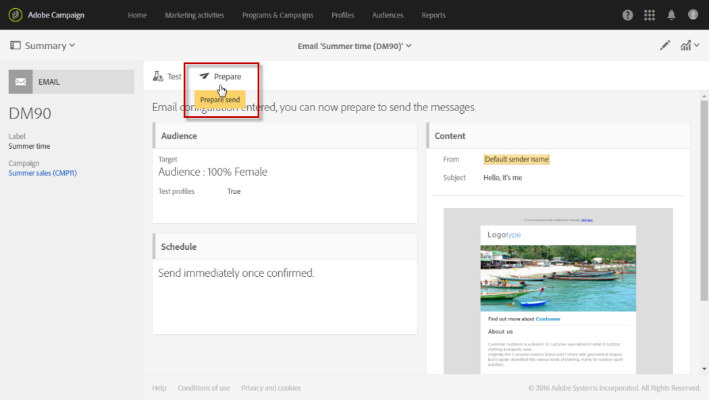
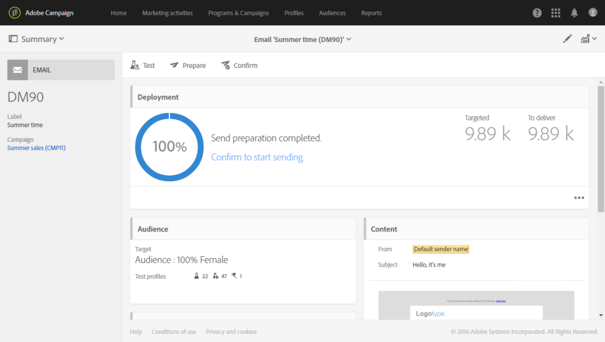
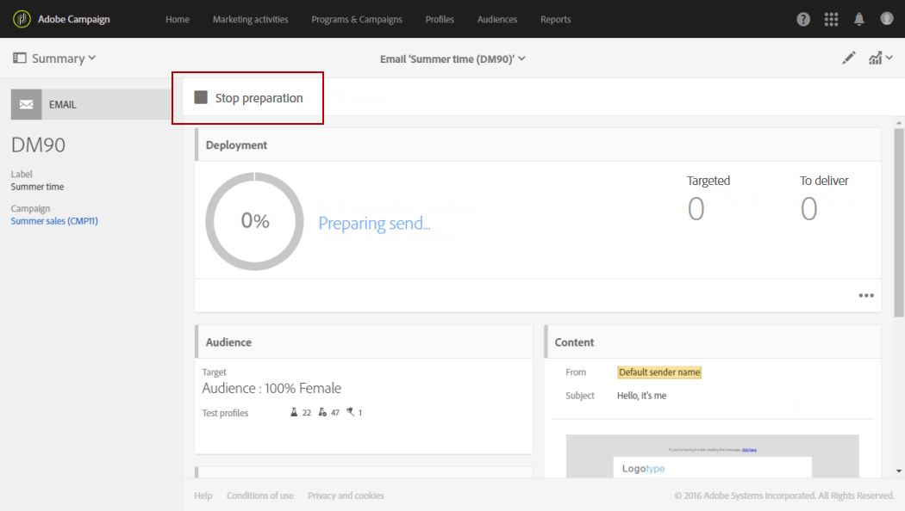
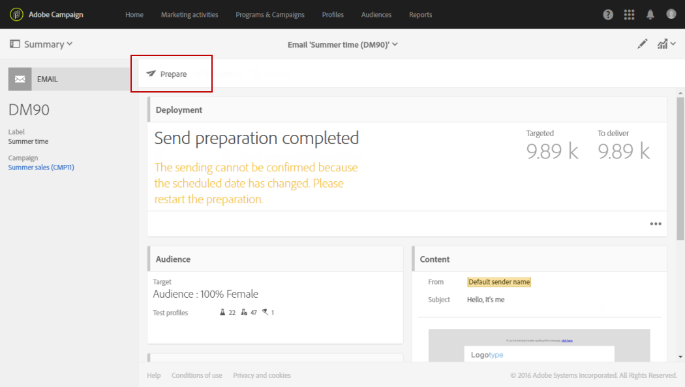
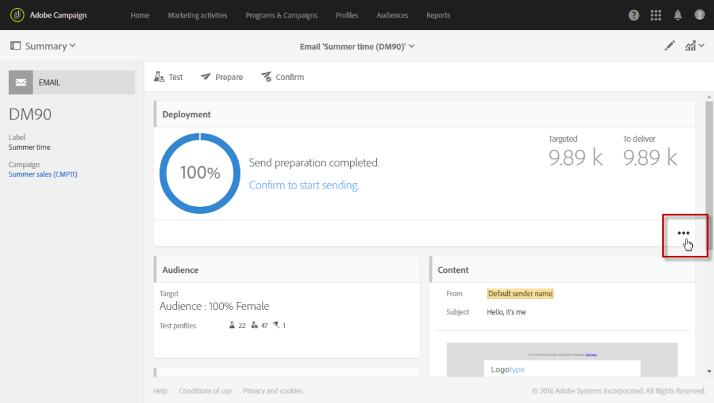
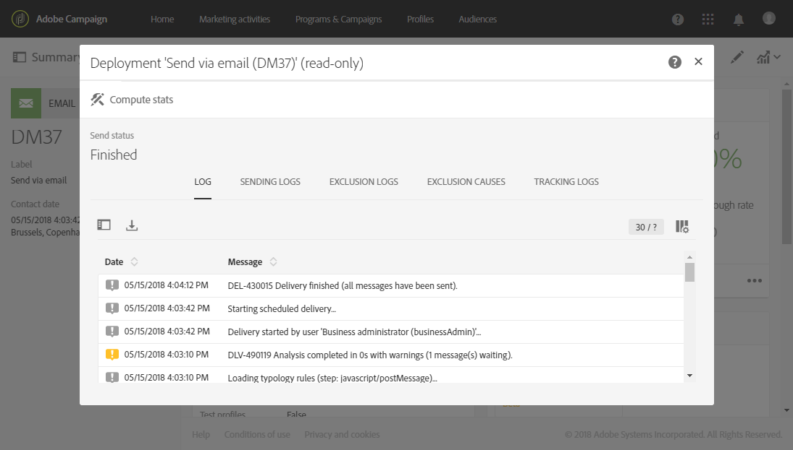

# Preparing the send{#preparing-the-send}

Preparing the send

Preparation corresponds to the step of calculating the target population and generating the message contents for each profile included in the target. Once preparation is finished, the messages are ready to be sent, either immediately or at [the scheduled date and time](../../sending/using/about-scheduling-messages.md).

1. To start preparing the send, click the **Prepare** button located in the action bar.

   

1. The **[!UICONTROL Deployment]** block shows the preparation progress, then the preparation statistics: number of targeted messages, number of messages to send, etc.

   Depending on the size of the targeted population, this operation may take some time.

   

1. Stop the preparation at any time using the **Stop** button, located in the action bar.

   During the preparation phase, no messages are sent. You can therefore start or stop this without risk of impacting anything. 

   

1. Your message is automatically saved during the preparing for delivery stage. If you need to make any changes to your message's schedule after the preparation step, you will need to make sure that you click the **[!UICONTROL Prepare]** button again for those changes to be taken into account. For more information on how to schedule a message, refer to this [page](../../sending/using/about-scheduling-messages.md).

   

1. To view the preparation logs, click the button located in the bottom right of the block.

   

1. The **[!UICONTROL Deployment]** window opens, correct any errors then restart the preparation.

   The last log message displays any error messages and the number of errors. A specific icon shows the encountered error type: the yellow icon indicates a non-critical processing error, the red icon indicates a critical error that prevents the delivery from being started.

   

1. Check the preparation statistics before confirming sending the messages. If the number of messages to send does not correspond to your configuration, edit the targeted population (see [Selecting an audience in a message](../../audiences/using/selecting-an-audience-in-a-message.md)) and restart the preparation.

Once the preparation has been completed, your message is ready to be sent. For more on this, see [Confirming send](../../sending/using/confirming-the-send.md).

**Typology rules**

Adobe Campaign comes with a set of build-in typology rules that are applied during the message preparation. They are used to check whether a message is valid and meets your quality criteria. See [Typologies](../../administration/using/about-typology-rules.md). You can define your own typology rules, for example, can set global cross-channel fatigue rules that will automatically exclude oversollicited profiles from campaigns. See [Fatigue rules](../../administration/using/fatigue-rules.md).

**SMS message check**

If you have inserted personalization fields or conditional text into the content of your SMS message, these factors may introduce characters that are not taken into account by the GSM encoding. When the preparation is run, the message length is monitored and a warning message will be displayed if it passes the limit.

For more on this, refer to the [SMS encoding, length and transliteration](../../administration/using/configuring-sms-channel.md#sms-encoding--length-and-transliteration) and [Personalizing SMS messages](../../channels/using/personalizing-sms-messages.md) sections.
