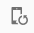
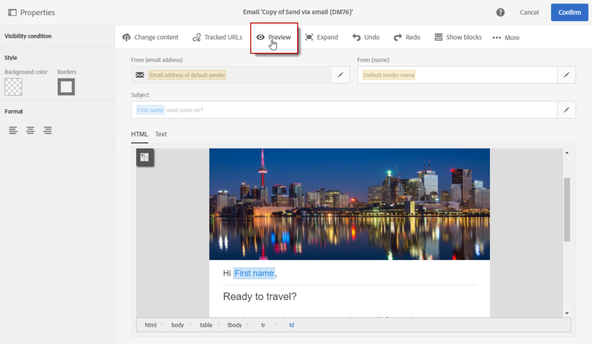
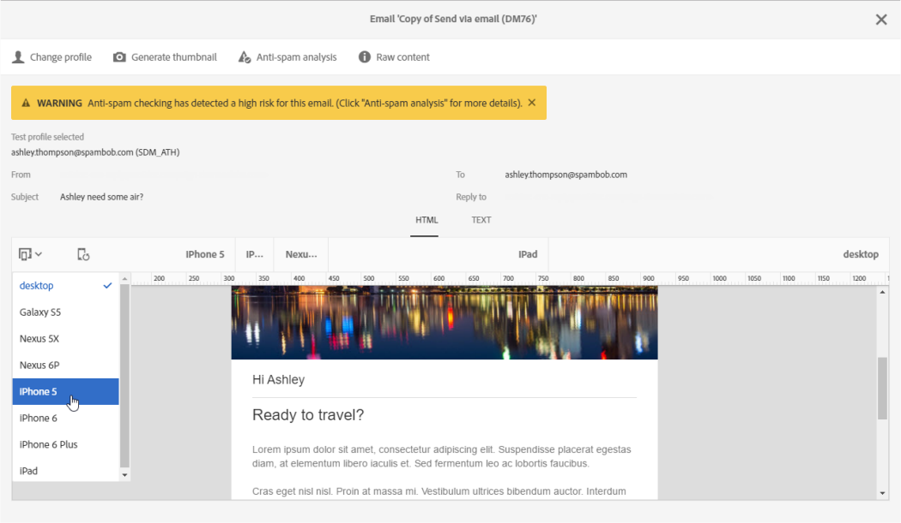

# Previewing messages{#previewing-messages}

Previewing messages

After adding test profiles in the **[!UICONTROL Audience]** window, you can preview your message to check its personalization and how your recipients will see your delivery.

## Previewing messages with the content editor {#previewing-messages-with-the-content-editor}

In the [content editor](../../designing/using/about-personalization.md), preview is available in HTML and text format.

The preview screen comes with a device mode that allows you to simulate a wide range of devices. You can select the device that you want to emulate in the dropdown list. The  

button lets you control the orientation between portrait and landscape.

For emails, an automatic anti-spam checking is performed during each preview. Click the **[!UICONTROL Show anti-spam analysis]** button to find out more about the warning.

1. In the **[!UICONTROL Content]** window, after personnalizing your message, use the **[!UICONTROL Preview]** button located in the action bar.

   

1. Select the **[!UICONTROL Change profile]** button to choose the test profile you want to test the personalization elements on.
1. To check your delivery layout on different devices, select a type of device in the top action bar.

   

Once the personalization is finished, your delivery is ready to be sent to your recipients.

## Previewing messages with the Email Designer {#previewing-messages-with-the-email-designer}

1. In the [Email Designer](../../designing/using/about-email-content-design.md#about-the-email-designer), click the **[!UICONTROL Preview]** button.

   

   A desktop view and a responsive mobile view of your email are displayed side by side.

1. An automatic anti-spam checking is performed during each preview. Click the **[!UICONTROL Anti-spam analysis]** button to find out more about the warning.

   

1. Select the **[!UICONTROL Change profile]** button to choose the test profile you want to test the personalization elements on.
1. To exit the **[!UICONTROL Preview]** mode, click the **[!UICONTROL Edit]** button on top left of the screen.

   

