# Previewing deliveries {#previewing-messages}

## Previewing emails {#previewing-emails}

Campaign Standard allows you to preview messages before sending, in order to check their personalization and how your recipients will see them.

Messages preview is performed using **Test profiles** that you add to the message's target.

For **email** messages, Campaign Standard allows you to preview messages using targeted profiles rather than test profiles. This allows you to get an exact representation of the message that a specific profile will receive. For more on this, see [Testing email messages using targeted profiles](../../sending/using/testing-messages-using-target.md).

To preview a message using test profiles, follow these steps:

1. In the [Email Designer](../../designing/using/designing-content-in-adobe-campaign.md), click the **[!UICONTROL Preview]** button.

   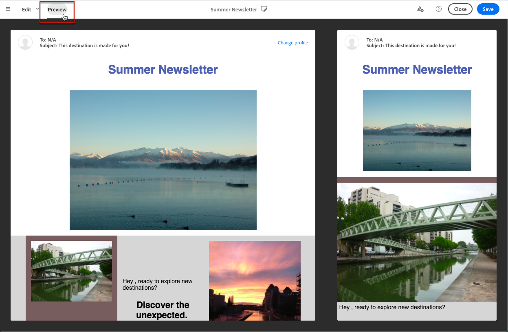

   A desktop view and a responsive mobile view of your email are displayed side by side.

1. An automatic anti-spam checking is performed during each preview. Click the **[!UICONTROL Anti-spam analysis]** button to find out more about the warning.

   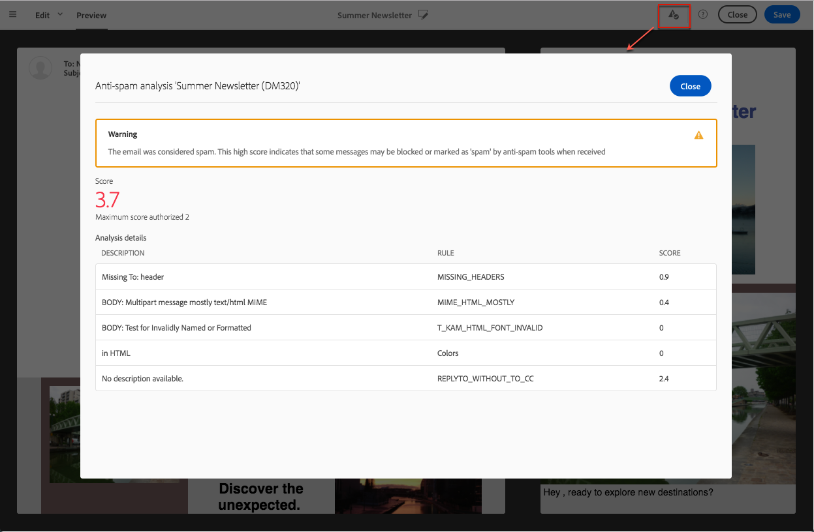

1. Select the **[!UICONTROL Change profile]** button to choose the test profile you want to test the personalization elements on.

    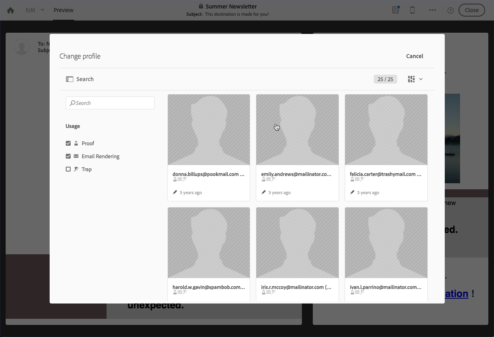

1. To exit the **[!UICONTROL Preview]** mode, click the **[!UICONTROL Edit]** button on top left of the screen.

   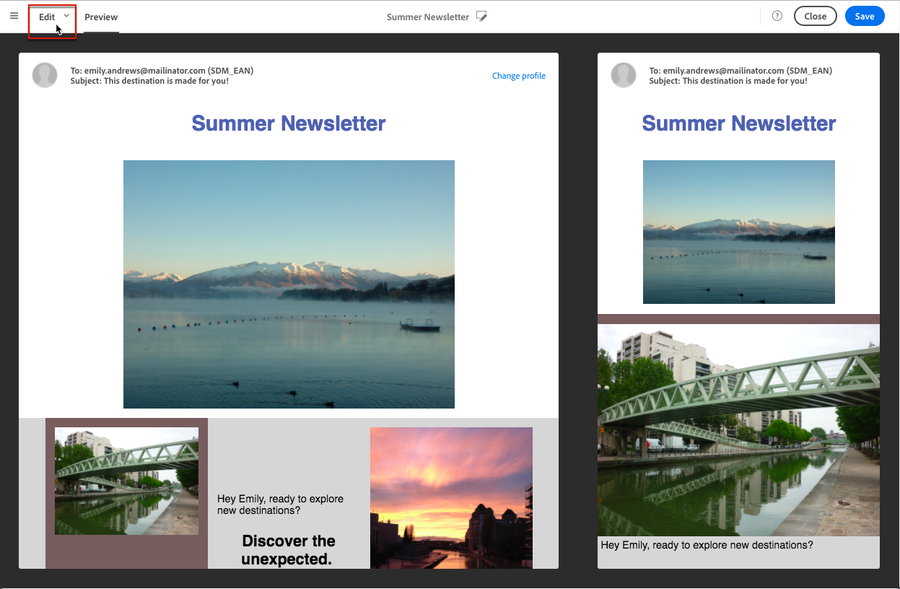

**Related topics**

* [Managing test profiles](../../audiences/using/managing-test-profiles.md)
* [Testing email messages using targeted profiles](../../sending/using/testing-messages-using-target.md)
* [Sending proofs](../../sending/using/sending-proofs.md)

## Previewing SMS messages {#previewing-sms}

For **SMS** messages, Campaign Standard allows you to preview messages using test profiles. This allows you to get an exact representation of the message that a specific profile will receive. For more on this, see [Managing test profiles](../../audiences/using/managing-test-profiles.md).

To preview a SMS message using test profiles, follow these steps:

1. Once you filled in the **[!UICONTROL Properties]** of your SMS message and selected your audiences, you can personalize your delivery. For more information, refer to [section](../../channels/using/personalizing-sms-messages.md).

   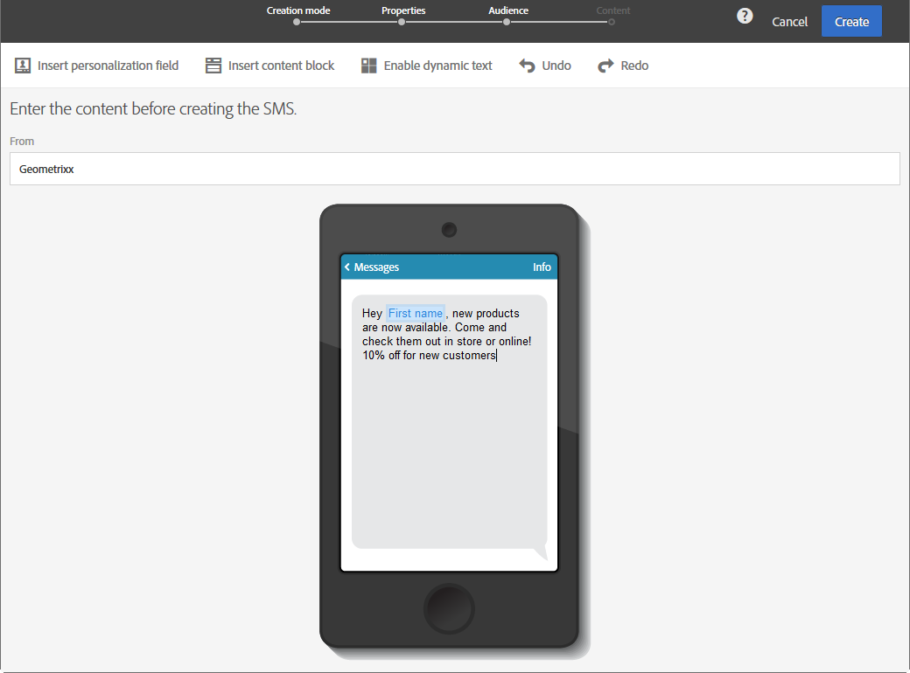

1. After personalizing your content, click **[!UICONTROL Create]** to access the **[!UICONTROL Summary]** window.

1. From the **[!UICONTROL Summary]** window, click **[!UICONTROL Content]** to start previewing your delivery.

   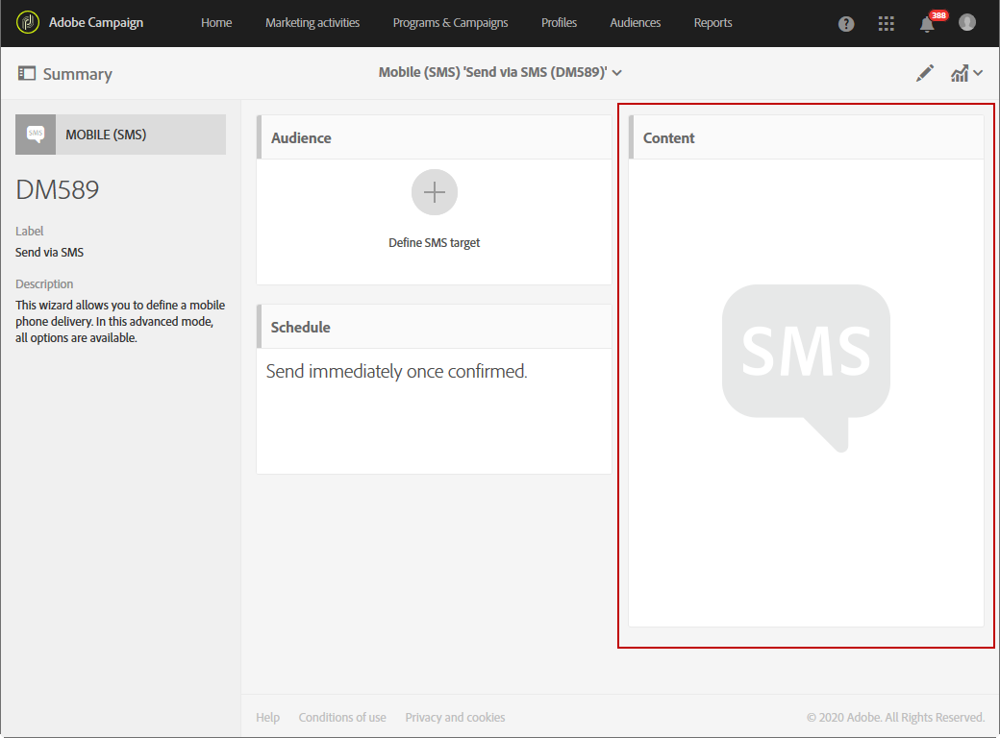

1. Click **[!UICONTROL Preview]** in the toolbar.

   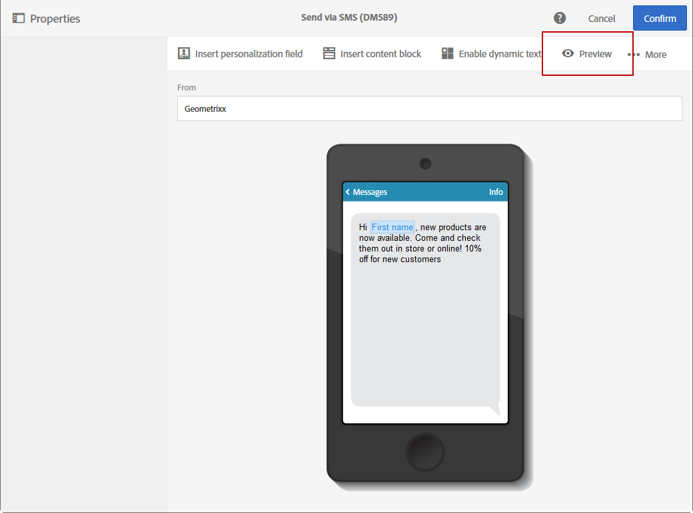

1. Click **[!UICONTROL Change profile]** to select your test profile then **[!UICONTROL Confirm]**.

   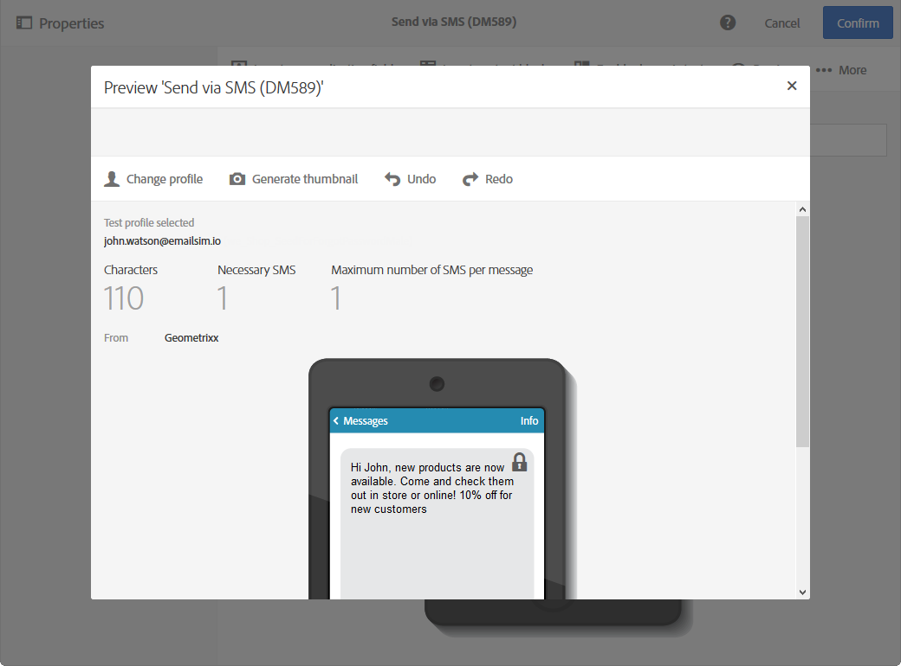

You can now see the exact representation of your message depending on the selected test profiles.

**Related topics**

* [About SMS messages](../../channels/using/about-sms-messages.md)
* [Creating an SMS message](../../channels/using/creating-an-sms-message.md)
* [Personalizing SMS messages](../../channels/using/personalizing-sms-messages.md)

## Previewing Push notifications {#previewing-push}

For **Push notification**, Campaign Standard allows you to preview messages using test profiles. This allows you to get an exact representation of the message that a specific profile will receive. For more on this, see [Managing test profiles](../../audiences/using/managing-test-profiles.md).

To preview a Push notification using test profiles, follow these steps:

1. Once you filled in the **[!UICONTROL Properties]** of your push notification and selected your audiences, you can personalize your delivery. For more information, refer to [Customizing a push notification](../../channels/using/customizing-a-push-notification.md).

1. After personalizing your content, you can directly check the rendering of your push notifications depending on devices and OS in the preview window.

   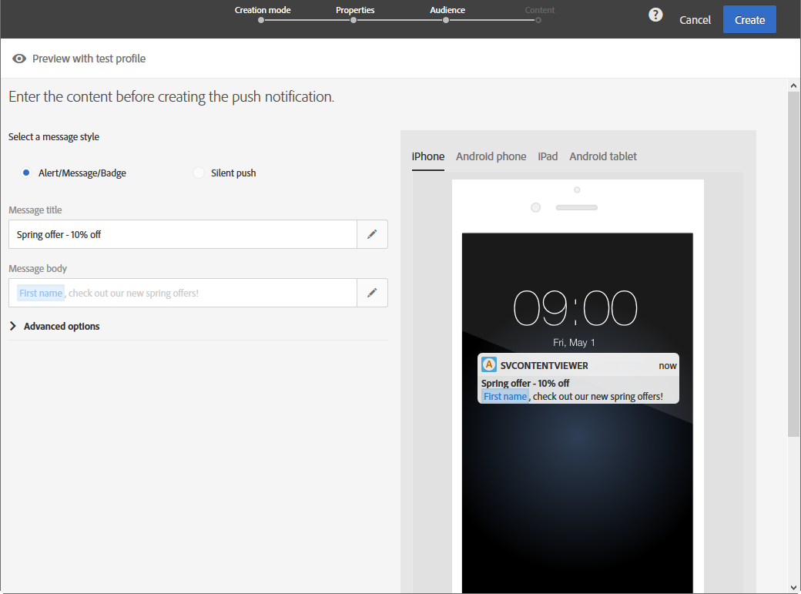

1. To preview your push notification using test profiles, click **[!UICONTROL Preview with test profile]**.

   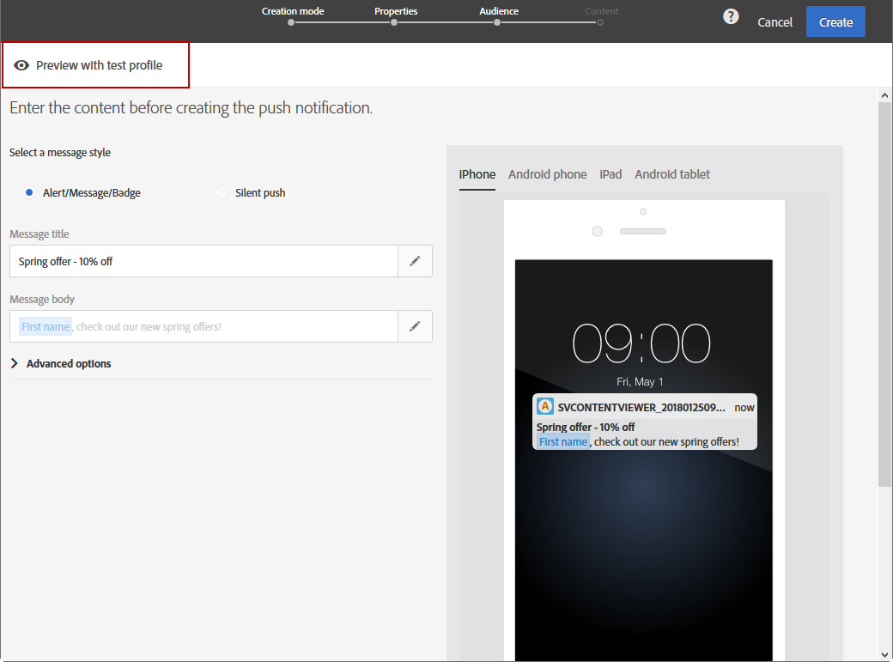

1. Select your test profile then **[!UICONTROL Confirm]**.

You can now see the exact representation of your message depending on the selected test profiles.

   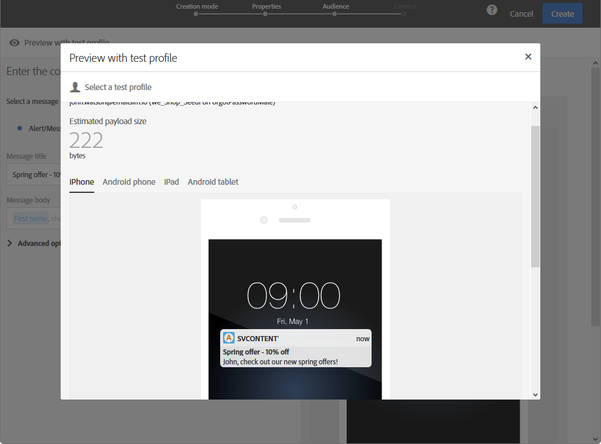

**Related topics**

* [About push notifications](../../channels/using/about-push-notifications.md)
* [Preparing and sending a push notification](../../channels/using/preparing-and-sending-a-push-notification.md)
* [Customizing a push notification](../../channels/using/customizing-a-push-notification.md)

## Previewing In-App messages {#previewing-in-app}

For **In-App**, Campaign Standard allows you to preview messages using test profiles. This allows you to get an exact representation of the message that a specific profile will receive. For more on this, see [Managing test profiles](../../audiences/using/managing-test-profiles.md).

To preview an In-App message using test profiles, follow these steps:

1. Once you filled in the **[!UICONTROL Properties]** of your In-App message, selected your audiences and set your **[!UICONTROL Triggers]**, you can personalize your delivery. For more information, refer to [Customizing an In-App message](../../channels/using/customizing-an-in-app-message.md).

1. After personalizing your content, you can directly check the rendering of your In-App message depending on devices and OS in the preview window.

   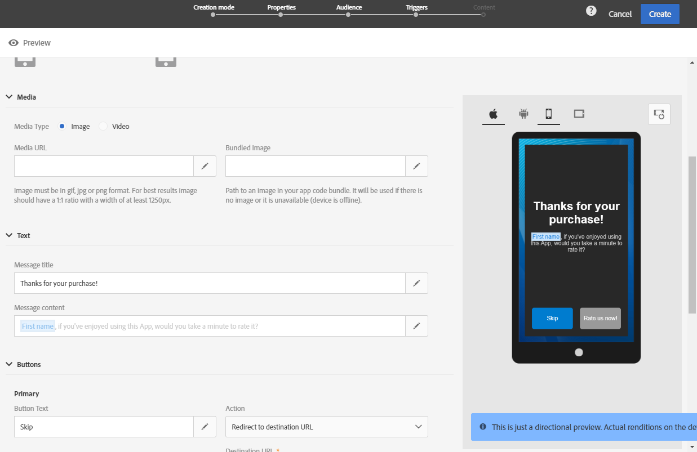

1. To preview your in-app message using test profiles, click **[!UICONTROL Preview]**.

   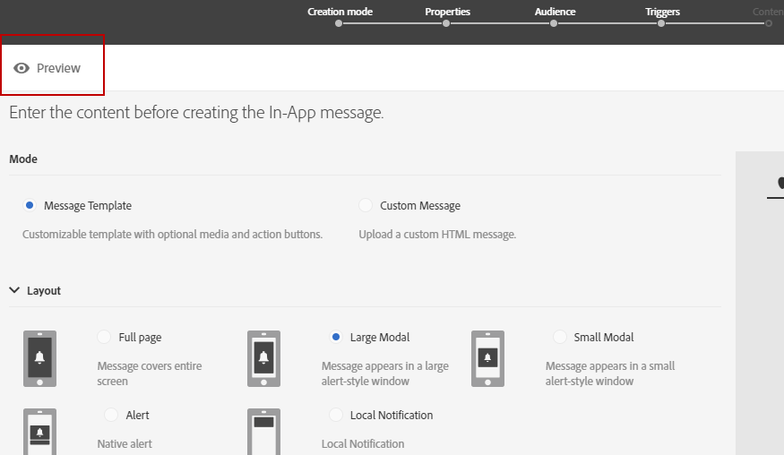

1. Select your test profile then **[!UICONTROL Confirm]**.

You can now see the exact representation of your message depending on the selected test profiles.

   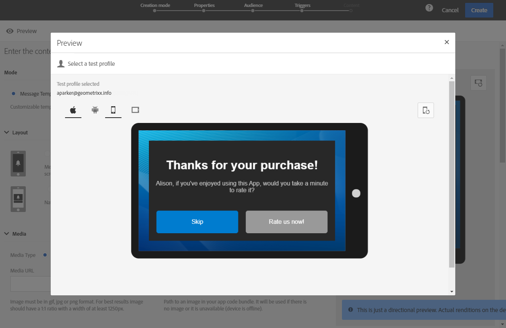

**Related topics**

* [About In-App messaging](../../channels/using/about-in-app-messaging.md)
* [Preparing and sending an In-App message](../../channels/using/#preparing-and-sending-an-in-app-message.md)
* [Customizing an In-App message](../../channels/using/customizing-an-in-app-message.md)