# Receiving alerts when failures happen{#receiving-alerts-when-failures-happen}

Receiving alerts when failures happen

## About delivery alerting {#about-delivery-alerting}

The **Delivery alerting** feature is an alert management system that enables a group of users to automatically receive notifications containing information on the execution of their deliveries.

The notifications sent contain a report based by default on the following criteria:

* Failed deliveries
* Deliveries with failed preparation
* Deliveries with a bad soft bounce error ratio
* Deliveries with a bad hard bounce error ratio
* Deliveries with a pending status longer than usual
* Deliveries with a low throughput
* Deliveries in progress

The recipients of the alerts can monitor the deliveries that are being processed by Adobe Campaign and take appropriate actions when there are issues in their execution.

These alerting notifications can be customized depending on specific alerting criteria that are defined through a dashboard in the Adobe Campaign interface.

>[!NOTE]
>
>The alerting notifications are delivered by email only.

The notifications sent contain:

* A **[!UICONTROL Summary]** displaying the number of deliveries meeting the criteria that you defined and the label/color that you chose for each criterion.
* A **[!UICONTROL Details]** section listing all of the delivery criteria defined for the corresponding dashboard and all of the deliveries for each criterion.

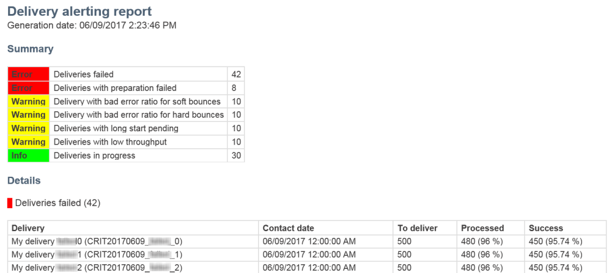

## Delivery alerting dashboards {#delivery-alerting-dashboards}

### About delivery alerting dashboards {#about-delivery-alerting-dashboards}

To manage the notifications' recipients, define the alerting criteria and access the history of the alerts, you need to use dashboards.

>[!NOTE]
>
>To access and configure the dashboards and the alerting criteria, you must have administration rights or appear in the **Delivery supervisors** security group. Standard users cannot access the dashboards in the Adobe Campaign interface. They can only receive the alerting notifications. For more on users and security in Adobe Campaign, see [Types of users](../../administration/using/types-of-users.md) and [About security groups](../../administration/using/managing-groups-and-users.md#about-security-groups).

From the Adobe Campaign interface, you can:

* Create and manage delivery alerting dashboards. See [Creating a delivery alerting dashboard](../../sending/using/receiving-alerts-when-failures-happen.md#creating-a-delivery-alerting-dashboard).
* Define and manage delivery alerting criteria for each dashboard. For example, you can build alerts based on deliveries with failed preparation or deliveries with a low throughput only. See [About alerting criteria](../../sending/using/receiving-alerts-when-failures-happen.md#about-alerting-criteria).
* Modify the criteria parameters for each dashboard. See [Criteria parameters](../../sending/using/receiving-alerts-when-failures-happen.md#criteria-parameters).
* Define a group of recipients for each dashboard.

  For example, you want to inform the users with administration rights of the failed deliveries only. However, you want the marketing users to receive information on the deliveries with a soft bounce bad error ratio. Therefore, you need to create two different dashboards and define the criteria that you want for each group of recipients.

* Access the history of all sent alerts for each dashboard.

  When selecting a dashboard, the last sent alert for this dashboard is displayed by default. All sent alerts are listed on the left of the screen. Click an item in the **[!UICONTROL History]** list to access the corresponding alerts.

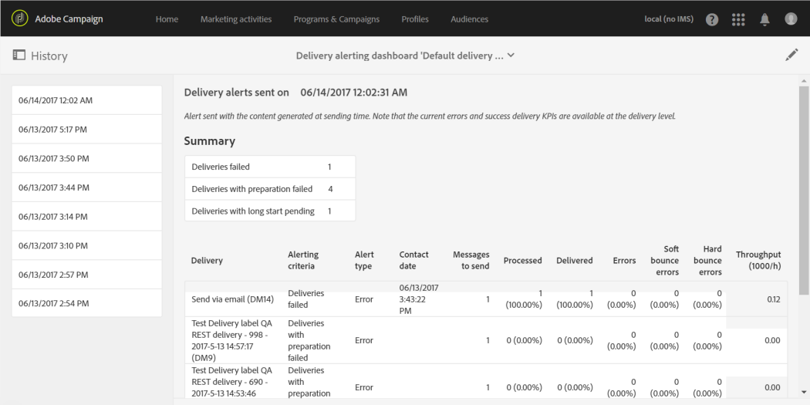

### Creating a delivery alerting dashboard {#creating-a-delivery-alerting-dashboard}

If you want to send notifications based on specific criteria to different groups of users, you need to use several dashboards. To create a new dashboard:

1. Go to **[!UICONTROL Administration]** > **[!UICONTROL Channels]** > **[!UICONTROL Delivery alerting]** .
1. Select **[!UICONTROL Delivery alerting dashboards]** and click **[!UICONTROL Create]** .
1. Check the **[!UICONTROL Enabled]** box to activate the current dashboard.

   If this option is disabled, notifications linked to this dashboard are no longer sent. This option is disabled by default.

   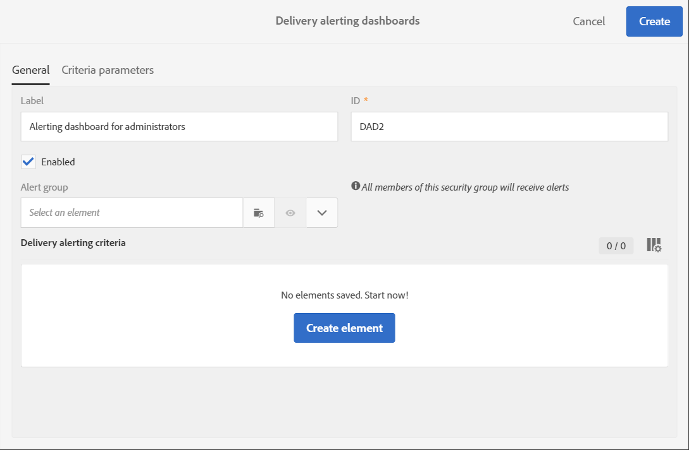

1. Select the group of recipients that you want to notify from the **[!UICONTROL Alert group]** drop-down list. To modify or create a group, see [Creating a security group and assigning users](../../administration/using/managing-groups-and-users.md#creating-a-security-group-and-assigning-users).
1. From the **[!UICONTROL Delivery alerting criteria]** section, click **[!UICONTROL Create element]** to add criteria. See [About alerting criteria](../../sending/using/receiving-alerts-when-failures-happen.md#about-alerting-criteria).
1. Select the **[!UICONTROL Edit properties]** button. In the **[!UICONTROL Criteria parameters]** tab, define how the criteria will be applied. See [Criteria parameters](../../sending/using/receiving-alerts-when-failures-happen.md#criteria-parameters).
1. Click **[!UICONTROL Create]** to save the dashboard.

Now each time a delivery meets the criteria that you defined in this dashboard, an alerting notification will be sent to the specified group of users.

## Delivery alerting criteria {#delivery-alerting-criteria}

### About alerting criteria {#about-alerting-criteria}

To access the delivery alerting criteria, go to **[!UICONTROL Administration]** > **[!UICONTROL Channels]** > **[!UICONTROL Delivery alerting]** and select **[!UICONTROL Delivery alerting criteria]** .

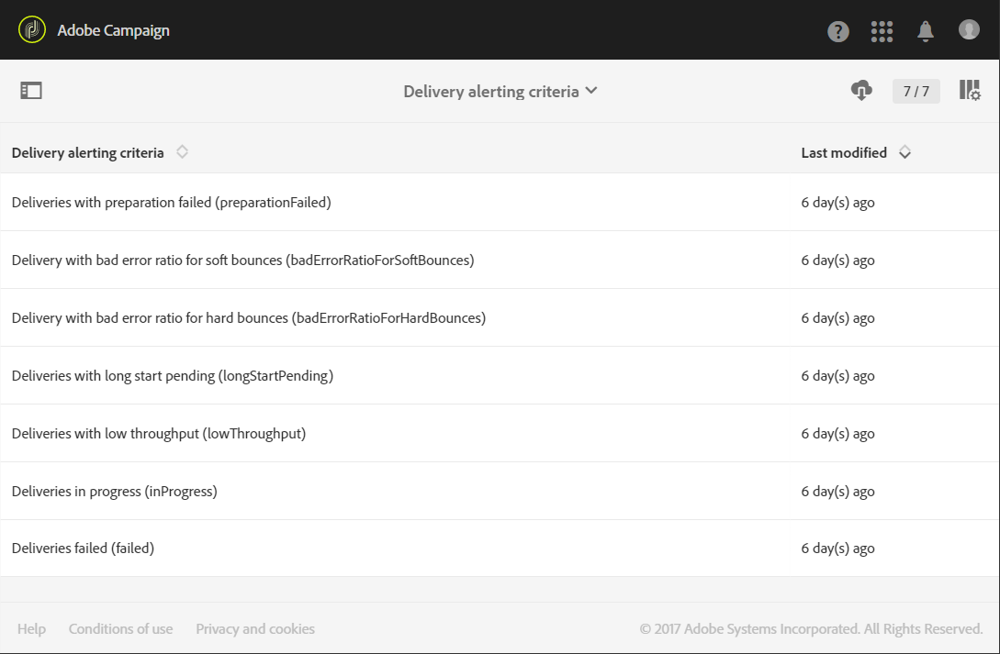

The following criteria can be used in the delivery alerting dashboards:

* **[!UICONTROL Deliveries failed]** : Any delivery scheduled within a defined range, with an erroneous status.
* **[!UICONTROL Deliveries with preparation failed]** : Any delivery modified within a defined range, for which the preparation step (target calculation and content generation) has failed. For more on this, see [Preparing the send](../../sending/using/preparing-the-send.md).
* **[!UICONTROL Delivery with bad error ratio for soft bounces]** : Any delivery scheduled within a defined range, with a status at least **[!UICONTROL In progress]** , with a soft bounce error ratio greater than a defined percentage.
* **[!UICONTROL Delivery with bad error ratio for hard bounces]** : Any delivery scheduled within a defined range, with a status at least **[!UICONTROL In progress]** , with a hard bounce error ratio greater than a defined percentage.
* **[!UICONTROL Deliveries with long start pending]** : Any delivery scheduled within a defined range, with a **[!UICONTROL Start pending]** status for longer than a defined duration, **[!UICONTROL Start pending]** status meaning that the messages have not been taken into account by the system yet.
* **[!UICONTROL Deliveries with low throughput]** : Any delivery started for longer than a defined duration, with less than a defined percentage of processed messages, with a throughput lower than a defined value.
* **[!UICONTROL Deliveries in progress]** : Any delivery scheduled within a defined range, with the **[!UICONTROL In progress]** status.

>[!NOTE]
>
>All the parameters applying to the above criteria have defaults values. These values can be changed in the **[!UICONTROL Criteria parameters]** tab of the delivery alerting dashboards. See [Criteria parameters](../../sending/using/receiving-alerts-when-failures-happen.md#criteria-parameters).

You can select any item from the **[!UICONTROL Delivery alerting criteria]** list to access its details.

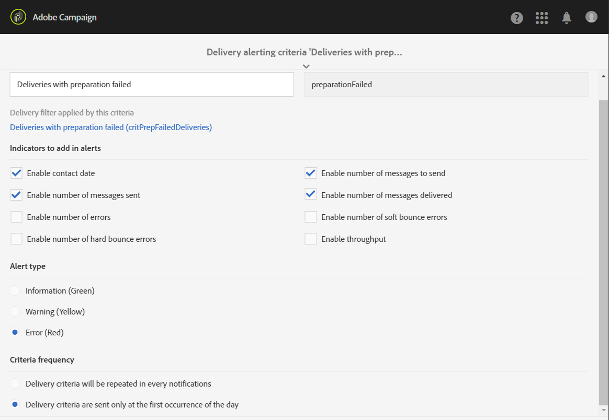

For each criterion, you can define the following settings:

* **[!UICONTROL Indicators to add in alerts]** , meaning the columns that will appear in the notification's **[!UICONTROL Details]** section for the deliveries corresponding to the selected criterion.

  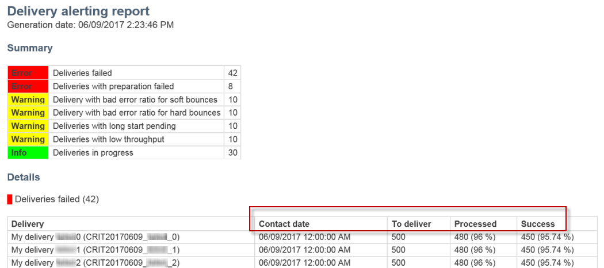

* **[!UICONTROL Alert type]** , meaning the label and the color that will appear next to the delivery criterion in the notification's summary.

  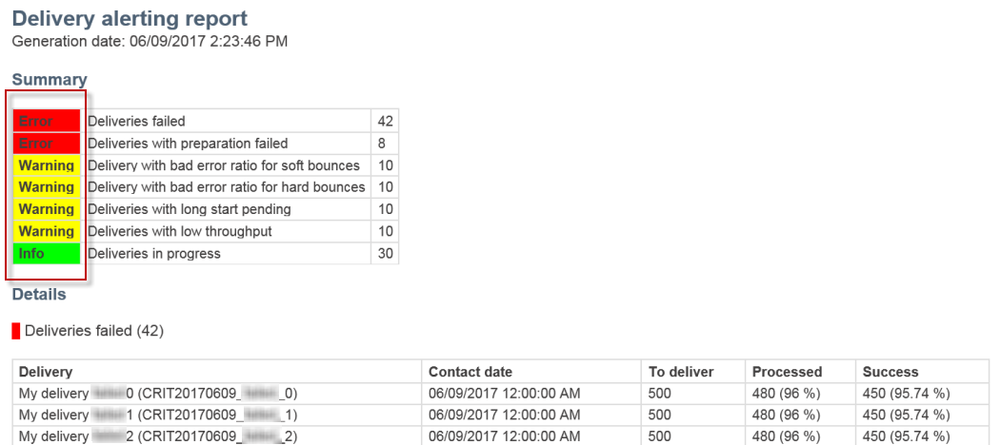

* **[!UICONTROL Criteria frequency]** : If a criterion is met for one delivery, it is repeated in each notification sent within the monitoring period. Otherwise, only one alert will be sent a day (on the first occurrence) by alert criterion for one delivery.

  By default, this option is set to once a day for all criteria.

**Related topics:**

* [Sending logs](../../sending/using/monitoring-a-delivery.md#sending-logs)
* [Alerting frequency](../../sending/using/receiving-alerts-when-failures-happen.md#alerting-frequency)
* [Marketing activity icons and statuses](../../start/using/marketing-activities.md#marketing-activity-icons-and-statuses)

### Creating a delivery alerting criterion {#creating-a-delivery-alerting-criterion}

You can create new delivery alerting criteria to better suit your needs.

For example, you can create a new criterion enabling to send a notification listing all deliveries with a **[!UICONTROL Finished]** status.

To do this, you first need to extend the **Delivery** resource and add a new filter allowing you to select only the deliveries with a **[!UICONTROL Finished]** status.

1. Go to **Adobe Campaign** > **Administration** > **Development** > **Custom resources** and click **[!UICONTROL Create]** .
1. Select **[!UICONTROL Extend an existing resource]** , select the **[!UICONTROL Delivery]** resource from the drop-down list and click **[!UICONTROL Create]** to edit it.

   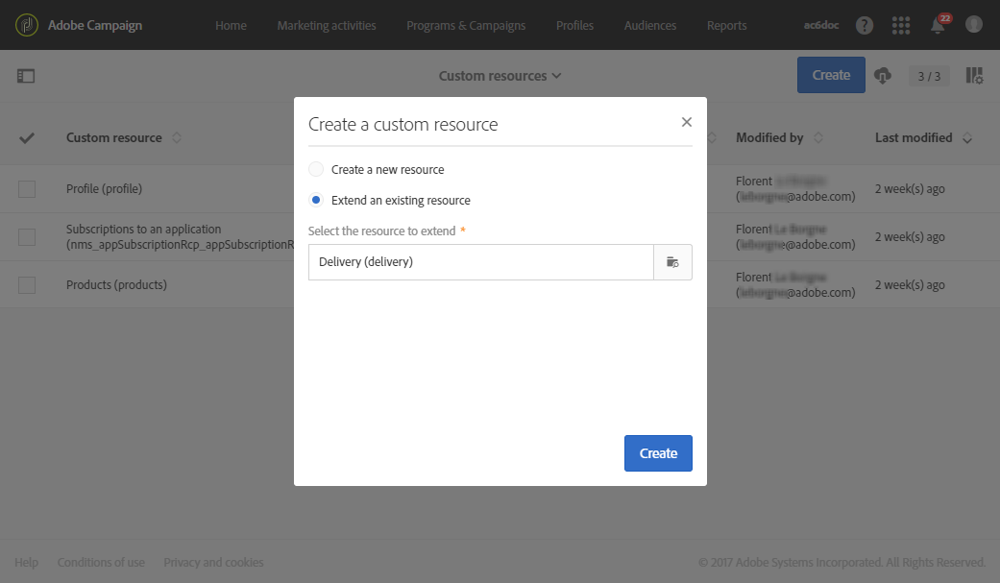

   For more on extending an existing resource, see [Define the resource](../../developing/using/creating-or-extending-the-resource.md).

1. In the **[!UICONTROL Delivery]** resource, go to the **[!UICONTROL Filter definition]** tab and click **[!UICONTROL Add an element]** to create a filter.

   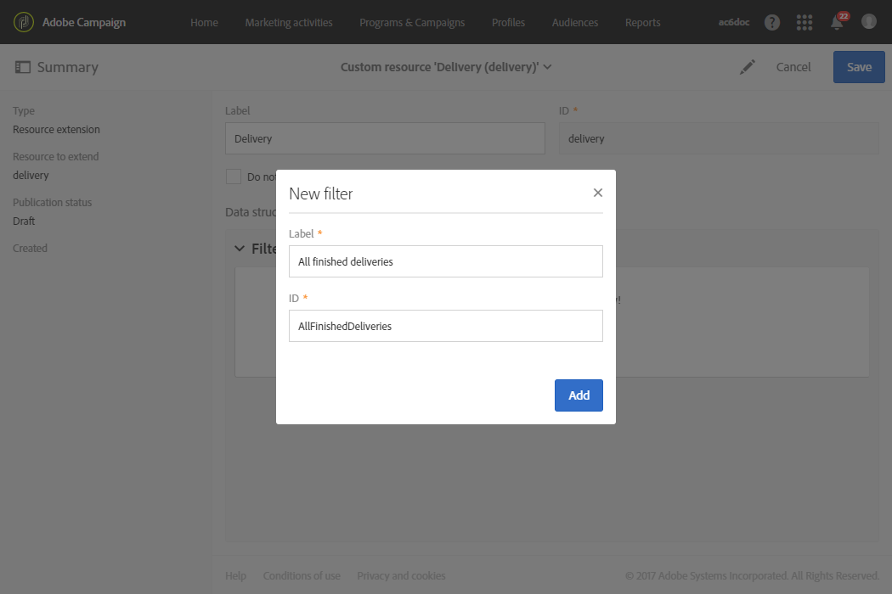

1. Edit the new filter definition: in the **[!UICONTROL Filter definition]** window, drag and drop the **[!UICONTROL Status]** item into the workspace and select **[!UICONTROL Finished]** as the filter condition.

   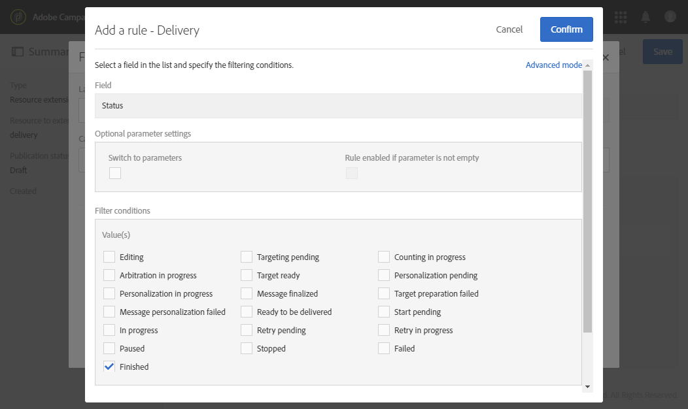

   For more on creating and editing custom filters, see [Define filters](../../developing/using/configuring-filter-definition.md).

1. Save your changes and publish your resources. For more on this, see [Publishing a custom resource](../../developing/using/updating-the-database-structure.md#publishing-a-custom-resource).

   The filter is created and can now be selected in a new delivery alerting criterion.

1. Go to **[!UICONTROL Administration]** > **[!UICONTROL Channels]** > **[!UICONTROL Delivery alerting]** , select **[!UICONTROL Delivery alerting criteria]** and click **[!UICONTROL Create]** .
1. In the **[!UICONTROL Delivery filter applied by this criterion]** drop-down list, select the filter that you just created.

   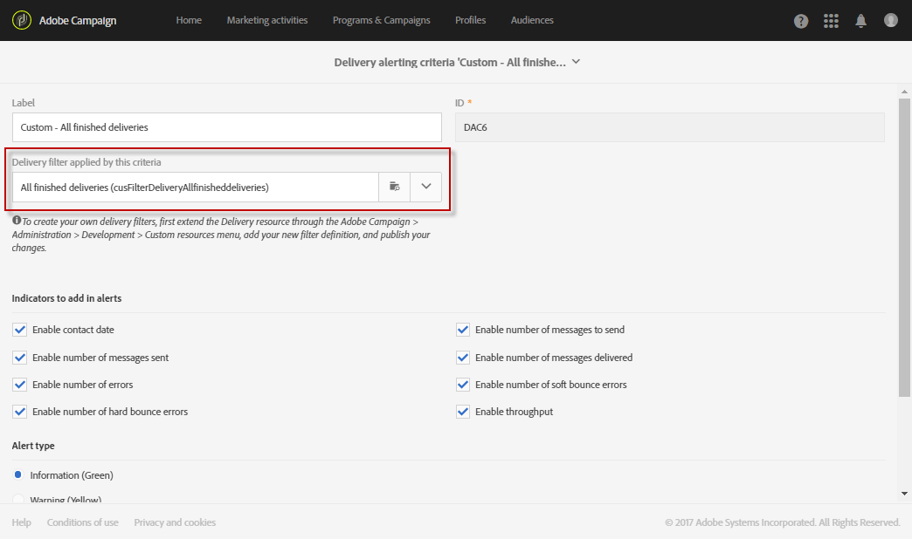

   You can define your criterion's settings the same way as for the default criteria. See [About alerting criteria](../../sending/using/receiving-alerts-when-failures-happen.md#about-alerting-criteria).

Once created, these criteria can be added to a delivery alerting dashboard as well as other criteria. See [About delivery alerting dashboards](../../sending/using/receiving-alerts-when-failures-happen.md#about-delivery-alerting-dashboards).

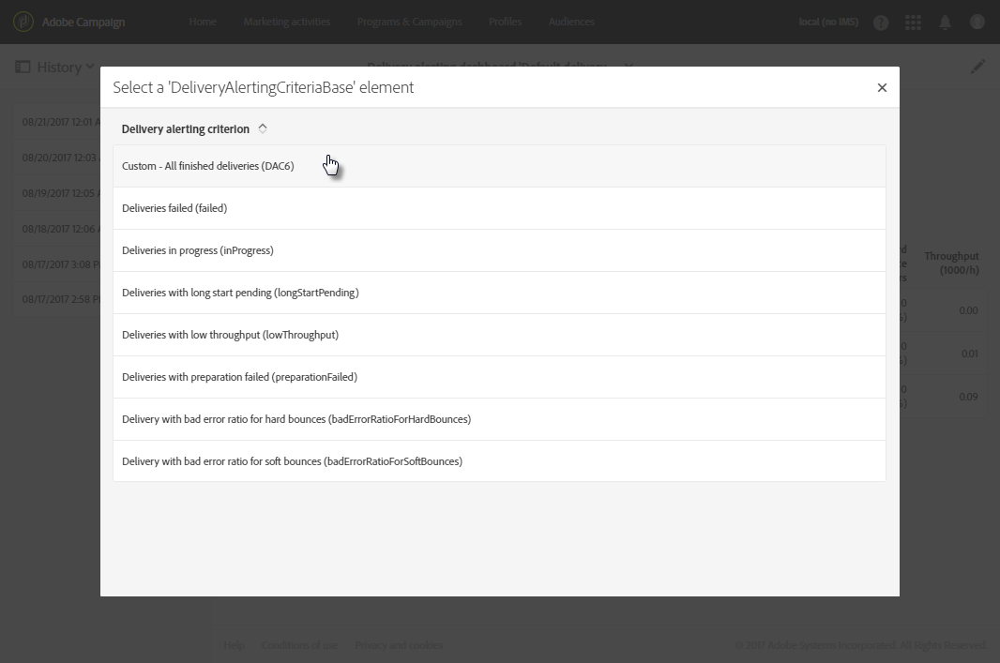

**Related topic:**

[Adding or extending a resource](../../developing/using/key-steps-of-adding-a-resource.md)

## Delivery alerting parameters {#delivery-alerting-parameters}

### Criteria parameters {#criteria-parameters}

In the **[!UICONTROL Criteria parameters]** tab of a [delivery alerting dashboard](../../sending/using/receiving-alerts-when-failures-happen.md#creating-a-delivery-alerting-dashboard), you can define the settings that apply to the criteria selected in this dashboard.

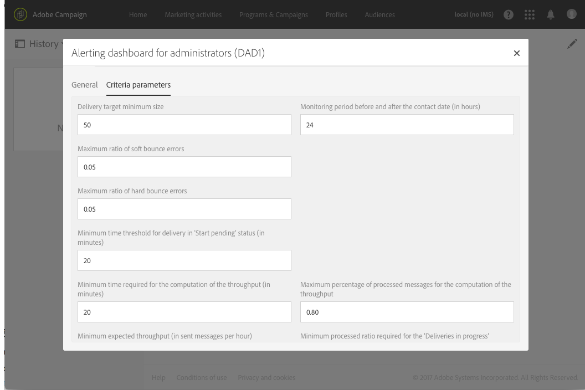

* **[!UICONTROL Delivery target minimum size]** : For example, if you enter 100 in this field, a notification is sent only for deliveries with a target equal to or greater than 100 recipients. This parameter applies to all criteria.
* **[!UICONTROL Monitoring period before and after the contact date (in hours)]** : Number of hours before and after the current time. Only the deliveries having a contact date in this time range are taken into account. This parameter applies to all criteria. By default, the value of this field is set to 24 hours.

  For more information on the contact date, see [About the scheduling](../../sending/using/about-scheduling-messages.md).

* **[!UICONTROL Maximum ratio of soft bounce errors]** : A notification is sent for all deliveries with a soft bounce error ratio greater than the specified value. By default, the value of this field is set to 0.05 (5%).

  For more on soft bounce errors, see [Bounce mail qualification](../../sending/using/understanding-delivery-failures.md#bounce-mail-qualification) and [List of delivery failure types](../../sending/using/understanding-delivery-failures.md#delivery-failure-types-and-reasons).

* **[!UICONTROL Maximum ratio of hard bounce errors]** : A notification is sent for all deliveries with a hard bounce error ratio greater than the specified value. By default, the value of this field is set to 0.05 (5%).

  For more on hard bounce errors, see [Bounce mail qualification](../../sending/using/understanding-delivery-failures.md#bounce-mail-qualification) and [List of delivery failure types](../../sending/using/understanding-delivery-failures.md#delivery-failure-types-and-reasons).

* **[!UICONTROL Minimum time threshold for delivery in 'Start pending' status (in minutes)]** : A notification is sent for all deliveries with a **[!UICONTROL Start pending]** status for longer than the duration specified in this field, **[!UICONTROL Start pending]** status meaning that the messages have not been taken into account by the system yet.
* **[!UICONTROL Minimum time required for the computation of the throughput (in minutes)]** : Only deliveries started (with **[!UICONTROL In progress]** status) for more than the specified duration are taken into account for the **[!UICONTROL Deliveries with low throughput]** criterion.
* **[!UICONTROL Maximum percentage of processed messages for the computation of the throughput]** : Only deliveries with a percentage of processed messages lower than the specified percentage are taken into account for the **[!UICONTROL Deliveries with low throughput]** criterion.
* **[!UICONTROL Minimum expected throughput (in sent messages per hour)]** : Only deliveries with a throughput lower than the specified value are taken into account for the **[!UICONTROL Deliveries with low throughput]** criterion.
* **[!UICONTROL Minimum processed ratio required for 'Deliveries in progress' criterion]** : Only deliveries with a percentage of processed messages higher than the specified percentage are taken into account.

### Alerting frequency {#alerting-frequency}

The **[!UICONTROL Frequency of delivery alerting]** option allows to define the delay between two alert sendings. By default, it is set to 10 minutes.

You can change this setting through the **[!UICONTROL Administration]** > **[!UICONTROL Application settings]** > **[!UICONTROL Options]** menu.

>[!NOTE]
>
>This option applies to all dashboards defined in Adobe Campaign. You cannot set a specific frequency for each dashboard.

## Delivery alerting reasons {#delivery-alerting-reasons}

The **Delivery alerting** feature keeps all of your involved Adobe Campaign users automatically informed about the delivery execution status, via email and dashboard.

Now when you receive a delivery alerting notification, here are a few tips on what you can do.

First of all, check the delivery's **Log** tab to view all information relating to the delivery and proofs. The red and yellow icons allow you to identify errors or warnings. The red icon indicates a critical error that prevents the delivery from being started.

To view the history of every occurrence of a delivery, select the **[!UICONTROL Sending logs]** tab. It contains the list of sent messages and their statuses. There you can check the delivery status for each recipient ( **[!UICONTROL Sent]** , **[!UICONTROL Pending]** , **[!UICONTROL Failed]** , etc.). For more on this, see [Sending logs](../../sending/using/monitoring-a-delivery.md#sending-logs).

Here are a few possible reasons for receiving alerting notifications according to the criteria that are met for a delivery.

* **[!UICONTROL Deliveries failed]** : This criterion informs you of all deliveries with an erroneous status. It can be due to:

    * A problem with the delivery server (MTA, Message Transfer Agent)
    * A connection time-out between the Adobe Campaign delivery server and the receiving server
    * A deliverability issue
    * An erroneous workflow

  If the delivery is triggered with a workflow, check if that workflow was correctly started. For more on this, see [Executing a workflow](../../automating/using/executing-a-workflow.md). Otherwise, get in touch with your Adobe Campaign administrator to solve the issue.

* **[!UICONTROL Deliveries with preparation failed]** : An error can occur during delivery preparation in the following cases:

    * The delivery is missing a subject.
    * There is a wrong syntax in the personalization fields.
    * The target is missing.
    * The delivery exceeds the size limit.

  For more on this, see [Preparing the send](../../sending/using/preparing-the-send.md). However, these errors are generally spotted during the message analysis. See [Control rules](../../administration/using/control-rules.md).

* The possible causes for a **[!UICONTROL Delivery with bad error ratio for soft bounces]** alert can be:

    * The recipient's server is down.
    * The recipient's mailbox is full.

  For more information, check the **[!UICONTROL Exclusion logs]** and **[!UICONTROL Exclusion causes]** tabs of the delivery logs. See [Exclusion logs](../../sending/using/monitoring-a-delivery.md#exclusion-logs).

  The possible causes for a **[!UICONTROL Delivery with bad error ratio for hard bounces]** alert can be:

    * The recipient is blacklisted, meaning that they no longer want to be contacted.
    * The recipient's email address does not exist.
    * The recipient's domain does not exist.
    * The recipient's server is blocking the delivery.

  To avoid soft and hard bounce errors, follow the best practices below:

    * Build filtering typology rules to exclude one part of the message target during the delivery analysis, such as quarantined recipients. See [Creating a filtering rule](../../administration/using/filtering-rules.md).
    * Regularly update your customer database to maintain good quarantine management processes. See [About quarantines](../../sending/using/understanding-quarantine-management.md#about-quarantines).
    * Generally speaking, improve deliverability the best as you can. See the Adobe Campaign v7 [Managing deliverability](http://docs.campaign.adobe.com/doc/AC/getting_started/EN/deliverability.html) detailed guide and contact your Adobe Campaign administrator for assistance.

* **[!UICONTROL Deliveries with long start pending]** : Usually this means that there is a problem at the MTA's (Message Transfer Agent) level. The execution process is waiting on the availability of some resources. The MTA may have not been started.

  **[!UICONTROL Deliveries with low throughput]** : Again, this is a deliverability issue meaning that the MTA is too slow.

  For more on these issues, get in touch with your Adobe Campaign administrator.

**Related topics:**

* [Understanding delivery failures](../../sending/using/understanding-delivery-failures.md)
* [Understanding quarantine management](../../sending/using/understanding-quarantine-management.md)
* [Managing blacklisting in Campaign](../../audiences/using/about-opt-in-and-opt-out-in-campaign.md)

