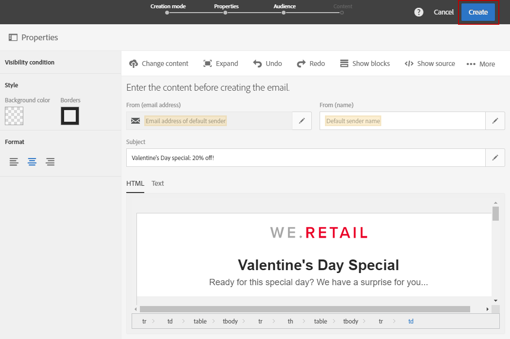
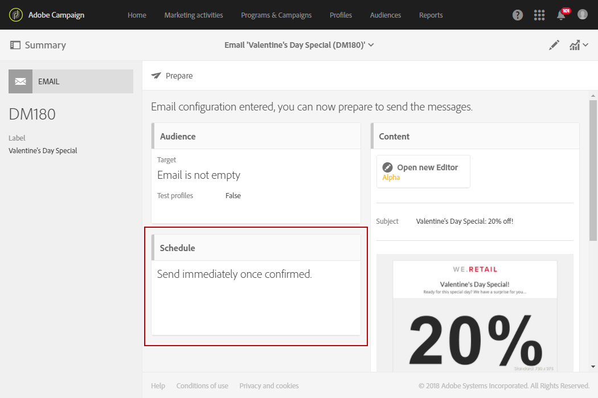
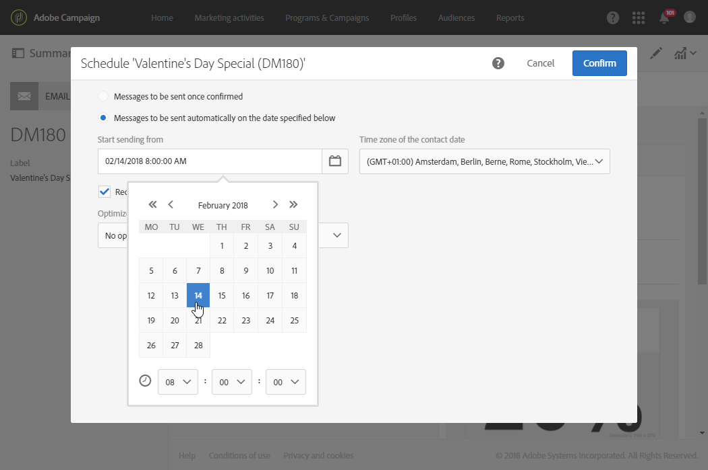
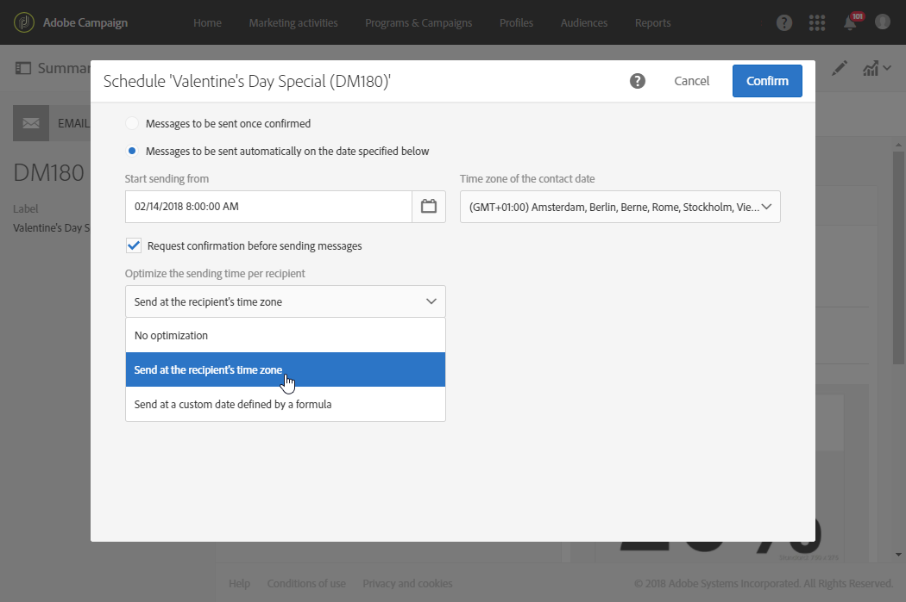
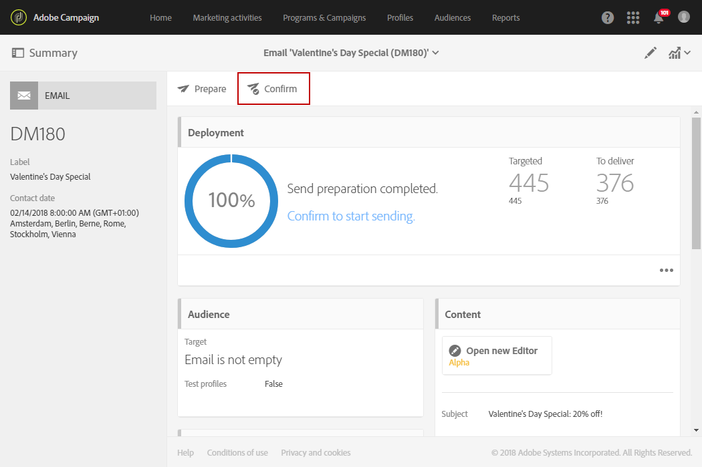

# Sending messages at the recipient's time zone{#sending-messages-at-the-recipient-s-time-zone}

When managing a campaign in which the date and time are important, you can schedule a delivery that takes each recipient's local time into account: they will receive email, SMS or push noftfications at the time you scheduled, in their own time zone.

>[!NOTE]
>
>To use this functionality, make sure that all profiles targeted by your delivery have a time zone specified in the **[!UICONTROL Address]** section of their properties. For more information on accessing profile properties, refer to this [section](../../audiences/using/editing-profiles.md).

To send a delivery at the recipient's time zone, you can also use the **[!UICONTROL Scheduler]** activity in a workflow. For more on this, refer to this [page](../../automating/using/scheduler.md).

In the following example, we want to send a promotional code that is only valid on Valentine's Day to all customers around the world. To provide sufficient time to use it during the day, all customers must receive your message on February 14th at 8:00 AM depending on their time zones.

1. In the **[!UICONTROL Marketing activities]** tab, start creating your delivery, in our case an email. To learn more on delivery creation, refer to this [section](../../channels/using/creating-an-email.md).
1. After designing your Valentine's Day email, click **[!UICONTROL Create]** to access the delivery dashboard. For more on email designing, refer to this [page](../../designing/using/personalization.md#example-email-personalization).

   

1. From the delivery dashboard, select the **[!UICONTROL Schedule]** block.

   

1. Select the **[!UICONTROL Messages to be sent automatically on the date]** option specified below. Then in the **[!UICONTROL Start sending from]** field, set the contact date, in our case February 14th at 8:00 AM so that every recipient receives it on Valentine's Day.

   

1. In the **[!UICONTROL Time zone of the contact date]** field, select at which time zone your delivery should be sent by default.

   If a profile's **[!UICONTROL Time zone]** is left as **[!UICONTROL Default]**, the recipients will receive the delivery depending on the chosen time zone here.

1. From the **[!UICONTROL Optimize the sending time per recipient]** drop-down menu, choose **[!UICONTROL Send at the recipient's time zone]**. This allows recipients to receive the Valentine's day email on the 14 of February depending on their time zone.

   

1. After confirming your schedule for your delivery, click the **[!UICONTROL Prepare]** button then **[!UICONTROL Confirm]** your delivery.

   Make sure to confirm the send at least 24 hours in advance. Otherwise, depending on their locations, some recipients might receive the delivery before the actual Valentine's day event.

   

No matter where they are located, all recipients will receive the message on February 14th at 8:00 AM their local time.
