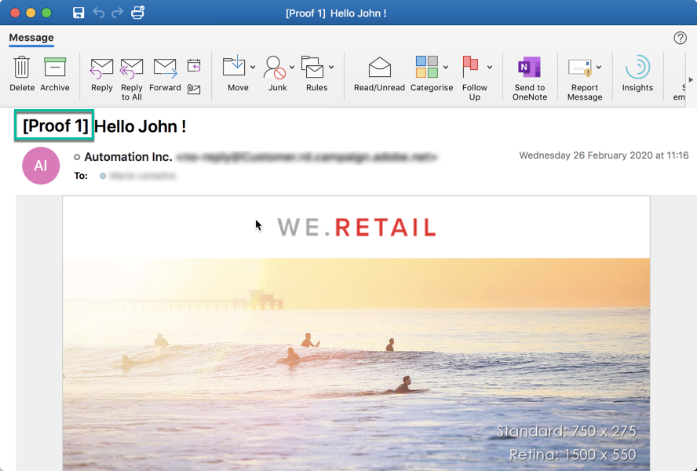
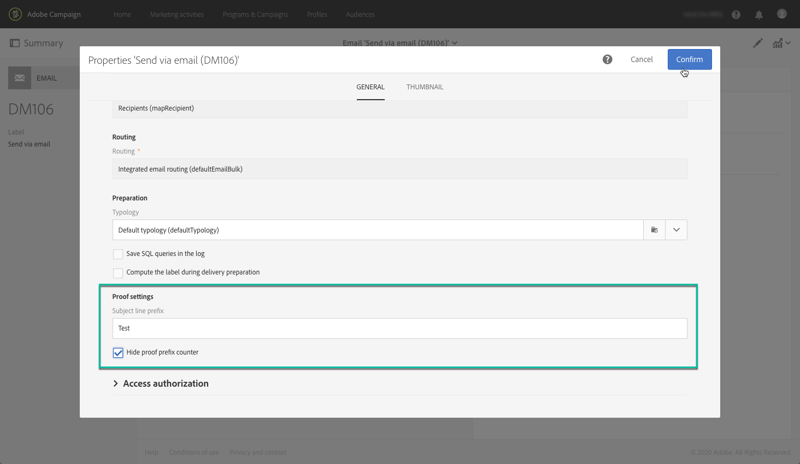

# Sending proofs {#sending-proofs}

## About proofs {#about-proofs}

A proof is a specific message that allows you to test a message before sending it to the main target. Recipients of the proof are in charge of approving the message (its content and form).

There are two types of proof recipients:

* **Test profiles** allow you to target additional recipients who do not match the defined targeting criteria.

   They can be added to a message's audience to detect any fraudulent use of your recipient database or to ensure the emails arrive in the inboxes. For more on this, see [Managing test profiles](../../audiences/using/managing-test-profiles.md).

   >[!NOTE]
   >
   >In order to send a proof, the test profiles must be included in your message's audience.

* **Substitution profiles** allow you to place yourself in the position of one of the targeted profiles and to get an exact representation of the message that the profile will receive. For more on this, see [Testing email messages using targeted profiles](../../sending/using/testing-messages-using-target.md).

   >[!NOTE]
   >
   >This feature is available for the email channel only.

## Sending a proof {#sending-a-proof}

To send proofs, follow these steps:

1. Make sure the proofs recipients have been configured:
   * **Test profiles** must be included in your message's audience.
   * **Substitution profiles** must be added once the message preparation has been successful (see [this section](../../sending/using/testing-messages-using-target.md)).

1. Click the **[!UICONTROL Send a test]** button.

   

1. Select the type of proof you would like to use:

    * **[!UICONTROL Email rendering]**: select this option to test the way your message is received according to the inboxes targeted. For more information, refer to [Email rendering](../../sending/using/email-rendering.md).
    * **[!UICONTROL Proof]**: select this option to test the message before sending it to the main target. The proof recipients are in charge of approving the delivery, by checking both its content and its format.
    * **[!UICONTROL Proof + Email rendering]**: this option combines the two previous options.

   

   >[!NOTE]
   >
   >Email rendering is available with test profiles only. If no test profiles have been added to the message, only the **[!UICONTROL Proof]** option will be available for selection.

1. Confirm your choice.

   The proofs are sent to the recipients that have been configured.

   

1. You can view your proofs using the **[!UICONTROL Proofs]** drop-down list.

   

1. Select a proof to access its summary. For an email, if you have selected the **Email rendering** option as the proof type, the **[!UICONTROL Access email rendering]** icon is displayed on the right of the proof label. See [Email rendering](../../sending/using/email-rendering.md).

   

Depending on the comments from the people who receive the proof, you may be asked to modify the delivery's content. Once the modifications have been carried out, you have to restart email preparation then re-send a proof. Each new proof can be accessed using the **[!UICONTROL Show proofs]** button.

You have to send as many proofs as necessary until you have finalized the content of your delivery. Once this is done, you can send the delivery to the main target and close the approval cycle.

## Configuring proofs' subject line {#configuring-proofs-subject-line}

When a proof is sent, its subject line is configured by default with the **"Proof"** prefix, as well as a counter indicating the proof's number.

   

To change the default subject line to use, follow these steps:

1. In the message dashboard, Click the **[!UICONTROL Open properties]** button.
1. In the **[!UICONTROL Advanced parameters]** section, define the prefix that you want to use by default in the subject line.

  To hide the proof's number in the subject line, activate the **[!UICONTROL Hide proof prefix counter]** option.

   >[!NOTE]
   >
   >If you want to hide the entire proof prefix, leave the **[!UICONTROL Subject line prefix]** field blank.

   

1. Click **[!UICONTROL Confirm]**. The settings will be applied by default to all the proofs sent for the selected message.

**Related topic:**

* [Sending a test, preparing and sending an email](../../sending/using/get-started-sending-messages.md#video) video
* [Testing email messages using targeted profiles](../../sending/using/testing-messages-using-target.md)
* [Managing test profiles](../../audiences/using/managing-test-profiles.md)
* [Previewing messages](../../sending/using/previewing-messages.md)
* [Configuring email channel](../../administration/using/configuring-email-channel.md)
