# Testing email messages using targeted profiles {#testing-message-profiles}

## Overview {#overview}

Additionally to [test profiles](../../audiences/using/managing-test-profiles.md), you can test an email message by placing yourself in the position of one of the targeted profiles. This allows you to get an exact representation of the message that the profile will receive (custom fields, dynamic and personalized information, including additional data from workflows...).

>[!NOTE]
>
> This feature is available with email messages only.

The main steps are as follows:

1. Configure your message then launch the **Preparation** phase.
1. **Select one or several profiles** among the profiles targeted by the message.
1. Associate with each profile a **substitution address** to which proofs will be sent.
1. (optional) For each profile, define a **prefix** to add to the proof subject line.
1. **Preview** in the Email Designer how the message will display for the profiles.
1. Send the proofs.

>[!IMPORTANT]
>
>This feature allows you to send profile personal information to external email addresses. Keep in mind that executing privacy requests (GDPR & CCPA) in Campaign Standard WILL NOT execute that request externally.

 [Discover this feature in video](#video)

## Selecting profiles and substitution addresses {#selecting-profiles}

To use targeted profiles for testing, you must first select them, then define the substitution addresses that will receive the proofs. To do this, you can either [select specific profiles](#selecting-individual-profiles) among the targeted profiles, or [import profiles from an existing audience](#importing-from-audience).

>[!NOTE]
>
>You can select a maximum of 100 profiles for testing.

### Selecting individual profiles {#selecting-individual-profiles}

1. In the message dashboard, make sure that the message preparation is successful, then click the **[!UICONTROL Audience]** block.

    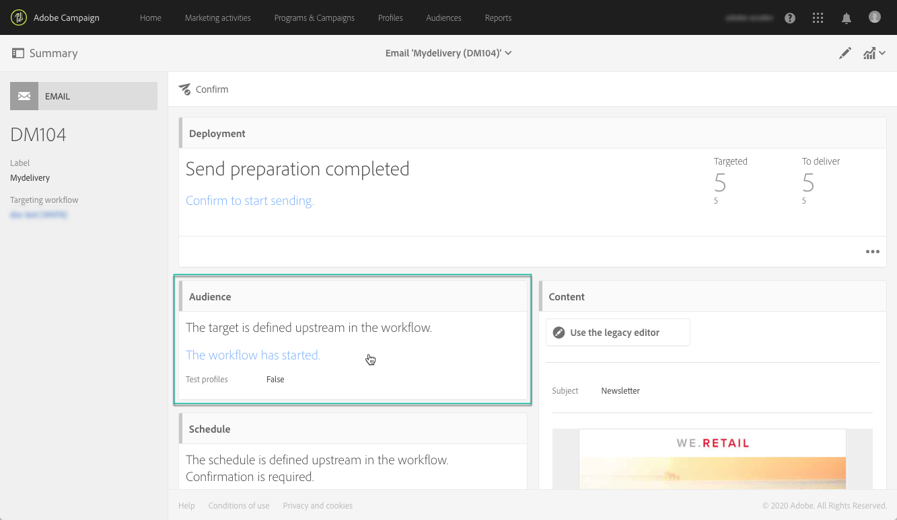

1. In the **[!UICONTROL Profile substitutions]** tab, click the **[!UICONTROL Create element]** button to select the profiles to use for testing.

   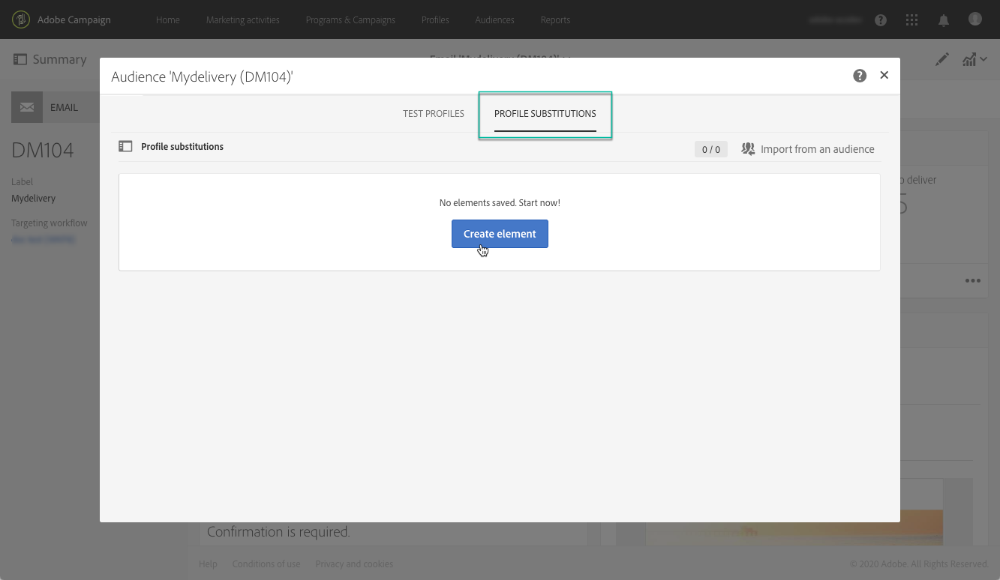

1. Click the profile selection button to display the list of profiles targeted by the message.

    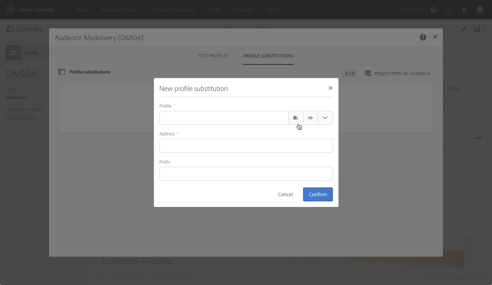

1. Select the profile to use for testing, then enter in the **[!UICONTROL Address]** field the desired substitution address, then click **[!UICONTROL Confirm]**. All proofs targeting the profile will be sent to this email address, rather than to the one defined in the database for this profile.

    If you want to add a specific prefix to the proofs' subject line, fill in the **[!UICONTROL Subject line prefix]** field.

    >[!NOTE]
    >
    >The subject line prefix can contain up to 500 characters.

    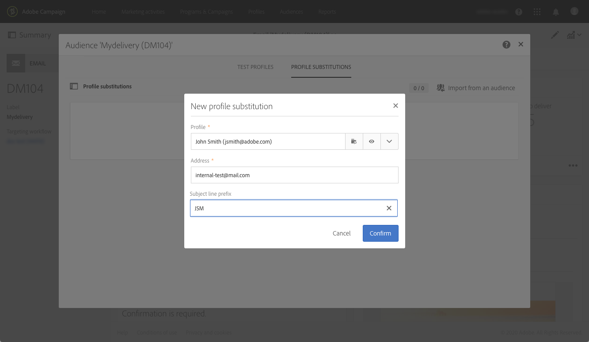

    The prefix will display as below:

    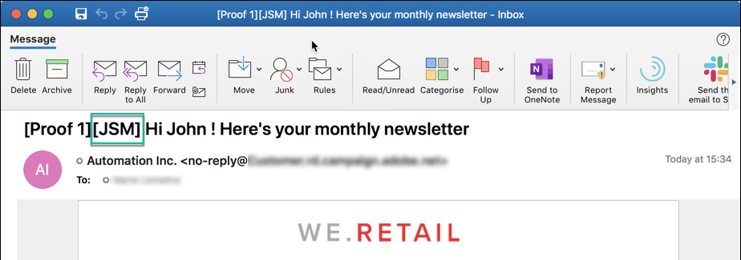

1. The profile is added to the list, with its associated substitution address and prefix. Repeat the above steps for all the profiles that you want to use for testing, then click **[!UICONTROL Confirm]**.

      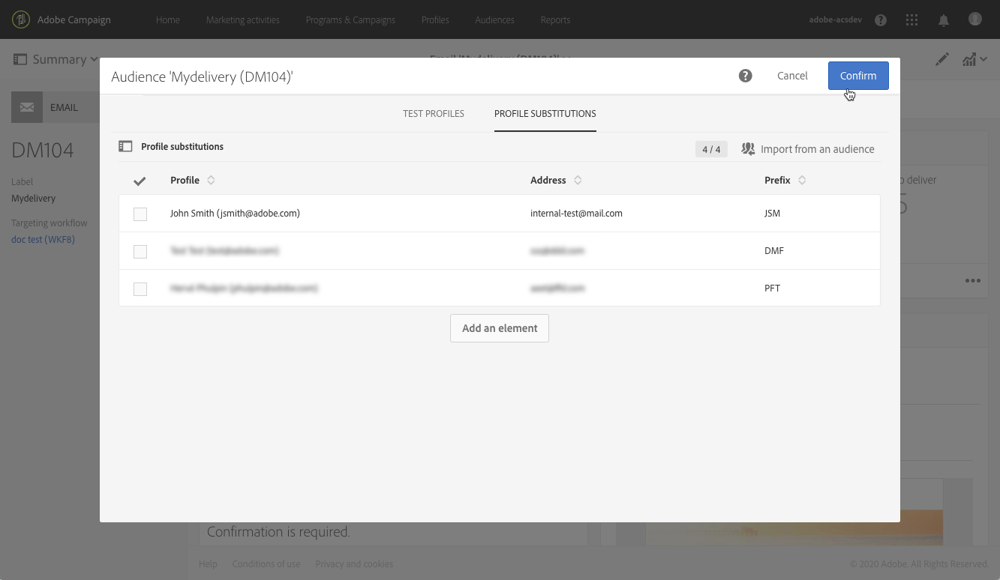

    If you want to send a proof to multiple substitution addresses for a same profile, you must add this profile as many times as required.

    In the example below, the proof based on the profile John Smith will be sent to two different substitution addresses:

    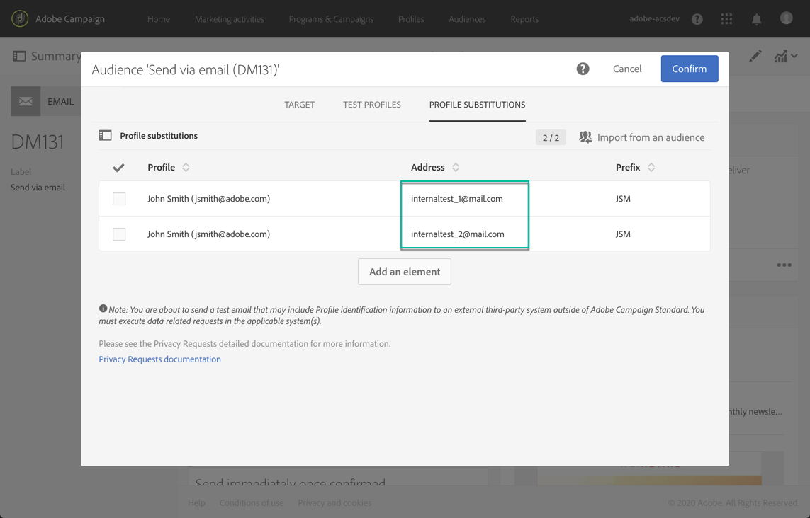

1. Once all profiles and substitution addresses are defined, you can send a proof to test the message. To do this, click the **[!UICONTROL Test]** button, then select the type of test to perform.

     Note that if no test profile has been added to the message target, the **[!UICONTROL Email rendering]** and **[!UICONTROL Proof + Email rendering]** options are not available.  For more information on proofs sending, refer to [this section](../../sending/using/sending-proofs.md).

    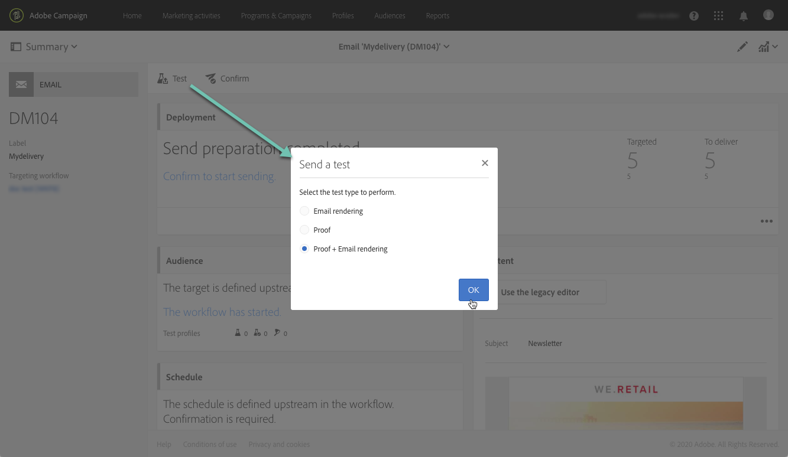

>[!IMPORTANT]
>
>If you make any change to your message, make sure you launch the message preparation again. Otherwise, the changes will not be reflected in the proof.

### Importing profiles from an audience {#importing-from-audience}

Campaign Standard allows you to import an audience of profiles that you can use for testing. This allows you, for example, to send to a unique email address an entire set of messages targeting different profiles.

Moreover, if your audience is already configured with the address and prefix columns, you will be able to import these information in the **[!UICONTROL Profile substitutions]** tab. An example of audience import with substitution addresses is detailed in [this section](#use-case).

>[!NOTE]
>
>When importing an audience, only the profiles corresponding to the message target are selected and added to the **[!UICONTROL Profile substitutions]** tab.

To import profiles to use for testing from an audience, follow these steps:

1. In the message dashboard, make sure that the message preparation has been successful, then click the **[!UICONTROL Audience]** block.

    

1. In the **[!UICONTROL Profile substitutions]** tab, click **[!UICONTROL Import from an audience]**.

   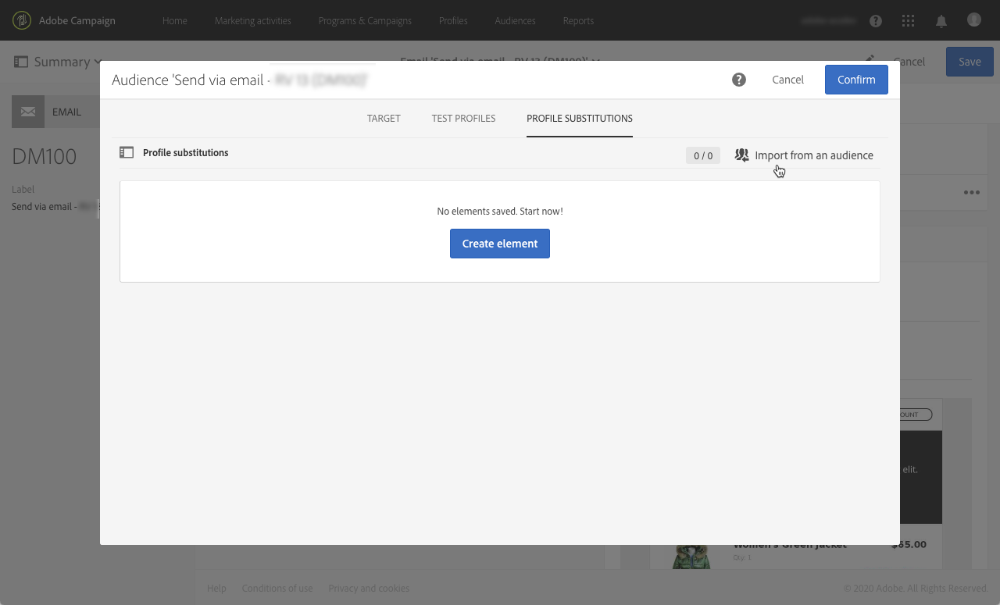

1. Select the audience to use, then enter the substitution address and the prefix to use for the proofs sent to the audience.
    
    >[!NOTE]
    >
    >The subject line prefix can contain up to 500 characters.

    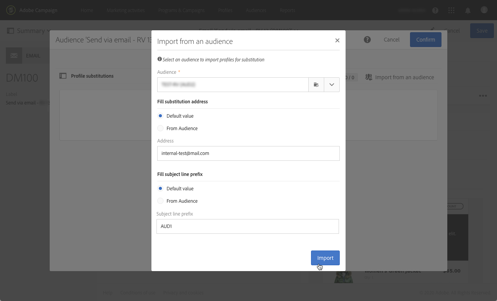

    If the substitution addresses and/or prefixes to use have already been defined in your audience, select the **[!UICONTROL From Audience]** option, then specify the column to use to retrieve these information.

    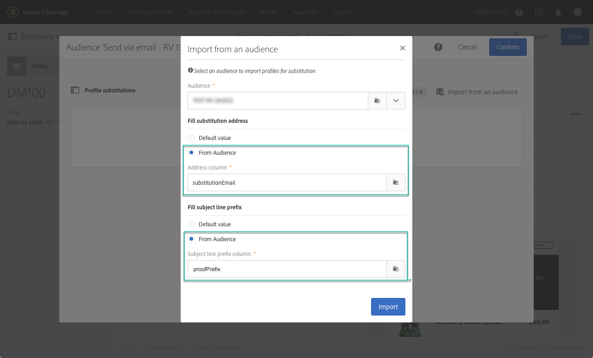

1. Click the **[!UICONTROL Import]** button. The profiles from the audience corresponding to the message target are added to the **[!UICONTROL Profile substitution]** tab, as well as the associated substitution addresses and prefixes.

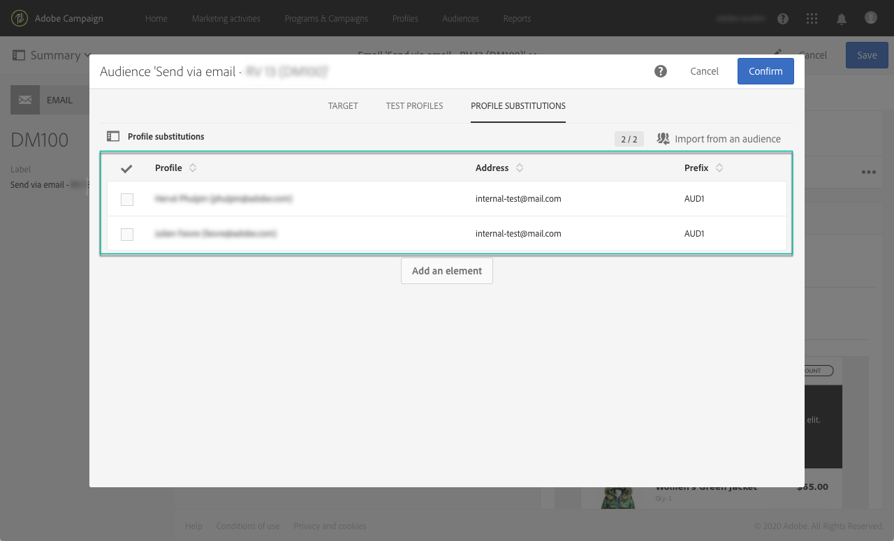

>[!NOTE]
>
>If you import the same audience once again, with different substitution addresses and/or prefixes, the profiles will be added to the list in addition to those from the previous import.

## Previewing the message with targeted profiles

>[!NOTE]
>
>Preview is available with the Email Designer only.

To be able to preview messages using targeted profiles, make sure you have added these profiles to the **[!UICONTROL Profile substitution]** list (see [Defining profiles and substitution addresses](#selecting-profiles)).

If you want to use personalization fields in the message, they must be added **before** launching the message preparation. Otherwise, they will not be taken into account in the preview. As a result, make sure you launch the message preparation again if any change is made to the personalization fields.

To preview messages using profile substitution, follow these steps:

1. In the message dashboard, click the content snapshot to open the message in the Email Designer.

    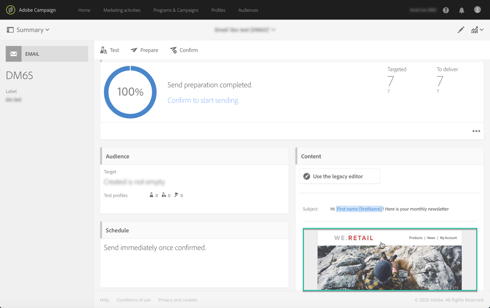

1. Select the **[!UICONTROL Preview]** tab, then click **[!UICONTROL Change profile]**.

    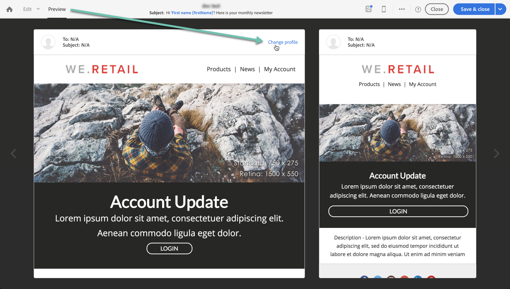

1. Click the **[!UICONTROL Profile Substitution]** tab to display the substitution profiles that have been added for testing.

    Select the profiles that you want to use for preview, then click **[!UICONTROL Select]**. 

    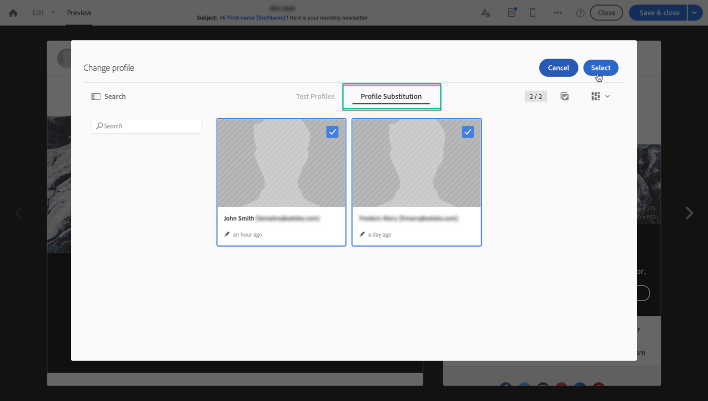

1. A preview of the message displays. Use the arrows to navigate between the selected profiles.

    

## Use case {#use-case}

In this use case, we want to send to a set of specific profiles a personalized email newsletter. Before sending the newsletter, we want to preview it using some of the targeted profiles, and send proofs to internal email addresses defined in an external file.

The main steps for this use case are as follows:

1. Create the audience to use for testing.
1. Build a workflow to target profiles and send the newsletter.
1. Configure the message's profile substitutions.
1. Preview the message using targeted profiles.
1. Send proofs.

### Step 1: Create the audience to use for testing

1. Prepare the file to import to create the audience. In our case, it should contain the substitution address to use for the proof, and a prefix to add into the proof's subject line.

    In this example, the "oliver.vaughan@internal.com" email address will receive a proof of the message targeting the profile with the "john.doe@mail.com" email address. The"JD" prefix will be added to the proof's subject line.

    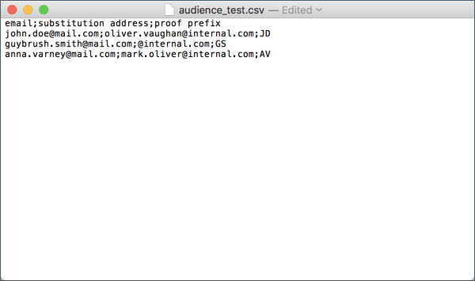

1. Build the workflow to create an audience from the file. To do this, add and configure the activities below:

    * **[!UICONTROL Load file]** activity: Imports the CSV file (for more on this activity, refer to [this section](../../automating/using/load-file.md)).
    * **[!UICONTROL Reconciliation]** activity: Links information from the file to information from the database. In this example, use the profile's email address as reconciliation field  (for more on this activity, refer to [this section](../../automating/using/reconciliation.md)).
    * **[!UICONTROL Save audience]** activity: Creates an audience based on the imported file (for more on this activity, refer to [this section](../../automating/using/save-audience.md)).

    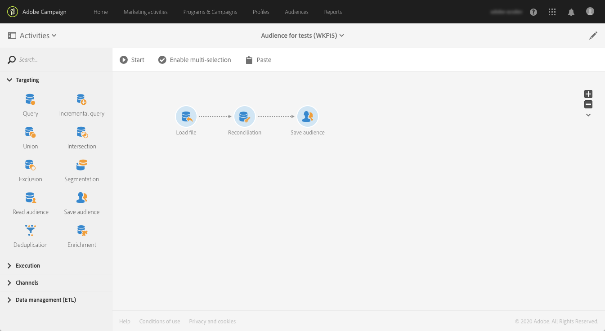

1. Run the workflow, then go to the **[!UICONTROL Audiences]** tab to check that the audience has been created with the desired information.

    In this example, the audience is made up of three profiles. Each of them is linked to a substitution email address that will receive the proof, with a prefix to use in the proof's subject line.

    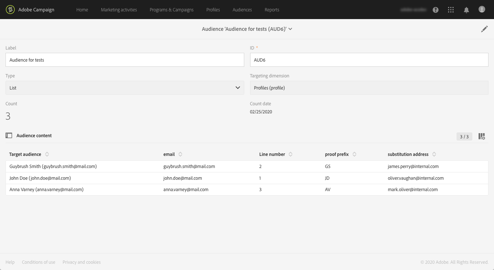

### Step 2: Build a workflow to target profiles and send the newsletter

1. Add **[!UICONTROL Query]** and **[!UICONTROL Email delivery]** activities, then configure them according to your needs (see [Query](../../automating/using/query.md) and [Email delivery](../../automating/using/email-delivery.md) sections).

    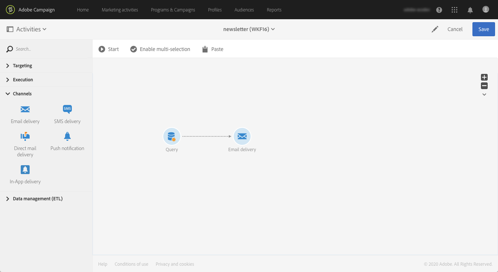

1. Run the workflow and make sure that the message preparation is successful.

### Step 3: Configure the message's Profile substitution tab

1. Open the **[!UICONTROL Email delivery]** activity. In the message dashboard, click the **[!UICONTROL Audience]** block.

    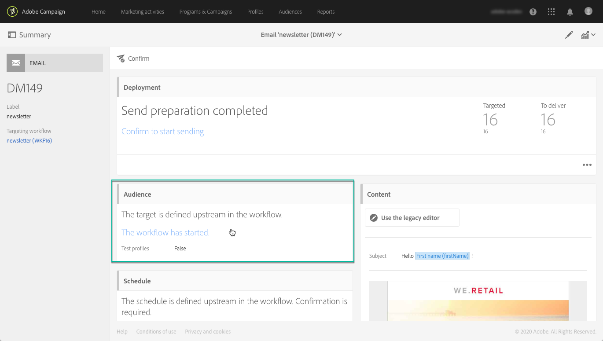

1. Select the **[!UICONTROL Profile substitutions]** tab, then click **[!UICONTROL Import from an audience]**.

    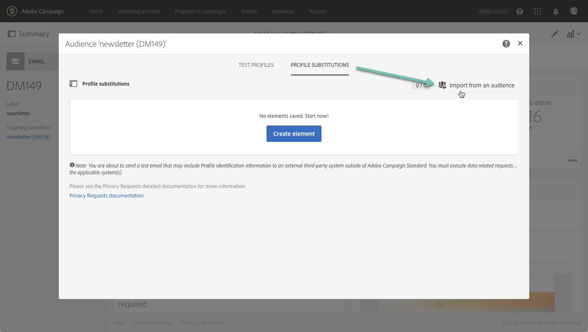

1. In the **[!UICONTROL Audience]**  field, select the audience created from the file.

    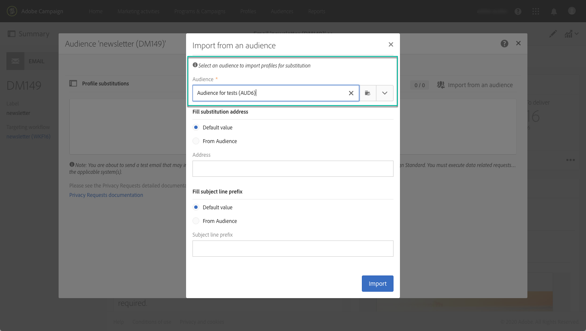

1. Define the substitution address and subject line prefix to use when sending the proofs.

    To do this, select the **[!UICONTROL From audience]** option, then select the column from the audience that contains the information.

    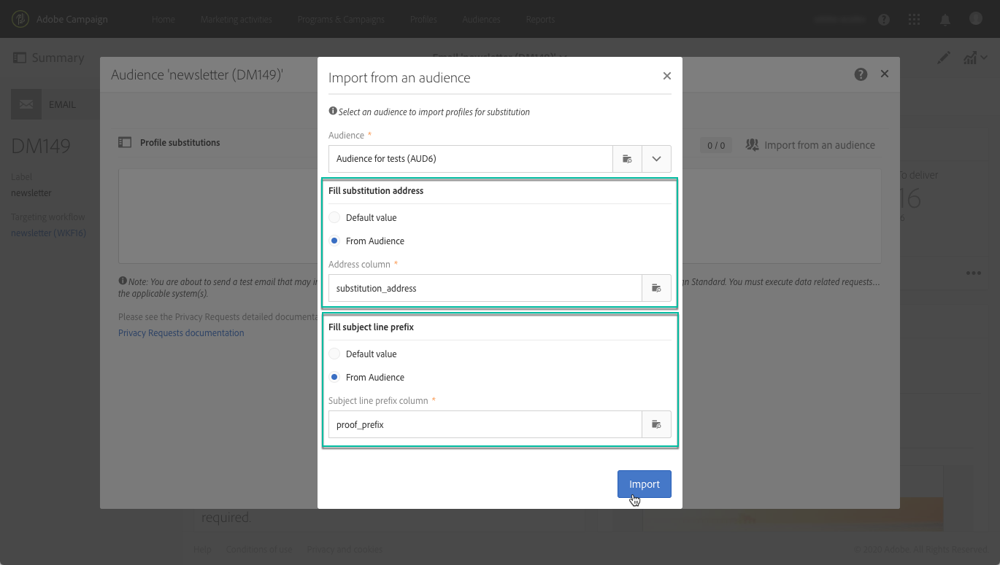

1. Click the **[!UICONTROL Import]** button. Profiles from the audience are added to the list, with their associated substitution addresses and subject line prefixes.

    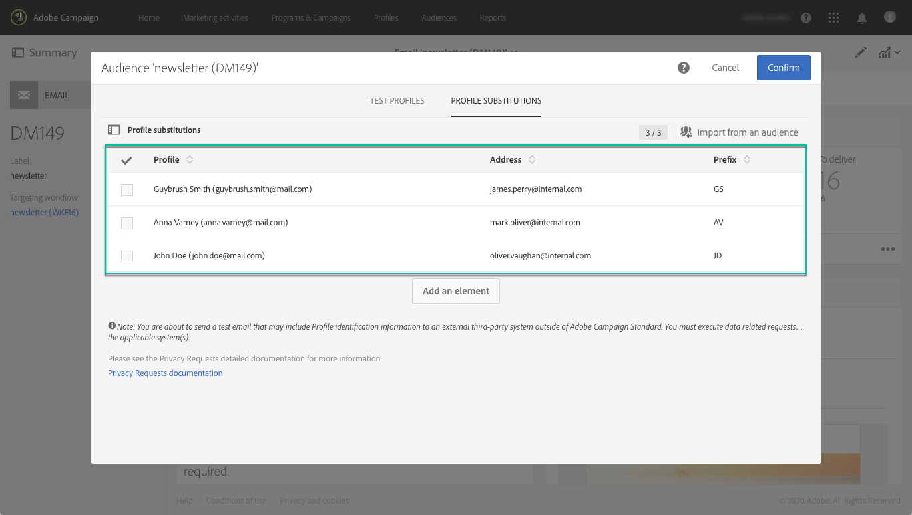

    >[!NOTE]
    >
    >In our case, all profiles from the audience are targeted by the **[!UICONTROL Query]** activity. If one of these profiles was not part of the message target, it would not be added to the list.

### Step 4: Preview the message using targeted profiles

1. In the message dashboard, click the content snapshot to open the message in the Email Designer.

    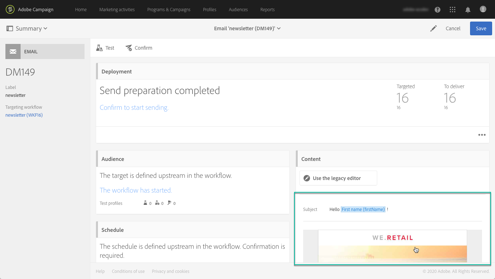

1. Select the **[!UICONTROL Preview]** tab, then click **[!UICONTROL Change profile]**.

    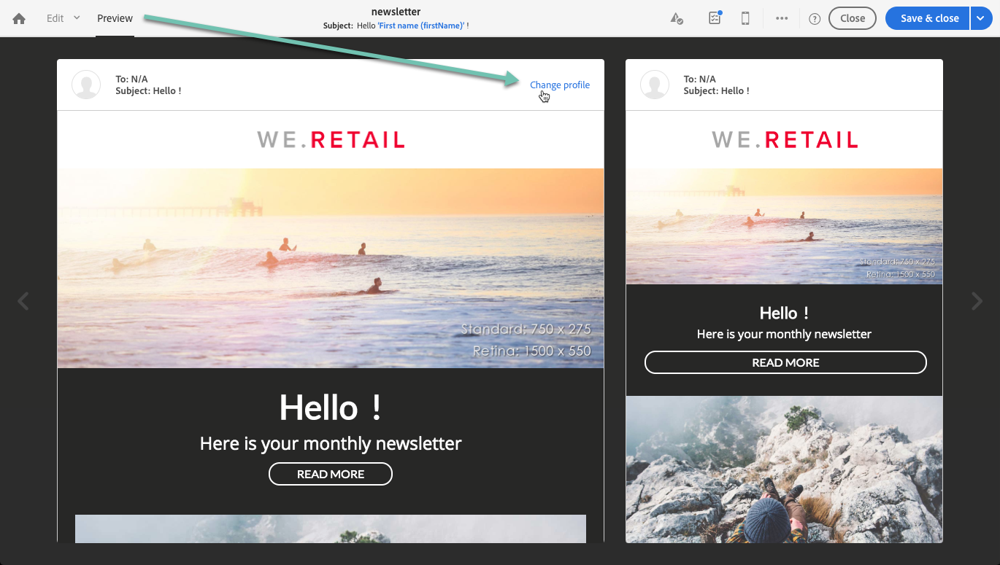

1. Click the **[!UICONTROL Profile Substitution]** tab to display the substitution profiles that have been added previously.

    Select the profiles that you want to use for preview, then click **[!UICONTROL Select]**.

    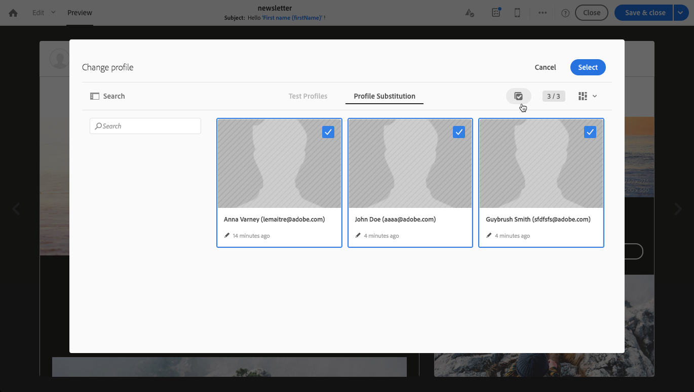

1. A preview of the message displays. Use the arrows to navigate between the selected profiles.

    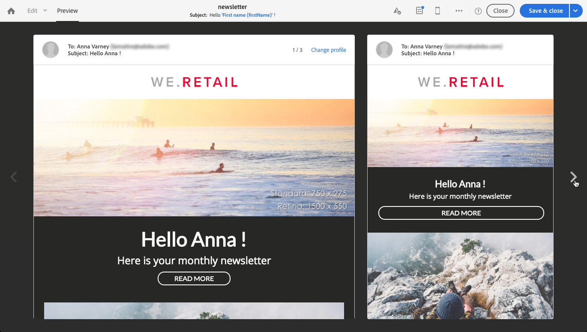

### Step 5: Send proofs

1. In the message dashboard, click the **[!UICONTROL Test]** button, then confirm.

    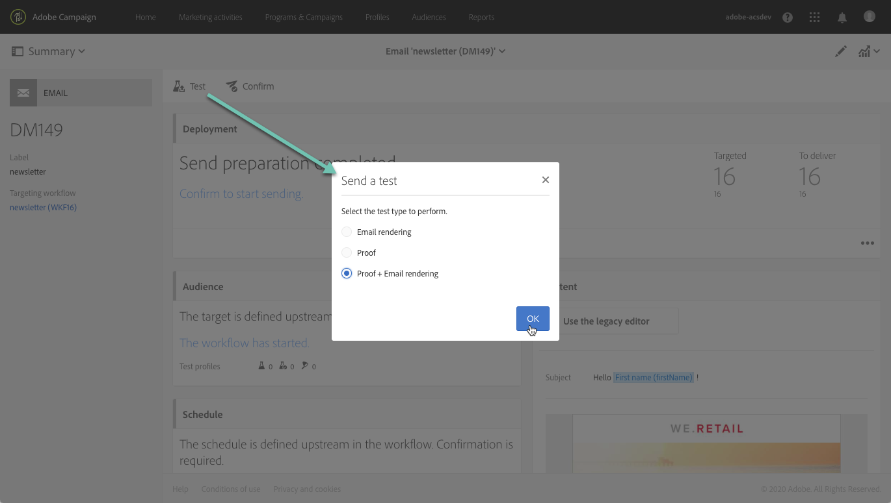

1. The proofs are sent according to what has been configured in the **[!UICONTROL Profile substitutions]** tab.

    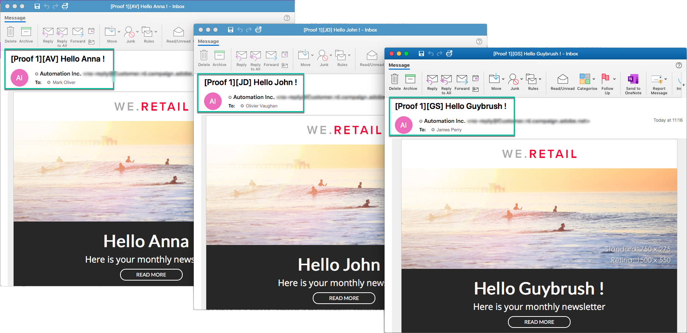

## Tutorial video {#video}

This video shows how you can test your email messages using Profile substitution.

>[!VIDEO](https://video.tv.adobe.com/v/32368?quality=12)

Additional Campaign Standard how-to videos are available [here](https://experienceleague.adobe.com/docs/campaign-standard-learn/tutorials/overview.html?lang=en).
