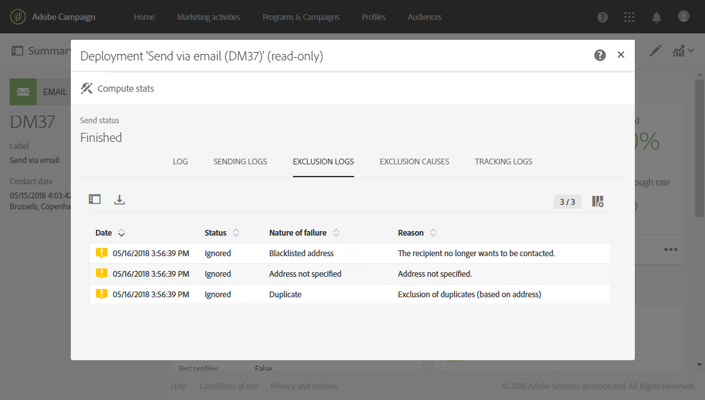
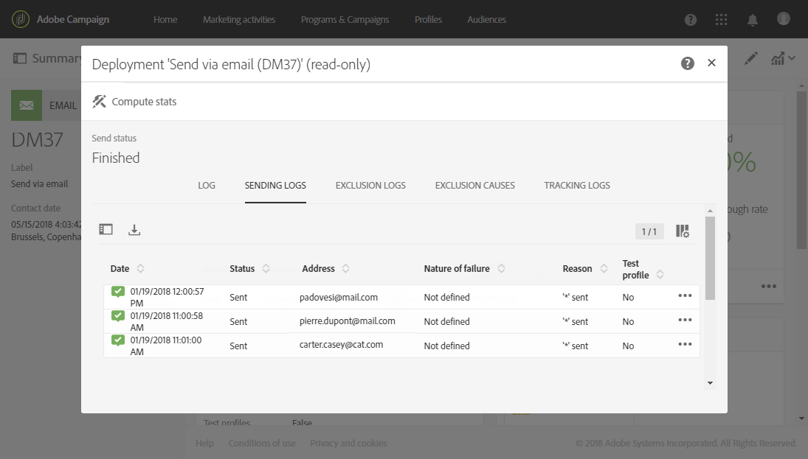

# Understanding delivery failures{#understanding-delivery-failures}

## About delivery failures {#about-delivery-failures}

When a delivery cannot be sent to a profile, the remote server automatically sends an error message, which is picked up by the Adobe Campaign platform and qualified to determine whether or not the email address or phone number should be quarantined. See [Bounce mail qualification](#bounce-mail-qualification).

>[!NOTE]
>
>**Email** error messages (or "bounces") are qualified by the inMail process. **SMS** error messages (or "SR" for "Status Report") are qualified by the MTA process.

Messages can also be excluded during the delivery preparation if an address is quarantined or if a profile is blacklisted. Excluded messages are listed in the **[!UICONTROL Exclusion logs]** tab of the delivery dashboard (see [this section](../../sending/using/monitoring-a-delivery.md#exclusion-logs)).

**Related topics:**

* [Understanding quarantine management](../../sending/using/understanding-quarantine-management.md)
* [Managing blacklisting in Campaign](../../audiences/using/about-opt-in-and-opt-out-in-campaign.md)

## Identifying delivery failures for a message {#identifying-delivery-failures-for-a-message}

Once a delivery is sent, the **[!UICONTROL Sending logs]** tab (see [this section](../../sending/using/monitoring-a-delivery.md#sending-logs)) allows you to view the delivery status for each profile and the associated failure type and reason (see [Delivery failure types and reasons](#delivery-failure-types-and-reasons)).

A dedicated out-of-the-box report is also available. This report details the overall hard and soft errors encountered during deliveries as well as the automatic processing of bounces. For more on this, refer to [this section](../../reporting/using/bounce-summary.md).

## Delivery failure types and reasons {#delivery-failure-types-and-reasons}

There are three types of errors when a delivery fails:

* **Hard**: A "hard" error indicates an invalid address. This involves an error message that explicitly states that the address is invalid, such as: "Unknown user".
* **Soft**: This might be a temporary error, or one that could not be categorized, such as: "Invalid domain" or "Mailbox full".
* **Ignored**: This is an error that is known to be temporary, such as "Out of office", or a technical error, for example if the sender type is "postmaster".

The possible reasons for a delivery failure are:

* **[!UICONTROL User unknown]** (Hard type): the address does not exist. No further deliveries will be attempted for this profile.
* **[!UICONTROL Quarantined address]** (Hard type): the address was placed in quarantine.
* **[!UICONTROL Unreachable]** (Soft/Hard type): an error has occurred in the message delivery chain (incident on SMTP relay, domain temporarily unreachable, etc.). According to the error returned by the provider, the address will be sent to quarantine directly or the delivery will be tried again until Campaign receives an error which justifies the Quarantine status or until the number of errors reaches 5.
* **[!UICONTROL Address empty]** (Hard type): the address is not defined.
* **[!UICONTROL Mailbox full]** (Soft type): the mailbox of this user is full and cannot accept more messages. This address can be removed from the quarantine list to make another attempt. It is removed automatically after 30 days.

  In order for the address to be automatically removed from the list of quarantined addresses, the **[!UICONTROL Database cleanup]** technical workflow must be started.

* **[!UICONTROL Refused]** (Soft/Hard type): the address has been placed in quarantine due to a security feedback as a spam report. According to the error returned by the provider, the address will be sent to quarantine directly or the delivery will be tried again until Campaign receives an error which justifies the Quarantine status or until the number of errors reaches 5.
* **[!UICONTROL Duplicate]**: the address has already been detected in the segmentation.
* **[!UICONTROL Not defined]** (Soft type): the address is in qualification because errors have not been incremented yet.

  This type of error occurs when a new error message is sent by the server: it can be an isolated error, but if it occurs again, the error counter increases, which will alert the technical teams. 

* **[!UICONTROL Error ignored]**: the address is in the whitelist and an email will be sent to it in any case.
* **[!UICONTROL Blacklisted address]**: the address was blacklisted at the time of sending.
* **[!UICONTROL Account disabled]** (Soft/Hard type): when the Internet Access Provider (IAP) detects a lengthy period of inactivity, it can close the user's account: deliveries to the user's address will then be impossible. The Soft or Hard type depends upon the type of error received: if the account is temporarily disabled due to six months of inactivity and can still be activated, the status **[!UICONTROL Erroneous]** will be assigned and the delivery will be tried again. If the error received signals that the account is permanently deactivated then it will directly be sent to Quarantine.
* **[!UICONTROL Not connected]**: the profile's mobile phone is switched off or not connected to the network when the message is sent.
* **[!UICONTROL Invalid domain]** (Soft type): the domain of the email address is incorrect or no longer exists. This profile will be targeted again until the error count reaches 5. After this, the record will be set to Quarantine status and no retry will follow.
* **[!UICONTROL Text too long]**: the number of characters in the SMS message exceeds the limit. For more on this, see [SMS encoding, length and transliteration](../../administration/using/configuring-sms-channel.md#sms-encoding--length-and-transliteration).
* **[!UICONTROL Character not supported by encoding]**: the SMS message contains one or more characters that are not supported by the encoding. &For more on this, see [Table of characters - GSM Standard](../../administration/using/configuring-sms-channel.md#table-of-characters---gsm-standard).

## Retries after a delivery temporary failure {#retries-after-a-delivery-temporary-failure}

If a message fails due to a temporary error of the **Ignored** type, retries will be performed during the delivery duration. For more on the types of errors, see [Delivery failure types and reasons](#delivery-failure-types-and-reasons).

To modify the duration of a delivery, go to the advanced parameters of the delivery or delivery template and specify the desired duration in the corresponding field. The advanced delivery properties are presented in [this section](../../administration/using/configuring-email-channel.md#validity-period-parameters).

The default configuration allows five retries at one-hour intervals, followed by one retry per day for four days. The number of retries can be changed globally (contact your Adobe technical administrator) or for each delivery or delivery template (see [this section](../../administration/using/configuring-email-channel.md#sending-parameters)).

## Synchronous and asynchronous errors {#synchronous-and-asynchronous-errors}

A delivery can fail immediately (synchronous error), or later on, after it has been sent (asynchronous error).

* **Synchronous error**: the remote server contacted by the Adobe Campaign delivery server immediately returned an error message, the delivery is not allowed to be sent to the profile's server.
* **Asynchronous error**: a bounce mail or a SR was resent later by the receiving server. Asynchronous errors can occur up until one week after a delivery has been sent.

## Bounce mail qualification {#bounce-mail-qualification}

Delivery failure error messages (or "SMTP bounce responses") are picked up by the Adobe Campaign platform and then processed and qualified as **Hard**, **Soft**, or **Ignored** using the **[!UICONTROL Delivery log qualification]** database.

<!--Delivery failure error messages (or "bounces") are picked up by the Adobe Campaign platform and qualified by the inMail process to enrich the list of email management rules.(applies to asynchronous (out-of-band) bounces)-->

This list is available to administrators only and contains all the rules used by Adobe Campaign to qualify delivery failures.

To access it, click the **[!UICONTROL Adobe Campaign]** logo, at the top left, then select **[!UICONTROL Administration > Channels > Email > Email processing rules]**.

For more on this, refer to this [section](../../administration/using/configuring-email-channel.md#email-processing-rules).

>[!IMPORTANT]
>
>Once upgraded to the Enhanced MTA, the bounce qualifications in the Campaign **[!UICONTROL Message qualification]** table are no longer used. For synchronous delivery failure error messages, the Enhanced MTA determines the bounce type and qualification, and sends back that information to Campaign. Asynchronous bounces are still qualified by the inMail process.
>
>For more on the Adobe Campaign Enhanced MTA, refer to this [document](https://helpx.adobe.com/campaign/kb/campaign-enhanced-mta.html).

Bounces can have the following qualification statuses:

* **[!UICONTROL To qualify]**: the bounce mail needs to be qualified. Qualification must be done by the Deliverability team to ensure that the platform deliverability functions correctly. As long as it is not qualified, the bounce mail is not used to enrich the list of email processing rules.
* **[!UICONTROL Keep]**: the bounce mail was qualified and will be used by the **Update for deliverability** workflow to be compared to existing email processing rules and enrich the list.
* **[!UICONTROL Ignore]**: the bounce mail was qualified but will not be used by the **Update for deliverability** workflow. So it will not be sent to the client instances.

To list the various bounces and their associated error types et reasons, click the **[!UICONTROL Adobe Campaign]** logo, in the top left, then select **[!UICONTROL Administration > Channels > Quarantines > Message qualification]**.

## Optimizing mail deliverability with double opt-in mechanism {#optimizing-mail-deliverability-with-double-opt-in-mechanism}

Double opt-in mechanism is a best practice when sending emails. It protects the platform from wrong or invalid email addresses, spambots, and prevents possible spam complaints.

The principle is to send an email to confirm the visitor's agreement before storing them as ‘profiles' into your Campaign database: the visitor fills out an online landing page, then receives an email and has to click in the confirmation link to finalize its subscription.

For more on this, refer to [this section](../../channels/using/setting-up-a-double-opt-in-process.md).
