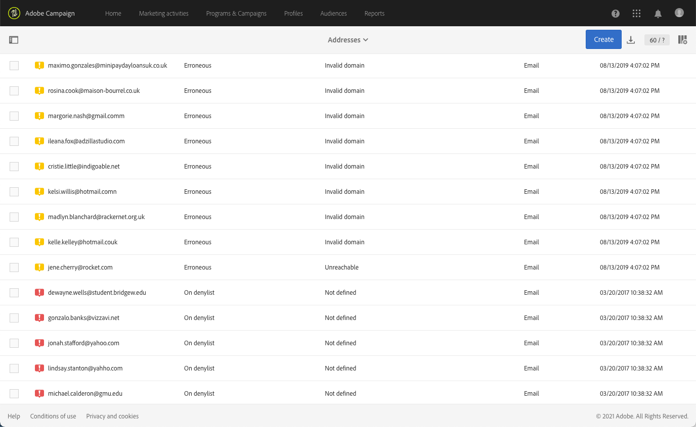
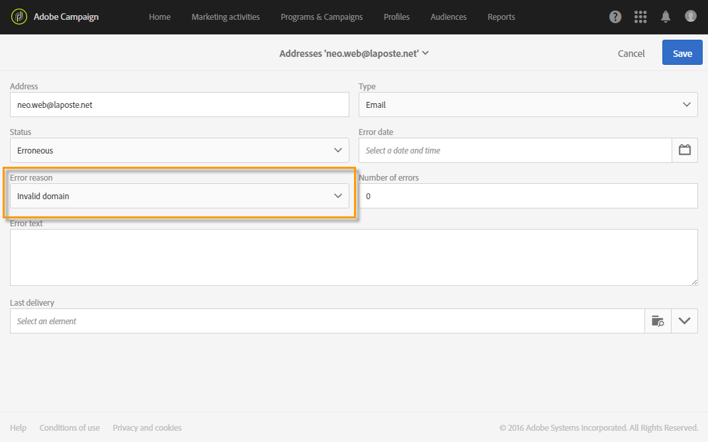

# Understanding quarantine management{#understanding-quarantine-management}

## About quarantines {#about-quarantines}

An email address or a phone number can be quarantined, for example, when the mailbox is full or if the address does not exist.

In any case, the quarantine procedure complies with specific rules described in this [section](#conditions-for-sending-an-address-to-quarantine).

### Optimizing your delivery through quarantines {#optimizing-your-delivery-through-quarantines}

The profiles whose email addresses or phone number are in quarantine are automatically excluded during message preparation (see [Identifying quarantined addresses for a delivery](#identifying-quarantined-addresses-for-a-delivery)). This will speed up deliveries, as the error rate has a significant effect on delivery speed.

Some internet access providers automatically consider emails to be spam if the rate of invalid addresses is too high. Quarantine therefore allows you to avoid being added to denylist by these providers.

Moreover, quarantines help reducing SMS sending costs by excluding erroneous phone numbers from deliveries.

For more on best practices to secure and optimize your deliveries, refer to [this page](../../sending/using/delivery-best-practices.md).

### Quarantine vs Denylist {#quarantine-vs-denylist}

**Quarantine** applies only to an address, not the profile itself. It means that, if two profiles have the same email address, they will both be affected if the address is quarantined.

Likewise, a profile whose email address is quarantined could update his profile and enter a new address, and could then be targeted by delivery actions again.

Being on the **Denylist** (resulting from a user qualifying your email as a spam), on the other hand, will result in the profile no longer being targeted by any delivery, for example after an unsubscription (opt-out). For more on the denylist process, refer to [About opt-in and opt-out in Campaign](../../audiences/using/about-opt-in-and-opt-out-in-campaign.md).

>[!NOTE]
>
>When a user replies to an SMS message with a keyword such as "STOP" in order to opt-out from SMS deliveries, his profile is not on denylist like in the email opt-out process. The profile phone number is sent to quarantine with the **[!UICONTROL On denylist]** status. This status refers to the phone number only, the profile is not on denylist so that the user continues receiving email messages. For more on this, refer to [this section](../../channels/using/managing-incoming-sms.md#managing-stop-sms).

## Identifying quarantined addresses {#identifying-quarantined-addresses}

Quarantined addresses can be listed for a specific delivery or for the entire platform.

<!-->
>[!NOTE]
>
>If you need to remove an address from quarantine, contact your technical administrator.
-->

### Identifying quarantined addresses for a delivery {#identifying-quarantined-addresses-for-a-delivery}

Quarantined addresses for a specific delivery are listed during the delivery preparation phase, in the **[!UICONTROL Exclusion logs]** tab of the delivery dashboard (see [this section](../../sending/using/monitoring-a-delivery.md#exclusion-logs)). For more on delivery preparation, refer to [this section](../../sending/using/preparing-the-send.md).

### Identifying quarantined addresses for the entire platform {#identifying-quarantined-addresses-for-the-entire-platform}

Administrators can list the addresses in quarantine for the entire platform from the **[!UICONTROL Administration > Channels > Quarantines > Addresses]** menu.

>[!NOTE]
>
>This menu lists quarantined elements for **email**, **SMS** and **Push notification** channels.

>[!NOTE]
>
>The increase in number of quarantines is a normal effect, related to the "wear and tear" of the database. For example, if the lifetime of an email address is considered to be three years and the recipient table increases by 50% each year, the increase in quarantines can be calculated as follows: End of Year 1: (1&#42;0.33)/(1+0.5)=22%. End of Year 2: ((1.22&#42;0.33)+0.33)/(1.5+0.75)=32.5%.

### Removing a quarantined address {#removing-a-quarantined-address}

If needed, you can manually remove an address from the quarantine list. In addition to this, addresses that match specific conditions are automatically deleted from the quarantine list by the **[!UICONTROL Database cleanup]** workflow. For more on the technical workflows, see [this section](../../administration/using/technical-workflows.md#list-of-technical-workflows).

To manually remove an address from the quarantine list:

* Select the address from the **[!UICONTROL Administration > Channels > Quarantines > Addresses]** menu and change its **[!UICONTROL Status]** to **[!UICONTROL Valid]**.

  

* You can also change its status to **[!UICONTROL On allowlist]**. In this case, the address remains on the quarantine list, but it will be systematically targeted, even if an error is encountered.

The addresses are automatically removed from the quarantine list in the following cases:

* Addresses in a **[!UICONTROL Erroneous]** status will be removed from the quarantine list after a successful delivery.
* Addresses in a **[!UICONTROL Erroneous]** status will be removed from the quarantine list if the last soft bounce occurred more than 10 days ago. For more on soft error management, see [this section](#soft-error-management).
* Addresses in a **[!UICONTROL Erroneous]** status that bounced with the **[!UICONTROL Mailbox full]** error will be removed from the quarantine list after 30 days.

Their status then changes to **[!UICONTROL Valid]**.

>[!IMPORTANT]
>
>Recipients with an address in a **[!UICONTROL Quarantine]** or **[!UICONTROL On denylist]** status will never be removed, even if they receive an email.

You can modify the number of errors and the period between two errors. To do this, change the corresponding settings in xxx.

## Conditions for sending an address to quarantine {#conditions-for-sending-an-address-to-quarantine}

Adobe Campaign manages quarantine according to the delivery failure type and the reason assigned during error messages qualification (see [Delivery failure types and reasons](../../sending/using/understanding-delivery-failures.md#delivery-failure-types-and-reasons) and [Bounce mail qualification](../../sending/using/understanding-delivery-failures.md#bounce-mail-qualification)).

* **Ignored error**: ignored errors do not send an address to quarantine.
* **Hard error**: the corresponding email address is immediately sent to quarantine. 
* **Soft error**: soft errors do not send immediately an address to quarantine, but they increment an error counter. For more on this, see [Soft error management](#soft-error-management).

  <!--
  When the error counter reaches the limit threshold, the address goes into quarantine. In the default configuration, the threshold is set at five errors, where two errors are significant if they occur at least 24 hours apart. The address is placed in quarantine at the fifth error. The error counter threshold can be modified. For more on this, refer to this [page](../../administration/using/configuring-email-channel.md#email-channel-parameters).
  When a delivery is successful after a retry, the error counter of the address which was prior to that quarantined is reinitialized. The address status changes to **[!UICONTROL Valid]** and it is deleted from the list of quarantines after two days by the **[!UICONTROL Database cleanup]** workflow.
  -->

If a user qualifies an email as a spam ([feedback loop](https://experienceleague.adobe.com/docs/deliverability-learn/deliverability-best-practice-guide/transition-process/infrastructure.html#feedback-loops)), the message is automatically redirected towards a technical mailbox managed by Adobe. The user's email address is then automatically sent to quarantine with the **[!UICONTROL On denylist]** status. This status refers to the address only, the profile is not on the denylist, so that the user continues receiving SMS messages and push notifications.

>[!NOTE]
>
>Quarantine in Adobe Campaign is case sensitive. Make sure to import email addresses in lower case, so that they are not retargeted later on.

In the list of quarantined addresses (see [Identifying quarantined addresses for the entire platform](#identifying-quarantined-addresses-for-the-entire-platform)), the **[!UICONTROL Error reason]** field indicates why the selected address was placed in quarantine.

### Soft error management {#soft-error-management}

As opposed to hard errors, soft errors do not send immediately an address to quarantine, but instead they increment an error counter.

* When the error counter reaches the limit threshold, then the address goes into quarantine.
* In the default configuration, the threshold is set at five errors, where two errors are significant if they occur at least 24 hours apart. The address is placed in quarantine at the fifth error.
* The error counter threshold can be modified. For more on this, refer to [Retries after a delivery temporary failure](understanding-delivery-failures.md#retries-after-a-delivery-temporary-failure).

The error counter is reinitialized if the last significant error occurred more than 10 days ago. The address status then changes to **Valid** and it is deleted from the list of quarantines by the **Database cleanup** workflow.
