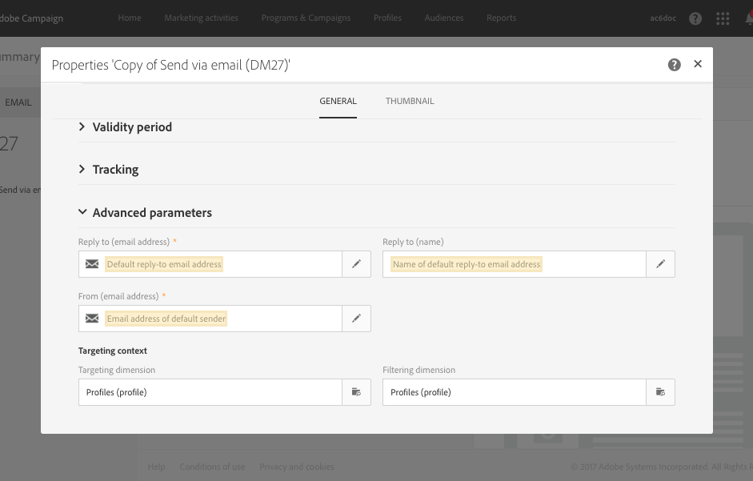
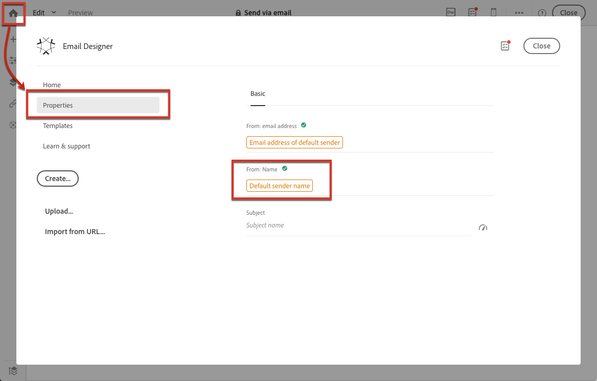
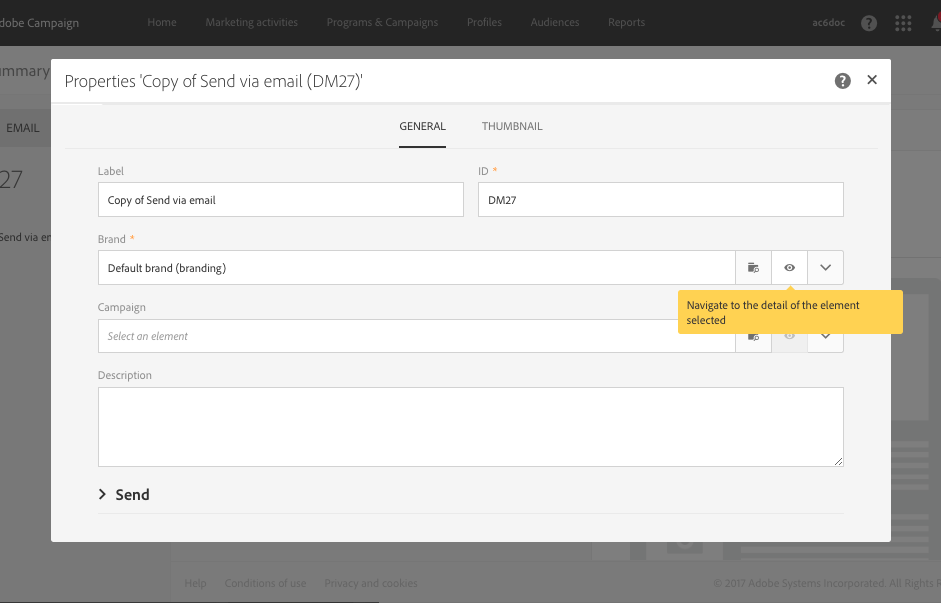

# Use templates {#use-templates}

Delivery templates allow for increased efficiency by providing ready-made scenarios for most common types of activities. With templates, marketers can deploy new campaigns with minimal customization in a shorter amount of time.

Learn more about delivery templates in [this section](../../start/using/marketing-activity-templates.md).

## Get started with delivery templates {#gs-templates}

A [delivery template](../../start/using/marketing-activity-templates.md#creating-a-new-template) enables you to define once a set of technical and functional properties that suit your needs and that can be reused for future deliveries. You can then save time and standardize deliveries when needed.

When you manage several brands in Adobe Campaign, Adobe recommends having one sub-domain per brand. For example, a bank can have several sub-domains corresponding to each of its regional agencies. If a bank owns the bluebank.com domain, its sub-domains can be @ny.bluebank.com, @ma.bluebank.com, @ca.bluebank.com, etc. Having one delivery template per sub-domain enables you to always use the right pre-configured parameters for each of your brand, which avoids errors and saves you time.

**Tip**:  To avoid configuration errors in Campaign, we recommend that you duplicate a native template and alter its properties rather than create a new template.

## Configure addresses

* The sender's address is mandatory to allow an email to be sent.

* Some ISPs (Internet Service Providers) check the validity of the sender address before accepting messages. 

* A badly formed address may result in it being rejected by the receiving server. You must make sure a correct address is given.

* The address must explicitly identify the sender. The domain must be owned by and registered to the sender.

* Adobe recommends creating email accounts that correspond to the addresses specified for deliveries and replies. Check with your messaging system administrator.

In the **[!UICONTROL Advanced parameters]** section of an email template's properties, the **[!UICONTROL From (email address)]** field corresponds to the sender's address.

The address domain must be the same as the sub-domain that you configured.

The **[!UICONTROL Reply to]** fields correspond to the email address and name used for replies.

**Tip** - Adobe recommends using an existing real address such as your brand's customer care. In this case, if a recipient sends a reply, the customer care will be able to handle it.

To change the name of the sender which will appear in the header of messages sent, go the **[!UICONTROL Properties]**  tab of the Email Designer home page (accessible through the home icon) and click the **[!UICONTROL Default sender name]** block.

To increase the opening rate of your deliveries, Adobe recommends using a name that is easily identifiable by the recipients, such as your brand's name.

**Tip** - To further improve the recipient's experience, you can add a person's name, for example "Emma from Megastore".

For more on personalizing the sender name, see [Email sender](../../designing/using/subject-line.md#email-sender).

## Personalize the SMS sender name

In the **Advanced parameters** section of an SMS template's properties, the **From** option allows you to personalize the name of the SMS message sender using a string of characters. This is the name that will appear as the sender name of the SMS message on the recipient's mobile telephone.

If this field is empty, then it will be the source number provided in the external account that will be used. If no source number is provided, it will be the short code that will be used. For more on this, see [SMS configuration](../../administration/using/configuring-sms-channel.md).

**Tip** - Check the legislation in your country regarding modifying the sender address. You should also check with your SMS service provider to see whether they offer this functionality.

## Set up a control group

Once the delivery is sent, you can compare the behavior of the excluded recipients with the recipients who did receive the delivery. You can then measure the efficiency of your campaigns. Learn more about control groups [this section](../../sending/using/control-group.md).

## Use typologies to apply filters or control rules

A typology contains checking rules that are applied during the analysis phase, before sending any message.

In the **[!UICONTROL Advanced parameters]** > **[!UICONTROL Preparation]** section of the template's properties, change the default typology according to your needs. 

For example, to better control the outbound traffic, you can define which IP addresses can be used by defining one affinity per sub-domain and creating one typology per affinity. The affinities are defined in the instance's configuration file. Contact your Adobe Campaign administrator.

For more on typologies, refer to [this section](../../sending/using/managing-typologies.md).

## Link a brand to a template

The parameters of sent emails related to a brand's identity (such as the brand logo or the sender address) are centrally managed in Adobe Campaign. You can create one or several brands and link them to delivery templates.

For more on using and configuring brands in Adobe Campaign, see Branding.

To display or change the brand assigned to a delivery template, select the template's Edit properties button and navigate to the brand's detail.

For more on linking a brand to a template, see [Assigning a brand to an email](../../administration/using/branding.md#assigning-a-brand-to-an-email).

Learn how to create an configure a brand [in this section](../../administration/using/branding.md#creating-a-brand).
