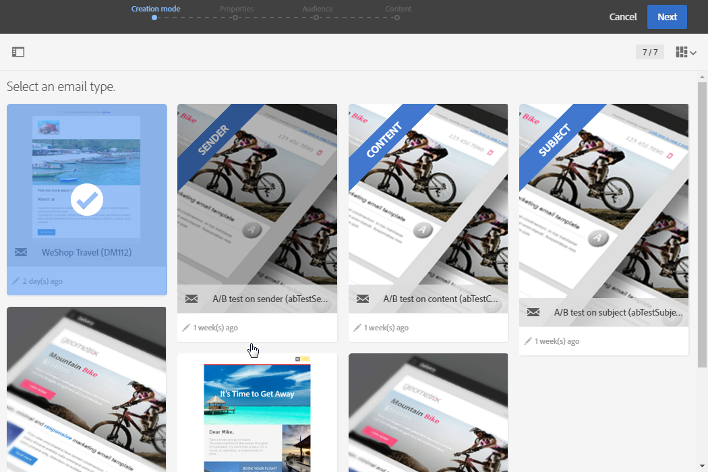
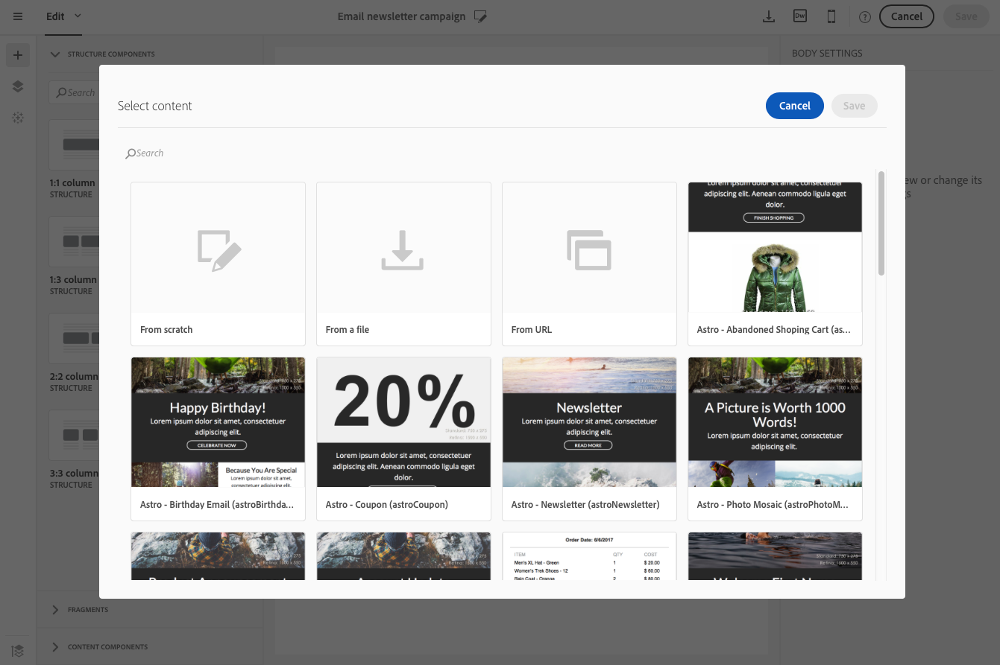

# About templates{#about-templates}

## Marketing activity templates {#marketing-activity-templates}

When you create a new marketing activity, the first screen in the wizard asks you to select a type, or template. Templates allow you to pre-configure certain parameters according to your needs. The template may contain a full or partial configuration of the marketing activity. The template management is performed by the functional administrator.

The end user has a simplified interface. When creating a new marketing activity, you just need to select the template you would like to use. There is no need to worry about any technical configurations. This has already been pre-configured by the functional administrator in the template.

For example, in the case of an email template, you can pre-fill the HTML content, the audience, and any other parameter of your delivery: schedule, test profiles, your delivery's general properties, the advanced parameters, etc. This allows you to save time when creating a new activity.

For each type of marketing activity, one or several out-of-the-box templates are available. They offer minimal configuration for each type of marketing activity. These out-of-the-box templates cannot be modified or deleted.

Templates are available for the following marketing activities:

* Programs
* Campaigns
* Email deliveries
* SMS deliveries
* Push notifications
* Landing pages
* Workflows
* Services
* Import
* Transactional messages

These templates are managed from the **[!UICONTROL Resources]** > **[!UICONTROL Templates]** screen.

>[!NOTE]
>
>Brand configuration can be pre-configured in an email or landing page template. For more information, refer to the [Branding](../../administration/using/branding.md) section.

## Content templates {#content-templates}

The HTML content templates are accessible from the **[!UICONTROL Resources]** > **[!UICONTROL Content templates & fragments]** screen of the [Advanced menu](../../start/using/interface-description.md#advanced-menu).

From there you can manage landing page content templates, delivery content templates and fragments.

* The out-of-the-box landing page and email content templates are read-only. To edit one of them, you must first duplicate it.
* You can also create new templates and define your own contents.

### Creating a content template

When editing content with the Email Designer, you can also create content templates by saving your content as fragment or as template. For more on this, see [Saving as fragment](../../designing/using/defining-the-email-structure.md#saving-content-as-a-fragment) and [Saving as template](../../designing/using/about-templates.md#about-the-email-designer).

### Saving content as template

When editing an email with the Email Designer, you can directly save part of that email as a template.

>[!CAUTION]
>
>You cannot save as template a structure containing personalization fields or dynamic content.///To check///

1. When editing an email in the Email Designer, select **[!UICONTROL Save as template]** from the main toolbar.

   

1. From the workspace, select the structures that will compose the fragment.

    

    >[!NOTE]
    >
    >You can only select structures that are adjacent to each other.

1. Click **[!UICONTROL Create]**.

1. Add a label and a description if needed, then click **[!UICONTROL Save]**.

    

1. To find the template that you just created, go to **[!UICONTROL Resources]** > **[!UICONTROL Content templates & fragments]**.

    

1. To use your new template, the **[!UICONTROL Templates]** tab of the [Email Designer](../../designing/using/about-email-content-design.md#about-the-email-designer) home page.

### Email content templates

You can manage HTML contents that will be offered in the **[!UICONTROL Templates]** tab of the [Email Designer](../../designing/using/about-email-content-design.md#about-the-email-designer) home page.

These templates include eighteen mobile-optimized layouts and four best-in-class responsive templates designed by Behance artists. They correspond to the most current usages such as customer welcome messages, newsletters and reengagement emails, among others. They can easily be customized with your brands' content to ease the process of designing emails from scratch.

**Related topics:**

* Learn how to personalize content templates [in this video](https://helpx.adobe.com/campaign/kt/acs/using/acs-email_content_templates-feature-video-use.html).
* For more information on editing content, see [About email content design](../../designing/using/about-email-content-design.md).

