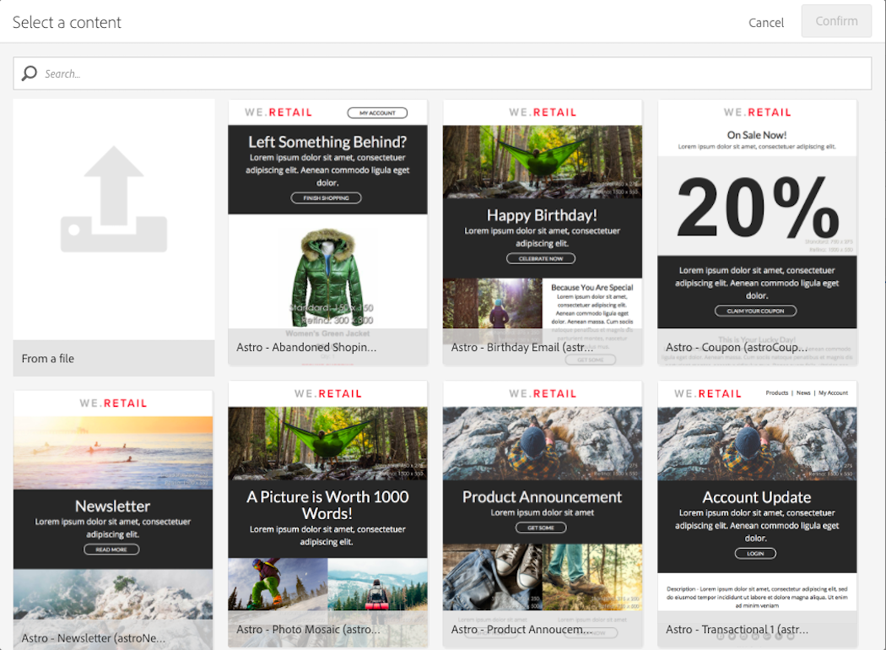

# About templates

About templates

## Marketing activity templates

When you create a new marketing activity, the first screen in the wizard asks you to select a type, or template. Using this template allows you to pre-configure certain parameters according to your needs. The template may contain a full or partial configuration of the marketing activity. The template management is performed by the functional administrator.

The end user has a simplified interface. When creating a new marketing activity, you just need to select the template you would like to use. There is no need to worry about any technical configurations. This has already been pre-configured by the functional administrator in the template.

For example, in the case of an email template, you can pre-fill the HTML content, the audience, and any other parameter of your delivery: schedule, test profiles, your delivery's general properties, the advanced parameters, etc. This allows you to save time when creating a new activity.

For each type of marketing activity, one or several out-of-the-box templates are available. They offer minimal configuration for each type of marketing activity. These out-of-the-box templates cannot be modified or deleted.

Templates are available for the following marketing activities:

* Programs
* Campaigns
* Email deliveries
* SMS deliveries
* Push notifications
* Landing pages
* Workflows
* Services
* Import
* Transactional messages

These templates are managed from the **Resources** > **Templates** screen.

>[!NOTE]
>
>Brand configuration can be pre-configured in an email or landing page template. For more information, refer to the [Branding](../../administration/using/branding.md) section.

## Content templates

You can also manage HTML contents that will be offered in the email content editing screen.

These templates include 18 mobile-optimized layouts corresponding to the most current usages such as customer welcome, newsletters and reengagement emails, among others. They can easily be customized with your brands’ content to ease the process of designing emails from scratch.

These out-of-the-box HTML contents are managed from the **Resources** > **Content templates** screen. They are read-only. To edit one of them, you must first duplicate it. You can also create new templates and define your own contents.

For more information on editing content, refer to the [Design content](../../designing/using/about-email-content-design.md) section.
